# Creación de un streaming en vivo de Azure Media Services

[!INCLUDE [media services api v3 logo](./includes/v3-hr.md)]

Este inicio rápido le ayudará a crear streaming en vivo de Azure Media Services mediante Azure Portal y Telestream Wirecast. Se supone que tiene una suscripción a Azure y que ha creado una cuenta de Media Services.

Si no tiene una suscripción a Azure, cree una [cuenta gratuita](https://azure.microsoft.com/free/) antes de empezar.

## Inicio de sesión en Azure Portal

Abra el explorador web y vaya a [Microsoft Azure Portal](https://portal.azure.com/). Introduzca sus credenciales para iniciar sesión en el portal. La vista predeterminada es el panel del servicio.

En este inicio rápido, trataremos lo siguiente:

- Configuración de un codificador local con una versión de evaluación gratuita de Telestream Wirecast.
- Configuración de streaming en vivo.
- Configuración de las salidas de streaming en vivo.
- Ejecución de un punto de conexión de streaming predeterminado.
- Uso de Azure Media Player para ver streaming en vivo y la salida a petición.

Para simplificar las cosas, usaremos un valor preestablecido de codificación para Azure Media Services en Wirecast, la codificación en la nube de paso a través y RTMP.

## Configuración de un codificador local mediante Wirecast

1. Descargue e instale Wirecast para su sistema operativo en el [sitio web de Telestream](https://www.telestream.net).
1. Inicie la aplicación y use su dirección de correo electrónico favorita para registrar el producto. Mantenga la aplicación abierta.
1. En el correo electrónico que reciba, compruebe su dirección de correo electrónico. A continuación, la aplicación iniciará la evaluación gratuita.
1. Se recomienda: Consulte el tutorial en vídeo de la pantalla de apertura de la aplicación.

## Configuración de streaming en vivo de Azure Media Services

1. Vaya a la cuenta de Azure Media Services en el portal y, luego, seleccione **Live streaming** (Streaming en vivo) en la lista de **Media Services**.

   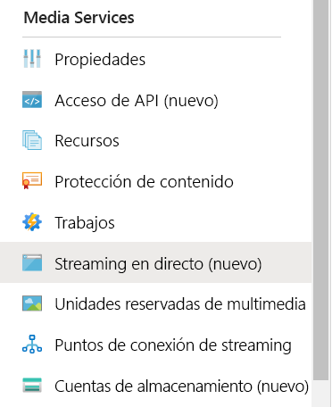
1. Seleccione **Add live event** (Agregar evento en directo) para crear un nuevo evento de streaming en vivo.

   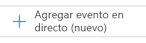
1. Escriba un nombre para el nuevo evento, por ejemplo, *TestLiveEvent*, en el campo **Live event name** (Nombre del evento en directo).

   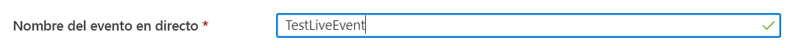
1. Escriba una descripción opcional del evento en el campo **Description** (Descripción).
1. Seleccione la opción **Pass-through – no cloud encoding** (Paso a través: sin codificación en la nube).

   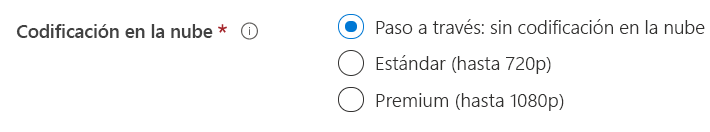
1. Seleccione la opción **RTMP**.
1. Asegúrese de que está seleccionada la opción **No** en **Start live event** (Iniciar el evento en directo), para evitar que se le facture el evento en directo antes de que esté listo. (La facturación comenzará cuando se inicie el evento en directo).

   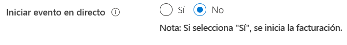
1. Seleccione el botón **Review + create** (Revisar y crear) para revisar la configuración.
1. Seleccione el botón **Create** (Crear) para crear el evento en directo. A continuación, volverá a la lista de eventos en directo.
1. Seleccione el vínculo al evento en directo que acaba de crear. Observe que el evento está detenido.
1. Mantenga esta página abierta en el explorador. Volveremos a él más adelante.

## Configuración de streaming en vivo mediante Wirecast Studio

1. En la aplicación Wirecast, seleccione **Create Empty Document** (Crear documento vacío) en el menú principal y, luego, **Continue** (Continuar).

   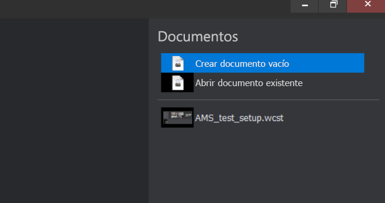
1. Mantenga el ratón sobre la primera capa del área **Wirecast layers** (Capas de Wirecast).  Seleccione el icono **Add** (Agregar) que aparece y elija la entrada de vídeo que quiera transmitir.

   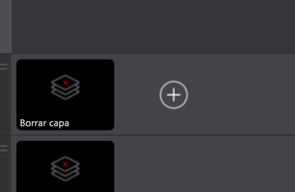

   Se abre el cuadro de diálogo **Master Layer 1** (Capa maestra 1).
1. Seleccione **Video capture** (Captura de vídeo) en el menú y, luego, elija la cámara que quiera usar.

   

   La vista de la cámara aparecerá en el área de vista previa.
1. Mantenga el mouse sobre la segunda capa del área **Wirecast layers** (Capas de Wirecast). Seleccione el icono **Add** (Agregar) que aparece y elija la entrada de vídeo que quiera transmitir. Se abre el cuadro de diálogo **Master Layer 2** (Capa maestra 2).
1. Seleccione **Audio capture** (Captura de audio) en el menú y, luego, elija la entrada de audio que quiera usar.

   
1. En el menú principal, seleccione **Output settings** (Configuración de salida). Aparece el cuadro de diálogo **Select an Output Destination** (Seleccionar un destino de salida).
1. Seleccione **Azure Media Services** en la lista desplegable **Destination** (Destino). La configuración de salida de Azure Media Services rellena automáticamente la *mayoría* de los valores de configuración de salida.

   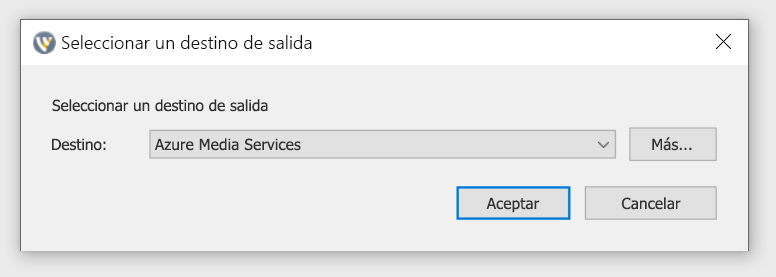

En el siguiente procedimiento, volverá a Azure Media Services en el explorador para copiar la dirección URL de entrada que va a escribir en la configuración de salida.

1. En la página de Azure Media Services del portal, seleccione **Start** (Iniciar) para iniciar el evento de streaming en vivo. (La facturación comienza ahora).

   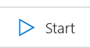
2. Establezca el botón de alternancia **Secure/Not secure** (Seguro/No seguro) en **Not secure** (No seguro). Este paso establece el protocolo en RTMP en lugar de RTMPS.
3. En el cuadro **Input URL** (Dirección URL de entrada), copie la dirección URL en el portapapeles.

   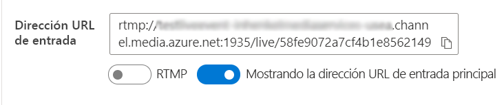
4. Cambie a la aplicación Wirecast y pegue la **dirección URL de entrada** en el campo **Address** (Dirección) en la configuración de salida.

   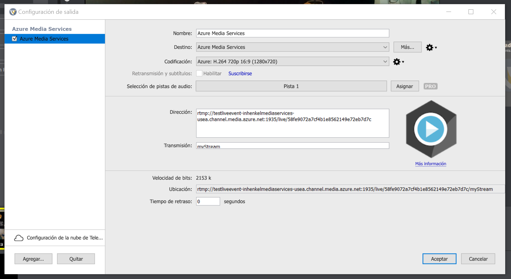
5. Seleccione **Aceptar**.

## Configuración de las salidas

En esta parte se configurarán las salidas y se le permitirá guardar una grabación de streaming en vivo.  

> [!NOTE]
> Para transmitir esta salida, el punto de conexión de streaming debe estar en ejecución. Consulte la sección [Ejecución del punto de conexión de streaming predeterminado](#run-the-default-streaming-endpoint).

1. Seleccione el vínculo **Create outputs** (Crear salidas) que aparece debajo del visor de vídeo **Outputs** (Salidas).
1. Si lo desea, modifique el nombre de la salida en el cuadro **Name** (Nombre) y use uno más descriptivo para que sea fácil de encontrar más adelante.
   
   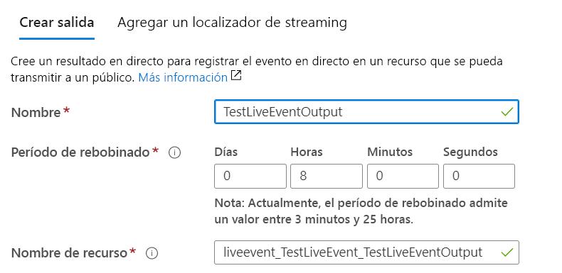
1. Deje todos los demás campos como están por ahora.
1. Seleccione **Next** (Siguiente) para agregar un localizador de streaming.
1. Si lo desea, cambie el nombre del localizador por algo más descriptivo.
   
   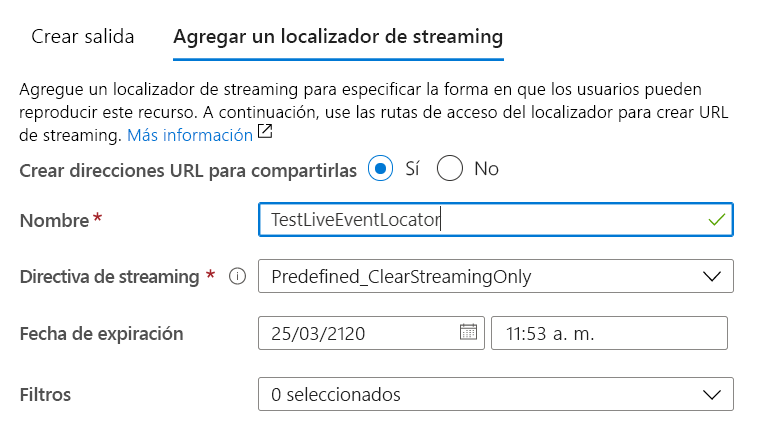
1. Deje todo lo demás en esta pantalla por ahora.
1. Seleccione **Crear**.

## Inicio de la retransmisión

1. En Wirecast, seleccione **Output** > **Start / Stop Broadcasting** > **Start Azure Media Services (Salida > Iniciar o detener retransmisión > Iniciar Azure Media Services): Azure Media Services** (Salida > Iniciar/detener retransmisión > Iniciar Azure Media Services: Azure Media Services) en el menú principal.

   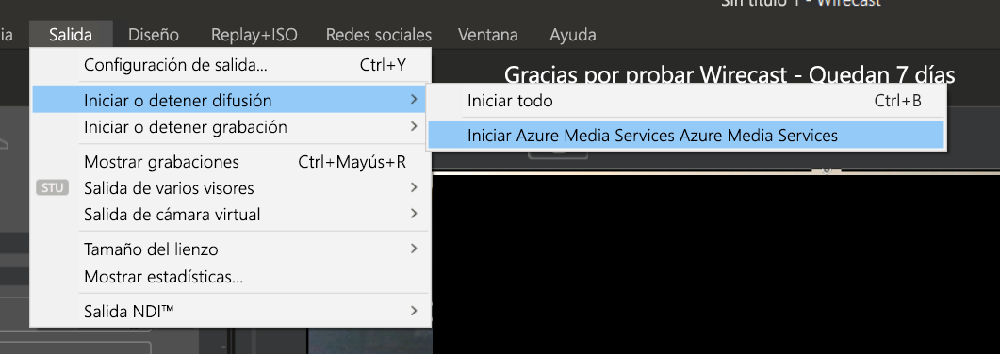

   Cuando se haya enviado la secuencia al evento en directo, la ventana **Live** (Directo) de Wirecast se mostrará en el reproductor de vídeo en la página de eventos en directo de Azure Media Services.

1. Seleccione el botón **Go** (Ir) situado bajo la ventana de vista previa para empezar a retransmitir el vídeo y el audio que seleccionó para las capas de Wirecast.

   

   > [!TIP]
   > Si se produce un error, intente volver a cargar el reproductor; para ello, seleccione el vínculo **Reload player** (Recargar reproductor) que aparece encima del reproductor.

## Ejecución del punto de conexión de streaming predeterminado

1. En la lista de Media Services, seleccione **Streaming endpoints** (Puntos de conexión de streaming).

   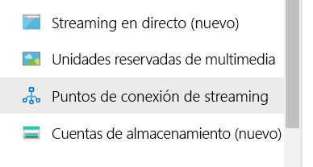
1. Si el estado del punto de conexión de streaming predeterminado es detenido, selecciónelo. Este paso le lleva a la página de ese punto de conexión.
1. Seleccione **Inicio**.
   
   

## Reproducción de la retransmisión de salida con Azure Media Player

1. Copie la dirección URL de streaming que aparece en el reproductor de vídeo de **salida**.
1. En un explorador web, abra la [demostración de Azure Media Player](https://ampdemo.azureedge.net/azuremediaplayer.html).
1. Pegue la dirección URL de streaming en el cuadro **URL** de Azure Media Player.
1. Seleccione el botón **Update Player** (Actualizar reproductor).
1. Seleccione el icono de **Reproducir** del vídeo para ver el streaming en vivo.

## Detención de la retransmisión

Cuando crea que ha transmitido suficiente contenido, detenga la retransmisión.

1. En Wirecast, seleccione el botón **Broadcast** (Retransmitir). Este paso detiene la retransmisión desde Wirecast.
1. En el portal, seleccione **Stop** (Detener). Recibirá un mensaje de advertencia para indicar que se detendrá el streaming en vivo, pero la salida se convertirá ahora en un recurso a petición.
1. Seleccione **Stop** (Detener) en el mensaje de advertencia. Azure Media Player ahora muestra un error, porque el streaming en vivo ya no está disponible.

## Reproducción de la salida a petición con Azure Media Player

La salida que creó ahora está disponible para streaming a petición siempre y cuando el punto de conexión de streaming esté en ejecución.

1. Vaya a la lista de Media Services y seleccione **Assets** (Recursos).
1. Busque la salida del evento que creó anteriormente y seleccione el vínculo al recurso. Se abre la página de salida del recurso.
1. Copie la dirección URL de streaming situada bajo el reproductor de vídeo del recurso.
1. Vuelva a Azure Media Player en el explorador y pegue la dirección URL de streaming en el cuadro URL.
1. Seleccione **Update Player** (Actualizar reproductor).
1. Seleccione el icono de **Reproducir** del vídeo para ver el recurso a petición.

## Limpieza de recursos

> [!IMPORTANT]
> Detenga los servicios. Cuando haya completado los pasos de este inicio rápido, asegúrese de detener el evento en directo y el punto de conexión de streaming o se le facturará el tiempo que sigan en ejecución. Para detener el evento en directo, consulte el procedimiento [Detención de la retransmisión](#stop-the-broadcast), pasos 2 y 3.

Para detener el punto de conexión de streaming:

1. En la lista de Media Services, seleccione **Puntos de conexión de streaming**.
2. Seleccione el punto de conexión de streaming que inició anteriormente. Este paso abre la página del punto de conexión.
3. Seleccione **Detener**.

> [!TIP]
> Si quiere conservar los recursos de este evento, asegúrese de eliminarlos para evitar que se le facture el almacenamiento.

## Pasos siguientes
> [!div class="nextstepaction"]
> [Eventos en directo y salidas activas en Media Services](./live-events-outputs-concept.md)
