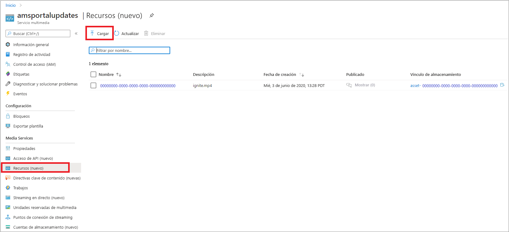
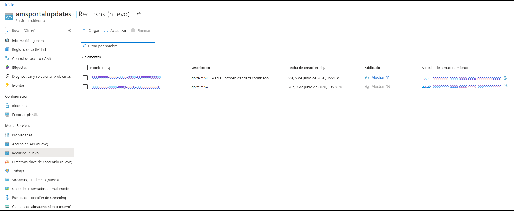
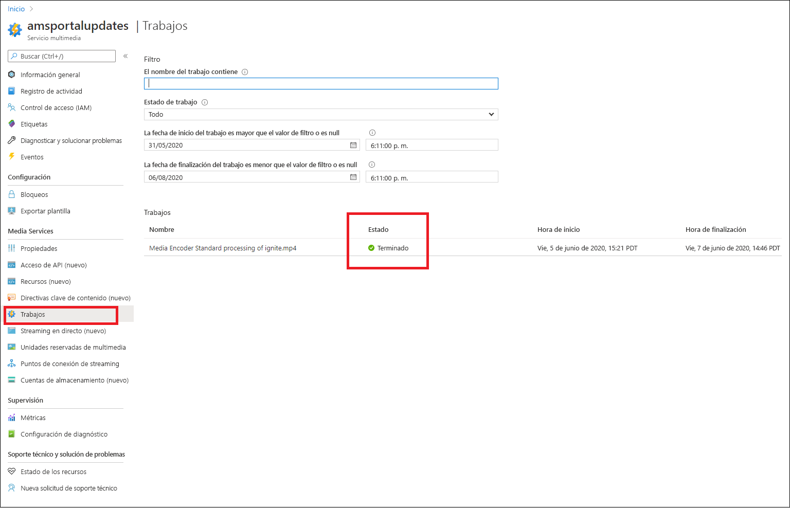
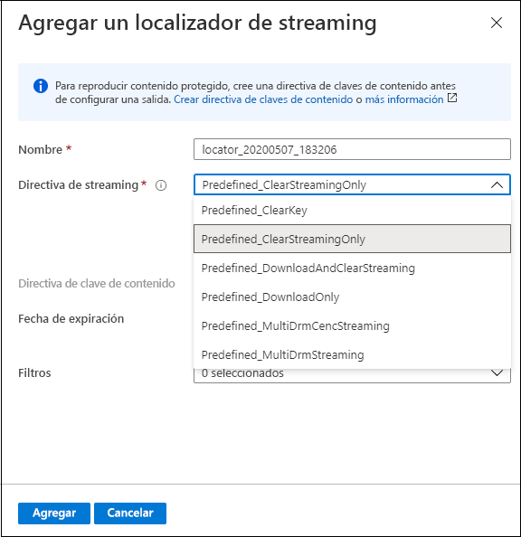
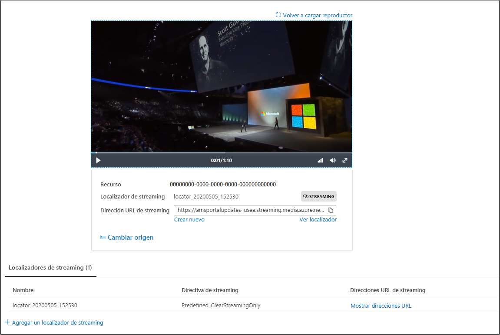

# Inicio rápido: Carga, codificación y streaming de contenido con el portal

[!INCLUDE [media services api v3 logo](./includes/v3-hr.md)]

En este inicio rápido se muestra cómo usar Azure Portal para cargar, codificar y hacer streaming de contenido con Azure Media Services.

> [!NOTE]
> Asegúrese de revisar las [limitaciones de Azure Portal para Media Services v3](frequently-asked-questions.md#what-are-the-azure-portal-limitations-for-media-services-v3).
  
## Información general

* Para iniciar la administración, cifrado, codificación, análisis y streaming de contenido multimedia en Azure, debe crear una cuenta de Media Services y cargar los archivos de medios digitales de alta calidad en un **recurso**. 
    
    > [!NOTE]
    > Si el vídeo se ha cargado previamente en la cuenta de Media Services con la API de Media Services v3 o si el contenido se ha generado a partir de una salida en directo, no verá los botones **Codificar**, **Analizar** o **Cifrar** en Azure Portal. Use las API de Media Services v3 para realizar estas tareas.

    Revise lo siguiente: 

  * [Carga y almacenamiento en la nube](storage-account-concept.md)
  * [Concepto de recursos](assets-concept.md)
* Una vez que cargue el archivo de medios digitales de alta calidad en un recurso (un recurso de entrada), puede procesarlo (codificarlo o analizarlo). El contenido procesado entra en otro recurso (recurso de salida). 
    * [Codifique](encoding-concept.md) el archivo cargado en formatos que se puedan reproducir en una gran variedad de exploradores y dispositivos.
    * [Analice](analyzing-video-audio-files-concept.md) el archivo cargado. 

        Actualmente, cuando usa Azure Portal, puede hacer lo siguiente: generar archivos de subtítulos TTML y WebVTT. Los archivos en estos formatos se pueden usar para crear archivos de audio y vídeo accesibles para personas con discapacidades auditivas. También puede extraer palabras clave del contenido.

        Para disfrutar de una experiencia enriquecida que le permita extraer información de sus archivos de audio y vídeo, use los valores preestablecidos de Media Services v3 (como se describe en [Tutorial: Análisis de vídeos con Media Services v3](analyze-videos-tutorial-with-api.md)).  Si desea información más detallada, use [Video Indexer](../video-indexer/index.yml) directamente.    
* Una vez procesado el contenido, puede proporcionar contenido multimedia a los reproductores cliente. Para que los vídeos del recurso de salida estén disponibles para los clientes para su reproducción, tiene que crear un **localizador de streaming**. Al crear el **localizador de streaming**, deberá especificar una **directiva de streaming**. Las **directivas de streaming** permiten definir los protocolos de streaming y las opciones de cifrado (si hubiera) de los **localizadores de streaming**.
    
    Revisión:

    * [Localizadores de streaming](streaming-locators-concept.md)
    * [Directivas de streaming](streaming-policy-concept.md)
    * [Empaquetado y entrega](dynamic-packaging-overview.md)
    * [Filtros](filters-concept.md)
* Puede proteger el contenido mediante su cifrado con Estándar de cifrado avanzado (AES-128) o con cualquiera de los tres sistemas DRM principales: Microsoft PlayReady, Google Widevine y Apple FairPlay. En el inicio rápido [Cifrado de contenido con Azure Portal](encrypt-content-quickstart.md) se muestra cómo configurar la protección del contenido.
        
## Requisitos previos

[!INCLUDE [quickstarts-free-trial-note](../../../includes/quickstarts-free-trial-note.md)]

[Creación de una cuenta de Media Services](create-account-howto.md#use-the-azure-portal)

## Cargar

1. Inicie sesión en [Azure Portal](https://portal.azure.com/).
1. Busque y haga clic en su cuenta de Media Services.
1. Seleccione **Recursos (nuevo)** .
1. Presione **Cargar** en la parte superior de la ventana. 
1. Arrastre y coloque el archivo que desea cargar o búsquelo.

Si navega a la ventana de recursos, verá que se ha agregado un nuevo recurso a la lista:

## Codificación

1. Seleccione **Recursos (nuevo)** .
1. Seleccione el nuevo recurso (el que se agregó en el último paso).
1. Haga clic en **Codificar** en la parte superior de la ventana.

    Al presionar este botón, se inicia el trabajo de codificación. Cuando se completa, genera correctamente un recurso de salida que contiene el contenido codificado.

Si va a la ventana de recursos, verá que se ha agregado el recurso de salida a la lista:

## Supervisión del progreso del trabajo

Para ver el estado del trabajo, vaya a **Trabajos**. El trabajo pasa normalmente por los siguientes estados: Programado, En cola, Procesando, Finalizado (el estado final). Si el trabajo ha encontrado un error, obtendrá el estado Error.

## Publicar y hacer streaming

Para publicar un recurso, ahora debe agregarle un localizador de streaming.

### Localizador de streaming 

1. En la sección **Localizador de streaming**, presione **+ Agregar un localizador de streaming**.
    Esto permite publicar el recurso y generar las direcciones URL de streaming.

    > [!NOTE]
    > Si quiere que la secuencia se cifre, debe crear una directiva de clave de contenido y establecerla en el localizador de streaming. Para más información, consulte [Cifrado de contenido con Azure Portal](encrypt-content-quickstart.md).
1. En la ventana **Agregar un localizador de streaming**, elija una de las directivas de streaming predefinidas. Para más información, consulte las [directivas de streaming](streaming-policy-concept.md).

    

Una vez publicado el recurso, puede transmitirlo directamente en el portal. 

O bien, copie la dirección URL de streaming y úsela en el reproductor cliente.

> [!NOTE]
> Asegúrese de que el [punto de conexión de streaming](streaming-endpoint-concept.md) esté en ejecución. Cuando crea por primera vez una cuenta de Media Services, se crea el punto de conexión de streaming predeterminado y aparece en estado detenido, por lo que tendrá que iniciarlo para poder hacer streaming del contenido. Solo se le facturará cuando el punto de conexión de streaming esté en estado de ejecución.

## Limpieza de recursos

Si su intención es probar los demás inicios rápidos, debería conservar los recursos creados. En caso contrario, vaya a Azure Portal, vaya a los grupos de recursos, seleccione el grupo de recursos en el que ejecutó este inicio rápido y elimine todos los recursos.

## Pasos siguientes

[Uso del portal para cifrar contenido](encrypt-content-quickstart.md)
