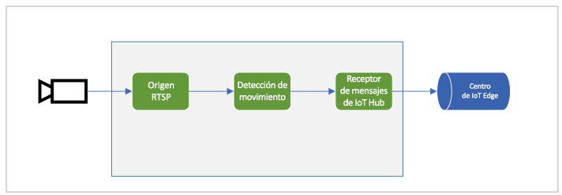

# <a name="quickstart-detect-motion-and-emit-events"></a>Inicio rápido: Detección de movimiento y emisión de eventos

Este inicio rápido le guiará por los pasos necesarios para empezar a usar Live Video Analytics en IoT Edge. Usa una máquina virtual de Azure como un dispositivo IoT Edge y una secuencia de vídeo en directo simulada. Después de completar los pasos de la configuración, podrá ejecutar una secuencia de vídeo en directo simulada mediante un grafo multimedia que detecta e informa de todos los movimientos de esa secuencia. El siguiente diagrama muestra una representación gráfica de ese grafo multimedia.

 

Este artículo se basa en un [ejemplo de código](https://github.com/Azure-Samples/live-video-analytics-iot-edge-csharp) escrito en C#.

## <a name="prerequisites"></a>Requisitos previos

* Una cuenta de Azure que tenga una suscripción activa. [Cree una cuenta gratuita](https://azure.microsoft.com/free/?WT.mc_id=A261C142F), en caso de que aún no lo haya hecho.
* [Visual Studio Code](https://code.visualstudio.com/) con las siguientes extensiones:
    * [Herramientas de Azure IoT](https://marketplace.visualstudio.com/items?itemName=vsciot-vscode.azure-iot-tools)
    * [C#](https://marketplace.visualstudio.com/items?itemName=ms-dotnettools.csharp)
* [SDK de .NET Core 3.1](https://dotnet.microsoft.com/download/dotnet-core/3.1). 

> [!TIP]
> Al instalar la extensión de Azure IoT Tools, es posible que se le pida que instale Docker. Puede omitir el aviso.

## <a name="set-up-azure-resources"></a>Configuración de los recursos de Azure

Este tutorial requiere los siguientes recursos de Azure:

* IoT Hub
* Cuenta de almacenamiento
* Cuenta de Azure Media Services
* Máquina virtual Linux en Azure, con el [entorno de ejecución de Azure IoT Edge](https://docs.microsoft.com/azure/iot-edge/how-to-install-iot-edge-linux) instalado

Para este inicio rápido, se recomienda usar el [script de configuración de recursos de Live Video Analytics](https://github.com/Azure/live-video-analytics/tree/master/edge/setup) para implementar los recursos necesarios en su suscripción de Azure. Para hacerlo, siga estos pasos:

1. Abra [Azure Cloud Shell](https://shell.azure.com).
1. Si es la primera vez que usa Cloud Shell, se le pedirá que seleccione una suscripción para crear una cuenta de almacenamiento y un recurso compartido de Microsoft Azure Files. Seleccione **Create storage** (Crear almacenamiento) para crear una cuenta de almacenamiento para la información de la sesión de Cloud Shell. Esta cuenta de almacenamiento es independiente de la que creará el script para usarla con su cuenta de Azure Media Services.
1. En el menú desplegable del lado izquierdo de la ventana de Cloud Shell, seleccione el entorno **Bash**.

    

1. Ejecute el siguiente comando:

    ```
    bash -c "$(curl -sL https://aka.ms/lva-edge/setup-resources-for-samples)"
    ```

    Si el script finaliza correctamente, debería ver todos los recursos necesarios en su suscripción.

1. Después de que finalice el script, seleccione las llaves para exponer la estructura de carpetas. Verá algunos archivos en el directorio *~/clouddrive/lva-sample*. Archivos de interés en este inicio rápido:

     * ***~/clouddrive/lva-sample/edge-deployment/.env***: este archivo contiene las propiedades que utiliza Visual Studio Code para implementar módulos en un dispositivo perimetral.
     * ***~/clouddrive/lva-sample/appsetting.json***: Visual Studio Code utiliza este archivo para ejecutar el código de ejemplo.
     
Necesitará estos archivos al configurar el entorno de desarrollo en Visual Studio Code en la sección siguiente. Es posible que desee copiarlos en un archivo local por el momento.

 

## <a name="set-up-your-development-environment"></a>Configurado su entorno de desarrollo

1. Clone el repositorio desde esta ubicación: https://github.com/Azure-Samples/live-video-analytics-iot-edge-csharp.
1. En Visual Studio Code, abra la carpeta en que se ha descargado.
1. En Visual Studio Code, vaya a la carpeta *src/cloud-to-device-console-app/operations.json*. Allí, cree un archivo y asígnele el nombre *appsettings.json*. Este archivo contendrá la configuración necesaria para ejecutar el programa.
1. Copie el contenido del archivo *~/clouddrive/lva-sample/appsettings.json* que generó anteriormente en este inicio rápido.

    El texto debería ser similar al siguiente.

    ```
    {  
        "IoThubConnectionString" : "HostName=xxx.azure-devices.net;SharedAccessKeyName=iothubowner;SharedAccessKey=XXX",  
        "deviceId" : "lva-sample-device",  
        "moduleId" : "lvaEdge"  
    }
    ```
1. Vaya a la carpeta *src/edge* y cree un archivo llamado *.env*.
1. Copie el contenido del archivo */clouddrive/lva-sample/edge-deployment/.env*. El texto debería ser similar al siguiente código.

    ```
    SUBSCRIPTION_ID="<Subscription ID>"  
    RESOURCE_GROUP="<Resource Group>"  
    AMS_ACCOUNT="<AMS Account ID>"  
    IOTHUB_CONNECTION_STRING="HostName=xxx.azure-devices.net;SharedAccessKeyName=iothubowner;SharedAccessKey=xxx"  
    AAD_TENANT_ID="<AAD Tenant ID>"  
    AAD_SERVICE_PRINCIPAL_ID="<AAD SERVICE_PRINCIPAL ID>"  
    AAD_SERVICE_PRINCIPAL_SECRET="<AAD SERVICE_PRINCIPAL ID>"  
    INPUT_VIDEO_FOLDER_ON_DEVICE="/home/lvaadmin/samples/input"  
    OUTPUT_VIDEO_FOLDER_ON_DEVICE="/home/lvaadmin/samples/input"
    APPDATA_FOLDER_ON_DEVICE="/var/local/mediaservices"
    CONTAINER_REGISTRY_USERNAME_myacr="<your container registry username>"  
    CONTAINER_REGISTRY_PASSWORD_myacr="<your container registry username>"      
    ```

## <a name="examine-the-sample-files"></a>Examen de los archivos de ejemplo

1. En Visual Studio Code, vaya a *src/edge*. Vará el archivo *.env* y algunos archivos de plantilla de implementación.

    La plantilla de implementación hace referencia al manifiesto de implementación del dispositivo perimetral, en el que las variables se utilizan para algunas propiedades. El archivo *.env* contiene los valores de esas variables.
1. Vaya a la carpeta *src/cloud-to-device-console-app*. Aquí verá el archivo *appsettings.json* y algunos otros archivos:

    * ***c2d-console-app.csproj***: el archivo de proyecto de Visual Studio Code.
    * ***operations.json***: una lista de las operaciones que desea que ejecute el programa.
    * ***Program.cs***: el código del programa de ejemplo. Este código:
    
      * Carga la configuración de la aplicación.
      * Invoca los métodos directos que expone el módulo Live Video Analytics en IoT Edge. Puede usar el módulo para analizar secuencias de vídeo en directo mediante la invocación de sus [métodos directos](direct-methods.md).
      * Se pone en pausa para que pueda examinar la salida del programa en la ventana **TERMINAL** y los eventos generados por el módulo en la ventana de **SALIDA**.
      * Invoca los métodos directos para limpiar los recursos.   

## <a name="generate-and-deploy-the-deployment-manifest"></a>Generación e implementación del manifiesto de implementación

El manifiesto de implementación define los módulos que se implementan en un dispositivo perimetral. También define los valores de configuración de los módulos. 

Siga estos pasos para generar el manifiesto a partir del archivo de plantilla y, después, impleméntelo en el dispositivo perimetral.

1. Abra Visual Studio Code.
1. Al lado del panel **AZURE IOT HUB**, seleccione el icono **Más acciones** para establecer la cadena de conexión de IoT Hub. Puede copiar la cadena del archivo *src/cloud-to-device-console-app/appsettings.json*. 

    

1. Haga clic con el botón derecho en **src/edge/deployment.template.json** y seleccione **Generate IoT Edge Deployment Manifest** (Generar manifiesto de implementación de IoT Edge).

    

    Esta acción debe crear un archivo de manifiesto llamado *deployment.amd64.json* en la carpeta *src/edge/config llamado*.
1. Haga clic con el botón derecho en **src/edge/config/deployment.amd64.json**, seleccione **Create Deployment for Single Device** (Crear una implementación para un dispositivo individual) y seleccione el nombre del dispositivo perimetral.

    

1. Cuando se le pida que seleccione un dispositivo IoT Hub, elija **lva-sample-device** en el menú contextual.
1. Tras aproximadamente 30 segundos, en la esquina inferior izquierda de la ventana, actualice Azure IoT Hub. El dispositivo perimetral ahora muestra los siguientes módulos implementados:

    * Live Video Analytics on IoT Edge (nombre del módulo `lvaEdge`).
    * Simulador del Protocolo de transmisión en tiempo real (RTSP) (nombre del módulo `rtspsim`).

El módulo del simulador de RTSP simula una secuencia de vídeo en directo mediante un archivo de vídeo que se copió en el dispositivo perimetral al ejecutar el [script de configuración de recursos de Live Video Analytics](https://github.com/Azure/live-video-analytics/tree/master/edge/setup). 

En esta fase se implementan los módulos, pero no hay grafos multimedia activos.

## <a name="prepare-to-monitor-events"></a>Preparación para supervisar eventos

Va a utilizar el módulo de Live Video Analytics on IoT Edge para detectar el movimiento en la secuencia de vídeo en directo entrante y enviar eventos a IoT Hub. Para ver estos eventos, siga estos pasos:

1. Abra el panel del explorador en Visual Studio Code y busque Azure IoT Hub en la esquina inferior izquierda.
1. Expanda el nodo **Devices** (Dispositivos).
1. Haga clic con el botón derecho en **lva-sample-device** y seleccione **Iniciar la supervisión del punto de conexión de eventos integrado**.

    

## <a name="run-the-sample-program"></a>Ejecución del programa de ejemplo

Para ejecutar el código de ejemplo, siga estos pasos:

1. En Visual Studio Code, vaya a *src/cloud-to-device-console-app/operations.json*.
1. En el nodo **GraphTopologySet**, asegúrese de que vea el siguiente valor:

    `"topologyUrl" : "https://raw.githubusercontent.com/Azure/live-video-analytics/master/MediaGraph/topologies/motion-detection/topology.json"`
1. En los nodos **GraphInstanceSet** y **GraphTopologyDelete**, asegúrese de que el valor de `topologyName` coincida con el valor de la propiedad `name` en la topología del grafo:

    `"topologyName" : "MotionDetection"`
    
1. Para iniciar una sesión de depuración, seleccione la tecla F5. La ventana **TERMINAL** mostrará algunos mensajes.
1. El archivo *operations.json* se inicia con llamadas a `GraphTopologyList` y `GraphInstanceList`. Si ha limpiado los recursos tras haber finalizado los inicios rápidos anteriores, este proceso devolverá listas vacías y, después, se pausará. Para continuar, seleccione la tecla Entrar.

    ```
    --------------------------------------------------------------------------
    Executing operation GraphTopologyList
    -----------------------  Request: GraphTopologyList  --------------------------------------------------
    {
        "@apiVersion": "1.0"
    }
    ---------------  Response: GraphTopologyList - Status: 200  ---------------
    {
        "value": []
    }
    --------------------------------------------------------------------------
    Executing operation WaitForInput
    Press Enter to continue
    ```

    La ventana **TERMINAL** muestra el siguiente conjunto de llamadas al método directo:
     
     * Una llamada a `GraphTopologySet` que utiliza la instancia anterior de `topologyUrl`.
     * Una llamada a `GraphInstanceSet` que usa el cuerpo siguiente:
     
         ```
         {
           "@apiVersion": "1.0",
           "name": "Sample-Graph",
           "properties": {
             "topologyName": "MotionDetection",
             "description": "Sample graph description",
             "parameters": [
               {
                 "name": "rtspUrl",
                 "value": "rtsp://rtspsim:554/media/camera-300s.mkv"
               },
               {
                 "name": "rtspUserName",
                 "value": "testuser"
               },
               {
                 "name": "rtspPassword",
                 "value": "testpassword"
               }
             ]
           }
         }
         ```
     
     * Una llamada a `GraphInstanceActivate` que inicia la instancia del grafo y el flujo de vídeo.
     * Una segunda llamada a `GraphInstanceList` que muestra que la instancia del grafo está en ejecución.
1. La salida de la ventana **TERMINAL** se pone en pausa en `Press Enter to continue`. No seleccione Entrar todavía. Desplácese hacia arriba para ver las cargas de la respuesta JSON para los métodos directos que ha invocado.
1. Cambie a la ventana **SALIDA** de Visual Studio Code. Verá los mensajes que el módulo Live Video Analytics en IoT Edge envía al centro de IoT. En la siguiente sección de este inicio rápido se analizan estos mensajes.
1. El grafo multimedia continúa ejecutándose e imprimiendo los resultados. El simulador RTSP sigue recorriendo el vídeo de origen. Para detener el grafo multimedia, vuelva a la ventana **TERMINAL** y seleccione Entrar. 

    La siguiente serie de llamadas limpia los recursos:
     * Una llamada a `GraphInstanceDeactivate` desactiva la instancia del grafo.
     * Una llamada a `GraphInstanceDelete` elimina la instancia.
     * Una llamada a `GraphTopologyDelete` elimina la topología.
     * Una llamada final a `GraphTopologyList` muestra que la lista está vacía.

## <a name="interpret-results"></a>Interpretación de los resultados

Cuando se ejecuta el grafo multimedia, los resultados del nodo del procesador de detección del movimiento pasan a través del nodo de receptor de IoT Hub al centro de IoT. Los mensajes que aparecen en la ventana **SALIDA** de Visual Studio Code contienen una sección `body` y una sección `applicationProperties`. Para más información, consulte [Creación y lectura de mensajes de IoT Hub](https://docs.microsoft.com/azure/iot-hub/iot-hub-devguide-messages-construct).

En los mensajes siguientes, se definen las propiedades de la aplicación y el contenido del cuerpo mediante el módulo Live Video Analytics.

### <a name="mediasessionestablished-event"></a>Evento MediaSessionEstablished

Cuando se crean instancias del grafo multimedia, el nodo de origen RTSP intenta conectarse al servidor RTSP que se ejecuta en el contenedor rtspsim-live555. Si la conexión se realiza correctamente, se imprime el evento siguiente.

```
[IoTHubMonitor] [9:42:18 AM] Message received from [lvaedgesample/lvaEdge]:  
{  
"body": {
"sdp": "SDP:\nv=0\r\no=- 1586450538111534 1 IN IP4 xxx.xxx.xxx.xxx\r\ns=Matroska video+audio+(optional)subtitles, streamed by the LIVE555 Media Server\r\ni=media/camera-300s.mkv\r\nt=0 0\r\na=tool:LIVE555 Streaming Media v2020.03.06\r\na=type:broadcast\r\na=control:*\r\na=range:npt=0-300.000\r\na=x-qt-text-nam:Matroska video+audio+(optional)subtitles, streamed by the LIVE555 Media Server\r\na=x-qt-text-inf:media/camera-300s.mkv\r\nm=video 0 RTP/AVP 96\r\nc=IN IP4 0.0.0.0\r\nb=AS:500\r\na=rtpmap:96 H264/90000\r\na=fmtp:96 packetization-mode=1;profile-level-id=4D0029;sprop-parameter-sets={SPS}\r\na=control:track1\r\n"  
},  
"applicationProperties": {  
    "dataVersion": "1.0",  
    "topic": "/subscriptions/{subscriptionID}/resourceGroups/{name}/providers/microsoft.media/mediaservices/hubname",  
    "subject": "/graphInstances/GRAPHINSTANCENAMEHERE/sources/rtspSource",  
    "eventType": "Microsoft.Media.MediaGraph.Diagnostics.MediaSessionEstablished",  
    "eventTime": "2020-04-09T16:42:18.1280000Z"  
    }  
}
```

En la salida anterior: 
* El mensaje es un evento de diagnóstico, `MediaSessionEstablished`. Indica que el nodo de origen RTSP (el sujeto) ha conectado con el simulador RTSP y ha comenzado a recibir una fuente en directo (simulada).
* En `applicationProperties`, `subject` hace referencia al nodo de la topología del grafo de elementos multimedia desde el que se generó el mensaje. En este caso, el mensaje se origina en el nodo de origen RTSP.
* En `applicationProperties`, `eventType` indica que este evento es un evento de diagnóstico.
* El valor `eventTime` indica la hora a la que se produjo el evento.
* La sección `body` contiene datos sobre el evento de diagnóstico. En este caso, los datos incluyen detalles sobre el [protocolo de descripción de sesiones (SDP)](https://en.wikipedia.org/wiki/Session_Description_Protocol).


### <a name="motiondetection-event"></a>Evento MotionDetection

Cuando se detecta movimiento, el módulo de Live Video Analytics on IoT Edge envía un evento de inferencia. `type` se establece en `motion` para indicar que se trata de un resultado del procesador de detección del movimiento. El valor `eventTime` le indica cuándo se ha producido el movimiento (en UTC). 

A continuación se muestra un ejemplo de este mensaje:

```
  {  
  "body": {  
    "timestamp": 142843967343090,
    "inferences": [  
      {  
        "type": "motion",  
        "motion": {  
          "box": {  
            "l": 0.573222,  
            "t": 0.492537,  
            "w": 0.141667,  
            "h": 0.074074  
          }  
        }  
      }  
    ]  
  },  
  "applicationProperties": {  
    "topic": "/subscriptions/{subscriptionID}/resourceGroups/{name}/providers/microsoft.media/mediaservices/hubname",  
    "subject": "/graphInstances/GRAPHINSTANCENAME/processors/md",  
    "eventType": "Microsoft.Media.Graph.Analytics.Inference",  
    "eventTime": "2020-04-17T20:26:32.7010000Z",
    "dataVersion": "1.0"  
  }  
}  
```

En este ejemplo: 

* En `applicationProperties`, `subject` hace referencia al nodo del grafo multimedia desde el que se generó el mensaje. En este caso, el mensaje se origina en el procesador de detección del movimiento.
* En `applicationProperties`, `eventType` indica que este es un evento de análisis.
* El valor `eventTime` es la hora en que se produjo el evento.
* El valor `body` son datos sobre el evento de análisis. En este caso, el evento es un evento de inferencia, por lo que el cuerpo contiene los datos `timestamp` y `inferences`.
* Los datos de `inferences` indican que el valor de `type` es `motion`. Tiene datos adicionales sobre el evento `motion`.
* La sección `box` contiene las coordenadas de un rectángulo delimitador alrededor del objeto en movimiento. Los valores se normalizan según el ancho y el alto del vídeo en píxeles. Por ejemplo, el ancho es 1920 y el alto es 1080.

    ```
    l - distance from left of image
    t - distance from top of image
    w - width of bounding box
    h - height of bounding box
    ```
    
## <a name="clean-up-resources"></a>Limpieza de recursos

Si su intención es probar los demás inicios rápidos, debería conservar los recursos creados. En caso contrario, en Azure Portal, vaya a los grupos de recursos, seleccione el grupo de recursos en el que ejecutó este inicio rápido y, a continuación, elimine todos los recursos.

## <a name="next-steps"></a>Pasos siguientes

Ejecute los restantes inicios rápidos, como el de detección de un objeto en una fuente de vídeo en directo.        
