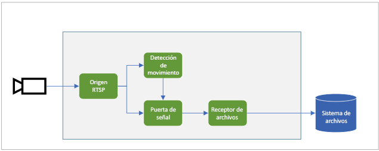
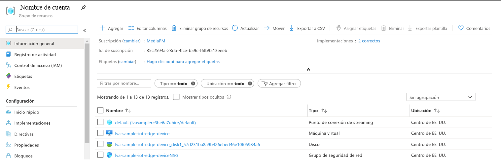
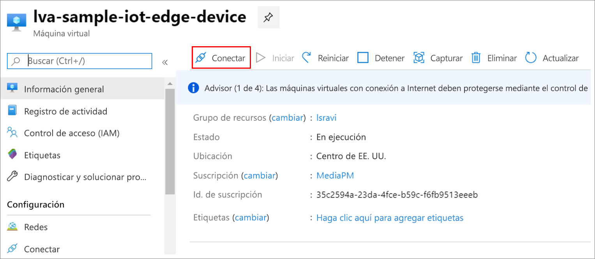

# <a name="quickstart-detect-motion-record-video-on-edge-devices"></a>Inicio rápido: Detección de movimiento y grabación de vídeo en dispositivos perimetrales
 
En este inicio rápido se muestra cómo usar Live Video Analytics en IoT Edge para analizar la fuente de vídeo en directo desde una cámara IP (simulada), detectar si hay algún movimiento y, en caso afirmativo, grabar un clip de vídeo MP4 en el sistema de archivos local del dispositivo perimetral. Usa una máquina virtual de Azure como un dispositivo IoT Edge y una secuencia de vídeo en directo simulada. Este artículo se basa en un ejemplo de código escrito en C#.

Este artículo se basa en [este](detect-motion-emit-events-quickstart.md) inicio rápido. 

## <a name="prerequisites"></a>Requisitos previos

* Una cuenta de Azure con una suscripción activa. [Cree una cuenta gratuita](https://azure.microsoft.com/free/?WT.mc_id=A261C142F).
* [Visual Studio Code](https://code.visualstudio.com/) en la máquina con las siguientes extensiones:
    * [Herramientas de Azure IoT](https://marketplace.visualstudio.com/items?itemName=vsciot-vscode.azure-iot-tools)
    * [C#](https://marketplace.visualstudio.com/items?itemName=ms-dotnettools.csharp)
* [SDK de .NET Core 3.1](https://dotnet.microsoft.com/download/dotnet-core/3.1) instalado en el sistema
* Si no ha completado previamente [este](detect-motion-emit-events-quickstart.md) inicio rápido, complete los pasos siguientes:
     * [Configuración de los recursos de Azure](detect-motion-emit-events-quickstart.md#set-up-azure-resources)
     * [Configuración del entorno de desarrollo](detect-motion-emit-events-quickstart.md#set-up-your-development-environment)
     * [Generación e implementación del manifiesto de implementación de IoT Edge](detect-motion-emit-events-quickstart.md#generate-and-deploy-the-iot-edge-deployment-manifest)
     * [Preparación de la supervisión de eventos](detect-motion-emit-events-quickstart.md#prepare-for-monitoring-events)

> [!TIP]
> Al instalar Azure IoT Tools, es posible que se le pida que instale Docker. Si lo desea, puede ignorar este aviso.

## <a name="review-the-sample-video"></a>Revisión del vídeo de ejemplo
Como parte de los pasos anteriores para configurar los recursos de Azure, se copiará un vídeo (corto) de un área de aparcamiento en la máquina virtual Linux en Azure que se usa como dispositivo IoT Edge. Este archivo de vídeo se usará para simular un streaming en vivo para este tutorial.

Puede usar una aplicación como [VLC Player](https://www.videolan.org/vlc/), iniciarla, presionar Ctrl + N y pegar [este](https://lvamedia.blob.core.windows.net/public/lots_015.mkv) vínculo al vídeo sobre el estacionamiento para iniciar la reproducción. Hacia la marca de 5 segundos, un coche blanco se desplaza por el aparcamiento.

Cuando realice los pasos que se indican a continuación, habrá utilizado Live Video Analytics en IoT Edge para detectar ese movimiento del coche y grabar un clip de vídeo que empiece en torno a esa marca de los 5 segundos.

## <a name="overview"></a>Información general



En el diagrama anterior se muestra cómo fluyen las señales en este inicio rápido. Un módulo IoT Edge (que se detalla [aquí](https://github.com/Azure/live-video-analytics/tree/master/utilities/rtspsim-live555)) simula una cámara IP que hospeda un servidor RTSP. Un nodo de [origen RTSP](media-graph-concept.md#rtsp-source) extrae la fuente de vídeo de este servidor y envía fotogramas de vídeo al nodo del [procesador de detección del movimiento](media-graph-concept.md#motion-detection-processor). El origen RTSP envía los mismos fotogramas de vídeo a un nodo de [procesador de la puerta de señal](media-graph-concept.md#signal-gate-processor), que permanece cerrado hasta que un evento lo desencadena.

Cuando el procesador de detección del movimiento determina que hay movimiento en el vídeo, envía un evento al nodo de procesador de la puerta de señal y lo desencadena. La puerta se abre durante el tiempo configurado y envía fotogramas de vídeo al nodo del [receptor de archivos](media-graph-concept.md#file-sink). Este nodo del receptor registra el vídeo como un archivo MP4 en el sistema de archivos local del dispositivo perimetral, en la ubicación configurada.

En este inicio rápido realizará lo siguiente:

1. Creación e implementación del grafo de elementos multimedia
1. Interpretación de los resultados
1. Limpieza de recursos

## <a name="examine-and-edit-the-sample-files"></a>Examen y edición de los archivos de ejemplo
Como parte de los requisitos previos, debería haber descargado el código de ejemplo en una carpeta. Inicie Visual Studio Code y abra la carpeta.

1. En Visual Studio Code, vaya a "src/edge". Verá el archivo .env que ha creado junto con algunos archivos de plantilla de implementación.
    * La plantilla de implementación hace referencia al manifiesto de implementación del dispositivo perimetral con algunos valores de marcador de posición. El archivo .env contiene los valores de esas variables.
1. A continuación, vaya a la carpeta "src/cloud-to-device-console-app". Aquí podrá ver el archivo appsettings.json que creó junto con algunos otros archivos:
    * c2d-console-app.csproj: este es el archivo de proyecto para Visual Studio Code.
    * operations.json: este archivo muestra las distintas operaciones que desea que ejecute el programa.
    * Program.cs: este es el código del programa de ejemplo, que hace lo siguiente:

        * Carga la configuración de la aplicación.
        * Invoca los métodos directos que expone el módulo Live Video Analytics en IoT Edge. Puede usar el módulo para analizar secuencias de vídeo en directo mediante la invocación de sus [métodos directos](direct-methods.md). 
        * Se pone en pausa para que pueda examinar la salida del programa en la ventana de terminal y los eventos generados por el módulo en la ventana de salida.
        * Invoca los métodos directos para la limpieza de los recursos.   

1. Realice los siguientes cambios en el archivo operations.json.
    * Cambie el vínculo a la topología de grafo: `"topologyUrl" : "https://raw.githubusercontent.com/Azure/live-video-analytics/master/MediaGraph/topologies/evr-motion-files/topology.json"`
    * En GraphInstanceSet, edite el nombre de la topología del grafo para que coincida con el valor del vínculo anterior `"topologyName" : "EVRToFilesOnMotionDetection"`.
    * Edite también la dirección URL de RTSP para que apunte al archivo de vídeo deseado `"value": "rtsp://rtspsim:554/media/lots_015.mkv"`.
    * En GraphTopologyDelete, edite el nombre `"name": "EVRToFilesOnMotionDetection"`.

## <a name="review---check-status-of-the-modules"></a>Revisión: comprobación del estado de los módulos
En el paso [Generación e implementación del manifiesto de implementación de IoT Edge](detect-motion-emit-events-quickstart.md#generate-and-deploy-the-iot-edge-deployment-manifest), en Visual Studio Code, si expande el nodo "Iva-sample-device" en AZURE IOT HUB (en la sección situada en la parte inferior izquierda) verá los siguientes módulos implementados.

    1. El módulo de Live Video Analytics, denominado "lvaEdge"
    1. Un módulo denominado "rtspsim", que simula un servidor RTSP, que actúa como el origen de una fuente de vídeo en directo

        


## <a name="review---prepare-for-monitoring-events"></a>Revisión: Preparación de la supervisión de eventos
Compruebe que ha completado los pasos para la [preparación de la supervisión de eventos](detect-motion-emit-events-quickstart.md#prepare-for-monitoring-events).


## <a name="run-the-sample-program"></a>Ejecución del programa de ejemplo

1. Inicie una sesión de depuración (presione F5). Empezará a ver algunos mensajes impresos en la ventana de terminal.
1. El archivo operations.json comienza con llamadas a los métodos directos GraphTopologyList y GraphInstanceList. Si ha limpiado los recursos después de los inicios rápidos anteriores, devolverá listas vacías y, a continuación, entrará en pausa para que presione Entrar.
```
--------------------------------------------------------------------------
Executing operation GraphTopologyList
-----------------------  Request: GraphTopologyList  --------------------------------------------------
{
  "@apiVersion": "1.0"
}
---------------  Response: GraphTopologyList - Status: 200  ---------------
{
  "value": []
}
--------------------------------------------------------------------------
Executing operation WaitForInput
Press Enter to continue
```
1. Al presionar la tecla "Entrar" en la ventana de terminal, se realiza el siguiente conjunto de llamadas de método directo
     * Una llamada a GraphTopologySet con el elemento topologyUrl anterior
     * Una llamada a GraphInstanceSet con el siguiente cuerpo
     ```
     {
       "@apiVersion": "1.0",
       "name": "Sample-Graph",
       "properties": {
         "topologyName": "EVRToFilesOnMotionDetection",
         "description": "Sample graph description",
         "parameters": [
           {
             "name": "rtspUrl",
             "value": "rtsp://rtspsim:554/media/lots_015.mkv"
           },
           {
             "name": "rtspUserName",
             "value": "testuser"
           },
           {
             "name": "rtspPassword",
             "value": "testpassword"
           }
         ]
       }
     }
     ```
     * Una llamada a GraphInstanceActivate para iniciar la instancia del grafo e iniciar el flujo de vídeo
     * Una segunda llamada a GraphInstanceList para mostrar que la instancia de grafo está ciertamente en ejecución
1. La salida de la ventana de TERMINAL se pondrá en pausa ahora con el mensaje "Press Enter to continue" (Presione Entrar para continuar). No presione "Entrar" en este momento. Puede desplazarse hacia arriba para ver las cargas de la respuesta JSON para los métodos directos que ha invocado.
1. Si ahora cambia a la ventana de salida de Visual Studio Code, verá los mensajes que se envían a IoT Hub mediante el módulo Live Video Analytics en IoT Edge.
     * Estos mensajes se describen en la sección siguiente.
1. El grafo de elementos multimedia seguirá en ejecución e imprimirá los resultados: el simulador RTSP mantendrá el bucle en el vídeo de origen. Para detener el grafo de elementos multimedia, vuelva a la ventana de terminal y presione "Entrar". Se realiza la siguiente serie de llamadas para la limpieza de recursos:
     * Una llamada a GraphInstanceDeactivate para desactivar la instancia del grafo.
     * Una llamada a GraphInstanceDelete para eliminar la instancia
     * Una llamada a GraphTopologyDelete para eliminar la topología
     * Una llamada final a GraphTopologyList para mostrar que ahora la lista está vacía

## <a name="interpret-results"></a>Interpretación de los resultados 
Cuando se ejecuta el grafo de elementos multimedia, los resultados del nodo del procesador de detección del movimiento se envían mediante el nodo de receptor de IoT Hub a IoT Hub. Los mensajes que aparecen en la ventana de salida de Visual Studio Code contienen una sección "body" y una sección "applicationProperties". Para comprender lo que estas secciones representan, consulte [este artículo](https://docs.microsoft.com/azure/iot-hub/iot-hub-devguide-messages-construct).

En los mensajes siguientes, se definen las propiedades de la aplicación y el contenido del cuerpo mediante el módulo Live Video Analytics.

## <a name="mediasession-established-event"></a>Evento MediaSessionEstablished

Cuando se crean instancias del grafo de elementos multimedia, el nodo de origen RTSP intenta conectarse al servidor RTSP que se ejecuta en el contenedor rtspsim-live555. Si se realiza correctamente, imprimirá este evento:

```
[IoTHubMonitor] [05:37:21 AM] Message received from [lva-sample-device/lvaEdge]:
{  
"body": {
"sdp": "SDP:\nv=0\r\no=- 1586450538111534 1 IN IP4 xxx.xxx.xxx.xxx\r\ns=Matroska video+audio+(optional)subtitles, streamed by the LIVE555 Media Server\r\ni=media/camera-300s.mkv\r\nt=0 0\r\na=tool:LIVE555 Streaming Media v2020.03.06\r\na=type:broadcast\r\na=control:*\r\na=range:npt=0-300.000\r\na=x-qt-text-nam:Matroska video+audio+(optional)subtitles, streamed by the LIVE555 Media Server\r\na=x-qt-text-inf:media/camera-300s.mkv\r\nm=video 0 RTP/AVP 96\r\nc=IN IP4 0.0.0.0\r\nb=AS:500\r\na=rtpmap:96 H264/90000\r\na=fmtp:96 packetization-mode=1;profile-level-id=4D0029;sprop-parameter-sets={SPS}\r\na=control:track1\r\n"  
},  
"applicationProperties": {  
    "dataVersion": "1.0",  
    "topic": "/subscriptions/{subscriptionID}/resourceGroups/{name}/providers/microsoft.media/mediaservices/hubname",  
    "subject": "/graphInstances/Sample-Graph-1/sources/rtspSource",  
    "eventType": "Microsoft.Media.MediaGraph.Diagnostics.MediaSessionEstablished",  
    "eventTime": "2020-05-21T05:37:21.398Z",
    }  
}
```

* El mensaje es un evento de diagnóstico, MediaSessionEstablished, que indica que el nodo de origen RTSP (sujeto) ha podido establecer la conexión con el simulador RTSP y comenzar a recibir una fuente en directo (simulada).
* La sección "subject" de applicationProperties hace referencia al nodo de la topología de grafo desde la que se generó el mensaje. En este caso, el mensaje se origina en el nodo de origen RTSP.
* "eventType" en applicationProperties indica que se trata de un evento de diagnóstico.
* "eventTime" indica la hora a la que se produjo el evento.
* "body" contiene datos sobre el evento de diagnóstico que, en este caso, es el detalle de [SDP](https://en.wikipedia.org/wiki/Session_Description_Protocol).


## <a name="recording-started-event"></a>Evento Grabación iniciada

Como se explica [aquí](#overview), cuando se detecta movimiento, se activa el nodo de procesador de la puerta de señal y el nodo de receptor de archivos del grafo de elementos multimedia empieza a escribir un archivo MP4. El nodo del receptor de archivos envía un evento operativo. El tipo se establece en "movimiento"para indicar que es un resultado procedente del procesador de detección del movimiento y eventTime le indica a qué hora (UTC) se produjo el movimiento. Aquí tiene un ejemplo:

```
[IoTHubMonitor] [05:37:27 AM] Message received from [lva-sample-device/lvaEdge]:
{
  "body": {
    "outputType": "filePath",
    "outputLocation": "/var/media/sampleFilesFromEVR-filesinkOutput-20200521T053726Z.mp4"
  },
  "applicationProperties": {
    "topic": "/subscriptions/{subscriptionID}/resourceGroups/{name}/providers/microsoft.media/mediaservices/hubname",  
    "subject": "/graphInstances/Sample-Graph-1/sinks/fileSink",
    "eventType": "Microsoft.Media.Graph.Operational.RecordingStarted",
    "eventTime": "2020-05-21T05:37:27.713Z",
    "dataVersion": "1.0"
  }
}
```

* La sección "subject" de applicationProperties hace referencia al nodo del grafo de elementos multimedia desde el que se generó el mensaje. En este caso, el mensaje se origina en el nodo del receptor de archivos.
* "eventType" en applicationProperties indica que se trata de un evento operativo.
* "eventTime" indica la hora a la que se produjo el evento. Observe que esta es 5 o 6 segundos posterior a MediaSessionEstablished y a que el vídeo empiece a ejecutarse. Esto se corresponde a la marca de 5 o 6 segundos cuando el [coche empezó a moverse](#review-the-sample-video) por el aparcamiento.
* "body" contiene los datos del evento operativo que, en este caso, son datos "outputType" y "outputLocation".
* "outputType" indica que esta información es sobre la ruta de acceso del archivo.
* "outputLocation" proporciona la ubicación del archivo MP4 dentro del módulo IoT Edge.

## <a name="recording-stopped-and-available-events"></a>Eventos Grabación detenida y Grabación disponible

Si examina las propiedades del nodo de procesador de la puerta de señal en la [topología del grafo](https://github.com/Azure/live-video-analytics/blob/master/MediaGraph/topologies/evr-motion-files/topology.json) puede ver que los tiempos de activación se han establecido en 5 segundos. Por tanto, 5 segundos después de que se reciba el evento RecordingStarted recibirá un
* Evento RecordingStopped, que indica que la grabación se ha detenido
* Evento RecordingAvailable, que indica que ahora se puede usar el archivo MP4 para su visualización

Normalmente, los dos eventos se emiten con unos segundos de diferencia.

### <a name="playing-back-the-mp4-clip"></a>Reproducción del clip de MP4

1. Los archivos MP4 se escriben en un directorio del dispositivo perimetral que configuró en el archivo .env mediante esta clave: OUTPUT_VIDEO_FOLDER_ON_DEVICE. Si no ha modificado los valores predeterminados los resultados estarán en /home/lvaadmin/samples/output/
1. Vaya al grupo de recursos, busque la máquina virtual y conéctese mediante Bastion

    
 
    
1. Una vez que haya iniciado sesión (con las credenciales que se generaron durante [este](detect-motion-emit-events-quickstart.md#set-up-azure-resources) paso), en el símbolo del sistema, vaya al directorio pertinente (el directorio predeterminado es: /home/lvaadmin/samples/output) y verá allí los archivos MP4. Puede usar [scp para hacer una copia segura de los archivos](https://docs.microsoft.com/azure/virtual-machines/linux/copy-files-to-linux-vm-using-scp) en la máquina local y reproducirlos mediante [VLC Player](https://www.videolan.org/vlc/) o cualquier otro reproductor de MP4.

    

## <a name="clean-up-resources"></a>Limpieza de recursos

Si su intención es probar los demás inicios rápidos, debería conservar los recursos creados. En caso contrario, vaya a Azure Portal, vaya a los grupos de recursos, seleccione el grupo de recursos en el que ejecutó este inicio rápido y elimine todos los recursos.

## <a name="next-steps"></a>Pasos siguientes

* Ejecute el inicio rápido [Ejecución de Live Video Analytics con su propio modelo](use-your-model-quickstart.md) que muestra cómo aplicar la inteligencia artificial a las fuentes de vídeo en directo.
* Revise los desafíos adicionales para los usuarios avanzados:

    * Use una [cámara IP](https://en.wikipedia.org/wiki/IP_camera) compatible con RTSP en lugar de utilizar el simulador RTSP. Puede buscar cámaras IP con compatibilidad con RTSP en la página de productos [compatibles con ONVIF](https://en.wikipedia.org/wiki/IP_camera), buscando dispositivos que cumplan con los perfiles G, S o T.
    * Use un dispositivo Linux AMD64 o x64 (en lugar de usar una máquina virtual Linux de Azure). El dispositivo debe estar en la misma red que la cámara IP. Puede seguir las instrucciones de [Instalación del entorno de ejecución de Azure IoT Edge en sistemas Linux basados en Debian](https://docs.microsoft.com/azure/iot-edge/how-to-install-iot-edge-linux) y, a continuación, seguir las instrucciones de la guía de inicio rápido [Implementación del primer módulo IoT Edge en un dispositivo virtual Linux](https://docs.microsoft.com/azure/iot-edge/quickstart-linux) para registrar el dispositivo en Azure IoT Hub.
