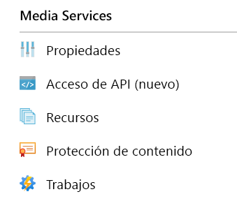
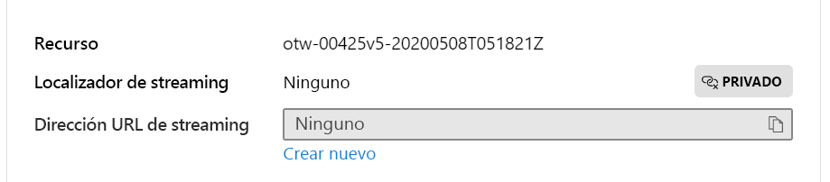

# <a name="quickstart-detect-motion-record-video-to-media-services"></a>Inicio rápido: Detección de movimiento y grabación de vídeo en Media Services

Este artículo le guía por los pasos necesarios para usar Live Video Analytics en IoT Edge para la [grabación basada en eventos](event-based-video-recording-concept.md). Usa una máquina virtual Linux en Azure como dispositivo IoT Edge y una secuencia de vídeo en directo simulada. Esta secuencia de vídeo se analiza para detectar la presencia de objetos en movimiento. Cuando se detecta movimiento, los eventos se envían a Azure IoT Hub y la parte correspondiente de la secuencia de vídeo se graba como un recurso de Azure Media Services.

Este artículo está basado en el [inicio rápido Introducción](get-started-detect-motion-emit-events-quickstart.md).

## <a name="prerequisites"></a>Requisitos previos

* Una cuenta de Azure con una suscripción activa. [Cree una cuenta gratuita](https://azure.microsoft.com/free/?WT.mc_id=A261C142F).
* [Visual Studio Code](https://code.visualstudio.com/) en la máquina con la [extensión de Azure IoT Tools](https://marketplace.visualstudio.com/items?itemName=vsciot-vscode.azure-iot-tools).
* Si no ha completado anteriormente el [inicio rápido Introducción](get-started-detect-motion-emit-events-quickstart.md), siga los pasos siguientes:
    * [Configuración de los recursos de Azure](get-started-detect-motion-emit-events-quickstart.md#set-up-azure-resources)
    * [Implementación de módulos](get-started-detect-motion-emit-events-quickstart.md#deploy-modules-on-your-edge-device)
    * [Configuración de Visual Studio Code](get-started-detect-motion-emit-events-quickstart.md#configure-the-azure-iot-tools-extension)

## <a name="review-the-sample-video"></a>Revisión del vídeo de ejemplo

Como parte de los pasos anteriores para configurar los recursos de Azure, se copiará un vídeo (corto) de un área de aparcamiento en la máquina virtual Linux en Azure que se usa como dispositivo IoT Edge. Este archivo de vídeo se usará para simular un streaming en vivo para este tutorial.

Puede usar una aplicación como [VLC Player](https://www.videolan.org/vlc/), iníciela, presione `Ctrl+N` y pegue el vínculo al [ejemplo de vídeo sobre el aparcamiento](https://lvamedia.blob.core.windows.net/public/lots_015.mkv) para iniciar la reproducción. Hacia la marca de 5 segundos, un coche blanco se desplaza por el aparcamiento.

Cuando realice los pasos que se indican a continuación, habrá utilizado Live Video Analytics en IoT Edge para detectar ese movimiento del coche y grabar un clip de vídeo que empiece en torno a esa marca de los 5 segundos. El diagrama siguiente es la representación visual de todo el flujo.

> [!div class="mx-imgBorder"]
> :::image type="content" source="./media/quickstarts/topology.svg" alt-text="Grabación de vídeo basada en eventos en recursos que se basan en eventos de movimiento":::

## <a name="use-direct-method-calls"></a>Uso de llamadas de método directo

Puede usar el módulo para analizar secuencias de vídeo en directo mediante la invocación de métodos directos. Lea [Métodos directos de Live Video Analytics en IoT Edge](direct-methods.md) para conocer todos los métodos directos que proporciona el módulo. 

### <a name="invoke-graphtopologylist"></a>Invocación de GraphTopologyList
En este paso se enumeran todas las [topologías de grafos](media-graph-concept.md#media-graph-topologies-and-instances) del módulo.

1. Haga clic con el botón derecho en el módulo "lvaEdge" y seleccione "Invoke Module Direct Method" (Invocar método directo del módulo) en el menú contextual.
1. Verá un cuadro de edición emergente en la parte superior central de la ventana de Visual Studio Code. Escriba "GraphTopologyList" en el cuadro de edición y presione ENTRAR.
1. A continuación, copie y pegue la carga de JSON siguiente en el cuadro de edición y presione ENTRAR.
    
```
{
    "@apiVersion" : "1.0"
}
```

En unos segundos, verá la ventana de salida en el cuadro emergente de Visual Studio Code con la siguiente respuesta
    
```
[DirectMethod] Invoking Direct Method [GraphTopologyList] to [lva-sample-device/lvaEdge] ...
[DirectMethod] Response from [lva-sample-device/lvaEdge]:
{
  "status": 200,
  "payload": {
    "value": []
  }
}
```
    
Se espera la respuesta anterior ya que no se ha creado ninguna topología de grafo.

### <a name="invoke-graphtopologyset"></a>Invocación de GraphTopologySet

Con los mismos pasos descritos para la invocación de GraphTopologyList, puede invocar a GraphTopologySet para establecer una [topología de grafo](media-graph-concept.md#media-graph-topologies-and-instances) mediante el siguiente JSON como carga. Va a crear una topología de grafo denominada "EVRtoAssetsOnMotionDetection".

```
{
    "@apiVersion": "1.0",
    "name": "EVRtoAssetsOnMotionDetection",
    "properties": {
      "description": "Event-based video recording to Assets based on motion events",
      "parameters": [
        {
            "name": "rtspUserName",
            "type": "String",
            "description": "rtsp source user name.",
            "default": "dummyUserName"
        },
        {
            "name": "rtspPassword",
            "type": "String",
            "description": "rtsp source password.",
            "default" : "dummyPassword"
        },
        {
            "name": "rtspUrl",
            "type": "String",
            "description": "rtsp Url"
        },
        {
            "name": "motionSensitivity",
            "type": "String",
            "description": "motion detection sensitivity",
            "default" : "medium"
        },
        {
            "name": "hubSinkOutputName",
            "type": "String",
            "description": "hub sink output name",
            "default" : "iothubsinkoutput"
        }                              
    ],         

      "sources": [
        {
          "@type": "#Microsoft.Media.MediaGraphRtspSource",
          "name": "rtspSource",
          "endpoint": {
            "@type": "#Microsoft.Media.MediaGraphUnsecuredEndpoint",
            "url": "${rtspUrl}",
            "credentials": {
              "@type": "#Microsoft.Media.MediaGraphUsernamePasswordCredentials",
              "username": "${rtspUserName}",
              "password": "${rtspPassword}"
            }
          }
        }
      ],
      "processors": [
        {
          "@type": "#Microsoft.Media.MediaGraphMotionDetectionProcessor",
          "name": "motionDetection",
          "sensitivity": "${motionSensitivity}",
          "inputs": [
            {
              "nodeName": "rtspSource"
            }
          ]
        },
        {
          "@type": "#Microsoft.Media.MediaGraphSignalGateProcessor",
          "name": "signalGateProcessor",
          "inputs": [
            {
              "nodeName": "motionDetection"
            },
            {
              "nodeName": "rtspSource"
            }
          ],
          "activationEvaluationWindow": "PT1S",
          "activationSignalOffset": "PT0S",
          "minimumActivationTime": "PT30S",
          "maximumActivationTime": "PT30S"
        }
      ],
      "sinks": [
        {
          "@type": "#Microsoft.Media.MediaGraphAssetSink",
          "name": "assetSink",
          "assetNamePattern": "sampleAssetFromEVR-LVAEdge-${System.DateTime}",
          "segmentLength": "PT0M30S",
          "localMediaCacheMaximumSizeMiB": "2048",
          "localMediaCachePath": "/var/lib/azuremediaservices/tmp/",
          "inputs": [
            {
              "nodeName": "signalGateProcessor"
            }
          ]
        },
        {
          "@type": "#Microsoft.Media.MediaGraphIoTHubMessageSink",
          "name": "hubSink",
          "hubOutputName": "${hubSinkOutputName}",
          "inputs": [
            {
              "nodeName": "motionDetection"
            }
          ]
        }
      ]
    }
}
```

La carga de JSON anterior da como resultado la creación de una topología de grafos que define cinco parámetros (cuatro de los cuales tienen valores predeterminados). La topología tiene un nodo de origen ([origen RTSP](media-graph-concept.md#rtsp-source)), dos nodos de procesador ([procesador de detección de movimiento](media-graph-concept.md#motion-detection-processor) y [procesador de la puerta de señal](media-graph-concept.md#signal-gate-processor)) y dos nodos receptores (receptor de IOT Hub y [receptor de recursos](media-graph-concept.md#asset-sink)). La representación visual de la topología se muestra más arriba.

En unos segundos, verá la siguiente respuesta en la ventana de salida.

```
[DirectMethod] Invoking Direct Method [GraphTopologySet] to [lva-sample-device/lvaEdge] ...
[DirectMethod] Response from [lva-sample-device/lvaEdge]:
{
  "status": 201,
  "payload": {
    "systemData": {
      "createdAt": "2020-05-12T22:05:31.603Z",
      "lastModifiedAt": "2020-05-12T22:05:31.603Z"
    },
    "name": "EVRtoAssetsOnMotionDetection",
    "properties": {
      "description": "Event-based video recording to assets based on motion events",
      "parameters": [
        {
          "name": "rtspUserName",
          "type": "String",
          "description": "rtsp source user name.",
          "default": "dummyUserName"
        },
        {
          "name": "rtspPassword",
          "type": "String",
          "description": "rtsp source password.",
          "default": "dummyPassword"
        },
        {
          "name": "rtspUrl",
          "type": "String",
          "description": "rtsp Url"
        },
        {
          "name": "motionSensitivity",
          "type": "String",
          "description": "motion detection sensitivity",
          "default": "medium"
        },
        {
          "name": "hubSinkOutputName",
          "type": "String",
          "description": "hub sink output name",
          "default": "iothubsinkoutput"
        }
      ],
      "sources": [
        {
          "@type": "#Microsoft.Media.MediaGraphRtspSource",
          "name": "rtspSource",
          "transport": "Tcp",
          "endpoint": {
            "@type": "#Microsoft.Media.MediaGraphUnsecuredEndpoint",
            "url": "${rtspUrl}",
            "credentials": {
              "@type": "#Microsoft.Media.MediaGraphUsernamePasswordCredentials",
              "username": "${rtspUserName}",
              "password": "${rtspPassword}"
            }
          }
        }
      ],
      "processors": [
        {
          "@type": "#Microsoft.Media.MediaGraphMotionDetectionProcessor",
          "sensitivity": "${motionSensitivity}",
          "name": "motionDetection",
          "inputs": [
            {
              "nodeName": "rtspSource",
              "outputSelectors": []
            }
          ]
        },
        {
          "@type": "#Microsoft.Media.MediaGraphSignalGateProcessor",
          "activationEvaluationWindow": "PT1S",
          "activationSignalOffset": "PT0S",
          "minimumActivationTime": "PT30S",
          "maximumActivationTime": "PT30S",
          "name": "signalGateProcessor",
          "inputs": [
            {
              "nodeName": "motionDetection",
              "outputSelectors": []
            },
            {
              "nodeName": "rtspSource",
              "outputSelectors": []
            }
          ]
        }
      ],
      "sinks": [
        {
          "@type": "#Microsoft.Media.MediaGraphAssetSink",
          "localMediaCachePath": "/var/lib/azuremediaservices/tmp/",
          "localMediaCacheMaximumSizeMiB": "2048",
          "segmentLength": "PT0M30S",
          "assetNamePattern": "sampleAssetFromEVR-LVAEdge-${System.DateTime}",
          "name": "assetSink",
          "inputs": [
            {
              "nodeName": "signalGateProcessor",
              "outputSelectors": []
            }
          ]
        },
        {
          "@type": "#Microsoft.Media.MediaGraphIoTHubMessageSink",
          "hubOutputName": "${hubSinkOutputName}",
          "name": "hubSink",
          "inputs": [
            {
              "nodeName": "motionDetection",
              "outputSelectors": []
            }
          ]
        }
      ]
    }
  }
}
```

El estado devuelto es 201, lo que indica que se ha creado una nueva topología de grafo. Intente los siguientes métodos directos como se indica a continuación:

* Vuelva a invocar a GraphTopologySet y compruebe que el código de estado devuelto es 200. Un código de estado 200 indica que se ha actualizado correctamente una topología de grafo ya existente.
* Vuelva a invocar a GraphTopologySet, pero cambie la cadena de descripción. Compruebe que el código de estado de la respuesta es 200 y que la descripción se ha actualizado al nuevo valor.
* Invoque GraphTopologyList como se describe en la sección anterior y compruebe que ahora puede ver la topología del grafo "EVRtoAssetsOnMotionDetecion" en la carga devuelta.

### <a name="invoke-graphtopologyget"></a>Invocación de GraphTopologyGet

Ahora, invoque a GraphTopologyGet con la carga siguiente
```

{
    "@apiVersion" : "1.0",
    "name" : "EVRtoAssetsOnMotionDetection"
}
```

En unos segundos, verá la siguiente respuesta en la ventana de salida.

```
[DirectMethod] Invoking Direct Method [GraphTopologyGet] to [lva-sample-device/lvaEdge] ...
[DirectMethod] Response from [lva-sample-device/lvaEdge]:
{
  "status": 200,
  "payload": {
    "systemData": {
      "createdAt": "2020-05-12T22:05:31.603Z",
      "lastModifiedAt": "2020-05-12T22:05:31.603Z"
    },
    "name": "EVRtoAssetsOnMotionDetection",
    "properties": {
      "description": "Event-based video recording to Assets based on motion events",
      "parameters": [
        {
          "name": "rtspUserName",
          "type": "String",
          "description": "rtsp source user name.",
          "default": "dummyUserName"
        },
        {
          "name": "rtspPassword",
          "type": "String",
          "description": "rtsp source password.",
          "default": "dummyPassword"
        },
        {
          "name": "rtspUrl",
          "type": "String",
          "description": "rtsp Url"
        },
        {
          "name": "motionSensitivity",
          "type": "String",
          "description": "motion detection sensitivity",
          "default": "medium"
        },
        {
          "name": "hubSinkOutputName",
          "type": "String",
          "description": "hub sink output name",
          "default": "iothubsinkoutput"
        }
      ],
      "sources": [
        {
          "@type": "#Microsoft.Media.MediaGraphRtspSource",
          "name": "rtspSource",
          "transport": "Tcp",
          "endpoint": {
            "@type": "#Microsoft.Media.MediaGraphUnsecuredEndpoint",
            "url": "${rtspUrl}",
            "credentials": {
              "@type": "#Microsoft.Media.MediaGraphUsernamePasswordCredentials",
              "username": "${rtspUserName}",
              "password": "${rtspPassword}"
            }
          }
        }
      ],
      "processors": [
        {
          "@type": "#Microsoft.Media.MediaGraphMotionDetectionProcessor",
          "sensitivity": "${motionSensitivity}",
          "name": "motionDetection",
          "inputs": [
            {
              "nodeName": "rtspSource",
              "outputSelectors": []
            }
          ]
        },
        {
          "@type": "#Microsoft.Media.MediaGraphSignalGateProcessor",
          "activationEvaluationWindow": "PT1S",
          "activationSignalOffset": "PT0S",
          "minimumActivationTime": "PT30S",
          "maximumActivationTime": "PT30S",
          "name": "signalGateProcessor",
          "inputs": [
            {
              "nodeName": "motionDetection",
              "outputSelectors": []
            },
            {
              "nodeName": "rtspSource",
              "outputSelectors": []
            }
          ]
        }
      ],
      "sinks": [
        {
          "@type": "#Microsoft.Media.MediaGraphAssetSink",
          "localMediaCachePath": "/var/lib/azuremediaservices/tmp/",
          "localMediaCacheMaximumSizeMiB": "2048",
          "segmentLength": "PT0M30S",
          "assetNamePattern": "sampleAssetFromEVR-LVAEdge-${System.DateTime}",
          "name": "assetSink",
          "inputs": [
            {
              "nodeName": "signalGateProcessor",
              "outputSelectors": []
            }
          ]
        },
        {
          "@type": "#Microsoft.Media.MediaGraphIoTHubMessageSink",
          "hubOutputName": "${hubSinkOutputName}",
          "name": "hubSink",
          "inputs": [
            {
              "nodeName": "motionDetection",
              "outputSelectors": []
            }
          ]
        }
      ]
    }
  }
}
```

Observe las siguientes propiedades en la carga de respuesta:

* El código de estado es 200, lo que indica que se ha realizado correctamente.
* La carga útil tiene las marcas de tiempo "created" y "lastModified".

### <a name="invoke-graphinstanceset"></a>Invocación de GraphInstanceSet

A continuación, cree una instancia de grafo que haga referencia a la topología de grafo anterior. Como se explicó [aquí](media-graph-concept.md#media-graph-topologies-and-instances), las instancias de grafos le permiten analizar secuencias de vídeo en directo desde muchas cámaras con la misma topología de grafos.

Ahora, invoque el método directo GraphInstanceSet con la carga siguiente:

```
{
    "@apiVersion" : "1.0",
    "name" : "Sample-Graph-2",
    "properties" : {
        "topologyName" : "EVRtoAssetsOnMotionDetection",
        "description" : "Sample graph description",
        "parameters" : [
            { "name" : "rtspUrl", "value" : "rtsp://rtspsim:554/media/lots_015.mkv" }
        ]
    }
}
```

Tenga en cuenta lo siguiente:

* La carga anterior especifica el nombre de la topología de grafo (EVRtoAssetsOnMotionDetecion) para la que se tiene que crear la instancia de grafo.
* La carga contiene el valor de parámetro para "rtspUrl", el cual no tenía un valor predeterminado en la carga de topología.

En unos segundos, verá la siguiente respuesta en la ventana de salida:

```
[DirectMethod] Invoking Direct Method [GraphInstanceSet] to [lva-sample-device/lvaEdge] ...
[DirectMethod] Response from [lva-sample-device/lvaEdge]:
{
  "status": 201,
  "payload": {
    "systemData": {
      "createdAt": "2020-05-12T23:30:20.666Z",
      "lastModifiedAt": "2020-05-12T23:30:20.666Z"
    },
    "name": "Sample-Graph-2",
    "properties": {
      "state": "Inactive",
      "description": "Sample graph description",
      "topologyName": "EVRtoAssetsOnMotionDetection",
      "parameters": [
        {
          "name": "rtspUrl",
          "value": "rtsp://rtspsim:554/media/lots_015.mkv"
        }
      ]
    }
  }
}
```

Observe las siguientes propiedades en la carga de respuesta:

* El código de estado es 201, lo que indica que se ha creado una nueva instancia.
* El estado es "Inactivo", lo que indica que la instancia de grafo se creó pero no se activó. Para más información, consulte los estados de los [grafos de elementos multimedia](media-graph-concept.md).

Intente los siguientes métodos directos como se indica a continuación:

* Vuelva a invocar a GraphInstanceSet con la misma carga y observe que el código de estado devuelto es ahora 200.
* Vuelva a invocar a GraphInstanceSet, pero con una descripción diferente y observe la descripción actualizada en la carga de respuesta, la cual indica que la instancia de grafo se actualizó correctamente.
* Invoque a GraphInstanceSet pero cambie el nombre a "Sample-Graph-3" y observe la carga de respuesta. Observe que se ha creado una nueva instancia de grafo (es decir, el código de estado es 201). Recuerde limpiar estas instancias duplicadas cuando acabe con el inicio rápido.

### <a name="prepare-for-monitoring-events"></a>Preparación de la supervisión de eventos

El grafo de elementos multimedia que creó usa el nodo del procesador de detección de movimientos para detectar el movimiento y estos eventos se retransmiten a IoT Hub. Para prepararse para observar estos eventos, siga estos pasos.

1. Abra el panel del explorador en Visual Studio Code y busque Azure IoT Hub en la esquina inferior izquierda.
1. Expanda el nodo Devices (Dispositivos).
1. Haga clic con el botón derecho en Iva-sample-device y elija la opción "Iniciar la supervisión del punto de conexión de eventos integrado".

    
    
    En cuestión de segundos, verá los siguientes mensajes en la ventana de salida:

```
[IoTHubMonitor] Start monitoring message arrived in built-in endpoint for all devices ...
[IoTHubMonitor] Created partition receiver [0] for consumerGroup [$Default]
[IoTHubMonitor] Created partition receiver [1] for consumerGroup [$Default]
[IoTHubMonitor] Created partition receiver [2] for consumerGroup [$Default]
[IoTHubMonitor] Created partition receiver [3] for consumerGroup [$Default]
```

### <a name="invoke-graphinstanceactivate"></a>Invocación de GraphInstanceActivate

Ahora active la instancia de grafo que inicia el flujo de vídeo en directo a través del módulo. Ahora, invoque el método directo GraphInstanceActivate con la carga siguiente:

```
{
    "@apiVersion" : "1.0",
    "name" : "Sample-Graph-2"
}
```

En unos segundos, verá la siguiente respuesta en la ventana de salida.

```
[DirectMethod] Invoking Direct Method [GraphInstanceActivate] to [lva-sample-device/lvaEdge] ...
[DirectMethod] Response from [lva-sample-device/lvaEdge]:
{
  "status": 200,
  "payload": null
}
```

El código de estado 200 en la carga de respuesta indica que la instancia de grafo se activó correctamente.

### <a name="invoke-graphinstanceget"></a>Invocación de GraphInstanceGet

Ahora, invoque el método directo GraphInstanceGet con la carga siguiente:

```
{
    "@apiVersion" : "1.0",
    "name" : "Sample-Graph-2"
}
```

En unos segundos, verá la siguiente respuesta en la ventana de salida.

```
[DirectMethod] Invoking Direct Method [GraphInstanceGet] to [lva-sample-device/lvaEdge] ...
[DirectMethod] Response from [lva-sample-device/lvaEdge]:
{
  "status": 200,
  "payload": {
    "systemData": {
      "createdAt": "2020-05-12T23:30:20.666Z",
      "lastModifiedAt": "2020-05-12T23:30:20.666Z"
    },
    "name": "Sample-Graph-2",
    "properties": {
      "state": "Active",
      "description": "Sample graph description",
      "topologyName": "EVRtoAssetsOnMotionDetection",
      "parameters": [
        {
          "name": "rtspUrl",
          "value": "rtsp://rtspsim:554/media/lots_015.mkv"
        }
      ]
    }
  }
}
```

Observe las siguientes propiedades en la carga de respuesta:

* El código de estado es 200, lo que indica que se ha realizado correctamente.
* El estado es "Activo", lo que indica que la instancia del grafo tiene ahora ese estado.

## <a name="observe-results"></a>Observación de resultados

La instancia de grafo que ha creado y activado anteriormente usa el nodo de procesador de detección de movimiento para detectar el movimiento en la secuencia de vídeo en directo entrante y envía eventos al receptor de IoT Hub. A continuación, estos eventos se retransmiten a IoT Hub, como se puede observar ahora. Verá los siguientes mensajes en la ventana de salida

```
[IoTHubMonitor] [4:33:04 PM] Message received from [lva-sample-device/lvaEdge]:
{
  "body": {
    "sdp": "SDP:\nv=0\r\no=- 1589326384077235 1 IN IP4 XXX.XX.XX.XXX\r\ns=Matroska video+audio+(optional)subtitles, streamed by the LIVE555 Media Server\r\ni=media/lots_015.mkv\r\nt=0 0\r\na=tool:LIVE555 Streaming Media v2020.04.12\r\na=type:broadcast\r\na=control:*\r\na=range:npt=0-73.000\r\na=x-qt-text-nam:Matroska video+audio+(optional)subtitles, streamed by the LIVE555 Media Server\r\na=x-qt-text-inf:media/lots_015.mkv\r\nm=video 0 RTP/AVP 96\r\nc=IN IP4 0.0.0.0\r\nb=AS:500\r\na=rtpmap:96 H264/90000\r\na=fmtp:96 packetization-mode=1;profile-level-id=640028;sprop-parameter-sets=XXXXXXXXXXXXXXXXXXXXXXXXXXXXXXXXXXX\r\na=control:track1\r\n"
  },
  "applicationProperties": {
    "topic": "/subscriptions/{subscriptionId}/resourceGroups/{resourceGroupName}/providers/microsoft.media/mediaservices/{amsAccountName}",
    "subject": "/graphInstances/Sample-Graph-2/sources/rtspSource",
    "eventType": "Microsoft.Media.Graph.Diagnostics.MediaSessionEstablished",
    "eventTime": "2020-05-12T23:33:04.077Z",
    "dataVersion": "1.0"
  }
}
[IoTHubMonitor] [4:33:09 PM] Message received from [lva-sample-device/lvaEdge]:
{
  "body": {
    "timestamp": 143039375044290,
    "inferences": [
      {
        "type": "motion",
        "motion": {
          "box": {
            "l": 0.48954,
            "t": 0.140741,
            "w": 0.075,
            "h": 0.058824
          }
        }
      }
    ]
  },
  "applicationProperties": {
    "topic": "/subscriptions/{subscriptionId}/resourceGroups/{resourceGroupName}/providers/microsoft.media/mediaservices/{amsAccountName}",
    "subject": "/graphInstances/Sample-Graph-2/processors/md",
    "eventType": "Microsoft.Media.Graph.Analytics.Inference",
    "eventTime": "2020-05-12T23:33:09.381Z",
    "dataVersion": "1.0"
  }
}
```

Observe las siguientes propiedades de los mensajes anteriores

* Cada mensaje contiene una sección "body" y una sección "applicationProperties". Para comprender lo que representan estas secciones, consulte [Creación y lectura de mensajes de IoT Hub](../../iot-hub/iot-hub-devguide-messages-construct.md).
* El primer mensaje es un evento de diagnóstico, MediaSessionEstablished, que indica que el nodo de origen RTSP (sujeto) ha podido establecer la conexión con el simulador RTSP y comenzar a recibir una fuente en directo (simulada).
* La sección "subject" de applicationProperties hace referencia al nodo de la topología de grafo desde la que se generó el mensaje. En este caso, el mensaje se origina en el nodo de origen RTSP.
* "eventType" en applicationProperties indica que se trata de un evento de diagnóstico.
* "eventTime" indica la hora a la que se produjo el evento.
* "body" contiene datos sobre el evento de diagnóstico: es el mensaje [SDP](https://en.wikipedia.org/wiki/Session_Description_Protocol).
* El segundo mensaje es un evento de análisis. Puede comprobar que se envía aproximadamente 5 segundos después del mensaje MediaSessionEstablished, lo cual se corresponde con el retraso entre el inicio del vídeo y el momento en que el automóvil circula por el aparcamiento.
* La sección "subject" de applicationProperties hace referencia al nodo del procesador de detección de movimiento del grafo que generó este mensaje.
* El evento es un evento de inferencia y, por lo tanto, el cuerpo contiene datos de "marca de tiempo" e "inferencias".
* la sección "inferences" indica que el "tipo" es "movimiento" y contiene datos adicionales sobre el evento "movimiento".

El siguiente mensaje que verá es el que aparece a continuación.

```
[IoTHubMonitor] [4:33:10 PM] Message received from [lva-sample-device/lvaEdge]:
{
  "body": {
    "outputType": "assetName",
    "outputLocation": "sampleAssetFromEVR-LVAEdge-20200512T233309Z"
  },
  "applicationProperties": {
    "topic": "/subscriptions/{subscriptionId}/resourceGroups/{resourceGroupName}/providers/microsoft.media/mediaservices/{amsAccountName}",
    "subject": "/graphInstances/Sample-Graph-2/sinks/assetSink",
    "eventType": "Microsoft.Media.Graph.Operational.RecordingStarted",
    "eventTime": "2020-05-12T23:33:10.392Z",
    "dataVersion": "1.0"
  }
}
```

* El tercer mensaje es un evento operativo. Puede comprobar que se ha enviado casi inmediatamente después del mensaje de detección de movimiento que sirvió como desencadenante para iniciar la grabación.
* La sección "subject" de applicationProperties hace referencia al nodo receptor del recurso del grafo que generó este mensaje.
* La sección "body" contiene información sobre la ubicación de salida, que en este caso es el nombre del recurso de Azure Media Services en el que se graba el vídeo. Anote este valor, lo usará más adelante en este inicio rápido.

En la topología, el nodo de procesador de la puerta de señal se ha configurado con tiempos de activación de 30 segundos, lo que significa que la topología del grafo grabará aproximadamente 30 segundos de vídeo en el recurso. Mientras se graba el vídeo, el nodo del procesador de detección de movimiento seguirá generando eventos de inferencia, los cuales se mostrarán en la ventana de salida. Después de algún tiempo, verá el siguiente mensaje.

```
[IoTHubMonitor] [4:33:31 PM] Message received from [lva-sample-device/lvaEdge]:
{
  "body": {
    "outputType": "assetName",
    "outputLocation": "sampleAssetFromEVR-LVAEdge-20200512T233309Z"
  },
  "applicationProperties": {
    "topic": "/subscriptions/{subscriptionId}/resourceGroups/{resourceGroupName}/providers/microsoft.media/mediaservices/{amsAccountName}",
    "subject": "/graphInstances/Sample-Graph-2/sinks/assetSink",
    "eventType": "Microsoft.Media.Graph.Operational.RecordingAvailable",
    "eventTime": "2020-05-12T23:33:31.051Z",
    "dataVersion": "1.0"
  }
}
```

* Este mensaje es también un evento operativo. El evento, RecordingAvailable, indica que se han escrito suficientes datos en el recurso para que los reproductores y clientes inicien la reproducción del vídeo.
* La sección "subject" de applicationProperties hace referencia al nodo receptor del recurso del grafo que generó este mensaje.
* La sección "body" contiene información sobre la ubicación de salida, que en este caso es el nombre del recurso de Azure Media Services en el que se graba el vídeo.

Si permite que la instancia del grafo continúe ejecutándose, verá este mensaje.

```
[IoTHubMonitor] [4:33:40 PM] Message received from [lva-sample-device/lvaEdge]:
{
  "body": {
    "outputType": "assetName",
    "outputLocation": "sampleAssetFromEVR-LVAEdge-20200512T233309Z"
  },
  "applicationProperties": {
    "topic": "/subscriptions/{subscriptionId}/resourceGroups/{resourceGroupName}/providers/microsoft.media/mediaservices/{amsAccountName}",
    "subject": "/graphInstances/Sample-Graph-2/sinks/assetSink",
    "eventType": "Microsoft.Media.Graph.Operational.RecordingStopped",
    "eventTime": "2020-05-12T23:33:40.014Z",
    "dataVersion": "1.0"
  }
}
```

* Este mensaje es también un evento operativo. El evento, RecordingStopped, indica que se ha detenido la grabación.
* Tenga en cuenta que han transcurrido aproximadamente 30 segundos desde el evento RecordingStarted, lo que coincide con los valores de los tiempos de activación del nodo de procesador de la puerta de señal.
* La sección "subject" de applicationProperties hace referencia al nodo receptor del recurso del grafo que generó este mensaje.
* La sección "body" contiene información sobre la ubicación de salida, que en este caso es el nombre del recurso de Azure Media Services en el que se graba el vídeo.

Si permite que la instancia del grafo continúe ejecutándose, el simulador RTSP alcanzará el final del archivo de vídeo y se detendrá o desconectará. El nodo de origen RTSP se volverá entonces a conectar al simulador y el proceso se repetirá.
    
## <a name="invoke-additional-direct-method-calls-to-clean-up"></a>Invocación de llamadas de método directo adicionales para la limpieza

Ahora, invoque métodos directos para desactivar y eliminar la instancia de grafo (en ese orden).

### <a name="invoke-graphinstancedeactivate"></a>Invocación de GraphInstanceDeactivate

Invoque el método directo GraphInstanceDeactivate con la carga siguiente:

```
{
    "@apiVersion" : "1.0",
    "name" : "Sample-Graph-2"
}
```

En unos segundos, verá la siguiente respuesta en la ventana de salida.

```
[DirectMethod] Invoking Direct Method [GraphInstanceDeactivate] to [lva-sample-device/lvaEdge] ...
[DirectMethod] Response from [lva-sample-device/lvaEdge]:
{
  "status": 200,
  "payload": null
}
```

El código de estado 200 indica que la instancia de grafo se ha desactivado correctamente.

Pruebe lo siguiente, como se indica a continuación:

* Invoque GraphInstanceGet como se ha indicado en las secciones anteriores y observe el valor de "state".

### <a name="invoke-graphinstancedelete"></a>Invocación de GraphInstanceDelete

Ahora, invoque el método directo GraphInstanceDelete con la carga siguiente:

```
{
    "@apiVersion" : "1.0",
    "name" : "Sample-Graph-2"
}
```

En unos segundos, verá la siguiente respuesta en la ventana de salida:

```
[DirectMethod] Invoking Direct Method [GraphInstanceDelete] to [lva-sample-device/lvaEdge] ...
[DirectMethod] Response from [lva-sample-device/lvaEdge]:
{
  "status": 200,
  "payload": null
}
```

El código de estado 200 de la respuesta indica que la instancia de grafo se eliminó correctamente.

### <a name="invoke-graphtopologydelete"></a>Invocación de GraphTopologyDelete

Invoque el método directo GraphTopologyDelete con la carga siguiente:

```
{
    "@apiVersion" : "1.0",
    "name" : "EVRtoAssetsOnMotionDetection"
}
```

En unos segundos, verá la siguiente respuesta en la ventana de salida.

```
[DirectMethod] Invoking Direct Method [GraphTopologyDelete] to [lva-sample-device/lvaEdge] ...
[DirectMethod] Response from [lva-sample-device/lvaEdge]:
{
  "status": 200,
  "payload": null
}
```

El código de estado 200 indica que la topología de MediaGraph se ha eliminado correctamente.

Intente los siguientes métodos directos como se indica a continuación:

* Invoque GraphTopologyList y observe que no hay topologías de grafos en el módulo.
* Invoque GraphInstanceList con la misma carga que GraphTopologyList y observe que no se enumeran instancias de grafos.

## <a name="playing-back-the-recorded-video"></a>Reproducción del vídeo grabado

A continuación, puede usar Azure Portal para reproducir el vídeo que grabó.

1. Inicie sesión en [Azure Portal](https://portal.azure.com/), escriba "Media Services" en el cuadro de búsqueda.
1. Busque la cuenta de Azure Media Services y ábrala.
1. Busque y seleccione la entrada de recursos en la lista de Media Services.

    
1. Si en este inicio rápido es la primera vez que usa Azure Media Services, solo se mostrarán los recursos generados a partir de este inicio rápido y podrá elegir el más antiguo.
1. En caso contrario, use el nombre del recurso que se proporcionó como outputLocation en los eventos operativos anteriores.
1. En la página de detalles que se abre, haga clic en el vínculo "Crear nuevo" justo debajo del cuadro de texto Dirección URL de streaming.

    
1. En el panel "Agregar un localizador de streaming" que se abre, acepte los valores predeterminados y pulse "Agregar" en la parte inferior.
1. En la página Detalles del recurso, el reproductor de vídeo debe cargar el primer fotograma del vídeo y puede pulsar ya el botón reproducir. Compruebe que ve la parte del vídeo en la que se mueve el coche por el aparcamiento.

    

> [!NOTE]
> Dado que el vídeo en directo simulado se inicia al activar el grafo, los valores de hora del día no son pertinentes y no se exponen a través de este acceso directo del reproductor. En el tutorial sobre grabación y reproducción continua de vídeos se muestra cómo puede mostrar las marcas de tiempo.

## <a name="clean-up-resources"></a>Limpieza de recursos

Si no va a seguir usando esta aplicación, elimine los recursos que ha creado en este inicio rápido.

## <a name="next-steps"></a>Pasos siguientes

* Aprenda a invocar Live Video Analytics en los [métodos directos](direct-methods.md) de IoT Edge mediante programación.
* Más información sobre los mensajes de diagnóstico.    
