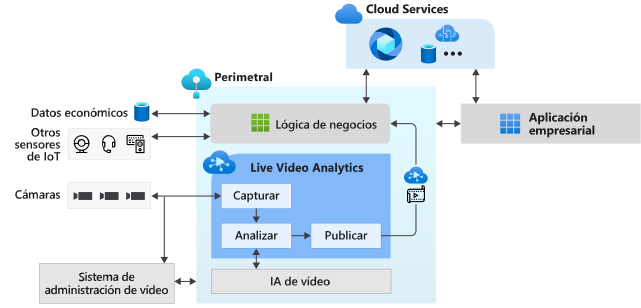

# ¿Qué es Live Video Analytics on IoT Edge? (versión preliminar)

Live Video Analytics on IoT Edge proporciona una plataforma para crear aplicaciones de vídeo inteligentes que abarcan el perímetro y la nube. La plataforma ofrece la capacidad de capturar, grabar y analizar vídeo en directo, junto con la publicación de los resultados (vídeo o análisis de vídeo) en los servicios de Azure (en la nube o en el perímetro). La plataforma se puede usar para mejorar las soluciones de IoT con análisis de vídeo. La funcionalidad Live Video Analytics on IoT Edge se puede combinar con otros módulos de Azure IoT Edge como Stream Analytics on IoT Edge, Cognitive Services on IoT Edge, así como servicios de Azure en la nube, como Media Services, Event Hubs, Cognitive Services, etc., para crear eficaces aplicaciones híbridas (por ejemplo, perimetrales y en la nube).

Live Video Analytics on IoT Edge está pensado para ser una plataforma ampliable, lo que le permite conectar diferentes módulos perimetrales de análisis de vídeo (por ejemplo, contenedores de Cognitive Services, módulos Edge personalizados creados con modelos de aprendizaje automático de código abierto o modelos personalizados entrenados con sus propios datos) y usarlos para analizar vídeo en directo sin preocuparse por la complejidad de la creación y ejecución de una canalización de vídeo en directo.

## Aceleración del desarrollo de soluciones de IoT 

Las soluciones de IoT que combinan análisis de vídeo con señales de otros sensores y datos empresariales de IoT pueden ayudarle a automatizar o a automatizar parcialmente las decisiones empresariales, lo que da lugar a mejoras en la productividad. Live Video Analytics on IoT Edge le permite crear estas soluciones de forma más rápida. Puede centrarse en la creación de los módulos y la lógica de análisis de vídeo específicos de su negocio y permitir que la plataforma oculte las complejidades de la administración y ejecución de una canalización de vídeo.

Con Live Video Analytics on IoT Edge, puede seguir usando sus [cámaras CCTV](https://en.wikipedia.org/wiki/Closed-circuit_television_camera) con los [sistemas de administración de vídeo (VMS)](https://en.wikipedia.org/wiki/Video_management_system) existentes y crear aplicaciones de análisis de vídeo de forma independiente. Live Video Analytics on IoT Edge se puede usar junto con los kits de desarrollo y SDK de Computer Vision para crear soluciones de IoT de vanguardia. Esto se muestra en el diagrama siguiente.

## Entornos admitidos

Se admiten los entornos Linux x86-64 y ARM64.
> [!NOTE]
> La compatibilidad con dispositivos ARM64 está disponible en las compilaciones `1.0.4` y más recientes.
> La compatibilidad con el entorno de ejecución de Azure IoT Edge en dispositivos ARM64 se encuentra en [versión preliminar pública](https://azure.microsoft.com/support/legal/preview-supplemental-terms/).

## Introducción

Lea los siguientes artículos sobre conceptos y pruebe un inicio rápido para ejecutar la detección de movimiento en una fuente de vídeo en directo.

### Conceptos

* [Grafo de elementos multimedia](media-graph-concept.md)
* [Grabación de vídeo](video-recording-concept.md)
* [Reproducción de vídeo](video-playback-concept.md)
* [Grabación continua de vídeo](continuous-video-recording-concept.md)
* [Grabación de vídeo basada en eventos](event-based-video-recording-concept.md)
* [Análisis de vídeos en vivo sin grabación de vídeo](analyze-live-video-concept.md)

## Pasos siguientes

* Consulte el tutorial [Inicio rápido: Ejecución de Live Video Analytics con su propio modelo](use-your-model-quickstart.md) para ver cómo puede ejecutar la detección de movimiento en una fuente de vídeo en directo.
* Revise la [terminología](terminology.md).
* Explore el [material de código abierto de Live Video Analytics](https://github.com/Azure/live-video-analytics).

