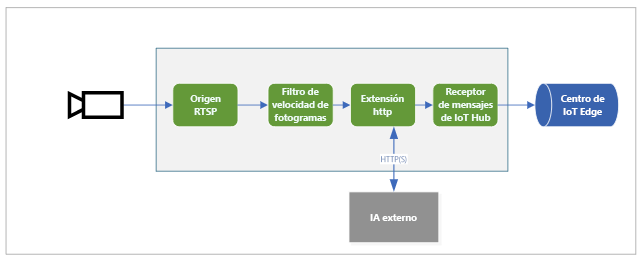

# <a name="quickstart-analyze-live-video-by-using-your-own-model"></a>Inicio rápido: Análisis de vídeo en directo con su propio modelo

En este inicio rápido se muestra cómo usar Live Video Analytics en IoT Edge para analizar una fuente de vídeo en directo desde una cámara IP (simulada). Verá cómo aplicar un modelo de Computer Vision para detectar objetos. Un subconjunto de los fotogramas de la fuente de vídeo en directo se envía a un servicio de inferencia. Los resultados se envían al centro de IoT Edge. 

Este inicio rápido usa una máquina virtual de Azure como dispositivo IoT Edge y emplea una secuencia de vídeo en directo simulada. Se basa en el código de ejemplo escrito en C# y se basa en [Inicio rápido: Detección de movimiento y emisión de eventos](detect-motion-emit-events-quickstart.md). 

## <a name="prerequisites"></a>Requisitos previos

* Una cuenta de Azure que incluya una suscripción activa. [Cree una cuenta gratuita](https://azure.microsoft.com/free/?WT.mc_id=A261C142F), en caso de que aún no lo haya hecho.
* [Visual Studio Code](https://code.visualstudio.com/) con las siguientes extensiones:
    * [Herramientas de Azure IoT](https://marketplace.visualstudio.com/items?itemName=vsciot-vscode.azure-iot-tools)
    * [C#](https://marketplace.visualstudio.com/items?itemName=ms-dotnettools.csharp)
* [SDK de .NET Core 3.1](https://dotnet.microsoft.com/download/dotnet-core/3.1).
* Si no completó el inicio rápido [Detección de movimiento y emisión de eventos](detect-motion-emit-events-quickstart.md), asegúrese de [configurar los recursos de Azure](detect-motion-emit-events-quickstart.md#set-up-azure-resources).

> [!TIP]
> Al instalar Azure IoT Tools, es posible que se le pida que instale Docker. Puede omitir el aviso.

## <a name="review-the-sample-video"></a>Revisión del vídeo de ejemplo
Cuando configura los recursos de Azure, se copia un vídeo corto del tráfico en la autopista en la máquina virtual Linux en Azure que usa como dispositivo IoT Edge. En este inicio rápido se usa el archivo de vídeo para simular una secuencia en directo.

Abra una aplicación como [VLC Media Player](https://www.videolan.org/vlc/). Seleccione Ctrl + N y, después, pegue un vínculo al [vídeo](https://lvamedia.blob.core.windows.net/public/camera-300s.mkv) para iniciar la reproducción. Verá las imágenes de muchos vehículos moviéndose en el tráfico de una autopista.

En este inicio rápido, usará Live Video Analytics on IoT Edge para detectar objetos como vehículos y personas. Publicará eventos de inferencia asociados en IoT Edge Hub.

## <a name="overview"></a>Información general



En este diagrama se muestra cómo fluyen las señales en este inicio rápido. Un [módulo perimetral](https://github.com/Azure/live-video-analytics/tree/master/utilities/rtspsim-live555) simula una cámara IP que hospeda un servidor de protocolo RTSP. Un nodo de [origen de RTSP](media-graph-concept.md#rtsp-source) extrae la fuente de vídeo de este servidor y envía fotogramas de vídeo al nodo del [procesador de filtros de velocidad de fotogramas](media-graph-concept.md#frame-rate-filter-processor), que limita la velocidad de los fotogramas de la secuencia de vídeo que llega al nodo del [procesador de extensión HTTP](media-graph-concept.md#http-extension-processor). 

El nodo de extensión HTTP desempeña el rol de un proxy. Convierte los fotogramas de vídeo en el tipo de imagen especificado. Luego, retransmite la imagen a través de REST a otro módulo perimetral que ejecuta un modelo de IA detrás de un punto de conexión HTTP. En este ejemplo, el módulo perimetral se crea mediante el modelo [YOLOv3](https://github.com/Azure/live-video-analytics/tree/master/utilities/video-analysis/yolov3-onnx), que puede detectar muchos tipos de objetos. El nodo del procesador de extensión HTTP recopila los resultados de la detección y publica los eventos en el nodo del [receptor de IoT Hub](media-graph-concept.md#iot-hub-message-sink), que posteriormente los envía a [IoT Edge Hub](../../iot-edge/iot-edge-glossary.md#iot-edge-hub).

En este inicio rápido realizará lo siguiente:

1. Creará e implementará el grafo de elementos multimedia.
1. Interpretará los resultados.
1. Limpieza de recursos.


## <a name="create-and-deploy-the-media-graph"></a>Creación e implementación del grafo de elementos multimedia
    
### <a name="examine-and-edit-the-sample-files"></a>Examen y edición de los archivos de ejemplo

Como parte de los requisitos previos, ha descargado el código de ejemplo en una carpeta. Siga estos pasos para examinar y editar los archivos de ejemplo.

1. En Visual Studio Code, vaya a *src/edge*. Puede ver el archivo *.env* y algunos archivos de plantilla de implementación.

    La plantilla de implementación hace referencia al manifiesto de implementación del dispositivo perimetral. Incluye algunos valores de marcador de posición. El archivo *.env* incluye los valores de esas variables.

1. Vaya a la carpeta *src/cloud-to-device-console-app*. Aquí verá tanto su archivo *appsettings.json* como otros archivos:

    * ***c2d-console-app.csproj***: el archivo de proyecto de Visual Studio Code.
    * ***operations.json***: una lista de las operaciones que desea que ejecute el programa.
    * ***Program.cs***: el código del programa de ejemplo. Este código:

        * Carga la configuración de la aplicación.
        * Invoca los métodos directos que expone el módulo Live Video Analytics en IoT Edge. Puede usar el módulo para analizar secuencias de vídeo en directo mediante la invocación de sus [métodos directos](direct-methods.md).
        * Se pone en pausa para que pueda examinar la salida del programa en la ventana **TERMINAL** y los eventos generados por el módulo en la ventana **SALIDA**.
        * Invoca los métodos directos para limpiar los recursos.


1. Edite el archivo *operations.json*:
    * Cambie el vínculo a la topología del grafo:

        `"topologyUrl" : "https://raw.githubusercontent.com/Azure/live-video-analytics/master/MediaGraph/topologies/httpExtension/topology.json"`

    * En `GraphInstanceSet`, edite el nombre de la topología del grafo para que coincida con el valor del vínculo anterior:

      `"topologyName" : "InferencingWithHttpExtension"`

    * En `GraphTopologyDelete`, edite el nombre:

      `"name": "InferencingWithHttpExtension"`

### <a name="generate-and-deploy-the-iot-edge-deployment-manifest"></a>Generación e implementación del manifiesto de implementación de IoT Edge

1. Haga clic con el botón derecho en el archivo *src/edge/ deployment.yolov3.template.json* y seleccione **Generate IoT Edge Deployment Manifest** (Generar manifiesto de implementación de IoT Edge).

      

    El archivo de manifiesto *deployment.yolov3.amd64.json* se crea en la carpeta *src/edge/config*.

1. Si ha completado el inicio rápido [Detección de movimiento y emisión de eventos](detect-motion-emit-events-quickstart.md), omita este paso. 

    Si no lo ha hecho, cerca del panel **AZURE IOT HUB**, en la esquina inferior izquierda, seleccione el icono **Más acciones** y, después, seleccione **Set IoT Hub Connection String** (Establecer cadena de conexión de IoT Hub). La cadena se puede copiar del archivo *appsettings.json*. O bien, para asegurarse de que ha configurado el centro de IoT adecuado en Visual Studio Code, use el [comando de selección de IoT Hub](https://github.com/Microsoft/vscode-azure-iot-toolkit/wiki/Select-IoT-Hub).
    
    

1. Haga clic con el botón derecho en *src/edge/config/deployment.yolov3.amd64.json* y seleccione **Create Deployment for Single Device** (Crear una implementación para un dispositivo individual). 

    

1. Cuando se le pida que seleccione un dispositivo IoT Hub, seleccione **lva-sample-device**.
1. Tras aproximadamente 30 segundos, en la esquina inferior izquierda de la ventana, actualice Azure IoT Hub. El dispositivo perimetral ahora muestra los siguientes módulos implementados:

    * El módulo de Live Video Analytics, denominado **lvaEdge**.
    * El módulo **rtspsim**, que simula un servidor RTSP y actúa como el origen de una fuente de vídeo en directo.
    * El módulo **yolov3**, que es el modelo de detección de objetos YOLOv3 que aplica Computer Vision a las imágenes y devuelve varias clases de tipos de objeto
 
      

### <a name="prepare-to-monitor-events"></a>Preparación para supervisar eventos

Haga clic con el botón derecho en el dispositivo de Live Video Analytics y seleccione **Start Monitoring Built-in Event Endpoint** (Iniciar supervisión del punto de conexión de eventos integrado). Este paso es necesario para supervisar los eventos de IoT Hub en la ventana **SALIDA** de Visual Studio Code. 

 

### <a name="run-the-sample-program"></a>Ejecución del programa de ejemplo

1. Para iniciar una sesión de depuración, seleccione la tecla F5. Verá mensajes impresos en la ventana **TERMINAL**.
1. El código de *operations.json* comienza con llamadas a los métodos directos `GraphTopologyList` y `GraphInstanceList`. Si ha limpiado los recursos tras haber completado los inicios rápidos anteriores, este proceso devolverá listas vacías y, después, se pausará. Para continuar, seleccione la tecla Entrar.

   ```
   --------------------------------------------------------------------------
   Executing operation GraphTopologyList
   -----------------------  Request: GraphTopologyList  --------------------------------------------------
   {
   "@apiVersion": "1.0"
   }
   ---------------  Response: GraphTopologyList - Status: 200  ---------------
   {
   "value": []
   }
   --------------------------------------------------------------------------
   Executing operation WaitForInput
   Press Enter to continue
   ```

    La ventana **TERMINAL** muestra el siguiente conjunto de llamadas al método directo:

     * Una llamada a `GraphTopologySet` que utiliza la instancia anterior de `topologyUrl`.
     * Una llamada a `GraphInstanceSet` que usa el cuerpo siguiente:

         ```
         {
           "@apiVersion": "1.0",
           "name": "Sample-Graph-1",
           "properties": {
             "topologyName": "InferencingWithHttpExtension",
             "description": "Sample graph description",
             "parameters": [
               {
                 "name": "rtspUrl",
                 "value": "rtsp://rtspsim:554/media/camera-300s.mkv"
               },
               {
                 "name": "rtspUserName",
                 "value": "testuser"
               },
               {
                 "name": "rtspPassword",
                 "value": "testpassword"
               }
             ]
           }
         }
         ```

     * Una llamada a `GraphInstanceActivate` que inicia la instancia del grafo y el flujo de vídeo.
     * Una segunda llamada a `GraphInstanceList` que muestra que la instancia del grafo está en ejecución.
1. La salida de la ventana **TERMINAL** se pone en pausa tras el mensaje `Press Enter to continue`. No seleccione Entrar todavía. Desplácese hacia arriba para ver las cargas de la respuesta JSON para los métodos directos que ha invocado.
1. Cambie a la ventana **SALIDA** de Visual Studio Code. Verá los mensajes que el módulo Live Video Analytics en IoT Edge envía al centro de IoT. En la siguiente sección de este inicio rápido se analizan estos mensajes.
1. El grafo multimedia continúa ejecutándose e imprimiendo los resultados. El simulador RTSP sigue recorriendo el vídeo de origen. Para detener el grafo multimedia, vuelva a la ventana **TERMINAL** y seleccione Entrar. 

    La siguiente serie de llamadas limpia los recursos:
      * Una llamada a `GraphInstanceDeactivate` desactiva la instancia del grafo.
      * Una llamada a `GraphInstanceDelete` elimina la instancia.
      * Una llamada a `GraphTopologyDelete` elimina la topología.
      * Una llamada final a `GraphTopologyList` muestra que la lista está vacía.

## <a name="interpret-results"></a>Interpretación de los resultados

Cuando se ejecuta el grafo multimedia, los resultados del nodo del procesador de extensión HTTP atraviesan el nodo de receptor de IoT Hub y llegan al centro de IoT. Los mensajes que aparecen en la ventana **SALIDA** contienen una sección `body` y una sección `applicationProperties`. Para más información, consulte [Creación y lectura de mensajes de IoT Hub](https://docs.microsoft.com/azure/iot-hub/iot-hub-devguide-messages-construct).

En los mensajes siguientes, se definen las propiedades de la aplicación y el contenido del cuerpo mediante el módulo Live Video Analytics. 

### <a name="mediasessionestablished-event"></a>Evento MediaSessionEstablished

Cuando se crean instancias del grafo multimedia, el nodo de origen RTSP intenta conectarse al servidor RTSP que se ejecuta en el contenedor rtspsim-live555. Si la conexión se realiza correctamente, se imprime el evento siguiente. El tipo de evento es `Microsoft.Media.MediaGraph.Diagnostics.MediaSessionEstablished`.

```
[IoTHubMonitor] [9:42:18 AM] Message received from [lvaedgesample/lvaEdge]:
{
  "body": {
    "sdp": "SDP:\nv=0\r\no=- 1586450538111534 1 IN IP4 nnn.nn.0.6\r\ns=Matroska video+audio+(optional)subtitles, streamed by the LIVE555 Media Server\r\ni=media/camera-300s.mkv\r\nt=0 0\r\na=tool:LIVE555 Streaming Media v2020.03.06\r\na=type:broadcast\r\na=control:*\r\na=range:npt=0-300.000\r\na=x-qt-text-nam:Matroska video+audio+(optional)subtitles, streamed by the LIVE555 Media Server\r\na=x-qt-text-inf:media/camera-300s.mkv\r\nm=video 0 RTP/AVP 96\r\nc=IN IP4 0.0.0.0\r\nb=AS:500\r\na=rtpmap:96 H264/90000\r\na=fmtp:96 packetization-mode=1;profile-level-id=4D0029;sprop-parameter-sets=Z00AKeKQCgC3YC3AQEBpB4kRUA==,aO48gA==\r\na=control:track1\r\n"
  },
  "applicationProperties": {
    "dataVersion": "1.0",
    "topic": "/subscriptions/{subscriptionID}/resourceGroups/{name}/providers/microsoft.media/mediaservices/hubname",
    "subject": "/graphInstances/GRAPHINSTANCENAMEHERE/sources/rtspSource",
    "eventType": "Microsoft.Media.MediaGraph.Diagnostics.MediaSessionEstablished",
    "eventTime": "2020-04-09T16:42:18.1280000Z"
  }
}
```

En este mensaje, tenga en cuenta estos detalles:

* El mensaje es un evento de diagnóstico. `MediaSessionEstablished` indica que el nodo de origen RTSP (el sujeto) ha conectado con el simulador RTSP y ha comenzado a recibir una fuente en directo (simulada).
* En `applicationProperties`, `subject` indica que el mensaje se generó desde el nodo de origen RTSP del grafo multimedia.
* En `applicationProperties`, `eventType` indica que este evento es de diagnóstico.
* `eventTime` indica la hora a la que se produjo el evento.
* `body` contiene datos sobre el evento de diagnóstico. En este caso, los datos incluyen detalles sobre el [protocolo de descripción de sesiones (SDP)](https://en.wikipedia.org/wiki/Session_Description_Protocol).

### <a name="inference-event"></a>Evento de inferencia

El nodo del procesador de extensión HTTP recibe los resultados de la inferencia del módulo yolov3. Luego, emite los resultados a través del nodo del receptor de IoT Hub como eventos de inferencia. 

En estos eventos, el tipo se establece en `entity` para indicar que es una entidad, como un coche o un camión. El valor `eventTime` es la hora UTC en que se detectó el objeto. 

En el siguiente ejemplo, se han detectado dos automóviles en el mismo fotograma de vídeo, con distintos niveles de confianza.

```
[IoTHubMonitor] [11:37:17 PM] Message received from [lva-sample-device/lvaEdge]:
{
  "body": {
    "inferences": [
      {
        "entity": {
          "box": {
            "h": 0.0344108157687717,
            "l": 0.5756940841674805,
            "t": 0.5929375966389974,
            "w": 0.04484643936157227
          },
          "tag": {
            "confidence": 0.8714089393615723,
            "value": "car"
          }
        },
        "type": "entity"
      },
      {
        "entity": {
          "box": {
            "h": 0.03960910373263889,
            "l": 0.2750667095184326,
            "t": 0.6102327558729383,
            "w": 0.031027007102966308
          },
          "tag": {
            "confidence": 0.7042660713195801,
            "value": "car"
          }
        },
        "type": "entity"
      }
    ]
  },
  "applicationProperties": {
    "topic": "/subscriptions/{subscriptionID}/resourceGroups/{name}/providers/microsoft.media/mediaservices/hubname",
    "subject": "/graphInstances/GRAPHINSTANCENAMEHERE/processors/inferenceClient",
    "eventType": "Microsoft.Media.Graph.Analytics.Inference",
    "eventTime": "2020-04-23T06:37:16.097Z"
  }
}
```

En los mensajes, tenga en cuenta los siguientes detalles:

* En `applicationProperties`, `subject` hace referencia al nodo de la topología del grafo multimedia desde el que se generó el mensaje. 
* En `applicationProperties`, `eventType` indica que este es un evento de análisis.
* El valor `eventTime` es la hora en que se produjo el evento.
* La sección `body` contiene datos sobre el evento de análisis. En este caso, el evento es un evento de inferencia, por lo que el cuerpo contiene los datos `inferences`.
* La sección `inferences` indica que el valor de `type` es `entity`. En esta sección se incluyen datos adicionales sobre la entidad.

## <a name="clean-up-resources"></a>Limpieza de recursos

Si su intención es probar los demás inicios rápidos, conserve los recursos creados. En caso contrario, vaya a Azure Portal, luego a los grupos de recursos, seleccione el grupo de recursos en que ejecutó este inicio rápido y elimine todos los recursos.

## <a name="next-steps"></a>Pasos siguientes

Revise los desafíos adicionales para los usuarios avanzados:

* Use una [cámara IP](https://en.wikipedia.org/wiki/IP_camera) que sea compatible con RTSP, en lugar de utilizar el simulador RTSP. Puede buscar cámaras IP compatibles con RTSP en la página de [productos compatibles con ONVIF](https://www.onvif.org/conformant-products/). Busque dispositivos que se ajusten a los perfiles G, S o T.
* Use un dispositivo Linux AMD64 o x64, en lugar de una máquina virtual Linux de Azure. El dispositivo debe estar en la misma red que la cámara IP. Puede seguir las instrucciones que aparecen en [Instalación del entorno de ejecución de Azure IoT Edge en Linux](https://docs.microsoft.com/azure/iot-edge/how-to-install-iot-edge-linux). Luego, registre el dispositivo en Azure IoT Hub, para lo que debe seguir las instrucciones que se encuentran en [Implementación del primer módulo IoT Edge en un dispositivo virtual Linux](https://docs.microsoft.com/azure/iot-edge/quickstart-linux).

