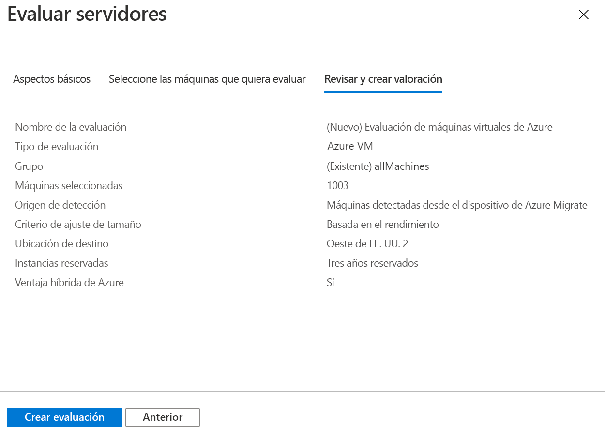

# <a name="assess-vmware-vms-with-server-assessment"></a>Evaluación de máquinas virtuales de VMware con Server Assessment

En este artículo se muestra cómo evaluar máquinas virtuales de VMware locales mediante la herramienta [Azure Migrate:Server Assessment](migrate-services-overview.md#azure-migrate-server-assessment-tool).


Este tutorial es el segundo de una serie que muestra cómo evaluar máquinas virtuales de VMware y migrarlas a Azure. En este tutorial, aprenderá a:
> [!div class="checklist"]
> * Crear un proyecto de Azure Migrate.
> * Configurar un dispositivo con Azure Migrate que se ejecute de forma local para evaluar las máquinas virtuales.
> * Iniciar la detección continua de máquinas virtuales locales. El dispositivo envía a Azure datos de configuración y rendimiento de las máquinas virtuales detectadas.
> * Agrupar las máquinas virtuales detectadas y evaluar el grupo de máquinas virtuales.
> * Revisar la evaluación.

> [!NOTE]
> En los tutoriales se muestra la ruta de implementación más sencilla para un escenario, de modo que pueda configurar rápidamente una prueba de concepto. En ellos se usan las opciones predeterminadas siempre que es posible y no muestran todos los valores y rutas de acceso posibles. Para obtener instrucciones detalladas, consulte los artículos de procedimientos.

Si no tiene una suscripción a Azure, cree una [cuenta gratuita](https://azure.microsoft.com/pricing/free-trial/) antes de empezar.

## <a name="prerequisites"></a>Requisitos previos

- [Realice el primer tutorial](tutorial-prepare-vmware.md) de esta serie. Si no lo hace, las instrucciones de este tutorial no funcionarán.
- Esto es lo que debería haber hecho en el primer tutorial:
    - [Preparar Azure](tutorial-prepare-vmware.md#prepare-azure) para trabajar con Azure Migrate.
    - [Preparar VMware](tutorial-prepare-vmware.md#prepare-for-assessment) para la evaluación. Aquí se incluye la comprobación de la configuración de VMware y la configuración de una cuenta que Azure Migrate puede usar para acceder a vCenter Server.
    - [Comprobar](tutorial-prepare-vmware.md#verify-appliance-settings-for-assessment) lo que se necesita para implementar la aplicación de Azure Migrate para la evaluación de VMware.

## <a name="set-up-an-azure-migrate-project"></a>Configuración de un proyecto de Azure Migrate

Para configurar un proyecto nuevo de Azure Migrate, haga lo siguiente:

1. En Azure Portal > **Todos los servicios**, busque **Azure Migrate**.
1. En **Servicios**, seleccione **Azure Migrate**.
1. En **Información general**, en **Detectar, evaluar y migrar servidores**, seleccione **Evaluar y migrar servidores**.

   

1. En **Introducción**, seleccione **Agregar herramientas**.
1. En **Migrar proyecto**, seleccione la suscripción a Azure y cree un grupo de recursos, en caso de que no lo tenga.     
1. En **Detalles del proyecto**, especifique el nombre del proyecto y la región geográfica en la que quiere crearlo. Revise las zonas geográficas admitidas para nubes [públicas](migrate-support-matrix.md#supported-geographies-public-cloud) y [nubes gubernamentales](migrate-support-matrix.md#supported-geographies-azure-government).

   

1. Seleccione **Next** (Siguiente).
1. En **Seleccione una herramienta de evaluación**, seleccione **Azure Migrate: Server Assessment** > **Siguiente**.

   

1. En **Seleccione una herramienta de migración**, seleccione **Omitir por ahora la adición de una herramienta de migración** > **Siguiente**.
1. En **Review + add tools** (Revisar y agregar herramientas), revise la configuración y seleccione **Agregar herramientas**.
1. Espere unos minutos para que se implemente el proyecto de Azure Migrate. Se le dirigirá a la página del proyecto. Si no ve el proyecto, puede acceder a él desde **Servidores** en el panel de Azure Migrate.

## <a name="set-up-the-azure-migrate-appliance"></a>Configuración del dispositivo de Azure Migrate

Azure Migrate:Server Assessment usa una aplicación de Azure Migrate ligera. La aplicación realiza la detección de la máquina virtual y envía tanto los metadatos como los datos de rendimiento de esta a Azure Migrate. El dispositivo se puede configurar de varias maneras.

- Configúrelo en una máquina virtual de VMware mediante una plantilla de OVA descargada. Este es el método que se usa en este tutorial.
- Configúrelo en una máquina virtual de VMware o en una máquina física con un script del instalador de PowerShell. Debe usarse [este método](deploy-appliance-script.md) si no se puede configurar una máquina virtual mediante una plantilla de OVA, o si se encuentra en Azure Government.

Una vez creada la aplicación, compruebe que se puede conectar a Azure Migrate:Server Assessment, configúrela por primera vez y regístrela en el proyecto de Azure Migrate.


### <a name="download-the-ova-template"></a>Descarga de la plantilla OVA

1. En **Objetivos de migración** > **Servidores** > **Azure Migrate: Server Assessment**, seleccione **Detectar**.
1. En **Detectar máquinas** >  **¿Las máquinas están virtualizadas?** , haga clic en **Yes, with VMware vSphere Hypervisor** (Sí, con VMware vSphere Hypervisor).
1. Seleccione **Descargar** para descargar el archivo de plantilla OVA.

   

### <a name="verify-security"></a>Comprobación de la seguridad

Compruebe que el archivo OVA es seguro antes de implementarlo:

1. En la máquina en la que descargó el archivo, abra una ventana de comandos de administrador.
2. Ejecute el siguiente comando para generar el código hash del archivo OVA:
  
   ```C:\>CertUtil -HashFile <file_location> [Hashing Algorithm]```
   
   Ejemplo de uso: ```C:\>CertUtil -HashFile C:\AzureMigrate\AzureMigrate.ova SHA256```

3. Compruebe las versiones más recientes del dispositivo y los valores hash:

    - Para la nube pública de Azure:
    
        **Algoritmo** | **Descargar** | **SHA256**
        --- | --- | ---
        VMware (10,9 GB) | [La versión más reciente](https://aka.ms/migrate/appliance/vmware) | cacbdaef927fe5477fa4e1f494fcb7203cbd6b6ce7402b79f234bc0fe69663dd

    - Para Azure Government:
    
        **Algoritmo** | **Descargar** | **SHA256**
        --- | --- | ---
        VMware (63,1 MB) | [La versión más reciente](https://go.microsoft.com/fwlink/?linkid=2120300&clcid=0x409 ) | 3d5822038646b81f458d89d706832c0a2c0e827bfa9b0a55cc478eaf2757a4de


### <a name="create-the-appliance-vm"></a>Creación de la máquina virtual del dispositivo

Importe el archivo descargado y cree una máquina virtual:

1. En la consola de cliente de vSphere, seleccione **File** (Archivo) > **Deploy OVF Template** (Implementar plantilla de OVF).

   

1. En el Deploy OVF Template Wizard (Asistente para implementar la plantilla de OVF) > **Source** (Origen), especifique la ubicación del archivo OVA.
1. En **Name** (Nombre) y **Location** (Ubicación), especifique un nombre descriptivo para la máquina virtual. Seleccione el objeto de inventario en el que se hospedará la máquina virtual.
1. En **Host/Cluster** (Host o clúster), especifique el host o clúster en que se ejecutará la máquina virtual.
1. En **Storage**, especifique el destino de almacenamiento de la máquina virtual.
1. En **Disk Format** (Formato de disco), especifique el tamaño y el tipo de disco.
1. En **Network Mapping** (Asignación de red), especifique la red a la que se conectará la máquina virtual. La red necesita conectividad a Internet para enviar metadatos a Server Assessment de Azure Migrate.
1. Revise y confirme la configuración y, a continuación, seleccione **Finish** (Finalizar).

## <a name="verify-appliance-access-to-azure"></a>Comprobación de que el dispositivo puede acceder a Azure

Asegúrese de que la VM del dispositivo pueda conectarse a las direcciones URL de Azure para las nubes [públicas](migrate-appliance.md#public-cloud-urls) y [gubernamentales](migrate-appliance.md#government-cloud-urls).

### <a name="configure-the-appliance"></a>Configuración del dispositivo

Configure el dispositivo por primera vez.

> [!NOTE]
> Si configura la aplicación mediante un [script de PowerShell](deploy-appliance-script.md) en lugar de la OVA descargada, los dos primeros pasos de este procedimiento no son pertinentes.

1. En la consola de cliente de vSphere, haga clic con el botón derecho en la máquina virtual y, luego, seleccione **Open Console** (Abrir consola).
1. Especifique el idioma, la zona horaria y la contraseña del dispositivo.
1. Abra un explorador en cualquier equipo que pueda conectarse a la máquina virtual y abra la dirección URL de la aplicación web del dispositivo: **https://*nombre o dirección IP del dispositivo*: 44368**.

   Como alternativa, puede abrir la aplicación desde el escritorio del dispositivo, para lo que debe seleccionar el acceso directo de la aplicación.
1. En la aplicación web > **Set up prerequisites** (Configurar los requisitos previos ), realice las siguientes operaciones:
   - **License** (Licencia): Acepte los términos de licencia y lea la información de terceros.
   - **Connectivity** (Conectividad): la aplicación comprueba que la máquina virtual tiene acceso a Internet. Si la máquina virtual usa un proxy:
     - Seleccione **Proxy settings** (Configuración de proxy) y especifique el puerto de escucha y la dirección del proxy con el formato http://ProxyIPAddress o http://ProxyFQDN.
     - Especifique las credenciales si el proxy requiere autenticación.
     - Solo se admite un proxy HTTP.
   - **Time sync** (Sincronización de hora): Para que la detección funcione correctamente, la hora del dispositivo debe estar sincronizada con la hora de Internet.
   - **Instalación de actualizaciones**: el dispositivo garantiza que se instalan las actualizaciones más recientes.
   - **Install VDDK** (Instalar VDDK): el dispositivo comprueba si VMWare vSphere Virtual Disk Development Kit (VDDK) está instalado. Si no está instalado, descargue VDDK 6.7 de VMware y extraiga el contenido del archivo ZIP descargado en la ubicación especificada del dispositivo.

     Server Migration de Azure Migrate usa VDDK para replicar las máquinas durante la migración a Azure.       

### <a name="register-the-appliance-with-azure-migrate"></a>Registro del dispositivo en Azure Migrate

1. Seleccione **Log In** (Iniciar sesión). Si no aparece, asegúrese de que ha deshabilitado el bloqueador de elementos emergentes en el explorador.
1. En la nueva pestaña, inicie sesión con su nombre de usuario y contraseña de Azure.
   
   No se admite el inicio de sesión con un PIN.
1. Después de iniciar sesión correctamente, vuelva a la aplicación web.
1. Seleccione la suscripción en la que se creó el proyecto de Azure Migrate y selecciónelo.
1. Escriba un nombre para el dispositivo. Este nombre debe ser alfanumérico y no puede tener más de 14 caracteres.
1. Seleccione **Registrar**.


## <a name="start-continuous-discovery"></a>Inicio de detección continua

El dispositivo necesita conectarse a vCenter Server para detectar los datos de configuración y rendimiento de las máquinas virtuales.

### <a name="specify-vcenter-server-details"></a>Especificar los detalles de vCenter Server
1. En **Especificar los detalles de vCenter Server**, especifique el nombre (nombre de dominio completo) o la dirección IP de la instancia de vCenter Server. Puede dejar el puerto predeterminado o especificar un puerto personalizado en el que vCenter Server escuche.
2. En **Nombre de usuario** y **Contraseña**, especifique las credenciales de la cuenta de vCenter Server que el dispositivo utilizará para detectar las máquinas virtuales en vCenter Server. 

    - Debe haber configurado una cuenta con los permisos necesarios en el [tutorial anterior](tutorial-prepare-vmware.md#set-up-permissions-for-assessment).
    - Si desea limitar el ámbito de la detección a objetos específicos de VMware (centros de datos de vCenter Server, clústeres, una carpeta de clústeres, hosts, una carpeta de hosts o máquinas virtuales individuales), consulte las instrucciones de [este artículo](set-discovery-scope.md) para restringir la cuenta usada por Azure Migrate.

3. Seleccione **Validar conexión** para asegurarse de que el dispositivo puede conectarse a vCenter Server.
4. En **Discover applications and dependencies on VMs** (Detectar aplicaciones y dependencias en máquinas virtuales), puede hacer clic en **Add credentials**  (Agregar credenciales) y especificar el sistema operativo para el que las credenciales son apropiadas, así como el nombre de usuario y la contraseña de las credenciales. A continuación, haga clic en **Agregar**.

    - Si lo desea, agregue las credenciales aquí si ha creado una cuenta para utilizarla en la [característica de detección de aplicaciones](how-to-discover-applications.md) o [en la característica de análisis de dependencias sin agente](how-to-create-group-machine-dependencies-agentless.md).
    - Si no usa estas características, puede omitir este valor.
    - Consulte cuáles son las credenciales necesarias para la [detección de aplicaciones](migrate-support-matrix-vmware.md#application-discovery-requirements) o para el [análisis sin agente](migrate-support-matrix-vmware.md#dependency-analysis-requirements-agentless).

5. **Guardar e iniciar detección**, para iniciar la detección de máquinas virtuales.

La detección funciona como se indica a continuación:
- Los metadatos de las máquinas virtuales detectadas tardan unos 15 minutos en aparecer en el portal.
- La detección de las aplicaciones, los roles y las características instaladas tarda un rato. Todo depende del número de máquinas virtuales que se detectan. En el caso de 500 máquinas virtuales, el inventario de la aplicación tarda aproximadamente una hora en aparecer en el portal de Azure Migrate.

### <a name="verify-vms-in-the-portal"></a>Comprobación de VM en el portal

Tras la detección, puede comprobar que las máquinas virtuales aparecen en Azure Portal.

1. Abra el panel de Azure Migrate.
1. En la página **Azure Migrate - Servidores** > **Azure Migrate: Server Assessment**, seleccione el icono que muestra el número de **servidores detectados**.

## <a name="set-up-an-assessment"></a>Configuración de una evaluación

Se pueden crear dos tipos de evaluaciones mediante Server Assessment de Azure Migrate:

**Valoración** | **Detalles** | **Data**
--- | --- | ---
**Basada en el rendimiento** | Evaluaciones basadas en los datos de rendimiento recopilados | **Tamaño de máquina virtual recomendado**: se basa en los datos de uso de la CPU y de la memoria.<br/><br/> **Tipo de disco recomendado (disco administrado estándar o Premium**): se basa en IOPS y en el rendimiento de los discos locales.
**Como local** | Evaluaciones que se basan en el tamaño local. | **Tamaño de máquina virtual recomendado**: se basa en el tamaño de la máquina virtual local.<br/><br> **Tipo de disco recomendado**: se basa en el valor del tipo de almacenamiento que se selecciona para la evaluación.

## <a name="run-an-assessment"></a>Ejecución de una evaluación

Las evaluaciones se realizan como se indica a continuación:

1. Consulte los [procedimientos recomendados](best-practices-assessment.md) para crear evaluaciones.
1. En la pestaña **Servidores**, en el icono **Azure Migrate: Server Assessment**, seleccione **Evaluar**.

   

1. En **Evaluar los servidores**, especifique el nombre de la evaluación.
1. Seleccione **Ver todo** y revise las propiedades de la evaluación.

   

1. En **Seleccionar o crear un grupo**, seleccione **Crear nuevo** y especifique un nombre de grupo. Un grupo recopila una o varias máquinas virtuales para su evaluación.
1. En **Agregar máquinas al grupo**, seleccione las máquinas virtuales que se van a agregar al grupo.
1. Seleccione **Crear evaluación** para crear el grupo y realizar la evaluación.

   

1. Una vez creada la evaluación, se puede ver en **Servidores** > **Azure Migrate: Server Assessment** > **Evaluaciones**.
1. Seleccione **Exportar la evaluación** para descargarla como un archivo de Excel.

## <a name="review-an-assessment"></a>Revisión de una evaluación

Una evaluación describe:

- **Preparación para Azure**: si las máquinas virtuales son adecuadas para la migración a Azure.
- **Estimación del costo mensual**: los costos mensuales estimados de proceso y almacenamiento por ejecutar las máquinas virtuales en Azure.
- **Estimación del costo mensual de almacenamiento**: costos estimados del almacenamiento en disco después de la migración.

Para ver una evaluación:

1. En **Objetivos de migración** > **Servidores**, seleccione **Evaluaciones** en **Azure Migrate: Server Assessment**.
1. En **Evaluaciones**, seleccione una evaluación para abrirla.

   

### <a name="review-azure-readiness"></a>Revisión de la preparación para Azure

1. En **Preparación para Azure**, compruebe si las máquinas virtuales están listas para su migración a Azure.
1. Revise el estado de la máquina virtual:
    - **Preparada para Azure**: se usa cuando Azure Migrate recomienda unas estimaciones de tamaño y costo de las máquinas virtuales en la evaluación.
    - **Preparado con condiciones**: muestra los problemas y las soluciones que se sugieren.
    - **No está preparado para Azure**: muestra los problemas y las soluciones que se sugieren.
    - **Preparación desconocida**: se usa cuando Azure Migrate no puede evaluar la preparación debido a problemas de disponibilidad de datos.

1. Seleccione uno de los estados de **Preparación para Azure**. Puede ver los detalles de preparación de la máquina virtual. También puede explorar en profundidad para ver los detalles de la máquina virtual, incluida la configuración de proceso, almacenamiento y red.

### <a name="review-cost-details"></a>Revisión de los datos de costo

El resumen de evaluación muestra el costo estimado de almacenamiento y proceso que conlleva ejecutar máquinas virtuales en Azure. Los costos se agregan para todas las máquinas virtuales del grupo evaluado. Puede explorar en profundidad para ver los detalles de costo de máquinas virtuales específicas.

> [!NOTE]
> Las estimaciones de costo se basan en las recomendaciones de tamaño de una máquina, así como de sus discos y propiedades. Las estimaciones son para ejecutar las máquinas virtuales locales como máquinas virtuales IaaS. Azure Migrate Server Assessment no tiene en cuenta los costos de PaaS o SaaS.

Los costos de almacenamiento agregado del grupo evaluado se dividen por los diferentes tipos de discos de almacenamiento. 

### <a name="review-confidence-rating"></a>Examen de la clasificación de confianza

Azure Migrate Server Assessment asigna una clasificación de confianza a una evaluación basada en el rendimiento de una estrella (la más baja) a cinco estrellas (la más alta).


La clasificación de confianza sirve de ayuda para calcular la confiabilidad de las recomendaciones de tamaño de la evaluación. Esta clasificación se basa en la disponibilidad de los puntos de datos necesarios para calcular tal evaluación:

**Disponibilidad del punto de datos** | **Clasificación de confianza**
--- | ---
0 % - 20 % | 1 estrella
21 % - 40 % | 2 estrellas
41 % - 60 % | 3 estrellas
61 % - 80 % | 4 estrellas
81 % - 100 % | 5 estrellas

[Más información sobre los procedimientos recomendados](best-practices-assessment.md#best-practices-for-confidence-ratings) para las clasificaciones de confianza.

## <a name="next-steps"></a>Pasos siguientes

En este tutorial, configurará un dispositivo de Azure Migrate. También creará y revisará una evaluación.

Para aprender a migrar máquinas virtuales de VMware a Azure mediante Server Migration de Azure Migrate, continúe con el tercer tutorial de la serie:

> [!div class="nextstepaction"]
> [Migración de máquinas virtuales de VMware](./tutorial-migrate-vmware.md)
