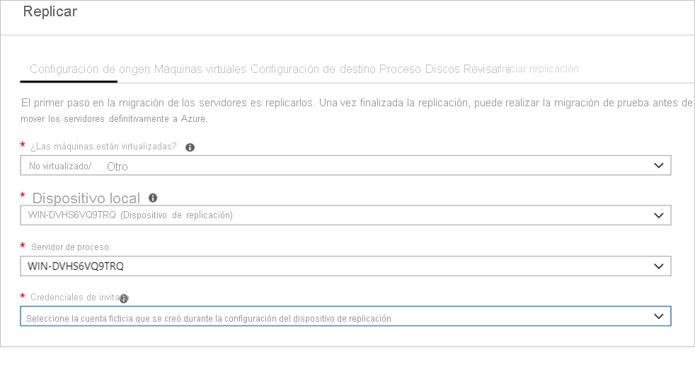

# <a name="migrate-machines-as-physical-servers-to-azure"></a>Migración de máquinas como servidores físicos a Azure

En este artículo se indica cómo migrar máquinas como servidores físicos a Azure mediante la herramienta Azure Migrate Server Migration. La migración de máquinas tratándolas como servidores físicos es útil en varios escenarios:

- Migración de servidores físicos locales.
- Migración de máquinas virtuales virtualizadas por plataformas como Xen, KVM.
- Migre las máquinas virtuales de Hyper-V o VMware si, por algún motivo, no puede usar el proceso de migración estándar para la migración de [Hyper-V](tutorial-migrate-hyper-v.md) o [VMware ](server-migrate-overview.md).
- Migración de máquinas virtuales que se ejecutan en nubes privadas.
- Migración de máquinas virtuales que se ejecutan en nubes públicas, como Amazon Web Services (AWS) o Google Cloud Platform (GCP).


Este tutorial es el tercero de una serie que muestra cómo evaluar y migrar servidores físicos a Azure. En este tutorial, aprenderá a:

> [!div class="checklist"]
> * Prepararse para usar Azure con Azure Migrate:Server Migration.
> * Comprobar los requisitos de las máquinas que desea migrar y preparar un equipo para el dispositivo de replicación de Azure Migrate que se usa para detectar y migrar las máquinas a Azure.
> * Agregar la herramienta Azure Migrate Server Migration en el centro de Azure Migrate.
> * Configurar el destino de replicación.
> * Instalar Mobility Service en las máquinas que desea migrar.
> * Habilite la replicación.
> * Ejecute una migración de prueba para asegurarse de que todo funciona de la forma esperada.
> * Ejecutar una migración completa a Azure.

> [!NOTE]
> En los tutoriales se muestra la ruta de implementación más sencilla para un escenario, de modo que pueda configurar rápidamente una prueba de concepto. En ellos se usan las opciones predeterminadas siempre que es posible y no muestran todos los valores y rutas de acceso posibles. Para obtener instrucciones detalladas, revise los procedimientos de Azure Migrate.

Si no tiene una suscripción a Azure, cree una [cuenta gratuita](https://azure.microsoft.com/pricing/free-trial/) antes de empezar.


## <a name="prerequisites"></a>Requisitos previos

Antes de comenzar este tutorial, debe:

[Revisar](./agent-based-migration-architecture.md) la arquitectura de migración.

## <a name="prepare-azure"></a>Preparación de Azure

Prepare Azure para la migración con Server Migration.

**Task** | **Detalles**
--- | ---
**Crear un proyecto de Azure Migrate** | La cuenta de Azure necesita permisos de colaborador o propietario para crear un proyecto.
**Comprobación de los permisos de la cuenta de Azure** | Su cuenta de Azure necesita permisos para crear una máquina virtual y escribir en un disco administrado de Azure.


### <a name="assign-permissions-to-create-project"></a>Asignación de permisos para crear un proyecto

1. En Azure Portal, abra la suscripción y seleccione **Control de acceso (IAM)** .
2. En **Comprobar acceso**, busque la cuenta correspondiente y haga clic en ella para ver los permisos.
3. Debe tener permisos de **Colaborador** o **Propietario**.
    - Si acaba de crear una cuenta de Azure gratuita, es el propietario de la suscripción.
    - Si no es el propietario, trabaje con él para asignar el rol.


### <a name="assign-azure-account-permissions"></a>Asignación de los permisos de la cuenta de Azure

Asigne el rol de colaborador de la máquina virtual a la cuenta de Azure. Este rol proporciona permisos para:

    - Crear una máquina virtual en el grupo de recursos seleccionado.
    - Crear una máquina virtual en la red virtual seleccionada.
    - Escribir en un disco administrado de Azure. 

### <a name="create-an-azure-network"></a>Creación de una red de Azure

[Configure](../virtual-network/manage-virtual-network.md#create-a-virtual-network) una red virtual de Azure. Al realizar la replicación en Azure, se crean máquinas virtuales de Azure y se unen a la red virtual de Azure que se especifica al configurar la migración.

## <a name="prepare-for-migration"></a>Preparación para la migración

Para preparar la migración del servidor físico, debe comprobar la configuración del servidor físico y preparar la implementación de un dispositivo de replicación.

### <a name="check-machine-requirements-for-migration"></a>Comprobación de los requisitos de las máquinas para la migración

Asegúrese de que las máquinas cumplen los requisitos para la migración a Azure. 

> [!NOTE]
> Al migrar máquinas físicas, Azure Migrate:Server Migration emplea la misma arquitectura de replicación que la recuperación ante desastres basada en agente del servicio Azure Site Recovery, y algunos componentes comparten el mismo código base. Puede que algún contenido se vincule a la documentación de Site Recovery.

1. [Compruebe](migrate-support-matrix-physical-migration.md#physical-server-requirements) los requisitos del servidor físico.
2. Compruebe que las máquinas locales que replique en Azure cumplan los [requisitos de máquina virtual de Azure](migrate-support-matrix-physical-migration.md#azure-vm-requirements).
3. Hay algunos cambios necesarios en las máquinas virtuales antes de migrarlas a Azure.
    - En algunos sistemas operativos, Azure Migrate realiza estos cambios automáticamente. 
    - Es importante realizar estos cambios antes de comenzar la migración. Si migra la máquina virtual antes de realizar el cambio, es posible que la máquina virtual no arranque en Azure. Revise los cambios en [Windows](prepare-for-migration.md#windows-machines) y [Linux](prepare-for-migration.md#linux-machines) que debe realizar.

### <a name="prepare-a-machine-for-the-replication-appliance"></a>Preparación de un equipo para el dispositivo de replicación

Azure Migrate:Server Migration usa un dispositivo de replicación para replicar máquinas en Azure. Este dispositivo ejecuta los siguientes componentes.

- **Servidor de configuración**: El servidor de configuración coordina la comunicación entre el entorno local y Azure, además de administrar la replicación de datos.
- **Servidor de proceso**: El servidor de procesos actúa como puerta de enlace de replicación. Recibe los datos de la replicación; los optimiza mediante el almacenamiento en la caché, la compresión y el cifrado, y los envía a una cuenta de almacenamiento en Azure. 

Para prepararse para la implementación del dispositivo, siga estos pasos:

- Prepare una máquina para hospedar el dispositivo de replicación. [Revise](migrate-replication-appliance.md#appliance-requirements) los requisitos de la máquina. El dispositivo no debe instalarse en una máquina de origen que quiera replicar.
- El dispositivo de replicación usa MySQL. Revise las [opciones](migrate-replication-appliance.md#mysql-installation) para instalar MySQL en el dispositivo.
- Revise las direcciones URL de Azure necesarias para que el dispositivo de replicación acceda a las nubes [públicas](migrate-replication-appliance.md#url-access) y [gubernamentales](migrate-replication-appliance.md#azure-government-url-access).
- Revise los requisitos de acceso [port] (migrate-replication-appliance.md#port-access) del dispositivo de replicación.

## <a name="add-the-server-migration-tool"></a>Incorporación de la herramienta Server Migration

Configure un proyecto de Azure Migrate y, luego, agréguele la herramienta Server Migration.

1. En Azure Portal > **Todos los servicios**, busque **Azure Migrate**.
2. En **Servicios**, seleccione **Azure Migrate**.
3. En **Información general**, haga clic en **Evaluar y migrar servidores**.
4. En **Detectar, evaluar y migrar servidores**, haga clic en **Evaluar y migrar servidores**.

    

5. En **Detectar, evaluar y migrar servidores**, haga clic en **Agregar herramientas**.
6. En **Migrar proyecto**, seleccione la suscripción a Azure y cree un grupo de recursos, en caso de que no lo tenga.
7. En **Detalles del proyecto**, especifique el nombre del proyecto y la zona geográfica en la que quiere crearlo; después, haga clic en **Siguiente**. Revise las zonas geográficas admitidas para nubes [públicas](migrate-support-matrix.md#supported-geographies-public-cloud) y [nubes gubernamentales](migrate-support-matrix.md#supported-geographies-azure-government).

    

8. En **Seleccione una herramienta de evaluación**, seleccione **Omitir por ahora la adición de una herramienta de evaluación** > **Siguiente**.
9. En **Seleccione una herramienta de migración**, seleccione **Azure Migrate: Migración del servidor** > **Siguiente**.
10. En **Revisar y agregar herramientas**, revise la configuración y haga clic en **Agregar herramientas**.
11. Después de agregar la herramienta, aparece en el proyecto de Azure Migrate > **Servidores** > **Herramientas de migración**.

## <a name="set-up-the-replication-appliance"></a>Configuración del dispositivo de replicación

El primer paso de la migración consiste en configurar el dispositivo de replicación. Para configurar el dispositivo para la migración del servidor físico, descargue el archivo del instalador del dispositivo y, luego, ejecútelo en la [máquina que ha preparado](#prepare-a-machine-for-the-replication-appliance). Después de instalar el dispositivo, puede registrarse en Azure Migrate Server Migration.


### <a name="download-the-replication-appliance-installer"></a>Descarga del instalador del dispositivo de replicación

1. En el proyecto de Azure Migrate > **Servidores**, en **Azure Migrate: Migración del servidor**, haga clic en **Detectar**.

    

3. En **Detectar máquinas** >  **¿Las máquinas están virtualizadas?** , haga clic en **No virtualizado/Otro**.
4. En **Región de destino**, seleccione la región de Azure a la que desea migrar las máquinas.
5. Seleccione **Confirme que la región de destino de la migración es nombreDeRegión**.
6. Haga clic en **Crear recursos**. Esto crea un almacén de Azure Site Recovery en segundo plano.
    - Si ya ha configurado la migración con Azure Migrate Server Migration, no se puede configurar la opción de destino, ya que los recursos se configuraron anteriormente.
    - Después de hacer clic en este botón ya no se puede cambiar la región de destino de este proyecto.
    - Todas las migraciones posteriores se realizan a esta región.

7. En **¿Quiere instalar un nuevo dispositivo de replicación?** , seleccione **Instalar un dispositivo de replicación**.
9. En **Descargue e instale el software del dispositivo de replicación**, descargue el instalador del dispositivo y la clave de registro. Necesitará la clave para registrar el dispositivo. La clave será válida durante cinco días a partir del momento en que se descarga.

    

10. Copie el archivo de instalación y el archivo de clave del dispositivo en el equipo con Windows Server 2016 que creó para el dispositivo.
11. Ejecute el archivo de configuración del dispositivo de replicación, tal como se describe en el procedimiento siguiente. Una vez finalizada la instalación, el Asistente para configuración de dispositivos se iniciará automáticamente (también puede iniciar el Asistente manualmente mediante el acceso directo cspsconfigtool que se crea en el escritorio del dispositivo). Use la pestaña Administrar cuentas del Asistente para agregar los detalles de la cuenta que se usarán para la instalación de extracción del servicio Mobility. En este tutorial, vamos a instalar manualmente el servicio Mobility en las máquinas que se van a replicar, por lo que debe crear una cuenta ficticia en este paso y continuar.

12. Una vez que se haya reiniciado el dispositivo después de la configuración, en **Detectar máquinas**, seleccione el nuevo dispositivo en **Seleccionar servidor de configuración** y haga clic en **Finalize registration**  (Finalizar registro). El paso de finalización del registro realiza un par de tareas finales para preparar el dispositivo de replicación.

    

Tras la finalización del registro, pueden pasar unos minutos hasta que las máquinas detectadas aparezcan en Migración de servidores de Azure Migrate. A medida que se detectan las máquinas virtuales, aumenta el número de **Servidores detectados**.


## <a name="install-the-mobility-service"></a>Instalación de Mobility Service

En las máquinas que desea migrar, debe instalar el agente de Mobility Service. Los instaladores del agente están disponibles en el dispositivo de replicación. Debe encontrar el instalador correcto e instalar el agente en cada máquina que desee migrar. Para ello, realice lo siguiente:

1. Inicie sesión en el dispositivo de replicación.
2. Vaya a **%ProgramData%\ASR\home\svsystems\pushinstallsvc\repository**.
3. Busque el instalador correspondiente al sistema operativo y la versión del equipo. Revise los [sistemas operativos compatibles](../site-recovery/vmware-physical-azure-support-matrix.md#replicated-machines). 
4. Copie el archivo de instalación en el equipo que desea migrar.
5. Asegúrese de que tiene la frase de contraseña que se generó al implementar el dispositivo.
    - Almacene el archivo en un archivo de texto temporal de la máquina.
    - Puede obtener la frase de contraseña en el dispositivo de replicación. Desde la línea de comandos, ejecute **C:\ProgramData\ASR\home\svsystems\bin\genpassphrase.exe -v** para ver la frase de contraseña actual.
    - No regenere la frase de contraseña. Esto interrumpirá la conectividad y tendrá que volver a registrar el dispositivo de replicación.


### <a name="install-on-windows"></a>Instalación en Windows

1. Extraiga el contenido del archivo de instalación en una carpeta local (por ejemplo, C:\Temp) en el equipo, como se indica a continuación:

    ```
    ren Microsoft-ASR_UA*Windows*release.exe MobilityServiceInstaller.exe
    MobilityServiceInstaller.exe /q /x:C:\Temp\Extracted
    cd C:\Temp\Extracted
    ```
2. Ejecute el instalador de Mobility Service:
    ```
   UnifiedAgent.exe /Role "MS" /Silent
    ```
3. Registre el agente en el dispositivo de replicación:
    ```
    cd C:\Program Files (x86)\Microsoft Azure Site Recovery\agent
    UnifiedAgentConfigurator.exe  /CSEndPoint <replication appliance IP address> /PassphraseFilePath <Passphrase File Path>
    ```

### <a name="install-on-linux"></a>Instalación en Linux

1. Extraiga el contenido del instalador de tarball en una carpeta local (por ejemplo, /tmp/MobSvcInstaller) del equipo, como se indica a continuación:
    ```
    mkdir /tmp/MobSvcInstaller
    tar -C /tmp/MobSvcInstaller -xvf <Installer tarball>
    cd /tmp/MobSvcInstaller
    ```
2. Ejecute el script del instalador:
    ```
    sudo ./install -r MS -q
    ```
3. Registre el agente en el dispositivo de replicación:
    ```
    /usr/local/ASR/Vx/bin/UnifiedAgentConfigurator.sh -i <replication appliance IP address> -P <Passphrase File Path>
    ```

## <a name="replicate-machines"></a>Replicación de máquinas

Ahora, seleccione las máquinas para la migración. 

> [!NOTE]
> Puede replicar hasta 10 máquinas juntas. Si necesita replicar más, replíquelas simultáneamente en lotes de 10.

1. En el proyecto de Azure Migrate > **Servidores**, **Azure Migrate: Migración del servidor**, haga clic en **Replicar**.

    

2. En **Replicar** > **Configuración de origen** >  **¿Las máquinas están virtualizadas?** , seleccione **Not virtualized/Other** (No virtualizadas/Otros).
3. En **Dispositivo local**, seleccione el nombre del dispositivo de Azure Migrate que configuró.
4. En **Servidor de procesos**, seleccione el nombre del dispositivo de replicación.
6. En **Credenciales de invitado**, se especifica una cuenta ficticia que se usará para instalar el servicio Mobility manualmente (no se admite la instalación de inserciones en el servidor físico). A continuación, haga clic en **Siguiente: Máquinas virtuales**.

    

7. En **Máquinas virtuales**, en **¿Quiere importar la configuración de migración de una evaluación?** , deje la configuración predeterminada **No, especificaré la configuración de migración manualmente**.
8. Compruebe todas las máquinas virtuales que desea migrar. A continuación, haga clic en **Siguiente: Configuración de destino**.

    


9. En **Configuración de destino**, seleccione la suscripción y la región de destino a la que va a migrar, y especifique el grupo de recursos en el que residirán las máquinas virtuales de Azure después de la migración.
10. En **Red virtual**, seleccione la red virtual o la subred de Azure a la que se unirán las máquinas virtuales de Azure después de la migración.
11. En **Ventaja híbrida de Azure**:

    - Seleccione **No** si no desea aplicar la Ventaja híbrida de Azure. A continuación, haga clic en **Siguiente**.
    - Seleccione **Sí** si tiene equipos con Windows Server que están incluidos en suscripciones activas de Software Assurance o Windows Server y desea aplicar el beneficio a las máquinas que va a migrar. A continuación, haga clic en **Siguiente**.

    

12. En **Proceso**, revise el nombre de la máquina virtual, su tamaño, el tipo de disco del sistema operativo y el conjunto de disponibilidad. Las máquinas virtuales deben cumplir los [requisitos de Azure](migrate-support-matrix-physical-migration.md#azure-vm-requirements).

    - **Tamaño de VM**: de forma predeterminada, Azure Migrate Server Migration elige un tamaño basándose en la coincidencia más cercana en la suscripción de Azure. También puede elegir un tamaño de manera manual en **Tamaño de la máquina virtual de Azure**. 
    - **Disco del sistema operativo**: especifique el disco del sistema operativo (arranque) de la máquina virtual. Este es el disco que tiene el cargador de arranque y el instalador del sistema operativo. 
    - **Conjunto de disponibilidad**: si la máquina virtual debe estar incluida en un conjunto de disponibilidad de Azure después de la migración, especifique el conjunto. El conjunto debe estar en el grupo de recursos de destino que especifique para la migración.

    

13. En **Discos**, especifique si los discos de máquina virtual se deben replicar en Azure y seleccione el tipo de disco (discos SSD o HDD estándar o bien discos administrados premium) en Azure. A continuación, haga clic en **Siguiente**.
    - Puede excluir discos de la replicación.
    - Si excluye discos, no estarán presentes en la máquina virtual de Azure después de la migración. 

    


14. En **Revisar e iniciar la replicación**, revise la configuración y haga clic en **Replicar** para iniciar la replicación inicial de los servidores.

> [!NOTE]
> Puede actualizar la configuración de replicación en cualquier momento antes de que esta comience; para ello, vaya a **Administrar** > **Replicación de máquinas**. Una vez iniciada la replicación, su configuración no se puede cambiar.


## <a name="track-and-monitor"></a>Seguimiento y supervisión

- Al hacer clic en **Replicar**, comienza el trabajo de inicio de replicación. 
- Cuando el trabajo de inicio de replicación finaliza correctamente, las máquinas comienzan su replicación inicial en Azure.
- Cuando finaliza esta replicación inicial, comienza la replicación diferencial. Los cambios incrementales de los discos locales se replican periódicamente en los discos de réplica de Azure.


Puede realizar un seguimiento del estado del trabajo en las notificaciones del portal.

Para supervisar el estado de la replicación, haga clic en **Replicando servidores** en **Azure Migrate: Server Migration**.


## <a name="run-a-test-migration"></a>Ejecutar una migración de prueba


Cuando comienza la replicación diferencial, puede ejecutar una migración de prueba para las máquinas virtuales antes de ejecutar una migración completa a Azure. Le recomendamos encarecidamente que lo haga al menos una vez en cada máquina, antes de migrarla.

- La ejecución de una migración de prueba comprueba que la migración funcionará según lo previsto, sin afectar a las máquinas locales, que seguirán estando operativas y continuarán realizando la replicación. 
- Para simular la migración, la migración de prueba crea una máquina virtual de Azure usando datos replicados (normalmente, con una migración a una red virtual que no es de producción en la suscripción a Azure).
- Puede usar la máquina virtual de Azure de prueba replicada para validar la migración, realizar pruebas de aplicaciones y resolver los problemas antes de la migración completa.

Realice una migración de prueba como se indica a continuación:


1. En **Objetivos de migración** > **Servidores** > **Azure Migrate: Server Migration**, haga clic en **Probar servidores migrados**.

     

2. Haga clic con el botón derecho en la máquina virtual que va a probar y haga clic en **Migración de prueba**.

    

3. En **Migración de prueba**, seleccione la red virtual de Azure en la que se ubicará la máquina virtual de Azure después de la migración. Se recomienda usar una red virtual que no sea de producción.
4. Comienza el trabajo de **Migración de prueba**. Supervise el trabajo en las notificaciones del portal.
5. Una vez finalizada la migración, la máquina virtual de Azure migrada se puede ver en **Máquinas virtuales** en Azure Portal. El nombre de la máquina tiene el sufijo **-Test**.
6. Una vez finalizada la prueba, haga clic con el botón derecho en la máquina virtual de Azure, en **Replicación de máquinas**, y haga clic en **Limpiar la migración de prueba**.

    


## <a name="migrate-vms"></a>Migración de máquinas virtuales

Después de comprobar que la migración de prueba funciona según lo previsto, puede migrar las máquinas locales.

1. En el proyecto de Azure Migrate > **Servidores** > **Azure Migrate: Server Migration**, haga clic en **Replicando servidores**.

    

2. En **Replicación de máquinas**, haga clic con el botón derecho en la máquina virtual > **Migrar**.
3. En **Migrar** >  **¿Quiere apagar las máquinas virtuales y realizar una migración planificada sin perder datos?** , seleccione **Sí** > **Aceptar**.
    - Si no desea apagar la máquina virtual, seleccione **No**

    Nota: Para la migración del servidor físico, se recomienda que la aplicación deje de estar disponible como parte de la ventana de migración (no permita que las aplicaciones acepten ninguna conexión) y, a continuación, inicie la migración (el servidor debe mantenerse en ejecución, por lo que los cambios restantes pueden sincronizarse) antes de que se complete la migración.

4. Se inicia un trabajo de migración de la máquina virtual. Realice un seguimiento del trabajo en las notificaciones de Azure.
5. Una vez finalizado el trabajo, la máquina virtual puede ver y administrar desde la página **Máquinas virtuales**.

## <a name="complete-the-migration"></a>Completar la migración

1. Una vez finalizada la migración, haga clic con el botón derecho en la máquina virtual > **Detener migración**. Esto hace lo siguiente:
    - Detiene la replicación en la máquina local.
    - Quita la máquina del recuento de **Servidores en replicación** en Azure Migrate: Server Migration.
    - Limpia la información del estado de replicación de la máquina.
2. Instale el agente de [Windows](../virtual-machines/extensions/agent-windows.md) o [Linux](../virtual-machines/extensions/agent-linux.md) de la máquina virtual de Azure en las máquinas migradas.
3. Realice los ajustes de la aplicación posteriores a la migración, como actualizar las cadenas de conexión de la base de datos y las configuraciones del servidor web.
4. Realice las pruebas finales de la aplicación y la aceptación de la migración en la aplicación migrada que ahora se ejecuta en Azure.
5. Pase el tráfico a la instancia de máquina virtual de Azure migrada.
6. Quite las máquinas virtuales locales del inventario de máquinas virtuales local.
7. Quite las máquinas virtuales locales de las copias de seguridad locales.
8. Actualice la documentación interna para mostrar la nueva ubicación y la dirección IP las máquinas virtuales de Azure. 

## <a name="post-migration-best-practices"></a>Procedimientos recomendados después de la migración

- Para aumentar la resistencia:
    - Proteja los datos mediante la copia de seguridad de máquinas virtuales de Azure mediante el servicio Azure Backup. [Más información](../backup/quick-backup-vm-portal.md).
    - Mantenga las cargas de trabajo en ejecución y disponibles continuamente mediante la replicación de máquinas virtuales de Azure en una región secundaria con Site Recovery. [Más información](../site-recovery/azure-to-azure-tutorial-enable-replication.md).
- Para aumentar la seguridad:
    - Bloquee y limite el acceso de tráfico de entrada con la [administración Just-In-Time de Azure Security Center](../security-center/security-center-just-in-time.md).
    - Restrinja el tráfico de red a los puntos de conexión de administración con [grupos de seguridad de red](../virtual-network/security-overview.md).
    - Implemente [Azure Disk Encryption](../security/fundamentals/azure-disk-encryption-vms-vmss.md) para ayudar a proteger discos y datos frente al robo y acceso no autorizado.
    - Obtenga más información sobre la [protección de recursos IaaS](https://azure.microsoft.com/services/virtual-machines/secure-well-managed-iaas/) y visite [Azure Security Center](https://azure.microsoft.com/services/security-center/).
- Para supervisión y administración:
    - Considere la posibilidad de implementar [Azure Cost Management](../cost-management-billing/cloudyn/overview.md) para supervisar el gasto y el uso de recursos.


## <a name="next-steps"></a>Pasos siguientes

Investigue el [proceso de la migración en la nube](/azure/architecture/cloud-adoption/getting-started/migrate) en el marco de Cloud Adoption Framework para Azure.
