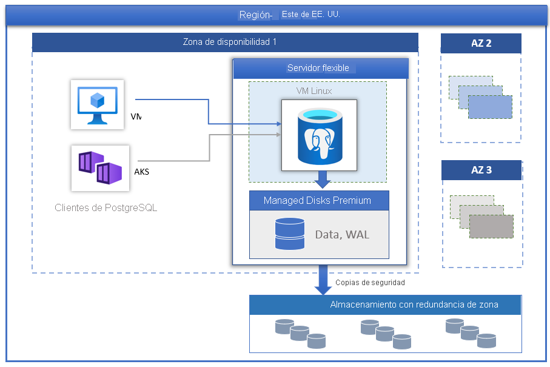

# Azure Database for PostgreSQL con la opción Servidor flexible

[Azure Database for PostgreSQL](../overview.md), con tecnología de PostgreSQL Community Edition, está disponible en tres modos de implementación:

- [Servidor único](../overview-single-server.md)
- Servidor flexible (versión preliminar)
- Hiperescala (Citus)

En este artículo, proporcionaremos información general y una introducción a los conceptos básicos del modelo de implementación de servidor flexible.

> [!IMPORTANT]
> Azure Database for PostgreSQL con la opción Servidor flexible se encuentra en versión preliminar.

## Información general

Servidor flexible de Azure Database for PostgreSQL es un servicio de base de datos totalmente administrado diseñado para proporcionar un control más granular y una mayor flexibilidad sobre las funciones de administración de bases de datos y las opciones de configuración. En general, el servicio proporciona mayor flexibilidad y personalizaciones de la configuración del servidor en función de los requisitos del usuario. La arquitectura de servidor flexible permite a los usuarios colocar el motor de base de datos con el nivel de cliente a fin de obtener una latencia baja y optar por la alta disponibilidad dentro de una única zona de disponibilidad o entre varias. Los servidores flexibles también proporcionan mejores controles de optimización de costos con la capacidad de iniciar o detener el servidor, así como un nivel de proceso flexible, que resulta ideal para las cargas de trabajo que no necesitan una capacidad de proceso completa de forma continuada. Actualmente, el servicio admite la versión Community de PostgreSQL 11 y 12. Actualmente, el servicio se encuentra disponible en versión preliminar en muchas [regiones de Azure](https://azure.microsoft.com/global-infrastructure/services/).

Los servidores flexibles son idóneos para lo siguiente:

- Desarrollo de aplicaciones que requieren un control mejorado y personalizaciones.
- Alta disponibilidad con redundancia de zona
- Ventana de mantenimiento administradas
  
## Alta disponibilidad

El modelo de implementación del servidor flexible está diseñado para admitir la alta disponibilidad dentro de una única zona de disponibilidad o entre varias. La arquitectura separa el proceso y el almacenamiento. El motor de base de datos se ejecuta en una máquina virtual Linux, mientras que los archivos de datos residen en Azure Storage. El almacenamiento mantiene tres copias sincrónicas con redundancia local de los archivos de base de datos, lo que garantiza la durabilidad de los datos.

Durante los eventos de conmutación por error planeados o no planeados, si el servidor deja de funcionar, el servicio mantiene la alta disponibilidad de los servidores mediante el siguiente procedimiento automático:

1. Se aprovisiona una nueva máquina virtual Linux de proceso.
2. El almacenamiento con archivos de datos se asigna a la nueva máquina virtual.
3. El motor de base de datos PostgreSQL pasa a estar en línea en la nueva máquina virtual.
4. El servicio de puerta de enlace garantiza una conmutación por error transparente, por lo que no se requiere ningún cambio en la aplicación.

En la imagen siguiente se muestra la transición del error de la máquina virtual y el almacenamiento.

 :::image type="content" source="./media/overview/overview-azure-postgres-flex-virtualmachine-storage-failure.png" alt-text="Servidor flexible: errores de almacenamiento y máquinas virtuales":::

Si está configurada la alta disponibilidad con redundancia de zona, el servicio aprovisiona y mantiene un servidor en espera activa entre zonas de disponibilidad dentro de la misma región de Azure. Los cambios en los datos del servidor de origen se replican sincrónicamente en el servidor en espera para garantizar que no se pierden datos. Con la alta disponibilidad con redundancia de zona, una vez que se desencadena el evento de conmutación por error planeado o sin planear, el servidor en espera se conecta inmediatamente y está disponible para procesar las transacciones entrantes. Esto permite la resistencia del servicio frente a errores en la zona de disponibilidad dentro de una región de Azure que admite varias zonas de disponibilidad, tal como se muestra en la imagen siguiente.

 :::image type="content" source="./media/business-continuity/concepts-zone-redundant-high-availability-architecture.png" alt-text="Alta disponibilidad con redundancia de zona":::

 Consulte el [documento de alta disponibilidad](./concepts-high-availability.md) para obtener más detalles.

## Aplicación automatizada de revisiones con la ventana de mantenimiento administrada

El servicio aplica automáticamente revisiones al hardware, sistema operativo y motor de base de datos subyacentes. La revisión incluye actualizaciones de seguridad y software. En el motor de PostgreSQL, las actualizaciones de versión secundaria también se incluyen como parte de la versión de mantenimiento planeado. Los usuarios pueden configurar la programación de la aplicación de revisión para que la administre el sistema o definir su programación personalizada. Durante la programación de mantenimiento, se aplica la revisión y es posible que el servidor requiera un reinicio como parte del proceso de aplicación de revisión a fin de completar la actualización. Con la programación personalizada, los usuarios pueden hacer que el ciclo de aplicación de revisión sea predecible y elegir una ventana de mantenimiento con un impacto mínimo en el negocio. En general, el servicio sigue una programación mensual de versiones como parte de la integración y publicación continuas.

## Copias de seguridad automáticas

El servicio de servidor flexible crea automáticamente copias de seguridad del servidor y las almacena en el almacenamiento con redundancia de zona configurado localmente por el usuario. Las copias de seguridad se pueden usar para restaurar el servidor a un momento dado dentro del período de retención de la copia de seguridad. El período de retención predeterminado es siete días. La retención se puede configurar para un total de 35 días. Todas las copias de seguridad se cifran mediante cifrado AES de 256 bits. Consulte [Copias de seguridad](./concepts-backup-restore.md) para obtener más información.

## Ajustar el rendimiento y la escala en cuestión de segundos

El servicio de servidor flexible está disponible en tres niveles de proceso: Flexible, De uso general y Optimizado para memoria. El nivel Flexible es el más adecuado para las cargas de trabajo de desarrollo de bajo costo y simultaneidad baja que no necesitan una capacidad de proceso completa continuamente. Los niveles De uso general y Optimizado para memoria son los más adecuados para las cargas de trabajo de producción que requieren un alto nivel de simultaneidad, escala y rendimiento predecible. Puede compilar su primera aplicación en una base de datos pequeña por poco dinero al mes y, después, ajustar fácilmente la escala para satisfacer las necesidades de la solución.

## Detención o inicio del servidor para reducir el costo total de propiedad

El servicio de servidor flexible le permite detener e iniciar el servidor a petición para reducir el costo total de propiedad. La facturación del nivel de proceso se detiene inmediatamente al detener el servidor. De este modo, puede lograr un importante ahorro en el costo durante el desarrollo, las pruebas y las cargas de trabajo de producción predecibles con límites de tiempo. El servidor permanece en estado detenido durante siete días, a menos que se reinicie antes.

## Seguridad de clase empresarial

El servicio de servidor flexible usa el módulo criptográfico con validación FIPS 140-2 para el cifrado del almacenamiento de los datos en reposo. Se cifran los datos, incluidas las copias de seguridad, y los archivos temporales creados mientras se ejecutan las consultas. El servicio usa el cifrado AES de 256 bits que se incluye en el cifrado de Azure Storage, y el sistema (valor predeterminado) puede administrar las claves. El servicio cifra los datos en movimiento con la Seguridad de la capa de transporte (SSL/TLS) que se aplica de manera predeterminada. El servicio solo aplica y admite las versiones 1.2 de TLS.

Los servidores flexibles permiten el acceso privado completo a los servidores mediante Azure Virtual Network (integración con red virtual). Solo puede acceder a los servidores de la red virtual de Azure y conectarse con ellos mediante las direcciones IP privadas. Con la integración con la red virtual, se deniega el acceso público y no se puede acceder a los servidores mediante puntos de conexión públicos.

## Supervisión y alertas

El servicio de servidor flexible está equipado con características integradas de alertas y supervisión de rendimiento. Todas las métricas de Azure tienen una frecuencia de un minuto y cada métrica proporciona 30 días de historial. Puede configurar alertas en las métricas. El servicio expone las métricas del servidor host para supervisar el uso de los recursos y permite configurar registros de consultas lentas. Con estas herramientas, puede optimizar rápidamente sus cargas de trabajo y configurar el servidor para lograr el máximo rendimiento.

## Migración

El servicio ejecuta la versión Community de PostgreSQL. Esto ofrece una compatibilidad total con las aplicaciones y requiere un costo mínimo de refactorización para migrar la aplicación existente desarrollada en el motor de PostgreSQL a un servidor flexible. 

- **Volcado y restauración**: en el caso de las migraciones sin conexión en las que los usuarios pueden permitirse un tiempo de inactividad, el volcado y la restauración mediante herramientas de la comunidad, como pg_dump y pg_restore, pueden proporcionar una manera más rápida de realizar la migración. Consulte [Migración mediante volcado y restauración](https://docs.microsoft.com/azure/postgresql/howto-migrate-using-dump-and-restore) para obtener más información.
- **Azure Database Migration Service**: puede aprovechar Azure Database Migration Service para las migraciones sin problemas y simplificadas a un servidor flexible con un tiempo de inactividad mínimo. Consulte [DMS a través del portal](https://docs.microsoft.com/azure/dms/tutorial-postgresql-azure-postgresql-online-portal) y [DMS a través de la CLI](https://docs.microsoft.com/azure/dms/tutorial-postgresql-azure-postgresql-online). Puede realizar la migración desde la instancia Azure Database for PostgreSQL con la opción Servidor único a la opción Servidor flexible. Consulte este [artículo sobre DMS](https://docs.microsoft.com/azure/dms/tutorial-azure-postgresql-to-azure-postgresql-online-portal) para obtener información.

## Pasos siguientes

Ahora que ha leído la introducción al modo de implementación Servidor flexible de Azure Database for PostgreSQL, ya está listo para crear su primer servidor: [Creación de una instancia de Azure Database for PostgreSQL con la opción Servidor flexible mediante Azure Portal](./quickstart-create-server-portal.md)

