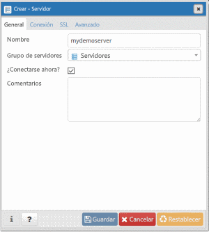
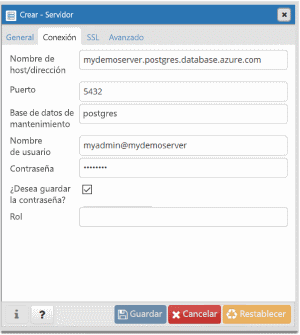
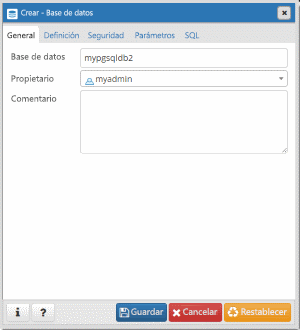

# <a name="quickstart-create-an-azure-database-for-postgresql---single-server-using-powershell"></a>Inicio rápido: Creación de una instancia de Azure Database for PostgreSQL: servidor único mediante PowerShell

En este inicio rápido se describe cómo usar PowerShell para crear un servidor de Azure Database for PostgreSQL en un grupo de recursos de Azure. Puede usar PowerShell para crear y administrar recursos de Azure de forma interactiva o en scripts.

## <a name="prerequisites"></a>Requisitos previos

Si no tiene una suscripción a Azure, cree una cuenta [gratuita](https://azure.microsoft.com/free/) antes de empezar.

Si decide usar PowerShell de forma local, para este artículo es preciso que instale el módulo Az PowerShell y que se conecte a su cuenta de Azure con el cmdlet [Connect-AzAccount](https://docs.microsoft.com/powershell/module/az.accounts/connect-azaccount). Para más información sobre cómo instalar el módulo Az PowerShell, consulte [Instalación de Azure PowerShell](https://docs.microsoft.com/powershell/azure/install-az-ps).

> [!IMPORTANT]
> Mientras el módulo Az.PostgreSql PowerShell se encuentre en versión preliminar, debe instalarlo por separado del módulo Az PowerShell mediante el siguiente comando: `Install-Module -Name Az.PostgreSql -AllowPrerelease`.
> Una vez que el módulo Az.PostgreSql PowerShell esté disponible con carácter general, formará parte de las futuras versiones del módulo Az PowerShell y estará disponible de forma nativa en Azure Cloud Shell.

Si esta es la primera vez que usa el servicio Azure Database for PostgreSQL, debe registrar el proveedor de recursos **Microsoft.DBforPostgreSQL**.

```azurepowershell-interactive
Register-AzResourceProvider -ProviderNamespace Microsoft.DBforPostgreSQL
```

[!INCLUDE [cloud-shell-try-it](../../includes/cloud-shell-try-it.md)]

Si tiene varias suscripciones a Azure, elija la suscripción adecuada en la que se debe facturar el recurso. Seleccione un identificador de suscripción específico con el cmdlet [Set-AzContext](https://docs.microsoft.com/powershell/module/az.accounts/set-azcontext).

```azurepowershell-interactive
Set-AzContext -SubscriptionId 00000000-0000-0000-0000-000000000000
```

## <a name="create-a-resource-group"></a>Crear un grupo de recursos

Cree un [grupo de recursos de Azure](https://docs.microsoft.com/azure/azure-resource-manager/resource-group-overview) con el cmdlet [New-AzResourceGroup](https://docs.microsoft.com/powershell/module/az.resources/new-azresourcegroup). Un grupo de recursos es un contenedor lógico en el que se implementan y se administran recursos de Azure como un grupo.

En el ejemplo siguiente, se crea un grupo de recursos denominado **myResourceGroup** en la región **Oeste de EE. UU.**

```azurepowershell-interactive
New-AzResourceGroup -Name myresourcegroup -Location westus
```

## <a name="create-an-azure-database-for-postgresql-server"></a>Creación de un servidor de Azure Database for PostgreSQL

Cree un servidor Azure Database for PostgreSQL con el cmdlet `New-AzPostgreSqlServer`. Un servidor puede administrar varias bases de datos. Normalmente se usa una base de datos independiente para cada proyecto o para cada usuario.

La tabla siguiente contiene una lista de parámetros y valores de ejemplo usados comúnmente para el cmdlet `New-AzPostgreSqlServer`.

|        **Configuración**         | **Valor de ejemplo** |                                                                                                                                                             **Descripción**                                                                                                                                                              |
| -------------------------- | ---------------- | ---------------------------------------------------------------------------------------------------------------------------------------------------------------------------------------------------------------------------------------------------------------------------------------------------------------------------------------- |
| Nombre                       | mydemoserver     | Elija un nombre único que identifique al servidor de Azure Database for PostgreSQL. El nombre del servidor solo puede contener letras, números y el carácter de guion (-). Los caracteres en mayúsculas que se especifiquen se convertirán automáticamente a minúsculas durante el proceso de creación. Debe contener entre 3 y 63 caracteres. |
| ResourceGroupName          | myresourcegroup  | Especifique el nombre del grupo de recursos de Azure.                                                                                                                                                                                                                                                                                            |
| SKU                        | GP_Gen5_2        | El nombre de la SKU. Sigue la convención **plan de tarifa\_generación de procesos\_núcleos virtuales** en forma abreviada. Para más información sobre el parámetro Sku, consulte la información de esta tabla.                                                                                                                                           |
| BackupRetentionDay         | 7                | Cuánto tiempo deben conservarse las copias de seguridad. La unidad es días. El intervalo es 7-35.                                                                                                                                                                                                                                                                       |
| GeoRedundantBackup         | habilitado          | Si se deben habilitar las copias de seguridad con redundancia geográfica en este servidor o no. Este valor no se puede habilitar para los servidores en el plan de tarifa Básico y no se puede cambiar después de crear el servidor. Valores permitidos: Enabled (Habilitada), Disabled (Deshabilitada).                                                                                                      |
| Location                   | westus           | Región de Azure para el servidor.                                                                                                                                                                                                                                                                                                         |
| SslEnforcement             | habilitado          | Si SSL debe habilitarse o no en este servidor. Valores permitidos: Enabled (Habilitada), Disabled (Deshabilitada).                                                                                                                                                                                                                                                 |
| StorageInMb                | 51200            | La capacidad de almacenamiento del servidor (la unidad es megabytes). Un valor de StorageInMb válido es un mínimo de 5120 MB y aumenta en incrementos de 1024 MB. Para más información sobre los límites del tamaño de almacenamiento, consulte [Planes de tarifa de Azure Database for PostgreSQL](./concepts-pricing-tiers.md).                                                                               |
| Versión                    | 9,6              | La versión principal de PostgreSQL.                                                                                                                                                                                                                                                                                                                 |
| AdministratorUserName      | myadmin          | El nombre del usuario del inicio de sesión del administrador. No puede ser **azure_superuser**, **admin**, **administrator**, **root**, **guest** o **public**.                                                                                                                                                                                            |
| AdministratorLoginPassword | `<securestring>` | Contraseña del usuario administrador en forma de cadena segura. Debe tener entre 8 y 128 caracteres. La contraseña debe contener caracteres de tres de las siguientes categorías: Letras del alfabeto inglés mayúsculas y minúsculas, números y caracteres no alfanuméricos.                                       |

El valor del parámetro **Sku** sigue la convención **plan de tarifa\_generación de proceso\_núcleos virtuales** como en los ejemplos siguientes:

- `-Sku B_Gen5_1` se asigna a Básico, Gen 5 y 1 núcleo virtual. Esta opción es la SKU más pequeña disponible.
- `-Sku GP_Gen5_32` se asigna a De uso general, Gen 5 y 32 núcleos virtuales.
- `-Sku MO_Gen5_2` se asigna a Optimizado para memoria, Gen 5 y 2 núcleos virtuales.

Para más información sobre los valores válidos de **Sku** por región y sobre los planes, consulte [Planes de tarifa de Azure Database for PostgreSQL](./concepts-pricing-tiers.md).

En el ejemplo siguiente se crea un servidor PostgreSQL en la región **Oeste de EE. UU.** denominado **mydemoserver** en el grupo de recursos **myresourcegroup** con el inicio de sesión del administrador del servidor de **myadmin**. Es un servidor de generación 5 en el plan de tarifa de uso general con dos núcleos virtuales y con copias de seguridad con redundancia geográfica habilitadas. Documente la contraseña usada en la primera línea del ejemplo, ya que se trata de la contraseña de la cuenta de administrador del servidor PostgreSQL.

> [!TIP]
> Un nombre de servidor se asigna a un nombre DNS y debe ser único en todo el mundo en Azure.

```azurepowershell-interactive
$Password = Read-Host -Prompt 'Please enter your password' -AsSecureString
New-AzPostgreSqlServer -Name mydemoserver -ResourceGroupName myresourcegroup -Sku GP_Gen5_2 -GeoRedundantBackup Enabled -Location westus -AdministratorUsername myadmin -AdministratorLoginPassword $Password
```

Considere la posibilidad de usar el plan de tarifa Básico si menos proceso y E/S resultan adecuados para su carga de trabajo.

> [!IMPORTANT]
> Los servidores que creó en el plan de tarifa Básico no se podrán escalar más adelante a servidores de uso general u optimizados para memoria y no se pueden replicar geográficamente.

## <a name="configure-a-firewall-rule"></a>Configuración de una regla de firewall

Cree una regla de firewall de nivel de servidor de Azure Database for PostgreSQL con el cmdlet `New-AzPostgreSqlFirewallRule`. Una regla de firewall de nivel de servidor permite que una aplicación externa, como la herramienta de línea de comandos `psql` o PostgreSQL Workbench, se conecte al servidor mediante el firewall del servicio Azure Database for PostgreSQL.

En el ejemplo siguiente se crea una regla de firewall denominada **AllowMyIP** que permite las conexiones desde una dirección IP específica, 192.168.0.1. Sustituya por una dirección IP o intervalo de direcciones IP que se corresponda a la ubicación desde la que se conecta.

```azurepowershell-interactive
New-AzPostgreSqlFirewallRule -Name AllowMyIP -ResourceGroupName myresourcegroup -ServerName mydemoserver -StartIPAddress 192.168.0.1 -EndIPAddress 192.168.0.1
```

> [!NOTE]
> Las conexiones a Azure Database for PostgreSQL se comunican a través del puerto 5432. Si intenta conectarse desde una red corporativa, es posible que no se permita el tráfico saliente a través del puerto 5432. En este escenario, solo podrá conectarse al servidor si el departamento de TI abre el puerto 5432.

## <a name="get-the-connection-information"></a>Obtención de la información de conexión

Para conectarse al servidor, debe proporcionar las credenciales de acceso y la información del host. Use el ejemplo siguiente para determinar la información de conexión. Tome nota de los valores de **FullyQualifiedDomainName** y **AdministratorLogin**.

```azurepowershell-interactive
Get-AzPostgreSqlServer -Name mydemoserver -ResourceGroupName myresourcegroup |
  Select-Object -Property FullyQualifiedDomainName, AdministratorLogin
```

```Output
FullyQualifiedDomainName                    AdministratorLogin
------------------------                    ------------------
mydemoserver.postgres.database.azure.com       myadmin
```

## <a name="connect-to-postgresql-database-using-psql"></a>Conectarse a la base de datos de PostgreSQL mediante psql

Si el equipo cliente tiene PostgreSQL instalado, puede usar una instancia local de [psql](https://www.postgresql.org/docs/current/static/app-psql.html) para conectarse a un servidor Azure PostgreSQL. También puede acceder a una versión preinstalada de la herramienta de línea de comandos `psql` en Azure Cloud Shell si selección el botón **Pruébelo** en un código de ejemplo de este artículo. Otras maneras de acceder a Azure Cloud Shell consisten en seleccionar el botón **>_** en la barra de herramientas superior derecha de Azure Portal o visitar [shell.azure.com](https://shell.azure.com/).

1. Conéctese al servidor Azure PostgreSQL mediante la utilidad de línea de comandos `psql`.

   ```azurepowershell-interactive
   psql --host=<servername> --port=<port> --username=<user@servername> --dbname=<dbname>
   ```

   Por ejemplo, el siguiente comando se conecta a la base de datos predeterminada denominada **postgres** en el servidor PostgreSQL `mydemoserver.postgres.database.azure.com` con las credenciales de acceso. Escriba el valor de `<server_admin_password>` que eligió cuando se le solicitó una contraseña.

   ```azurepowershell-interactive
   psql --host=mydemoserver.postgres.database.azure.com --port=5432 --username=myadmin@mydemoserver --dbname=postgres
   ```

   > [!TIP]
   > Si prefiere usar una ruta URL para conectarse a Postgres, codifique la URL con el signo @ en el nombre de usuario con `%40`. Por ejemplo, la cadena de conexión de psql sería `psql postgresql://myadmin%40mydemoserver@mydemoserver.postgres.database.azure.com:5432/postgres`

1. Una vez conectado al servidor, cree una base de datos vacía en el símbolo del sistema.

   ```sql
   CREATE DATABASE mypgsqldb;
   ```

1. En el símbolo del sistema, ejecute el siguiente comando para cambiar la conexión a la base de datos **mypgsqldb** recién creada:

   ```sql
   \c mypgsqldb
   ```

## <a name="connect-to-the-postgresql-server-using-pgadmin"></a>Conexión al servidor de PostgreSQL mediante pgAdmin

pgAdmin es una herramienta de código abierto que se usa con PostgreSQL. Puede instalar pgAdmin desde el [sitio web de pgAdmin](https://www.pgadmin.org/). La versión de pgAdmin que use podría ser diferente de la que se usa en esta guía de inicio rápido. Lea la documentación de pgAdmin si necesita instrucciones adicionales.

1. Abra la aplicación pgAdmin en el equipo cliente.

1. En la barra de herramientas, vaya a **Object** (Objeto), mantenga el mouse sobre **Create** (Crear) y seleccione **Server** (Servidor).

1. En el cuadro de diálogo **Create - Server** (Crear: servidor) de la pestaña **General**, escriba un nombre descriptivo único para el servidor, como **mydemoserver**.

   

1. En la pestaña **Connection** (Conexión) del cuadro de diálogo **Create - Server** (Crear: servidor), rellene la tabla de configuración.

   

    parámetro pgAdmin |Value|Descripción
    ---|---|---
    Host name/address | Nombre de servidor | El valor de nombre de servidor que usó al crear el servidor de Azure Database for MySQL. El servidor de ejemplo es **mydemoserver.postgres.database.azure.com.** Use el nombre de dominio completo ( **\*.postgres.database.azure.com**) tal como se muestra en el ejemplo. Si no recuerda el nombre del servidor, siga los pasos de la sección anterior para obtener la información de conexión.
    Port | 5432 | El puerto se usará al conectarse al servidor de Azure Database for PostgreSQL.
    Maintenance Database | *postgres* | Nombre de la base de datos predeterminada que crea el sistema.
    Nombre de usuario | Nombre de inicio de sesión del administrador del servidor | El nombre de usuario de inicio de sesión del administrador del servidor que suministró al crear el servidor de Azure Database for PostgreSQL. Si no recuerda el nombre de usuario, siga los pasos de la sección anterior para obtener la información de conexión. El formato es *nombre de usuario\@nombre de servidor*.
    Contraseña | Contraseña del administrador | La contraseña que eligió al crear el servidor antes en esta guía de inicio rápido.
    Role | Déjelo en blanco | No es necesario proporcionar un nombre de rol en este momento. Deje el campo en blanco.
    SSL Mode | *Require* | Puede establecer el modo TLS/SSL en la pestaña SSL de pgAdmin. De forma predeterminada, todos los servidores de Azure Database for PostgreSQL se crean de modo que se exija TLS. Para desactivar la aplicación de TLS, consulte [Configuración de la aplicación de TLS](./concepts-ssl-connection-security.md#configure-enforcement-of-tls).

1. Seleccione **Guardar**.

1. En el panel izquierdo del **explorador**, expanda el nodo **Servidores**. Seleccione el servidor, por ejemplo, **mydemoserver**. Haga clic para conectarse a él.

1. Expanda el nodo de servidor y **Bases de datos**. La lista debe incluir las bases de datos *postgres* existentes y otras bases de datos que haya creado. Con Azure Database for PostgreSQL puede crear varias bases de datos por servidor.

1. Haga clic con el botón derecho en **Bases de datos**, elija el menú **Crear** y, a continuación, seleccione **Base de datos**.

1. Escriba el nombre de base de datos que quiera en el campo **Base de datos**, por ejemplo, **mypgsqldb2**.

1. Seleccione el **propietario** de la base de datos en el cuadro de lista. Elija el nombre de inicio de sesión del administrador del servidor, como en el ejemplo, **my admin**.

   

1. Seleccione **Guardar** para crear una base de datos vacía.

1. En el panel del **explorador**, puede ver la base de datos que ha creado en la lista de bases de datos, debajo del nombre del servidor.

## <a name="clean-up-resources"></a>Limpieza de recursos

Si no se necesitan los recursos que se han creado en este inicio rápido para otro inicio rápido o tutorial, puede eliminarlos con el siguiente comando.

> [!CAUTION]
> En el ejemplo siguiente se elimina el grupo de recursos especificado y todos los recursos que contiene.
> Si los recursos que están fuera del ámbito de este inicio rápido existen en el grupo de recursos especificado, también se eliminarán.

```azurepowershell-interactive
Remove-AzResourceGroup -Name myresourcegroup
```

Para eliminar solo el servidor creado en este inicio rápido sin eliminar el grupo de recursos, use el cmdlet `Remove-AzPostgreSqlServer`.

```azurepowershell-interactive
Remove-AzPostgreSqlServer -Name mydemoserver -ResourceGroupName myresourcegroup
```

## <a name="next-steps"></a>Pasos siguientes

> [!div class="nextstepaction"]
> [Diseño de una base de datos de Azure Database for PostgreSQL mediante PowerShell](tutorial-design-database-using-powershell.md)
