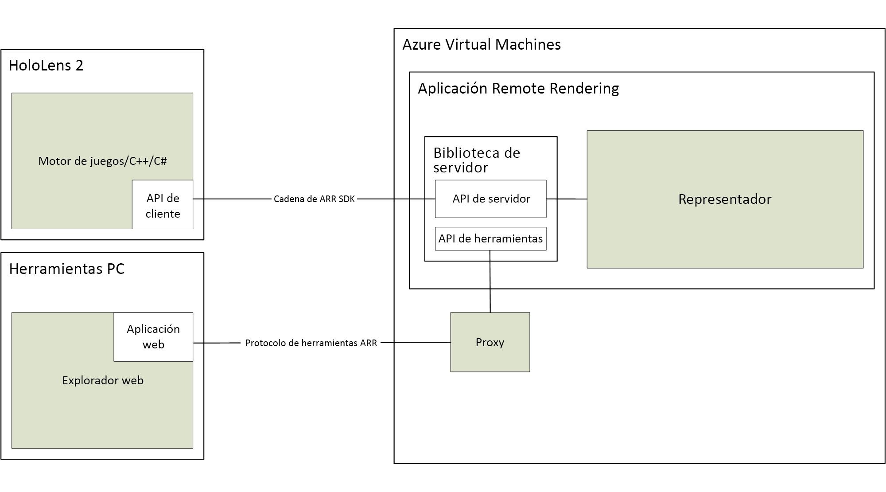

# Acerca de Azure Remote Rendering

> [!IMPORTANT]
> **Azure Remote Rendering** está actualmente en versión preliminar pública.
> Esta versión preliminar se ofrece sin Acuerdo de Nivel de Servicio y no se recomienda para cargas de trabajo de producción. Es posible que algunas características no sean compatibles o que tengan sus funcionalidades limitadas. Para más información, consulte [Términos de uso complementarios de las Versiones Preliminares de Microsoft Azure](https://azure.microsoft.com/support/legal/preview-supplemental-terms/).

*Azure Remote Rendering* (ARR) es un servicio que permite representar contenido 3D interactivo de alta calidad en la nube y transmitirlo en tiempo real a los dispositivos, como HoloLens 2.

Los dispositivos desconectados tienen una potencia de cálculo limitada para la representación de modelos complejos. Sin embargo, en muchas aplicaciones, sería inaceptable reducir la fidelidad visual de algún modo.

Para resolver este problema, *Remote Rendering* traslada la carga de trabajo de representación a las GPU de perfil alto en la nube. Un motor de gráficos hospedado en la nube representa la imagen, la codifica como una secuencia de vídeo y la transmite al dispositivo de destino.

## Representación híbrida

En la mayoría de las aplicaciones, no basta con representar solo un modelo complejo. También se necesita una interfaz de usuario personalizada para proporcionar funcionalidad al usuario. Azure Remote Rendering no obliga a usar un marco de interfaz de usuario dedicado, sino que admite *representación híbrida*. Esto significa que puede representar elementos en el dispositivo con el método que prefiera, como [MRTK](https://microsoft.github.io/MixedRealityToolkit-Unity/Documentation/GettingStartedWithTheMRTK.html).

Al final de un marco, Azure Remote Rendering combina automáticamente el contenido representado localmente con la imagen remota. Incluso puede hacerlo con la oclusión correcta.

## Representación de varias GPU

Algunos modelos son demasiado complejos como para representarlos a velocidades de fotogramas interactivas, incluso con una GPU de perfil alto. Este es un problema común, en especial en la visualización industrial. Para aumentar el límite aún más, Azure Remote Rendering puede distribuir la carga de trabajo a varias GPU. Los resultados se combinan en una sola imagen, lo que hace que el proceso sea completamente transparente para el usuario.

## Arquitectura de alto nivel

En este diagrama se ilustra la arquitectura de representación remota:

Un ciclo completo de generación de imágenes consta de los siguientes pasos:

1. Lado cliente: Configuración de fotogramas
    1. El código: se procesa la entrada del usuario, se actualiza el gráfico de escena.
    1. Código ARR: el gráfico de escena se actualiza y la posición de la cabeza prevista se envía al servidor.
1. Lado servidor: Representación remota
    1. El motor de representación distribuye la representación entre las GPU disponibles.
    1. La salida de varias GPU consta de una sola imagen.
    1. La imagen se codifica como secuencia de vídeo y se devuelve al cliente.
1. Lado cliente: Finalización
    1. El código: se representa el contenido local opcional (interfaz de usuario, marcadores, etc.)
    1. Código ARR: al "presentarlo", el contenido representado localmente se combina automáticamente con la secuencia de vídeo

La latencia de red es el problema principal. El tiempo de respuesta entre el envío de una solicitud y la recepción del resultado suele ser demasiado largo para las velocidades de fotogramas interactivas. Por lo tanto, puede haber más de un fotograma en tránsito en cualquier momento.

## Pasos siguientes

* [Requisitos del sistema](system-requirements.md)
* [Inicio rápido: Representación de un modelo con Unity](../quickstarts/render-model.md)
