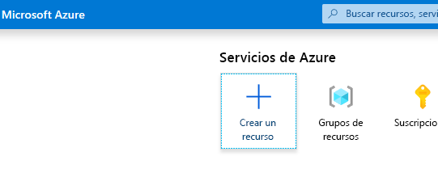
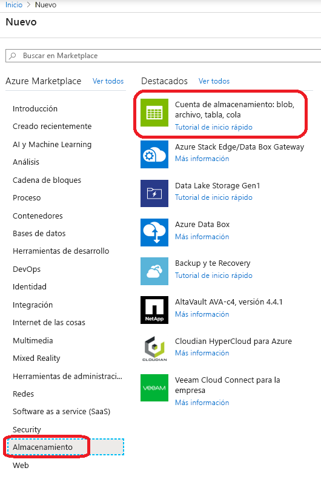
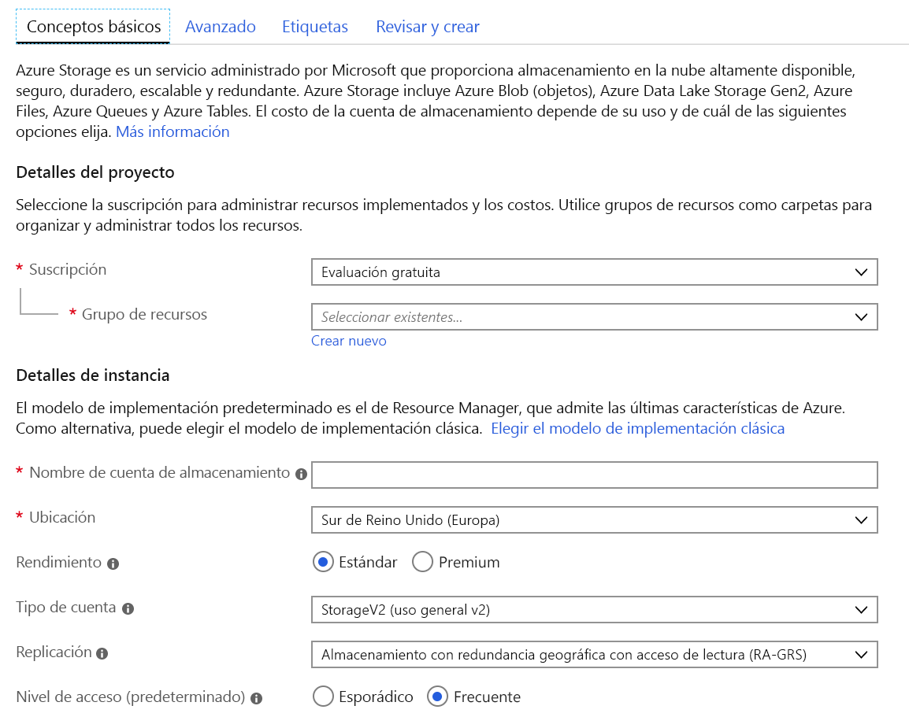
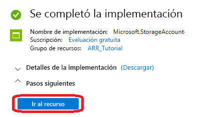
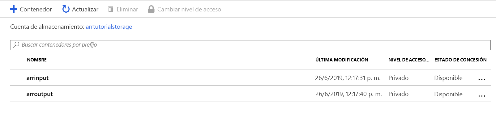
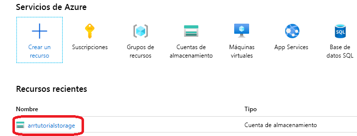
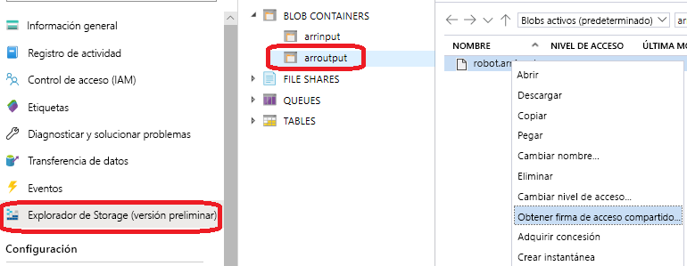

# <a name="quickstart-convert-a-model-for-rendering"></a>Inicio rápido: Conversión de un modelo para su representación

En [Inicio rápido: Representación de un modelo con Unity](render-model.md), ha aprendido a usar el proyecto de ejemplo de Unity para representar un modelo integrado. En esta guía se muestra cómo convertir sus propios modelos.

Aprenderá a:

> [!div class="checklist"]
>
> * Configurar una cuenta de almacenamiento de blobs de Azure para la entrada y salida
> * Cargar y convertir un modelo 3D para su uso con Azure Remote Rendering
> * Incluir el modelo 3D convertido en una aplicación para su representación

## <a name="prerequisites"></a>Requisitos previos

* Realizar el tutorial [Quickstart: Representación de un modelo con Unity](render-model.md)
* Instalación de Azure PowerShell [(documentación)](https://docs.microsoft.com/powershell/azure/)
  * Apertura de una instancia de PowerShell con derechos de administrador
  * Ejecute `Install-Module -Name Az -AllowClobber`.

## <a name="overview"></a>Información general

El representador del servidor no puede trabajar directamente con formatos del modelo de origen como FBX o GLTF. En su lugar, requiere que el modelo esté en un formato binario propietario.
El servicio de conversión consume modelos de almacenamiento de blobs de Azure y vuelve a escribir los modelos convertidos en un contenedor de almacenamiento de blobs de Azure proporcionado.

Necesita:

* Una suscripción de Azure
* Una cuenta "StorageV2" de la suscripción
* Un contenedor de almacenamiento de blobs para el modelo de entrada
* Un contenedor de almacenamiento de blobs para los datos de salida
* Un modelo que se va a convertir, consulte [Modelos de ejemplo](../samples/sample-model.md).
  * Consulte la lista de [formatos de origen admitidos](../how-tos/conversion/model-conversion.md#supported-source-formats).
  * Para usar el script de conversión de ejemplo, asegúrese de preparar una carpeta de entrada que contenga el modelo y todas las dependencias externas (como texturas externas o geometría).

## <a name="azure-setup"></a>Configuración de Azure

Si aún no tiene una cuenta, vaya a [https://azure.microsoft.com/get-started/](https://azure.microsoft.com/get-started/), haga clic en la opción de cuenta Gratis y siga las instrucciones.

Cuando tenga una cuenta de Azure, vaya a [https://ms.portal.azure.com/#home](https://ms.portal.azure.com/#home).

### <a name="storage-account-creation"></a>Creación de cuentas de almacenamiento

Para crear el almacenamiento de blobs, primero necesita una cuenta de almacenamiento.
Para crear uno, haga clic en el botón "Crear un recurso":



En la pantalla nueva, elija **Almacenamiento** en el lado izquierdo y, a continuación, **Cuenta de almacenamiento: blob, archivo, tabla, cola** de la columna siguiente:



Al hacer clic en este botón, aparecerá la siguiente pantalla con las propiedades de almacenamiento que se van a rellenar:



Rellene el formulario de la siguiente manera:

* Cree un nuevo grupo de recursos en el vínculo situado debajo del cuadro desplegable y asígnele el nombre **ARR_Tutorial**.
* En **Nombre de la cuenta de almacenamiento**, escriba un nombre único. **Este nombre debe ser único globalmente**; de lo contrario, aparecerá un mensaje que le informa de que el nombre está ya asignado. En el ámbito de este artículo de inicio rápido, se denomina **arrtutorialstorage**. En consecuencia, debe reemplazarlo por su nombre para cualquier aparición en este inicio rápido.
* Selección de una **ubicación** cercana a usted. Lo ideal es utilizar la misma ubicación que la usada para configurar la representación en el otro inicio rápido.
* **Rendimiento** establézcalo en "Estándar"
* **Tipo de cuenta** establézcalo en "StorageV2 (uso general v2)"
* **Replicación** establézcalo en "Almacenamiento con redundancia geográfica con acceso de lectura (RA-GRS)"
* **Nivel de acceso** establézcalo en "Frecuente"

No es necesario cambiar ninguna de las propiedades de otras pestañas, por lo que puede continuar con **"Revisar y crear"** y, a continuación, seguir los pasos para completar la instalación.

El sitio web ahora le informa sobre el progreso de la implementación y notifica que la implementación se ha completado. Haga clic en el botón **"Ir al recurso"** para ver los pasos siguientes:



### <a name="blob-storage-creation"></a>Creación de almacenamiento de blobs

A continuación, necesitamos dos contenedores de blobs, uno para la entrada y otro para la salida.

En el botón **"Ir al recurso"** anterior, accederá a una página con un panel a la izquierda que contiene un menú de lista. En esa lista, en la categoría **"Blob service"** , haga clic en el botón **"Contenedores"** :


Presione el botón **"+ Contenedor"** para crear el contenedor de almacenamiento de blobs de **entrada**.
Utilice la siguiente configuración al crearlo:
  
* Nombre = arrinput
* Nivel de acceso público = Privado

Una vez creado el contenedor, haga clic en **+ Contenedor** y repita con esta configuración para el contenedor de **salida**:

* Nombre = arroutput
* Nivel de acceso público = Privado

Ahora debería tener dos contenedores de almacenamiento de blobs:



## <a name="run-the-conversion"></a>Ejecución de la conversión

Para facilitar la llamada al servicio de conversión de recursos, se proporciona un script de utilidad. Se encuentra en la carpeta *Scripts* y se llama **Conversion.ps1**.

En concreto, este script:

1. Carga todos los archivos de un directorio determinado desde el disco local al contenedor de almacenamiento de entrada.
1. Llama a la [API REST de conversión de recursos](../how-tos/conversion/conversion-rest-api.md) que recuperará los datos del contenedor de almacenamiento de entrada e iniciará una conversión que devolverá un identificador de conversión.
1. Sondea la API de estado de la conversión con el identificador de conversión recuperado hasta que el proceso de conversión finalice con un estado de Correcto o Error.
1. Recupera un vínculo al recurso convertido en el almacenamiento de salida.

El script lee su configuración del archivo *Scripts\arrconfig.json*. Abra el archivo JSON con un editor de texto.

```json
{
    "accountSettings": {
        "arrAccountId": "8*******-****-****-****-*********d7e",
        "arrAccountKey": "R***************************************l04=",
        "region": "<your-region>"
    },
    "renderingSessionSettings": {
        "vmSize": "standard",
        "maxLeaseTime": "1:00:00"
    },
    "assetConversionSettings": {
        "localAssetDirectoryPath": "D:\\tmp\\robot",
        "resourceGroup": "ARR_Tutorial",
        "storageAccountName": "arrexamplestorage",
        "blobInputContainerName": "arrinput",
        "inputFolderPath": "robotConversion",
        "inputAssetPath": "robot.fbx",
        "blobOutputContainerName": "arroutput",
        "outputFolderPath":"converted/robot",
        "outputAssetFileName": "robot.arrAsset"
    }
}
```

La configuración del grupo **accountSettings** (identificador de cuenta y clave) debe rellenarse de forma análoga a las credenciales del artículo [Inicio rápido: Representación de un modelo con Unity](render-model.md).

En el grupo **assetConversionSettings**, asegúrese de cambiar **resourceGroup**, **blobInputContainerName** y **blobOutputContainerName** como se mostró anteriormente.
Tenga en cuenta que el valor **arrtutorialstorage** debe reemplazarse por el nombre único seleccionado durante la creación de la cuenta de almacenamiento.

Cambie **localAssetDirectoryPath** para que apunte al directorio del disco que contiene el modelo que desea convertir. Tenga cuidado de escapar correctamente las barras diagonales inversas ("\\") en la ruta de acceso con dos barras diagonales inversas ("\\\\").

Todos los datos de la ruta de acceso proporcionada en **localAssetDirectoryPath** se cargarán en el contenedor de blobs **blobInputContainerName** en un subtrazado proporcionado por **inputFolderPath**. Por lo tanto, en la configuración de ejemplo anterior, el contenido del directorio "D:\\tmp\\robot" se cargará en el contenedor de blobs "arrinput" de la cuenta de almacenamiento "arrtutorialstorage" en la ruta de acceso "robotConversion". Se sobrescribirá cualquier archivo existente.

Cambie **inputAssetPath** a la ruta de acceso del modelo que se va a convertir: la ruta de acceso está relacionada con localAssetDirectoryPath. Use "/" en lugar de "\\" como separador de la ruta de acceso. Por lo tanto, para un archivo "robot.fbx" que se encuentra directamente en "D:\\tmp\\robot", use "robot.fbx".

Una vez convertido el modelo, se volverá a escribir en el contenedor de almacenamiento proporcionado por **blobOutputContainerName**. Se puede especificar un subtrazado proporcionando el valor de **outputFolderPath** opcional. En el ejemplo anterior, el valor de "robot.arrAsset" resultante se copiará en el contenedor de blobs de salida en "converted/robot".

El valor de configuración **outputAssetFileName** determina el nombre del recurso convertido. El parámetro es opcional y el nombre de archivo de salida se deducirá del nombre del archivo de entrada en caso contrario.

Abra una instancia de PowerShell, asegúrese de que ha instalado *Azure PowerShell* como se mencionó en los [requisitos previos](#prerequisites). Después, inicie sesión en la suscripción con el siguiente comando y siga las instrucciones de la pantalla:

```PowerShell
Connect-AzAccount
```

> [!NOTE]
> En caso de que la organización tenga más de una suscripción, es posible que haya que especificar los argumentos SubscriptionId y Tenant. Busque los detalles en la [documentación de Connect-AzAccount](https://docs.microsoft.com/powershell/module/az.accounts/connect-azaccount).

Cambie al directorio `azure-remote-rendering\Scripts` y ejecute el script de conversión:

```PowerShell
.\Conversion.ps1 -UseContainerSas
```

Puede ver algo así: 

## <a name="insert-new-model-into-quickstart-sample-app"></a>Inserción de un nuevo modelo en la aplicación Inicio rápido de ejemplo

El script de conversión genera un identificador URI de *Firma de acceso compartido (SAS)* para el modelo convertido. Ahora puede copiar este identificador URI como el **nombre de modelo** en la aplicación de ejemplo del artículo de inicio rápido (consulte [Inicio rápido: Representación de un modelo con Unity](render-model.md)).


 El ejemplo debería ahora cargar y representar el modelo personalizado.

## <a name="optional-re-creating-a-sas-uri"></a>Opcional: Recreación de un URI de SAS

El URI de SAS creado por el script de conversión solo será válido durante 24 horas. Sin embargo, una vez expirado, no es necesario volver a convertir el modelo. En su lugar, puede crear una nueva SAS en el portal, tal y como se describe en los pasos siguientes:

1. Vaya a [Azure Portal](https://www.portal.azure.com).
1. Haga clic en el recurso de **cuenta de almacenamiento**: 
1. En la siguiente pantalla, haga clic en **Explorador de almacenamiento** en el panel izquierdo y busque el modelo de salida (archivo *.arrAsset*) en el contenedor de almacenamiento de blobs *arroutput*. Haga clic con el botón derecho en el archivo y seleccione **Obtener firma de acceso compartido** en el menú contextual. 
1. Se abre una nueva pantalla en la que puede seleccionar una fecha de expiración. Presione **Crear** y copie el identificador URI que se muestra en el siguiente cuadro de diálogo. Este nuevo identificador URI reemplaza el URI temporal que creó el script.

## <a name="next-steps"></a>Pasos siguientes

Ahora que conoce los conceptos básicos, consulte nuestros tutoriales para obtener un conocimiento más profundo.

Si desea obtener información detallada sobre la conversión de modelos, consulte [la API REST de conversión de modelos](../how-tos/conversion/conversion-rest-api.md).

> [!div class="nextstepaction"]
> [Tutorial: Visualización de modelos representados de forma remota](../tutorials/unity/view-remote-models/view-remote-models.md)
