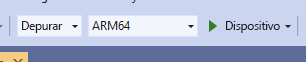

# <a name="quickstart-deploy-native-c-sample-to-hololens"></a>Inicio rápido: Implementación de un ejemplo de C++ nativo en HoloLens

En este inicio rápido se explica cómo implementar y ejecutar la aplicación del tutorial de C++ nativo en HoloLens 2.

En este artículo de inicio rápido aprenderá lo siguiente:

> [!div class="checklist"]
>
>* Compilar la aplicación del tutorial para HoloLens.
>* Cambie las credenciales de enrutamiento de solicitud de aplicaciones en el código fuente.
>* Implementar y ejecutar el ejemplo en el dispositivo.

## <a name="prerequisites"></a>Requisitos previos

Para obtener acceso al servicio Azure Remote Rendering, primero debe [crear una cuenta](../../../how-tos/create-an-account.md).

Debe instalar el software siguiente:

* Windows SDK 10.0.18362.0 [(descargar)](https://developer.microsoft.com/windows/downloads/windows-10-sdk)
* La versión más reciente de Visual Studio 2019 [(descargar)](https://visualstudio.microsoft.com/vs/older-downloads/)
* [Las herramientas de Visual Studio para Mixed Reality](https://docs.microsoft.com/windows/mixed-reality/install-the-tools). En concreto, las instalaciones de *carga de trabajo* siguientes son obligatorias:
  * **Desarrollo para el escritorio con C++**
  * **Desarrollo de Plataforma universal de Windows (UWP)**
* GIT [(descargar)](https://git-scm.com/downloads)

## <a name="clone-the-arr-samples-repository"></a>Clonación del repositorio de ejemplos de enrutamiento de solicitud de aplicaciones

Como primer paso, clonamos el repositorio de Git, que aloja los ejemplos públicos de Azure Remote Rendering. Abra un símbolo del sistema (escriba `cmd` en el menú Inicio de Windows) y cambie a un directorio en el que desee almacenar el proyecto de ejemplo de ARR.

Ejecute los comandos siguientes:

```cmd
mkdir ARR
cd ARR
git clone https://github.com/Azure/azure-remote-rendering
```

El último comando crea un subdirectorio en el directorio ARR que contiene los diversos proyectos de ejemplo para Azure Remote Rendering.

El tutorial de C++ en HoloLens puede encontrarse en el subdirectorio *NativeCpp/HoloLens*.

## <a name="build-the-project"></a>Compilación del proyecto

Abra el archivo de solución *HolographicApp.sln* ubicado en el subdirectorio *NativeCpp/HoloLens* con Visual Studio 2019.

Cambie la configuración de compilación a *Depurar* (o *Liberar*) y *ARM64*. Asegúrese también de que el modo del depurador está establecido en *Dispositivo*, en lugar de en *Máquina remota*:



Puesto que las credenciales de la cuenta están codificadas de forma rígida en el código fuente del tutorial, cámbielas por unas credenciales válidas. Para ello, abra el archivo `HolographicAppMain.cpp` dentro de Visual Studio y cambie la parte en la que se crea el front-end dentro del constructor de la clase `HolographicAppMain`:

```cpp
// 2. Create front end
{
    // Users need to fill out the following with their account data and model
    RR::AzureFrontendAccountInfo init;
    init.AccountId = "00000000-0000-0000-0000-000000000000";
    init.AccountKey = "<account key>";
    init.AccountDomain = "westus2.mixedreality.azure.com"; // <change to your region>
    m_modelURI = "builtin://Engine";
    m_sessionOverride = ""; // If there is a valid session ID to re-use, put it here. Otherwise a new one is created
    m_frontEnd = RR::ApiHandle(RR::AzureFrontend(init));
}
```

En concreto, cambie los valores siguientes:
* `init.AccountId` y `init.AccountKey` para usar los datos de la cuenta. Consulte el párrafo sobre cómo [recuperar información de una cuenta](../../../how-tos/create-an-account.md#retrieve-the-account-information).
* La parte de la región de la cadena de `init.AccountDomain` para regiones que no sean `westus2`, por ejemplo `"westeurope.mixedreality.azure.com"`
* Además, `m_sessionOverride` se puede cambiar a un identificador de sesión existente. Se pueden crear sesiones fuera de este ejemplo, por ejemplo, mediante [el script de PowerShell](../../../samples/powershell-example-scripts.md#script-renderingsessionps1) o mediante la [API REST de la sesión](../../../how-tos/session-rest-api.md#create-a-session) directamente.
Se recomienda crear una sesión fuera del ejemplo cuando este deba ejecutarse varias veces. Si no se devuelve ninguna sesión, el ejemplo creará una en cada inicio, lo que puede tardar varios minutos.

Ya se puede compilar la aplicación.

## <a name="launch-the-application"></a>Inicie la aplicación.

1. Conecte el dispositivo HoloLens con un cable USB al equipo.
1. Encienda HoloLens y espere hasta que aparezca el menú de inicio.
1. Inicie el depurador en Visual Studio (F5). La aplicación se implementará automáticamente en el dispositivo.

La aplicación de ejemplo debe iniciarse y debe aparecer un panel de texto que le informará del estado actual de la aplicación. El estado en el momento de inicio es iniciar una sesión nueva o conectarse a una sesión existente. Una vez completada la carga del modelo, el modelo de motor integrado aparece en la posición principal. Con forma de oclusión, el modelo del motor interactúa correctamente con el cubo giratorio que se representa localmente.

 Si quiere volver a iniciar el ejemplo más tarde, también puede encontrarlo en el menú de inicio de HoloLens, pero tenga en cuenta que puede tener un identificador de sesión compilado.

## <a name="next-steps"></a>Pasos siguientes

Este inicio rápido se basa en el resultado de un tutorial que explica cómo integrar todos los elementos relacionados con Remote Rendering en una *de HoloLens Holographic* estándar. Para saber cuáles son los pasos necesarios, siga este tutorial:

> [!div class="nextstepaction"]
> [Tutorial: Integración de Remote Rendering en una aplicación de HoloLens Holographic](../../../tutorials/native-cpp/hololens/integrate-remote-rendering-into-holographic-app.md)
