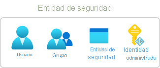
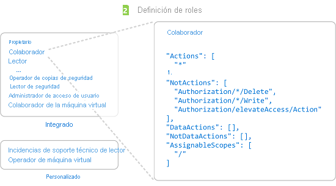
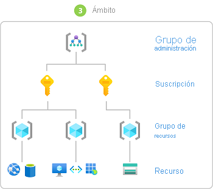
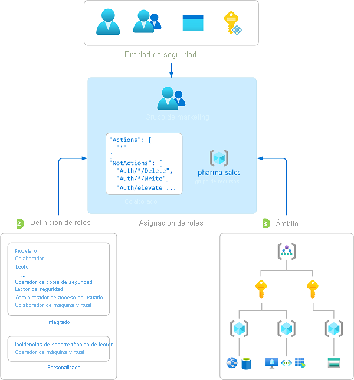
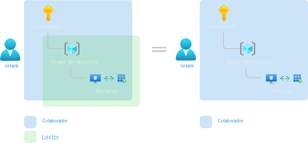

# ¿Qué es el control de acceso basado en rol de Azure (RBAC)?

La administración de acceso de los recursos en la nube es una función importantísima para cualquier organización que use la nube. El control de acceso basado en rol (Azure RBAC) ayuda a administrar quién tiene acceso a los recursos de Azure, qué pueden hacer con esos recursos y a qué áreas puede acceder.

Azure RBAC es un sistema de autorización basado en [Azure Resource Manager](../azure-resource-manager/management/overview.md) que proporciona administración de acceso específico a los recursos de Azure.

En este vídeo se ofrece información general rápida sobre Azure RBAC.

>[!VIDEO https://www.youtube.com/embed/Dzhm-garKBM]

## ¿Qué puedo hacer con Azure RBAC?

Estos son algunos ejemplos de lo que puede hacer con Azure RBAC:

- Permitir que un usuario administre las máquinas virtuales de una suscripción y que otro usuario administre las redes virtuales
- Permitir que un grupo de DBA administre bases de datos SQL en una suscripción
- Permitir que un usuario administre todos los recursos de un grupo de recursos, como las máquinas virtuales, los sitios web y las subredes
- Permitir que una aplicación acceda a todos los recursos de un grupo de recursos

## Funcionamiento de Azure RBAC

La forma en que se controla el acceso a los recursos mediante Azure RBAC es mediante las asignaciones de roles. Este es un concepto clave que es necesario entender: se trata de cómo se aplican los permisos. Una asignación de roles consta de tres elementos: entidad de seguridad, definición de rol y ámbito.

### Entidad de seguridad

Una *entidad de seguridad* es un objeto que representa a un usuario, un grupo, una entidad de servicio o una identidad administrada que solicita acceso a recursos de Azure. Puede asignar un rol a cualquiera de estas entidades de seguridad.

### Definición de roles

Una *definición de roles* es una recopilación de permisos. Suele denominarse un *rol*. Una definición de roles enumera las operaciones que se pueden realizar, por ejemplo, de lectura, escritura y eliminación. Los roles pueden ser generales, como propietarios, o específicos, como lectores de máquina virtual.

Azure incluye varios [roles integrados](built-in-roles.md) que puede usar. Por ejemplo, el rol [Colaborador de máquina virtual](built-in-roles.md#virtual-machine-contributor) permite al usuario crear y administrar máquinas virtuales. Si los roles integrados no satisfacen las necesidades específicas de la organización, puede crear [roles personalizados de Azure](custom-roles.md) propios.

En este vídeo se ofrece información general rápida sobre los roles integrados y los roles personalizados.

>[!VIDEO https://www.youtube.com/embed/I1mefHptRgo]

Azure tiene operaciones de datos que le permiten conceder acceso a los datos dentro de un objeto. Por ejemplo, si un usuario tiene acceso para leer datos de una cuenta de almacenamiento, puede leer los blobs o mensajes en esa cuenta de almacenamiento.

Para más información, consulte [Descripción de definiciones de roles de Azure](role-definitions.md).

### Ámbito

*Ámbito* es el conjunto de recursos al que se aplica el acceso. Cuando se asigna un rol, es posible limitar aún más las acciones permitidas si se define un ámbito. Esto resulta útil si desea convertir a alguien en [Colaborador del sitio web](built-in-roles.md#website-contributor), pero solo para un grupo de recursos.

En Azure, puede especificar un ámbito en cuatro niveles: [grupo de administración](../governance/management-groups/overview.md), suscripción, [grupo de recursos](../azure-resource-manager/management/overview.md#resource-groups) o recurso. Los ámbitos se estructuran en una relación de elementos primarios y secundarios. Puede asignar roles en cualquiera de estos niveles de ámbito.

Para obtener más información sobre el ámbito, vea [Comprensión del ámbito](scope-overview.md).

### Asignaciones de roles

Una *asignación de roles* es el proceso de asociar una definición de roles a un usuario, grupo, entidad de servicio o identidad administrada en un ámbito determinado con el fin de conceder acceso. El acceso se concede mediante la creación de una asignación de roles y se revoca al quitar una asignación de roles.

El diagrama siguiente muestra un ejemplo de una asignación de roles. En este ejemplo, al grupo de marketing se le asignó el rol [Colaborador](built-in-roles.md#contributor) del grupo de recursos de ventas farmacéuticas. Esto significa que los usuarios del grupo de marketing pueden crear o administrar cualquier recurso de Azure del grupo de recursos de ventas farmacéuticas. Los usuarios de marketing no tienen acceso a los recursos fuera del grupo de recursos de ventas farmacéuticas, a menos que sean parte de otra asignación de roles.

Puede crear asignaciones de roles mediante Azure Portal, la CLI de Azure, Azure PowerShell, los SDK de Azure o las API de REST.

Para obtener más información, consulte [Pasos para agregar una asignación de rol](role-assignments-steps.md).

## Asignaciones de varios roles

Por tanto, ¿qué ocurre si tiene varias asignaciones de roles que se superponen? Azure RBAC es un modelo de suma, por lo que los permisos efectivos son la suma de sus asignaciones de rol. Considere el ejemplo siguiente, donde a un usuario se le concede el rol Colaborador en el ámbito de la suscripción y el rol Lector en un grupo de recursos. La suma de los permisos de Colaborador y los permisos de Lector es realmente el rol Colaborador del grupo de recursos. Por consiguiente, en este caso, la asignación del rol Lector no tiene ningún impacto.

## Asignaciones de denegación

Anteriormente, Azure RBAC era un modelo solo de permiso sin denegación, pero ahora Azure RBAC admite asignaciones de denegación de manera limitada. De forma similar a una asignación de roles, una *asignación de denegación* asocia un conjunto de acciones de denegación a un usuario, grupo, entidad de servicio o identidad administrada en un ámbito determinado con el fin de denegar el acceso. Una asignación de roles define un conjunto de acciones que están *permitidas*, mientras que una asignación de denegación define un conjunto de acciones *no permitidas*. En otras palabras, denegar asignaciones impide que los usuarios realicen acciones especificadas, incluso si una asignación de roles les concede acceso. Las asignaciones de denegación tienen prioridad sobre las asignaciones de roles.

Para más información, consulte [Descripción de las asignaciones de denegación de Azure](deny-assignments.md).

## Cómo determina Azure RBAC si un usuario tiene acceso a un recurso

Los siguientes son los pasos de alto nivel que Azure RBAC usa para determinar si tiene acceso a un recurso en el plano de administración. Esto resulta útil para saber si está intentando solucionar un problema de acceso.

1. Un usuario (o entidad de servicio) adquiere un token de Azure Resource Manager.

    El token incluye pertenencias de grupo del usuario (incluida la pertenencia a grupos transitivos).

1. El usuario realiza una llamada de API REST a Azure Resource Manager con el token adjunto.

1. Azure Resource Manager recupera todas las asignaciones de roles y de denegación aplicables al recurso en el que se está realizando la acción.

1. Azure Resource Manager limita las asignaciones de roles aplicables a este usuario o su grupo y determina los roles que tiene el usuario para este recurso.

1. Azure Resource Manager determina si la acción en la llamada de API se incluye en los roles que tiene el usuario para este recurso.

1. Si el usuario no tiene un rol con la acción en el ámbito solicitado, no se le concede acceso. En caso contrario, Azure Resource Manager comprueba si se aplica una asignación de denegación.

1. Si se aplica una asignación de denegación, el acceso se bloquea. En caso contrario, se concede el acceso.

## Requisitos de licencia

[!INCLUDE [Azure AD free license](../../includes/active-directory-free-license.md)]

## Pasos siguientes

- [Incorporación o eliminación de asignaciones de roles de Azure mediante Azure Portal](role-assignments-portal.md)
- [Descripción de los distintos roles](rbac-and-directory-admin-roles.md)
- [Plataforma de adopción de la nube: Administración del acceso a recursos de Azure](/azure/cloud-adoption-framework/govern/resource-consistency/resource-access-management)
