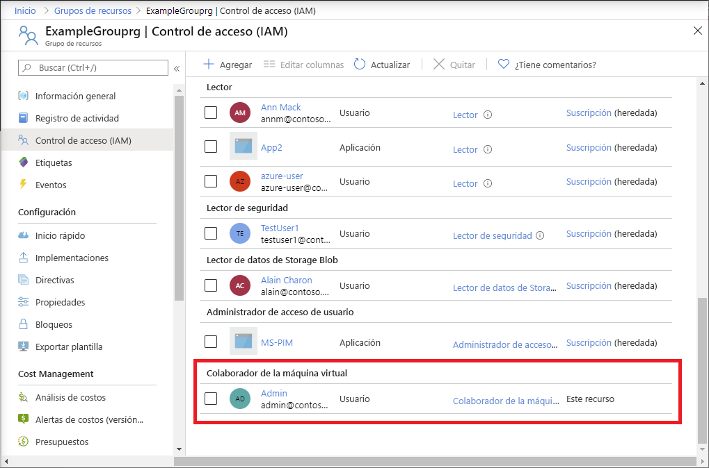

# <a name="quickstart-add-an-azure-role-assignment-using-an-arm-template"></a>Inicio rápido: Incorporación de una asignación de roles de Azure mediante una plantilla de Resource Manager

El [control de acceso basado en rol (RBAC)](overview.md) es la forma en la que se administra el acceso a los recursos de Azure. En este inicio rápido, se crea un grupo de recursos y se concede acceso a un usuario para crear y administrar máquinas virtuales en el grupo de recursos. En este inicio rápido se usa una plantilla de Azure Resource Manager para conceder el acceso.

[!INCLUDE [About Azure Resource Manager](../../includes/resource-manager-quickstart-introduction.md)]

Si su entorno cumple los requisitos previos y está familiarizado con el uso de plantillas de Resource Manager, seleccione el botón **Implementar en Azure**. La plantilla se abrirá en Azure Portal.

[](https://portal.azure.com/#create/Microsoft.Template/uri/https%3A%2F%2Fraw.githubusercontent.com%2FAzure%2Fazure-quickstart-templates%2Fmaster%2F101-rbac-builtinrole-resourcegroup%2Fazuredeploy.json)

## <a name="prerequisites"></a>Requisitos previos

Para agregar asignaciones de roles, debe tener:

- Si no tiene una suscripción a Azure, cree una [cuenta gratuita](https://azure.microsoft.com/free/?WT.mc_id=A261C142F) antes de empezar.
- Permisos `Microsoft.Authorization/roleAssignments/write` y `Microsoft.Authorization/roleAssignments/delete`, como [Administrador de acceso de usuarios](built-in-roles.md#user-access-administrator) o [propietario](built-in-roles.md#owner)
- Para agregar una asignación de roles, es preciso especificar tres elementos: entidad de seguridad, definición de roles y ámbito. En este inicio rápido, la entidad de seguridad es usted, o cualquier otro usuario de su directorio, la definición de roles es [Colaborador de máquina virtual](built-in-roles.md#virtual-machine-contributor) y el ámbito es el grupo de recursos que especifique.

## <a name="review-the-template"></a>Revisión de la plantilla

La plantilla usada en este inicio rápido forma parte de las [plantillas de inicio rápido de Azure](https://azure.microsoft.com/resources/templates/101-rbac-builtinrole-resourcegroup/). La plantilla tiene tres parámetros y una sección de recursos. En la sección de recursos, observe que tiene los tres elementos de una asignación de roles: entidad de seguridad, definición de roles y ámbito.

:::code language="json" source="~/quickstart-templates/101-rbac-builtinrole-resourcegroup/azuredeploy.json" highlight="30-32":::

El recurso definido en la plantilla es el siguiente:

- [Microsoft.Authorization/roleAssignments](/azure/templates/Microsoft.Authorization/roleAssignments)

## <a name="deploy-the-template"></a>Implementación de la plantilla

1. Inicie sesión en [Azure Portal](https://portal.azure.com).

1. Determine la dirección de correo electrónico asociada a su suscripción de Azure. O bien, determine la dirección de correo electrónico de otro usuario del directorio.

1. Abra Azure Cloud Shell para PowerShell.

1. Copie y pegue el siguiente script en Cloud Shell.

    ```azurepowershell
    $resourceGroupName = Read-Host -Prompt "Enter a resource group name (i.e. ExampleGrouprg)"
    $emailAddress = Read-Host -Prompt "Enter an email address for a user in your directory"
    $location = Read-Host -Prompt "Enter a location (i.e. centralus)"
    
    $roleAssignmentName = New-Guid
    $principalId = (Get-AzAdUser -Mail $emailAddress).id
    $roleDefinitionId = (Get-AzRoleDefinition -name "Virtual Machine Contributor").id
    $templateUri = "https://raw.githubusercontent.com/Azure/azure-quickstart-templates/master/101-rbac-builtinrole-resourcegroup/azuredeploy.json"
    
    New-AzResourceGroup -Name $resourceGroupName -Location $location
    New-AzResourceGroupDeployment -ResourceGroupName $resourceGroupName -TemplateUri $templateUri -roleAssignmentName $roleAssignmentName -roleDefinitionID $roleDefinitionId -principalId $principalId
    ```

1. Escriba un nombre de grupo de recursos, como ExampleGrouprg.

1. Escriba una dirección de correo electrónico para usted o para otro usuario en el directorio.

1. Escriba una ubicación para el grupo de recursos, como centralus.

1. Si fuera necesario, presione Entrar para ejecutar el comando New-AzResourceGroupDeployment.

    El comando [New-AzResourceGroup](/powershell/module/az.resources/new-azresourcegroup) crea un grupo de recursos, mientras que el comando [New-AzResourceGroupDeployment](/powershell/module/az.resources/new-azresourcegroupdeployment) implementa la plantilla para agregar la asignación de roles.

    Debería ver un resultado similar al siguiente:

    ```azurepowershell
    PS> New-AzResourceGroupDeployment -ResourceGroupName $resourceGroupName -TemplateUri $templateUri -roleAssignmentName $roleAssignmentName -roleDefinitionID $roleDefinitionId -principalId $principalId
    
    DeploymentName          : azuredeploy
    ResourceGroupName       : ExampleGrouprg
    ProvisioningState       : Succeeded
    Timestamp               : 5/22/2020 9:01:30 PM
    Mode                    : Incremental
    TemplateLink            :
                              Uri            : https://raw.githubusercontent.com/Azure/azure-quickstart-templates/master/101-rbac-builtinrole-resourcegroup/azuredeploy.json
                              ContentVersion : 1.0.0.0
    
    Parameters              :
                              Name                  Type                       Value
                              ====================  =========================  ==========
                              roleAssignmentName    String                     {roleAssignmentName}
                              roleDefinitionID      String                     9980e02c-c2be-4d73-94e8-173b1dc7cf3c
                              principalId           String                     {principalId}
    
    Outputs                 :
    DeploymentDebugLogLevel :
    ```

## <a name="review-deployed-resources"></a>Revisión de los recursos implementados

1. En Azure Portal, abra el grupo de recursos que ha creado.

1. En el menú de la izquierda, haga clic en **Control de acceso (IAM)** .

1. Haga clic en la pestaña **Asignaciones de roles**.

1. Compruebe que el rol **Colaborador de la máquina virtual** está asignado al usuario que ha especificado.

   

## <a name="clean-up-resources"></a>Limpieza de recursos

Para quitar la asignación de roles y el grupo de recursos que ha creado, siga estos pasos.

1. Copie y pegue el siguiente script en Cloud Shell.

    ```azurepowershell
    $emailAddress = Read-Host -Prompt "Enter the email address of the user with the role assignment to remove"
    $resourceGroupName = Read-Host -Prompt "Enter the resource group name to remove (i.e. ExampleGrouprg)"
    
    $principalId = (Get-AzAdUser -Mail $emailAddress).id
    
    Remove-AzRoleAssignment -ObjectId $principalId -RoleDefinitionName "Virtual Machine Contributor" -ResourceGroupName $resourceGroupName
    Remove-AzResourceGroup -Name $resourceGroupName
    ```
    
1. Escriba la dirección de correo electrónico del usuario con la asignación de roles que se va a quitar.

1. Escriba el nombre del grupo de recursos que va a quitar, como por ejemplo ExampleGrouprg.

1. Si fuera necesario, presione Entrar para ejecutar el comando Remove-AzResourceGroup.

1. Escriba **Y** para confirmar que desea quitar el grupo de recursos.

## <a name="next-steps"></a>Pasos siguientes

> [!div class="nextstepaction"]
> [Tutorial: Concesión de acceso de usuario a recursos de Azure mediante Azure PowerShell](tutorial-role-assignments-user-powershell.md)