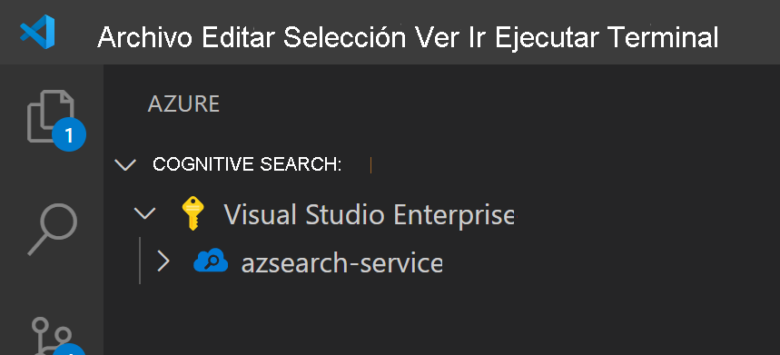
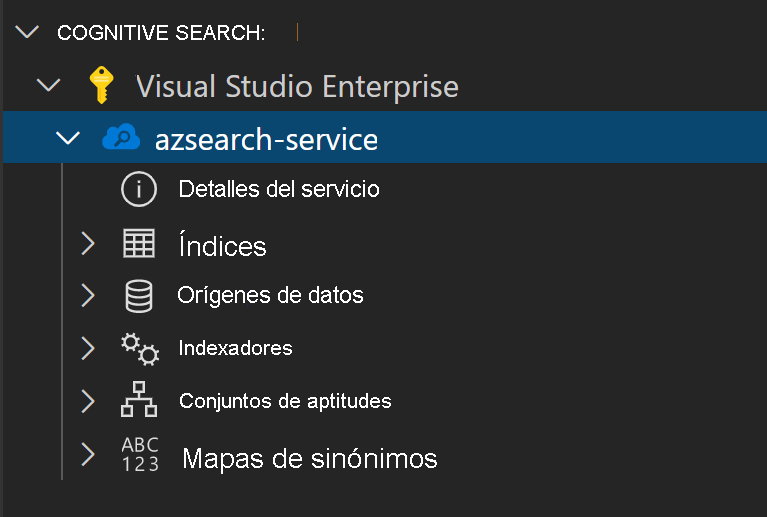
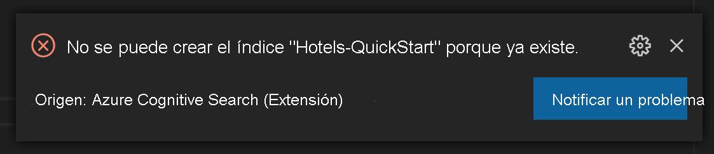
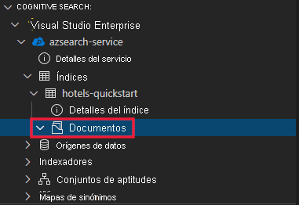
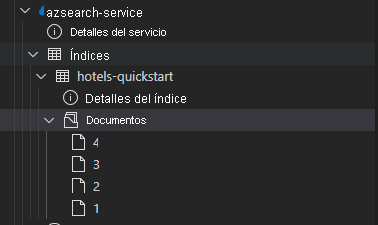
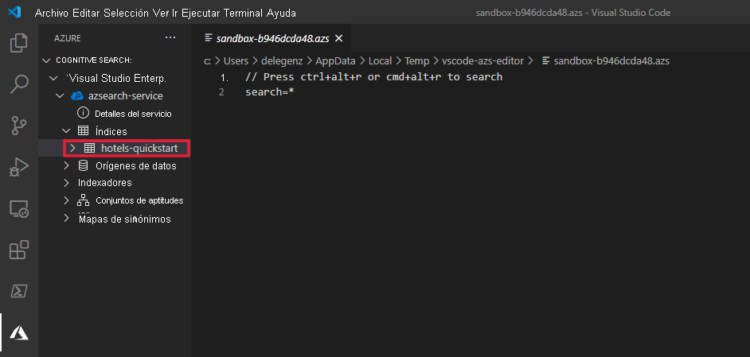

En el artículo se usa una extensión de Visual Studio Code (versión preliminar) para las API REST de Azure Cognitive Search.

> [!IMPORTANT] 
> Esta característica actualmente está en su versión preliminar pública. La funcionalidad de versión preliminar se ofrece sin un Acuerdo de Nivel de Servicio y no es aconsejable usarla para cargas de trabajo de producción. Para más información, consulte [Términos de uso complementarios de las Versiones Preliminares de Microsoft Azure](https://azure.microsoft.com/support/legal/preview-supplemental-terms/). 

## <a name="prerequisites"></a>Prerrequisitos

Para este inicio rápido, se requieren los siguientes servicios y herramientas. 

+ [Visual Studio Code](https://code.visualstudio.com/download)

+ [Azure Cognitive Search para Visual Studio Code (versión preliminar)](https://marketplace.visualstudio.com/items?itemName=ms-azuretools.vscode-azurecognitivesearch)

+ [Cree un servicio Azure Cognitive Search](../search-create-service-portal.md) o [busque uno existente](https://ms.portal.azure.com/#blade/HubsExtension/BrowseResourceBlade/resourceType/Microsoft.Search%2FsearchServices) en su suscripción actual. Puede usar un servicio gratuito para este inicio rápido. 

## <a name="copy-a-key-and-url"></a>Copia de una clave y una dirección URL

Las llamadas de REST requieren la dirección URL del servicio y una clave de acceso en cada solicitud. Con ambos se crea un servicio de búsqueda, por lo que, si ha agregado Azure Cognitive Search a su suscripción, siga estos pasos para obtener la información necesaria:

1. [Inicie sesión en Azure Portal](https://portal.azure.com/) y en la página **Introducción** del servicio de búsqueda, obtenga la dirección URL. Un punto de conexión de ejemplo podría ser similar a `https://mydemo.search.windows.net`.

1. En **Configuración** > **Claves**, obtenga una clave de administrador para tener derechos completos en el servicio. Se proporcionan dos claves de administrador intercambiables para lograr la continuidad empresarial, por si necesitara sustituir una de ellas. Puede usar la clave principal o secundaria en las solicitudes para agregar, modificar y eliminar objetos.


Todas las solicitudes requieren una clave de API en cada solicitud enviada al servicio. Tener una clave válida genera la confianza, solicitud a solicitud, entre la aplicación que envía la solicitud y el servicio que se encarga de ella.

## <a name="install-the-extension"></a>Instalación de la extensión

Para empezar, abra [VS Code](https://code.visualstudio.com). Seleccione la pestaña **Extensiones** en la barra de actividades y, a continuación, busque *Azure Cognitive Search*. Busque la extensión en los resultados de la búsqueda y seleccione **Instalar**.


Como alternativa, puede instalar la [extensión de Azure Cognitive Search](https://aka.ms/vscode-search) desde el marketplace de VS Code en un explorador web.

Si aún no lo tiene, verá una nueva pestaña de Azure en la barra de actividades.


## <a name="connect-to-your-subscription"></a>su suscripción

Seleccione **Inicie sesión en Azure...** y hágalo con su cuenta.

Aparecerán sus suscripciones. Seleccione una suscripción para ver la lista de los servicios de búsqueda de esta.



Para limitar las suscripciones que se muestran, abra la paleta de comandos (Ctrl + Mayús + P o Cmd + Mayús + P) y busque *Azure* o *Seleccionar suscripciones*. También hay comandos disponibles para iniciar y cerrar sesión en su cuenta de Azure.

Al expandir el servicio de búsqueda, verá los elementos del árbol de cada uno de los recursos de Cognitive Search: índices, orígenes de datos, indexadores, conjuntos de aptitudes y mapas de sinónimos.



Estos elementos del árbol se pueden expandir para mostrar los recursos que tenga en el servicio de búsqueda.

## <a name="1---create-an-index"></a>1 - Creación de un índice

Para empezar a trabajar con Azure Cognitive Search, primero debe crear un índice de búsqueda. Esto se hace mediante [Create Index (API REST)](/rest/api/searchservice/create-index). 

Con la extensión de VS Code, solo tiene que preocuparse por el cuerpo de la solicitud. En este inicio rápido, se proporciona una definición de índice de ejemplo y los documentos correspondientes.

### <a name="index-definition"></a>Definición de índice

La siguiente definición de índice es un esquema de ejemplo para hoteles ficticios.

La colección `fields` define la estructura de los documentos en el índice de búsqueda. Cada campo tiene un tipo de datos y un número de atributos adicionales que determina cómo se puede usar el campo.

```json
{
    "name": "hotels-quickstart",
    "fields": [
        {
            "name": "HotelId",
            "type": "Edm.String",
            "key": true,
            "filterable": true
        },
        {
            "name": "HotelName",
            "type": "Edm.String",
            "searchable": true,
            "filterable": false,
            "sortable": true,
            "facetable": false
        },
        {
            "name": "Description",
            "type": "Edm.String",
            "searchable": true,
            "filterable": false,
            "sortable": false,
            "facetable": false,
            "analyzer": "en.lucene"
        },
        {
            "name": "Description_fr",
            "type": "Edm.String",
            "searchable": true,
            "filterable": false,
            "sortable": false,
            "facetable": false,
            "analyzer": "fr.lucene"
        },
        {
            "name": "Category",
            "type": "Edm.String",
            "searchable": true,
            "filterable": true,
            "sortable": true,
            "facetable": true
        },
        {
            "name": "Tags",
            "type": "Collection(Edm.String)",
            "searchable": true,
            "filterable": true,
            "sortable": false,
            "facetable": true
        },
        {
            "name": "ParkingIncluded",
            "type": "Edm.Boolean",
            "filterable": true,
            "sortable": true,
            "facetable": true
        },
        {
            "name": "LastRenovationDate",
            "type": "Edm.DateTimeOffset",
            "filterable": true,
            "sortable": true,
            "facetable": true
        },
        {
            "name": "Rating",
            "type": "Edm.Double",
            "filterable": true,
            "sortable": true,
            "facetable": true
        },
        {
            "name": "Address",
            "type": "Edm.ComplexType",
            "fields": [
                {
                    "name": "StreetAddress",
                    "type": "Edm.String",
                    "filterable": false,
                    "sortable": false,
                    "facetable": false,
                    "searchable": true
                },
                {
                    "name": "City",
                    "type": "Edm.String",
                    "searchable": true,
                    "filterable": true,
                    "sortable": true,
                    "facetable": true
                },
                {
                    "name": "StateProvince",
                    "type": "Edm.String",
                    "searchable": true,
                    "filterable": true,
                    "sortable": true,
                    "facetable": true
                },
                {
                    "name": "PostalCode",
                    "type": "Edm.String",
                    "searchable": true,
                    "filterable": true,
                    "sortable": true,
                    "facetable": true
                },
                {
                    "name": "Country",
                    "type": "Edm.String",
                    "searchable": true,
                    "filterable": true,
                    "sortable": true,
                    "facetable": true
                }
            ]
        }
    ],
    "suggesters": [
        {
            "name": "sg",
            "searchMode": "analyzingInfixMatching",
            "sourceFields": [
                "HotelName"
            ]
        }
    ]
}
```

Para crear un índice nuevo, haga clic con el botón derecho en **Índices** y, después, seleccione **Crear nuevo índice**. Aparecerá un editor con un nombre similar a `indexes-new-28c972f661.azsindex`. 

Pegue la definición del índice anterior en la ventana. Guarde el archivo y seleccione **Cargar** cuando se le pregunte si desea actualizar el índice. Esto creará el índice y hará que esté disponible en la vista de árbol.


Si hay un problema con la definición del índice, aparecerá una ventana emergente con un mensaje de error con los detalles.



Si esto ocurre, corrija el problema y vuelva a guardar el archivo.

## <a name="2---load-documents"></a>2 - Carga de documentos

La creación del índice y su rellenado son pasos independientes. En Azure Cognitive Search, el índice contiene todos los datos que permiten búsquedas. En este escenario, los datos se proporcionan como documentos JSON. La API REST [Add, Update, or Delete Documents](/rest/api/searchservice/addupdate-or-delete-documents) (Agregar, actualizar o eliminar documentos) se usa para esta tarea. 

Para agregar nuevos documentos en VS Code:

1. Expanda el índice de `hotels-quickstart` que ha creado. Haga clic con el botón derecho en **Documentos** y seleccione **Crear nuevo documento**.

    

2. Se abrirá un editor de JSON que ha deducido el esquema del índice.

    

3. Pegue el código JSON siguiente y, después, guarde el archivo. Aparecerá un cuadro emergente que le pedirá que confirme los cambios. Seleccione **Cargar** para guardar los cambios.

    ```json
    {
        "HotelId": "1",
        "HotelName": "Secret Point Motel",
        "Description": "The hotel is ideally located on the main commercial artery of the city in the heart of New York. A few minutes away is Time's Square and the historic centre of the city, as well as other places of interest that make New York one of America's most attractive and cosmopolitan cities.",
        "Category": "Boutique",
        "Tags": [ "pool", "air conditioning", "concierge" ],
        "ParkingIncluded": false,
        "LastRenovationDate": "1970-01-18T00:00:00Z",
        "Rating": 3.60,
        "Address": {
            "StreetAddress": "677 5th Ave",
            "City": "New York",
            "StateProvince": "NY",
            "PostalCode": "10022",
            "Country": "USA"
        } 
    }
    ```

4. Repita este proceso para los tres documentos restantes.

    Documento 2:
    ```json
    {
        "HotelId": "2",
        "HotelName": "Twin Dome Motel",
        "Description": "The hotel is situated in a  nineteenth century plaza, which has been expanded and renovated to the highest architectural standards to create a modern, functional and first-class hotel in which art and unique historical elements coexist with the most modern comforts.",
        "Category": "Boutique",
        "Tags": [ "pool", "free wifi", "concierge" ],
        "ParkingIncluded": false,
        "LastRenovationDate": "1979-02-18T00:00:00Z",
        "Rating": 3.60,
        "Address": {
            "StreetAddress": "140 University Town Center Dr",
            "City": "Sarasota",
            "StateProvince": "FL",
            "PostalCode": "34243",
            "Country": "USA"
        } 
    }
    ```

    Documento 3:
    ```json
    {
        "HotelId": "3",
        "HotelName": "Triple Landscape Hotel",
        "Description": "The Hotel stands out for its gastronomic excellence under the management of William Dough, who advises on and oversees all of the Hotel’s restaurant services.",
        "Category": "Resort and Spa",
        "Tags": [ "air conditioning", "bar", "continental breakfast" ],
        "ParkingIncluded": true,
        "LastRenovationDate": "2015-09-20T00:00:00Z",
        "Rating": 4.80,
        "Address": {
            "StreetAddress": "3393 Peachtree Rd",
            "City": "Atlanta",
            "StateProvince": "GA",
            "PostalCode": "30326",
            "Country": "USA"
        } 
    }
    ```

    Documento 4:
    ```json
    {
        "HotelId": "4",
        "HotelName": "Sublime Cliff Hotel",
        "Description": "Sublime Cliff Hotel is located in the heart of the historic center of Sublime in an extremely vibrant and lively area within short walking distance to the sites and landmarks of the city and is surrounded by the extraordinary beauty of churches, buildings, shops and monuments. Sublime Cliff is part of a lovingly restored 1800 palace.",
        "Category": "Boutique",
        "Tags": [ "concierge", "view", "24-hour front desk service" ],
        "ParkingIncluded": true,
        "LastRenovationDate": "1960-02-06T00:00:00Z",
        "Rating": 4.60,
        "Address": {
            "StreetAddress": "7400 San Pedro Ave",
            "City": "San Antonio",
            "StateProvince": "TX",
            "PostalCode": "78216",
            "Country": "USA"
        }
    }
    ```

En este punto, debería ver los cuatro documentos disponibles en la sección de documentos.



## <a name="3---search-an-index"></a>3 - Búsqueda en un índice

Una vez que se haya cargado el índice y el conjunto de documentos, puede realizar consultas en ellos mediante [Documentos de búsqueda (API REST)](/rest/api/searchservice/search-documents).

Para hacer esto en VS Code:

1. Haga clic con el botón derecho en el índice en el que quiera realizar la búsqueda y seleccione **Índice de búsqueda**. Esto hará que se abra un editor con un nombre similar a `sandbox-b946dcda48.azs`.

    

2. Una consulta simple se rellena automáticamente. Presione **Ctrl+Alt+R** o **Cmd+Alt+R** para enviar la consulta. Los resultados aparecerán en una ventana a la izquierda.

    


### <a name="example-queries"></a>Consultas de ejemplo

Pruebe con algunos otros ejemplos de consultas para hacerse una idea de la sintaxis. A continuación hay cuatro consultas adicionales para que las pruebe. Puede agregar varias consultas al mismo editor. Cuando presiona **Ctrl+Alt+R** o **Cmd+Alt+R**, la línea del cursor determina qué consulta se enviará.


En la primera consulta, buscamos `boutique` y `select` solo algunos campos. Es aconsejable usar `select` solo en los campos en que sea necesario, ya que la extracción de datos innecesarios puede agregar latencia a las consultas. La consulta también establece `$count=true` para devolver el número total de resultados junto con los resultados de la búsqueda.

```
// Query example 1 - Search `boutique` with select and return count
search=boutique&$count=true&$select=HotelId,HotelName,Rating,Category
```

En la siguiente consulta, se especifica el término de búsqueda `wifi` y también se incluye un filtro para que se devuelvan solo los resultados en los que el estado sea igual a `'FL'`. Los resultados también se ordenan por el valor de `Rating` del hotel.

```
// Query example 2 - Search with filter, orderBy, select, and count
search=wifi&$filter=Address/StateProvince eq 'FL'&$select=HotelId,HotelName,Rating&$orderby=Rating desc
```

Luego, la búsqueda se limita a un único campo mediante el uso del parámetro `searchFields`. Esta es una excelente opción si desea que la consulta sea más eficaz, pero solo si sabe que está interesado en las coincidencias de determinados campos.

```
// Query example 3 - Limit searchFields
search=submlime cliff&$select=HotelId,HotelName,Rating&searchFields=HotelName
```

Otra opción común que se incluye en las consultas es `facets`. Las facetas le permiten crear filtros en la interfaz de usuario, con el fin de que los usuarios sepan fácilmente por qué valores pueden filtrar.

```
// Query example 4 - Take the top two results, and show only HotelName and Category in the results
search=*&$select=HotelId,HotelName,Rating&searchFields=HotelName&facet=Category
```

## <a name="open-index-in-the-portal"></a>Abrir el índice en el portal

Si desea ver el servicio de búsqueda en el portal, haga clic con el botón derecho en el nombre del servicio de búsqueda y seleccione **Abrir en el portal**. Esto le llevará al servicio de búsqueda de Azure Portal.