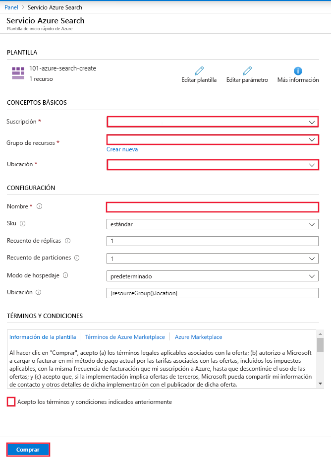

# Inicio rápido: Implementación de Cognitive Search con una plantilla de ARM

Este artículo le guiará por el proceso de uso de una plantilla de Azure Resource Manager (plantilla de ARM) para implementar un recurso de Azure Cognitive Search en Azure Portal.

[!INCLUDE [About Azure Resource Manager](../../includes/resource-manager-quickstart-introduction.md)]

Si su entorno cumple los requisitos previos y está familiarizado con el uso de plantillas de Resource Manager, seleccione el botón **Implementar en Azure**. La plantilla se abrirá en Azure Portal.

## Requisitos previos

Si no tiene una suscripción a Azure, cree una [cuenta gratuita](https://azure.microsoft.com/free/?WT.mc_id=A261C142F) antes de empezar.

## Revisión de la plantilla

La plantilla usada en este inicio rápido forma parte de las [plantillas de inicio rápido de Azure](https://azure.microsoft.com/resources/templates/101-azure-search-create/).

:::code language="json"source="~/quickstart-templates/101-azure-search-create/azuredeploy.json":::

El recurso de Azure definido en esta plantilla:

- [Microsoft. Search/searchServices](/azure/templates/Microsoft.Search/searchServices): creación de un servicio Azure Cognitive Search

## Implementación de la plantilla

Seleccione la imagen siguiente para iniciar sesión en Azure y abrir una plantilla. La plantilla crea un recurso de Azure Cognitive Search.

El portal muestra un formulario que le permite proporcionar fácilmente los valores de parámetros. Algunos parámetros se rellenan previamente con los valores predeterminados de la plantilla. Tendrá que proporcionar la suscripción, el grupo de recursos, la ubicación y el nombre del servicio. Si desea usar Cognitive Services en una canalización de [enriquecimiento con IA](cognitive-search-concept-intro.md), por ejemplo, para analizar archivos de imagen binarios para el texto, elija una ubicación que ofrezca Cognitive Search y Cognitive Services. Ambos servicios deben estar en la misma región para cargas de trabajo de enriquecimiento con inteligencia artificial. Una vez que haya completado el formulario, deberá aceptar los términos y condiciones y, a continuación, seleccionar el botón de compra para completar la implementación.

> [!div class="mx-imgBorder"]
> 

## Revisión de los recursos implementados

Una vez completada la implementación, puede tener acceso al nuevo grupo de recursos y al nuevo servicio de búsqueda en el portal.

## Limpieza de recursos

Otros artículos de inicio rápido y tutoriales de Cognitive Search se basan este. Si tiene pensado seguir trabajando en otros artículos de inicio rápido y tutoriales, considere la posibilidad de dejar este recurso activo. Cuando ya no lo necesite, elimine el grupo de recursos; de este modo, se eliminarán también el servicio Cognitive Search y los recursos relacionados.

## Pasos siguientes

En este inicio rápido, ha creado un servicio Cognitive Search mediante una plantilla de ARM y ha validado la implementación. Para más información sobre Cognitive Search y Azure Resource Manager, continúe con los artículos siguientes.

- [Introducción a Azure Cognitive Search](search-what-is-azure-search.md).
- [Creación de un índice](search-get-started-portal.md) para el servicio de búsqueda.
- [Creación de una aplicación de demostración](search-create-app-portal.md) mediante el asistente del portal.
- [Creación de un conjunto de aptitudes](cognitive-search-quickstart-blob.md) para extraer información de los datos.
