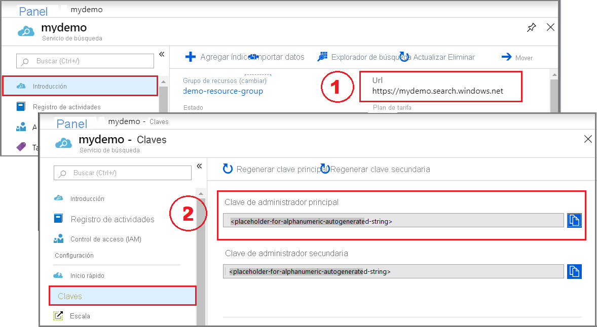

# <a name="quickstart-create-an-azure-cognitive-search-index-in-python-using-jupyter-notebooks"></a>Inicio rápido: Creación de un índice de Azure Cognitive Search en Python mediante Jupyter Notebook

> [!div class="op_single_selector"]
> * [Python](search-get-started-python.md)
> * [PowerShell (REST)](./search-get-started-powershell.md)
> * [C#](./search-get-started-dotnet.md)
> * [REST](search-get-started-rest.md)
> * [Portal](search-get-started-portal.md)
>

Compile un cuaderno de Jupyter Notebook que cree, cargue y consulte un índice de Azure Cognitive Search mediante Python y la [biblioteca azure-search-documents](/python/api/overview/azure/search-documents-readme) del SDK de Azure para Python. En este artículo se explica cómo crear un cuaderno paso a paso. Como alternativa, puede [descargar y ejecutar un cuaderno de Jupyter Python finalizado](https://github.com/Azure-Samples/azure-search-python-samples).

Si no tiene una suscripción a Azure, cree una [cuenta gratuita](https://azure.microsoft.com/free/?WT.mc_id=A261C142F) antes de empezar.

## <a name="prerequisites"></a>Prerrequisitos

Para este inicio rápido, se requieren los siguientes servicios y herramientas.

* [Anaconda 3.x](https://www.anaconda.com/distribution/#download-section), que proporciona Python 3.x y Jupyter Notebook.

* [Paquete azure-search-documents](https://pypi.org/project/azure-search-documents/)

* [Cree un servicio Azure Cognitive Search](search-create-service-portal.md) o [busque uno existente](https://ms.portal.azure.com/#blade/HubsExtension/BrowseResourceBlade/resourceType/Microsoft.Search%2FsearchServices) en su suscripción actual. Puede usar el nivel Gratis para este inicio rápido. 

## <a name="copy-a-key-and-url"></a>Copia de una clave y una dirección URL

Las llamadas de REST requieren la dirección URL del servicio y una clave de acceso en cada solicitud. Con ambos se crea un servicio de búsqueda, por lo que, si ha agregado Azure Cognitive Search a su suscripción, siga estos pasos para obtener la información necesaria:

1. [Inicie sesión en Azure Portal](https://portal.azure.com/) y en la página **Introducción** del servicio de búsqueda, obtenga la dirección URL. Un punto de conexión de ejemplo podría ser similar a `https://mydemo.search.windows.net`.

1. En **Configuración** > **Claves**, obtenga una clave de administrador para tener derechos completos en el servicio. Se proporcionan dos claves de administrador intercambiables para lograr la continuidad empresarial, por si necesitara sustituir una de ellas. Puede usar la clave principal o secundaria en las solicitudes para agregar, modificar y eliminar objetos.



Todas las solicitudes requieren una clave de API en cada solicitud enviada al servicio. Tener una clave válida genera la confianza, solicitud a solicitud, entre la aplicación que envía la solicitud y el servicio que se encarga de ella.

## <a name="connect-to-azure-cognitive-search"></a>Conexión a Azure Cognitive Search

En esta tarea, inicie un cuaderno de Jupyter Notebook y compruebe que puede conectarse a Azure Cognitive Search. Para ello, solicite una lista de índices de su servicio. En Windows con Anaconda3, puede utilizar el navegador de Anaconda para iniciar un cuaderno.

1. Cree un cuaderno de Python3.

1. En la primera celda, cargue las bibliotecas del SDK de Azure para Python, incluida [azure-search-documents](/python/api/azure-search-documents).

   ```python
    !pip install azure-search-documents --pre
    !pip show azure-search-documents

    import os
    from azure.core.credentials import AzureKeyCredential
    from azure.search.documents.indexes import SearchIndexClient 
    from azure.search.documents import SearchClient
    from azure.search.documents.indexes.models import (
        ComplexField,
        CorsOptions,
        SearchIndex,
        ScoringProfile,
        SearchFieldDataType,
        SimpleField,
        SearchableField
    )
   ```

1. En la segunda celda, introduzca los elementos de solicitud que serán constantes en cada solicitud. Proporcione el nombre del servicio de búsqueda, la clave de API de administración y la clave de API de consulta, las cuales copió en un paso anterior. Esta celda también configura los clientes que se usarán para operaciones específicas: [SearchIndexClient](/python/api/azure-search-documents/azure.search.documents.indexes.searchindexclient) crear un índice y [SearchClient](/python/api/azure-search-documents/azure.search.documents.searchclient) para consultar un índice.

   ```python
    service_name = ["SEARCH_ENDPOINT - do not include search.windows.net"]
    admin_key = ["Cognitive Search Admin API Key"]

    index_name = "hotels-quickstart"

    # Create an SDK client
    endpoint = "https://{}.search.windows.net/".format(service_name)
    admin_client = SearchIndexClient(endpoint=endpoint,
                          index_name=index_name,
                          credential=AzureKeyCredential(admin_key))

    search_client = SearchClient(endpoint=endpoint,
                          index_name=index_name,
                          credential=AzureKeyCredential(admin_key))
   ```

1. En la tercera celda, ejecute una operación delete_index para borrar el servicio de los índices *hotels-quickstart* existentes. La eliminación del índice permite crear otro índice *hotels-quickstart* con el mismo nombre.

   ```python
    try:
        result = admin_client.delete_index(index_name)
        print ('Index', index_name, 'Deleted')
    except Exception as ex:
        print (ex)
   ```

1. Ejecute cada paso.

## <a name="1---create-an-index"></a>1 - Creación de un índice

Los elementos necesarios de un índice incluyen un nombre, una colección de campos y una clave. La colección de campos define la estructura de un *documento de búsqueda* lógico, que se usa para cargar datos y devolver resultados. 

Cada campo tiene un nombre, un tipo y unos atributos que determinan cómo se usa el campo (por ejemplo, si es texto completo que se puede buscar, filtrar o recuperar en los resultados de búsqueda). Dentro de un índice, uno de los campos de tipo `Edm.String` se debe designar como la *clave* para la identidad del documento.

Este índice se denomina "hotels-quickstart" y tiene las definiciones de campo que aparecen a continuación. Es un subconjunto de un [índice de hoteles](https://github.com/Azure-Samples/azure-search-sample-data/blob/master/hotels/Hotels_IndexDefinition.JSON) mayor usado en otros tutoriales. Lo hemos acortado en este inicio rápido para mayor brevedad.

1. En la siguiente celda, pegue el siguiente ejemplo en una celda para proporcionar el esquema.

    ```python
    name = index_name
    fields = [
            SimpleField(name="HotelId", type=SearchFieldDataType.String, key=True),
            SearchableField(name="HotelName", type=SearchFieldDataType.String, sortable=True),
            SearchableField(name="Description", type=SearchFieldDataType.String, analyzer_name="en.lucene"),
            SearchableField(name="Description_fr", type=SearchFieldDataType.String, analyzer_name="fr.lucene"),
            SearchableField(name="Category", type=SearchFieldDataType.String, facetable=True, filterable=True, sortable=True),

            SearchableField(name="Tags", collection=True, type=SearchFieldDataType.String, facetable=True, filterable=True),

            SimpleField(name="ParkingIncluded", type=SearchFieldDataType.Boolean, facetable=True, filterable=True, sortable=True),
            SimpleField(name="LastRenovationDate", type=SearchFieldDataType.DateTimeOffset, facetable=True, filterable=True, sortable=True),
            SimpleField(name="Rating", type=SearchFieldDataType.Double, facetable=True, filterable=True, sortable=True),

            ComplexField(name="Address", fields=[
                SearchableField(name="StreetAddress", type=SearchFieldDataType.String),
                SearchableField(name="City", type=SearchFieldDataType.String, facetable=True, filterable=True, sortable=True),
                SearchableField(name="StateProvince", type=SearchFieldDataType.String, facetable=True, filterable=True, sortable=True),
                SearchableField(name="PostalCode", type=SearchFieldDataType.String, facetable=True, filterable=True, sortable=True),
                SearchableField(name="Country", type=SearchFieldDataType.String, facetable=True, filterable=True, sortable=True),
            ])
        ]
    cors_options = CorsOptions(allowed_origins=["*"], max_age_in_seconds=60)
    scoring_profiles = []
    suggester = [{'name': 'sg', 'source_fields': ['Tags', 'Address/City', 'Address/Country']}]
    ```

1. En otra celda, formule la solicitud. Esta solicitud create_index tiene como destino la colección de índices de su servicio de búsqueda y crea un [SearchIndex](/python/api/azure-search-documents/azure.search.documents.indexes.models.searchindex) en función del esquema de índice proporcionado en la celda anterior.

   ```python
    index = SearchIndex(
        name=name,
        fields=fields,
        scoring_profiles=scoring_profiles,
        suggesters = suggester,
        cors_options=cors_options)

    try:
        result = admin_client.create_index(index)
        print ('Index', result.name, 'created')
    except Exception as ex:
        print (ex)
   ```

1. Ejecute cada paso.

<a name="load-documents"></a>

## <a name="2---load-documents"></a>2 - Carga de documentos

Para cargar documentos, cree una colección de documentos mediante una [acción de índice](/python/api/azure-search-documents/azure.search.documents.models.indexaction) para el tipo de operación (carga, combinación y carga, etc.). Los documentos se originan en [HotelsData](https://github.com/Azure-Samples/azure-search-sample-data/blob/master/hotels/HotelsData_toAzureSearch.JSON) en GitHub.

1. En una celda nueva, proporcione cuatro documentos que se ajusten al esquema de índice. Especifique una acción de carga para cada documento.

    ```python
    documents = {
        "value": [
        {
        "@search.action": "upload",
        "HotelId": "1",
        "HotelName": "Secret Point Motel",
        "Description": "The hotel is ideally located on the main commercial artery of the city in the heart of New York. A few minutes away is Time's Square and the historic centre of the city, as well as other places of interest that make New York one of America's most attractive and cosmopolitan cities.",
        "Description_fr": "L'hôtel est idéalement situé sur la principale artère commerciale de la ville en plein cœur de New York. A quelques minutes se trouve la place du temps et le centre historique de la ville, ainsi que d'autres lieux d'intérêt qui font de New York l'une des villes les plus attractives et cosmopolites de l'Amérique.",
        "Category": "Boutique",
        "Tags": [ "pool", "air conditioning", "concierge" ],
        "ParkingIncluded": "false",
        "LastRenovationDate": "1970-01-18T00:00:00Z",
        "Rating": 3.60,
        "Address": {
            "StreetAddress": "677 5th Ave",
            "City": "New York",
            "StateProvince": "NY",
            "PostalCode": "10022",
            "Country": "USA"
            }
        },
        {
        "@search.action": "upload",
        "HotelId": "2",
        "HotelName": "Twin Dome Motel",
        "Description": "The hotel is situated in a  nineteenth century plaza, which has been expanded and renovated to the highest architectural standards to create a modern, functional and first-class hotel in which art and unique historical elements coexist with the most modern comforts.",
        "Description_fr": "L'hôtel est situé dans une place du XIXe siècle, qui a été agrandie et rénovée aux plus hautes normes architecturales pour créer un hôtel moderne, fonctionnel et de première classe dans lequel l'art et les éléments historiques uniques coexistent avec le confort le plus moderne.",
        "Category": "Boutique",
        "Tags": [ "pool", "free wifi", "concierge" ],
        "ParkingIncluded": "false",
        "LastRenovationDate": "1979-02-18T00:00:00Z",
        "Rating": 3.60,
        "Address": {
            "StreetAddress": "140 University Town Center Dr",
            "City": "Sarasota",
            "StateProvince": "FL",
            "PostalCode": "34243",
            "Country": "USA"
            }
        },
        {
        "@search.action": "upload",
        "HotelId": "3",
        "HotelName": "Triple Landscape Hotel",
        "Description": "The Hotel stands out for its gastronomic excellence under the management of William Dough, who advises on and oversees all of the Hotel's restaurant services.",
        "Description_fr": "L'hôtel est situé dans une place du XIXe siècle, qui a été agrandie et rénovée aux plus hautes normes architecturales pour créer un hôtel moderne, fonctionnel et de première classe dans lequel l'art et les éléments historiques uniques coexistent avec le confort le plus moderne.",
        "Category": "Resort and Spa",
        "Tags": [ "air conditioning", "bar", "continental breakfast" ],
        "ParkingIncluded": "true",
        "LastRenovationDate": "2015-09-20T00:00:00Z",
        "Rating": 4.80,
        "Address": {
            "StreetAddress": "3393 Peachtree Rd",
            "City": "Atlanta",
            "StateProvince": "GA",
            "PostalCode": "30326",
            "Country": "USA"
            }
        },
        {
        "@search.action": "upload",
        "HotelId": "4",
        "HotelName": "Sublime Cliff Hotel",
        "Description": "Sublime Cliff Hotel is located in the heart of the historic center of Sublime in an extremely vibrant and lively area within short walking distance to the sites and landmarks of the city and is surrounded by the extraordinary beauty of churches, buildings, shops and monuments. Sublime Cliff is part of a lovingly restored 1800 palace.",
        "Description_fr": "Le sublime Cliff Hotel est situé au coeur du centre historique de sublime dans un quartier extrêmement animé et vivant, à courte distance de marche des sites et monuments de la ville et est entouré par l'extraordinaire beauté des églises, des bâtiments, des commerces et Monuments. Sublime Cliff fait partie d'un Palace 1800 restauré avec amour.",
        "Category": "Boutique",
        "Tags": [ "concierge", "view", "24-hour front desk service" ],
        "ParkingIncluded": "true",
        "LastRenovationDate": "1960-02-06T00:00:00Z",
        "Rating": 4.60,
        "Address": {
            "StreetAddress": "7400 San Pedro Ave",
            "City": "San Antonio",
            "StateProvince": "TX",
            "PostalCode": "78216",
            "Country": "USA"
            }
        }
    ]
    }
    ```  

1. En otra celda, formule la solicitud. Esta solicitud upload_documents tiene como destino la colección de documentos del índice hotels-quickstart y envía los documentos proporcionados en el paso anterior al índice de Cognitive Search.


   ```python
    try:
        result = search_client.upload_documents(documents=documents)
        print("Upload of new document succeeded: {}".format(result[0].succeeded))
    except Exception as ex:
        print (ex.message)
   ```

1. Ejecute cada paso para insertar los documentos en un índice en el servicio de búsqueda.

## <a name="3---search-an-index"></a>3 - Búsqueda en un índice

Este paso muestra cómo realizar consultas en un índice con la [API de REST de Buscar documentos](/rest/api/searchservice/search-documents).

1. Para esta operación, utilice search_client. Esta cadena ejecuta una búsqueda vacía (`search=*`), que devuelve una lista no clasificada (puntuación de búsqueda = 1,0) de documentos arbitrarios. Dado que no hay ningún criterio, en los resultados se incluyen todos los documentos. Esta consulta imprime solo dos de los campos en cada documento. También agrega `include_total_count=True` para obtener un recuento de todos los documentos (4) en los resultados.

   ```python
    results =  search_client.search(search_text="*", include_total_count=True)

    print ('Total Documents Matching Query:', results.get_count())
    for result in results:
        print("{}: {}".format(result["HotelId"], result["HotelName"]))
   ```

1. La siguiente consulta agrega términos completos a la expresión de búsqueda ("wifi"). Esta consulta especifica que los resultados contienen solo los campos de la instrucción `select`. La limitación de los campos que se devuelven reduce la cantidad de datos que se envían mediante la conexión y reduce la latencia de búsqueda.

   ```python
    results =  search_client.search(search_text="wifi", include_total_count=True, select='HotelId,HotelName,Tags')

    print ('Total Documents Matching Query:', results.get_count())
    for result in results:
        print("{}: {}: {}".format(result["HotelId"], result["HotelName"], result["Tags"]))
   ```

1. A continuación, aplique una expresión de filtro que devuelva solo aquellos hoteles con una clasificación superior a 4 en orden descendente.

   ```python
    results =  search_client.search(search_text="hotels", select='HotelId,HotelName,Rating', filter='Rating gt 4', order_by='Rating desc')

    for result in results:
        print("{}: {} - {} rating".format(result["HotelId"], result["HotelName"], result["Rating"]))
   ```

1. Agregue `search_fields` para delimitar el ámbito de la consulta a un solo campo.

   ```python
    results =  search_client.search(search_text="sublime", search_fields='HotelName', select='HotelId,HotelName')

    for result in results:
        print("{}: {}".format(result["HotelId"], result["HotelName"]))
   ```

1. Las facetas son etiquetas que se pueden usar para crear una estructura de navegación. Esta consulta devuelve las facetas y los recuentos de la categoría.

   ```python
    results =  search_client.search(search_text="*", facets=["Category"])

    facets = results.get_facets()

    for facet in facets["Category"]:
        print("    {}".format(facet))
   ```

1. En este ejemplo se busca un documento específico por su clave. Normalmente, querrá devolver un documento cuando un usuario haga clic en un documento de un resultado de búsqueda.

   ```python
    result = search_client.get_document(key="3")

    print("Details for hotel '3' are:")
    print("        Name: {}".format(result["HotelName"]))
    print("      Rating: {}".format(result["Rating"]))
    print("    Category: {}".format(result["Category"]))
   ```

1. En este ejemplo usaremos la función autocompletar. Normalmente se usa en los cuadros de búsqueda para ayudar a autocompletar posibles coincidencias a medida que el usuario escribe en el cuadro de búsqueda.

   Cuando se creó el índice, también se creó un proveedor de sugerencias denominado "sg" como parte de la solicitud. Una definición de proveedor de sugerencias especifica qué campos se pueden usar para buscar posibles coincidencias en las solicitudes de este. En este ejemplo, los campos son "Tags", "Address/City", "Address/Country". Para simular la función autocompletar, pase las letras "sa" como cadena parcial. El método autocompletar de [SearchClient](/python/api/azure-search-documents/azure.search.documents.searchclient) devuelve posibles coincidencias de términos.

   ```python
    search_suggestion = 'sa'
    results = search_client.autocomplete(search_text=search_suggestion, suggester_name="sg", mode='twoTerms')

    print("Autocomplete for:", search_suggestion)
    for result in results:
        print (result['text'])
   ```

## <a name="clean-up"></a>Limpieza

Al trabajar en una suscripción propia, se recomienda identificar al final de un proyecto si aún necesita los recursos creados. Los recursos que se dejan en ejecución pueden costarle mucho dinero. Puede eliminar los recursos de forma individual o eliminar el grupo de recursos para eliminar todo el conjunto de recursos.

Puede encontrar y administrar recursos en el portal, mediante el vínculo **Todos los recursos** o **Grupos de recursos** en el panel de navegación izquierdo.

Si está usando un servicio gratuito, recuerde que está limitado a tres índices, indexadores y orígenes de datos. Puede eliminar elementos individuales en el portal para mantenerse por debajo del límite. 

## <a name="next-steps"></a>Pasos siguientes

Como simplificación, este tutorial de rápido usa una versión abreviada del índice de hoteles. Puede crear la versión completa para realizar más consultas interesantes. Para obtener la versión completa y los 50 documentos, ejecute el asistente **Importar datos** y seleccione *hotels-sample* en los orígenes de datos de ejemplo integrados.

> [!div class="nextstepaction"]
> [Inicio rápido: Creación de un índice de Azure Search en Azure Portal](search-get-started-portal.md)