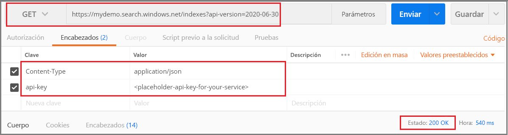

# <a name="tutorial-create-a-custom-analyzer-for-phone-numbers"></a>Tutorial: Creación de un analizador personalizado para números de teléfono

Los [analizadores](search-analyzers.md) son un componente clave en cualquier solución de búsqueda. Para mejorar la calidad de los resultados de la búsqueda, es importante comprender cómo funcionan los analizadores y cómo afectan a estos resultados.

En algunos casos, por ejemplo en un campo de texto sin formato, basta con seleccionar el [analizador de idioma](index-add-language-analyzers.md) correcto para mejorar los resultados de la búsqueda. Sin embargo, algunos escenarios, como la búsqueda precisa de números de teléfono, direcciones URL o correos electrónicos, pueden requerir el uso de analizadores personalizados.

En este tutorial se usan las [API REST](https://docs.microsoft.com/rest/api/searchservice/) de Postman y de Azure Cognitive Search para:

> [!div class="checklist"]
> * Explicar el funcionamiento de los analizadores
> * Definir un analizador personalizado para la búsqueda de números de teléfono
> * Probar el modo en que el analizador personalizado tokeniza el texto
> * Crear analizadores independientes para la indexación y búsqueda a fin de mejorar aún más los resultados

## <a name="prerequisites"></a>Requisitos previos

Este tutorial requiere los siguientes servicios y herramientas:

+ [Aplicación de escritorio Postman](https://www.getpostman.com/)
+ [Creación](search-create-service-portal.md) o [búsqueda de un servicio de búsqueda existente](https://ms.portal.azure.com/#blade/HubsExtension/BrowseResourceBlade/resourceType/Microsoft.Search%2FsearchServices)

## <a name="download-files"></a>Descarga de archivos

El código fuente de este tutorial está disponible en la carpeta [custom-analyzers](https://github.com/Azure-Samples/azure-search-postman-samples/custom-analyzers) del repositorio de GitHub [Azure-Samples/azure-search-postman-samples](https://github.com/Azure-Samples/azure-search-postman-samples).

## <a name="1---create-azure-cognitive-search-service"></a>1\. Creación del servicio Azure Cognitive Search

Para finalizar este tutorial, necesitará un servicio Azure Cognitive Search, que puede [crear en el portal](search-create-service-portal.md). Puede usar el nivel Gratis para completar este tutorial.

En el paso siguiente, deberá conocer el nombre del servicio de búsqueda y su clave de API. Si duda de cómo encontrar esos elementos, consulte este [inicio rápido](search-create-service-portal.md#get-a-key-and-url-endpoint).


## <a name="2---set-up-postman"></a>2: Configuración de Postman

A continuación, inicie Postman e importe la recopilación que descargó de [Azure-samples/Azure-Search-Postman-samples](https://github.com/Azure-Samples/azure-search-postman-samples).

Para importar la recopilación, vaya a **Archivos** > **Importar** y, a continuación, seleccione el archivo de recopilación que desee importar.

Para cada solicitud:

1. Reemplace `<YOUR-SEARCH-SERVICE>` por el nombre del servicio de búsqueda.

1. Reemplace `<YOUR-ADMIN-API-KEY>` por la clave principal o secundaria del servicio de búsqueda.

  

Si no conoce esta herramienta, consulte [Exploración de las API REST de Azure Cognitive Search mediante Postman](search-get-started-postman.md).

## <a name="3---create-an-initial-index"></a>3\. Creación de un índice inicial

En este paso, se creará un índice inicial, se cargarán documentos en el índice y, a continuación, se consultarán para ver cómo se realizan nuestras búsquedas iniciales.

### <a name="create-index"></a>Crear índice

Comenzaremos por crear un índice simple denominado `tutorial-basic-index` con dos campos: `id` y `phone_number`. Todavía no se ha definido un analizador, por lo que se usará el analizador `standard.lucene` de forma predeterminada.

Para crear el índice, se envía la solicitud siguiente:

```http
PUT https://<YOUR-SEARCH-SERVICE-NAME>.search.windows.net/indexes/tutorial-basic-index?api-version=2019-05-06
  Content-Type: application/json
  api-key: <YOUR-ADMIN-API-KEY>

  {
    "fields": [
      {
        "name": "id",
        "type": "Edm.String",
        "key": true,
        "searchable": true,
        "filterable": false,
        "facetable": false,
        "sortable": true
      },
      {
        "name": "phone_number",
        "type": "Edm.String",
        "sortable": false,
        "searchable": true,
        "filterable": false,
        "facetable": false
      }
    ]
  }
```

### <a name="load-data"></a>Cargar datos

A continuación, se cargan los datos en el índice. En algunos casos, es posible que no tenga control sobre el formato de los números de teléfono ingeridos, por lo que probaremos con distintos tipos de formatos. Idealmente, una solución de búsqueda devolverá todos los números de teléfono coincidentes independientemente de su formato.

Los datos se cargan en el índice con la solicitud siguiente: 

```http
POST https://<YOUR-SEARCH-SERVICE-NAME>.search.windows.net/indexes/tutorial-basic-index/docs/index?api-version=2019-05-06
  Content-Type: application/json
  api-key: <YOUR-ADMIN-API-KEY>

  {
    "value": [
      {
        "@search.action": "upload",  
        "id": "1",
        "phone_number": "425-555-0100"
      },
      {
        "@search.action": "upload",  
        "id": "2",
        "phone_number": "(321) 555-0199"
      },
      {  
        "@search.action": "upload",  
        "id": "3",
        "phone_number": "+1 425-555-0100"
      },
      {  
        "@search.action": "upload",  
        "id": "4",  
        "phone_number": "+1 (321) 555-0199"
      },
      {
        "@search.action": "upload",  
        "id": "5",
        "phone_number": "4255550100"
      },
      {
        "@search.action": "upload",  
        "id": "6",
        "phone_number": "13215550199"
      },
      {
        "@search.action": "upload",  
        "id": "7",
        "phone_number": "425 555 0100"
      },
      {
        "@search.action": "upload",  
        "id": "8",
        "phone_number": "321.555.0199"
      }
    ]  
  }
```

Con los datos del índice, estamos listos para empezar a buscar.

### <a name="search"></a>Search

Para que la búsqueda sea intuitiva, es mejor no esperar a que los usuarios apliquen formato a las consultas de una forma específica. Un usuario podría buscar `(425) 555-0100` en cualquiera de los formatos mostrados anteriormente y seguir esperando que se devuelvan los resultados. En este paso, probaremos un par de consultas de ejemplo para ver cómo funcionan.

Comenzamos buscando `(425) 555-0100`:

```http
GET https://<YOUR-SEARCH-SERVICE-NAME>.search.windows.net/indexes/tutorial-basic-index/docs?api-version=2019-05-06&search=(425) 555-0100
  Content-Type: application/json
  api-key: <YOUR-ADMIN-API-KEY>  
```

Esta consulta devuelve **tres de los cuatro resultados esperados**, pero también devuelve **dos resultados inesperados**:

```json
{
    "value": [
        {
            "@search.score": 0.05634898,
            "phone_number": "+1 425-555-0100"
        },
        {
            "@search.score": 0.05634898,
            "phone_number": "425 555 0100"
        },
        {
            "@search.score": 0.05634898,
            "phone_number": "425-555-0100"
        },
        {
            "@search.score": 0.020766128,
            "phone_number": "(321) 555-0199"
        },
        {
            "@search.score": 0.020766128,
            "phone_number": "+1 (321) 555-0199"
        }
    ]
}
```

A continuación, vamos a buscar un número sin formato: `4255550100`.

```http
GET https://<YOUR-SEARCH-SERVICE-NAME>.search.windows.net/indexes/tutorial-basic-index/docs?api-version=2019-05-06&search=4255550100
  api-key: <YOUR-ADMIN-API-KEY>
```

Esta consulta todavía es peor y solo devuelve **una de las cuatro coincidencias correctas**.

```json
{
    "value": [
        {
            "@search.score": 0.6015292,
            "phone_number": "4255550100"
        }
    ]
}
```

Si encuentra confusos estos resultados, no es el único. En la siguiente sección, profundizaremos en la razón por la que se han obtenido estos resultados.

## <a name="4---debug-search-results"></a>4\. Depuración de los resultados de la búsqueda

Para comprender estos resultados, es importante saber primero cómo funcionan los analizadores. Entonces podremos probar el analizador predeterminado mediante [Analyze Text API](https://docs.microsoft.com/rest/api/searchservice/test-analyzer) y, después, crear un analizador que satisfaga nuestras necesidades.

### <a name="how-analyzers-work"></a>Cómo funcionan los analizadores

Un [analizador](search-analyzers.md) es un componente del [motor de búsqueda de texto completo](search-lucene-query-architecture.md) responsable del procesamiento de texto en cadenas de consulta y documentos indexados. Diferentes analizadores manipulan el texto de maneras diferentes según el escenario. En este escenario, es necesario crear un analizador adaptado a los números de teléfono.

Los analizadores constan de tres componentes:

+ Los [**filtros de caracteres**](#CharFilters) que quitan o reemplazan caracteres individuales del texto de entrada.
+ Un [**tokenizador**](#Tokenizers) que divide el texto de entrada en tokens que se convierten en claves en el índice de búsqueda.
+ Los [**filtros de token**](#TokenFilters) que manipulan los tokens generados por el tokenizador.

En el diagrama siguiente, puede ver cómo funcionan conjuntamente estos tres componentes para tokenizar una frase:

  

Estos tokens se almacenan en un índice invertido, lo que permite búsquedas rápidas y de texto completo.  Un índice invertido permite la búsqueda de texto completo mediante la asignación de todos los términos únicos extraídos durante el análisis léxico a los documentos en los que se producen. Puede ver un ejemplo en el diagrama siguiente:

  

Toda la búsqueda se reduce a buscar los términos almacenados en el índice invertido. El usuario emite una consulta:

1. Se analizan la consulta y sus términos.
1. A continuación, se examina el índice invertido para buscar documentos con términos coincidentes.
1. Por último, los documentos recuperados se clasifican con el [algoritmo de similitud](index-ranking-similarity.md).

  

Si los términos de la consulta no coinciden con los términos del índice invertido, no se devolverán resultados. Para más información sobre el funcionamiento de las consultas, consulte el artículo sobre la [búsqueda de texto completo](search-lucene-query-architecture.md).

> [!Note]
> Las [consultas de términos parciales](search-query-partial-matching.md) son una excepción importante para esta regla. A diferencia de las consultas de términos normales, estas consultas (prefijo de consulta, consulta de caracteres comodín, consulta regex) omiten el proceso de análisis léxico. Los términos parciales solo están en minúsculas antes de que coincidan con los términos del índice. Si un analizador no está configurado para que admita estos tipos de consultas, a menudo recibirá resultados inesperados porque no existen términos coincidentes en el índice.

### <a name="test-analyzer-using-the-analyze-text-api"></a>Prueba del analizador mediante Analyze Text API

Azure Cognitive Search ofrece [Analyze Text API](https://docs.microsoft.com/rest/api/searchservice/test-analyzer) que le permite probar los analizadores para comprender cómo procesan el texto.

Use la siguiente solicitud para llamar a Analyze Text API:

```http
POST https://<YOUR-SEARCH-SERVICE-NAME>.search.windows.net/indexes/tutorial-basic-index/analyze?api-version=2019-05-06
  Content-Type: application/json
  api-key: <YOUR-ADMIN-API-KEY>

  {
      "text": "(425) 555-0100",
      "analyzer": "standard.lucene"
  }
```

A continuación, la API devuelve una lista de los tokens extraídos del texto. Puede ver que el analizador de Lucene estándar divide el número de teléfono en tres tokens independientes:

```json
{
    "tokens": [
        {
            "token": "425",
            "startOffset": 1,
            "endOffset": 4,
            "position": 0
        },
        {
            "token": "555",
            "startOffset": 6,
            "endOffset": 9,
            "position": 1
        },
        {
            "token": "0100",
            "startOffset": 10,
            "endOffset": 14,
            "position": 2
        }
    ]
}
```

Por el contrario, el número de teléfono `4255550100` con formato sin puntuación se tokeniza en un token único.

```json
{
  "text": "4255550100",
  "analyzer": "standard.lucene"
}
```

```json
{
    "tokens": [
        {
            "token": "4255550100",
            "startOffset": 0,
            "endOffset": 10,
            "position": 0
        }
    ]
}
```

Tenga en cuenta que se analizan tanto los términos de consulta como los documentos indexados. Al pensar en los resultados de la búsqueda del paso anterior, podemos empezar a ver por qué se devolvieron los resultados.

En la primera consulta, se devolvieron números de teléfono incorrectos porque uno de sus términos, `555`, coincidía con alguno de los términos buscados. En la segunda consulta, solo se devolvió el número uno porque era el único registro que tenía un término coincidente, `4255550100`.

## <a name="5---build-a-custom-analyzer"></a>5\. Creación de un analizador personalizado

Ahora que entendemos los resultados que estamos viendo, vamos a crear un analizador personalizado para mejorar la lógica de tokenización.

El objetivo es proporcionar una búsqueda intuitiva en los números de teléfono, independientemente del formato en el que se encuentre la consulta o la cadena indexada. Para lograr este resultado, especificaremos un [filtro de caracteres](#CharFilters), un [tokenizador](#Tokenizers) y un [filtro de token](#TokenFilters).

<a name="CharFilters"></a>

### <a name="character-filters"></a>Filtros de caracteres

Los filtros de caracteres se utilizan para procesar el texto antes de introducirse en el tokenizador. Entre los usos comunes de los filtros de caracteres se incluyen el filtrado de elementos HTML o la sustitución de caracteres especiales.

En el caso de los números de teléfono, queremos quitar los caracteres especiales y los espacios en blanco, ya que no todos los formatos de número de teléfono contienen los mismos.

```json
"charFilters": [
    {
      "@odata.type": "#Microsoft.Azure.Search.MappingCharFilter",
      "name": "phone_char_mapping",
      "mappings": [
        "-=>",
        "(=>",
        ")=>",
        "+=>",
        ".=>",
        "\\u0020=>"
      ]
    }
  ]
```

El filtro anterior quitará `-` `(` `)` `+` `.` y los espacios de la entrada.

|Entrada|Output|  
|-|-|  
|`(321) 555-0199`|`3215550199`|  
|`321.555.0199`|`3215550199`|

<a name="Tokenizers"></a>

### <a name="tokenizers"></a>Tokenizer

Los tokenizadores dividen el texto en tokens y descartan algunos caracteres, como los signos de puntuación, a lo largo del proceso. En muchos casos, el objetivo de la tokenización es dividir una frase en palabras individuales.

En este escenario, usaremos un tokenizador de palabras clave, `keyword_v2`, porque queremos capturar el número de teléfono como un solo término. Tenga en cuenta que esta no es la única manera de resolver este problema. Consulte la sección [Enfoques alternativos](#Alternate) a continuación.

Los tokenizadores de palabras clave siempre generan el mismo texto que se proporcionó como un único término.

|Entrada|Output|  
|-|-|  
|`The dog swims.`|`[The dog swims.]`|  
|`3215550199`|`[3215550199]`|

<a name="TokenFilters"></a>

### <a name="token-filters"></a>Filtros de token

Los filtros de token filtrarán o modificarán los tokens que el tokenizador genere. Un uso habitual de un filtro de token es poner en minúsculas todos los caracteres mediante un filtro de token en minúsculas. Otro uso habitual es el filtrado de palabras irrelevantes como `the`, `and` o `is`.

Aunque no es necesario usar ninguno de estos filtros para este escenario, usaremos un filtro de token de n-grama para permitir las búsquedas parciales de números de teléfono.

```json
"tokenFilters": [
  {
    "@odata.type": "#Microsoft.Azure.Search.NGramTokenFilterV2",
    "name": "custom_ngram_filter",
    "minGram": 3,
    "maxGram": 20
  }
]
```

#### <a name="ngramtokenfilterv2"></a>NGramTokenFilterV2

El [filtro de token nGram_v2](https://lucene.apache.org/core/6_6_1/analyzers-common/org/apache/lucene/analysis/ngram/NGramTokenFilter.html) divide los tokens en n-gramas de un tamaño determinado basándose en los parámetros `minGram` y `maxGram`.

En el analizador de teléfonos, se establece `minGram` en `3` porque es la subcadena más corta que se espera que los usuarios busquen. `maxGram` se establece en `20` para asegurarse de que todos los números de teléfono, incluso aquellos con extensiones, quepan en un único n-grama.

 El efecto secundario no deseado de los n-gramas es que se devolverán algunos falsos positivos. Lo corregiremos en el paso 7 creando un analizador independiente para las búsquedas que no incluyan el filtro de token de n-grama.

|Entrada|Output|  
|-|-|  
|`[12345]`|`[123, 1234, 12345, 234, 2345, 345]`|  
|`[3215550199]`|`[321, 3215, 32155, 321555, 3215550, 32155501, 321555019, 3215550199, 215, 2155, 21555, 215550, ... ]`|

### <a name="analyzer"></a>Analizador

Con nuestros filtros de caracteres, tokenizador y filtros de token preparados, estamos listos para definir el analizador.

```json
"analyzers": [
  {
    "@odata.type": "#Microsoft.Azure.Search.CustomAnalyzer",
    "name": "phone_analyzer",
    "tokenizer": "custom_tokenizer_phone",
    "tokenFilters": [
      "custom_ngram_filter"
    ],
    "charFilters": [
      "phone_char_mapping"
    ]
  }
]
```

|Entrada|Output|  
|-|-|  
|`12345`|`[123, 1234, 12345, 234, 2345, 345]`|  
|`(321) 555-0199`|`[321, 3215, 32155, 321555, 3215550, 32155501, 321555019, 3215550199, 215, 2155, 21555, 215550, ... ]`|

Observe que ahora se puede buscar en cualquiera de los tokens de la salida. Si la consulta incluye alguno de esos tokens, se devolverá el número de teléfono.

Con el analizador personalizado definido, vuelva a crear el índice de modo que el analizador personalizado esté disponible para realizar pruebas en el paso siguiente. Para simplificar, la colección de Postman crea un nuevo índice denominado `tutorial-first-analyzer` con el analizador que hemos definido.

## <a name="6---test-the-custom-analyzer"></a>6\. Prueba del analizador personalizado

Después de crear el índice, ahora puede probar el analizador que se ha creado con la siguiente solicitud:

```http
POST https://<YOUR-SEARCH-SERVICE-NAME>.search.windows.net/indexes/tutorial-first-analyzer/analyze?api-version=2019-05-06
  Content-Type: application/json
  api-key: <YOUR-ADMIN-API-KEY>  

  {
    "text": "+1 (321) 555-0199",
    "analyzer": "phone_analyzer"
  }
```

Podrá ver la colección de tokens resultante del número de teléfono:

```json
{
    "tokens": [
        {
            "token": "132",
            "startOffset": 1,
            "endOffset": 17,
            "position": 0
        },
        {
            "token": "1321",
            "startOffset": 1,
            "endOffset": 17,
            "position": 0
        },
        {
            "token": "13215",
            "startOffset": 1,
            "endOffset": 17,
            "position": 0
        },
        ...
        ...
        ...
    ]
}
```

## <a name="7---build-a-custom-analyzer-for-queries"></a>7\. Creación de un analizador personalizado para consultas

Después de realizar algunas consultas de ejemplo en el índice con el analizador personalizado, observará que la recuperación ha mejorado y que ahora se devuelven todos los números de teléfono coincidentes. Sin embargo, el filtro de token de n-grama provoca que se devuelvan también algunos falsos positivos. Se trata de un efecto secundario frecuente de un filtro de token de n-grama.

Para evitar los falsos positivos, vamos a crear un analizador independiente que realice las consultas. Este analizador será el mismo que ya hemos creado, pero **sin** `custom_ngram_filter`.

```json
    {
      "@odata.type": "#Microsoft.Azure.Search.CustomAnalyzer",
      "name": "phone_analyzer_search",
      "tokenizer": "custom_tokenizer_phone",
      "tokenFilters": [],
      "charFilters": [
        "phone_char_mapping"
      ]
    }
```

En la definición del índice, especificamos `indexAnalyzer` y `searchAnalyzer`.

```json
    {
      "name": "phone_number",
      "type": "Edm.String",
      "sortable": false,
      "searchable": true,
      "filterable": false,
      "facetable": false,
      "indexAnalyzer": "phone_analyzer",
      "searchAnalyzer": "phone_analyzer_search"
    }
```

Con este cambio, está todo listo. Vuelva a crear el índice, indexe los datos y pruebe de nuevo las consultas para comprobar que la búsqueda funciona según lo previsto. Si utiliza la colección de Postman, se creará un tercer índice denominado `tutorial-second-analyzer`.

<a name="Alternate"></a>

## <a name="alternate-approaches"></a>Enfoques alternativos

El analizador anterior se diseñó para maximizar la flexibilidad de la búsqueda. Sin embargo, esto es a expensas del costo que supone el almacenamiento en el índice de muchos términos que pueden no ser importantes.

En el ejemplo siguiente se muestra un analizador diferente que también se puede usar para esta tarea. 

El analizador funciona bien salvo para los datos de entrada, como `14255550100`, lo que dificulta la fragmentación lógica del número de teléfono. Por ejemplo, el analizador no podría separar el código de país, `1`, del código de área, `425`. Esta discrepancia provocaría que el número anterior no se devolviera si un usuario no incluyese un código de país en la búsqueda.

```json
"analyzers": [
  {
    "@odata.type": "#Microsoft.Azure.Search.CustomAnalyzer",
    "name": "phone_analyzer_shingles",
    "tokenizer": "custom_tokenizer_phone",
    "tokenFilters": [
      "custom_shingle_filter"
    ]
  }
],
"tokenizers": [
  {
    "@odata.type": "#Microsoft.Azure.Search.StandardTokenizerV2",
    "name": "custom_tokenizer_phone",
    "maxTokenLength": 4
  }
],
"tokenFilters": [
  {
    "@odata.type": "#Microsoft.Azure.Search.ShingleTokenFilter",
    "name": "custom_shingle_filter",
    "minShingleSize": 2,
    "maxShingleSize": 6,
    "tokenSeparator": ""
  }
]
```

En el ejemplo siguiente, puede ver que el número de teléfono se divide en los fragmentos que los usuarios suelen buscar.

|Entrada|Output|  
|-|-|  
|`(321) 555-0199`|`[321, 555, 0199, 321555, 5550199, 3215550199]`|

En función de sus requisitos, este puede ser un enfoque más eficaz del problema.

## <a name="reset-and-rerun"></a>Restablecer y volver a ejecutar

Para simplificar, en este tutorial se han creado tres índices nuevos. Sin embargo, es habitual eliminar y volver a crear los índices durante las primeras fases del desarrollo. Puede eliminar un índice en Azure Portal o mediante la siguiente llamada a la API:

```http
DELETE https://<YOUR-SEARCH-SERVICE-NAME>.search.windows.net/indexes/tutorial-basic-index?api-version=2019-05-06
  api-key: <YOUR-ADMIN-API-KEY>
```

## <a name="takeaways"></a>Puntos clave

En este tutorial se ha demostrado el proceso de creación y prueba de un analizador personalizado. Ha creado un índice, ha indexado los datos y, a continuación, ha consultado en el índice para ver los resultados de búsqueda que se han devuelto. Con esto, ha usado Analyze Text API para ver el proceso de análisis léxico en acción.

Aunque el analizador definido en este tutorial ofrece una solución sencilla para la búsqueda de números de teléfono, este mismo proceso se puede usar para crear un analizador de teléfonos personalizado en cualquier escenario que se pueda dar.

## <a name="clean-up-resources"></a>Limpieza de recursos

Cuando trabaje con su propia suscripción, al final de un proyecto, es recomendable eliminar los recursos que ya no necesite. Los recursos que se dejan en ejecución pueden costarle mucho dinero. Puede eliminar los recursos de forma individual o eliminar el grupo de recursos para eliminar todo el conjunto de recursos.

Puede buscar y administrar los recursos en el portal, mediante el vínculo Todos los recursos o Grupos de recursos en el panel de navegación izquierdo.

## <a name="next-steps"></a>Pasos siguientes

Ahora que sabe cómo crear un analizador personalizado, echemos un vistazo a todos los filtros, tokenizadores y analizadores disponibles para crear una rica experiencia de búsqueda.

> [!div class="nextstepaction"]
> [Analizadores personalizados de Azure Cognitive Search](index-add-custom-analyzers.md)
