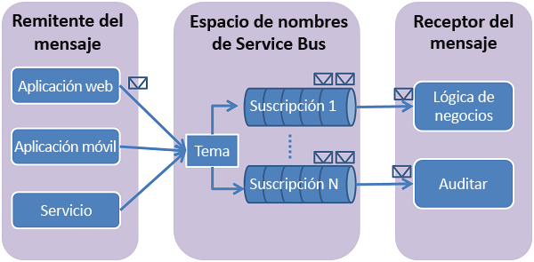

# Use Azure Portal para crear un tema de Service Bus y suscripciones a dicho tema
En este inicio rápido, usará Azure Portal para crear un tema de Service Bus y, después, crear suscripciones a dicho tema. 

## Qué son los temas y las suscripciones de Service Bus
Las suscripciones y los temas de Service Bus son compatibles con el modelo de comunicación de mensajería de *publicación/suscripción* . Cuando se usan temas y suscripciones, los componentes de una aplicación distribuida no se comunican directamente entre sí, sino que intercambian mensajes a través de un tema, que actúa como un intermediario.

A diferencia de las colas de Service Bus, en las que un solo destinatario procesa cada mensaje, los temas y las suscripciones proporcionan una forma de comunicación de uno a varios mediante un patrón de publicación/suscripción. Es posible registrar varias suscripciones en un tema. Cuando un mensaje se envía a un tema, pasa a estar disponible para cada suscripción para la administración o el procesamiento de manera independiente. Una suscripción a un tema se asemeja a una cola virtual que recibe copias de los mensajes que se enviaron al tema. Opcionalmente, puede registrar reglas de filtros para un tema por suscripción, lo que le permite filtrar o restringir qué mensajes para un tema reciben las suscripciones a un tema.

Las suscripciones y temas de Service Bus le permiten escalar para realizar el procesamiento de un número elevado de mensajes en una serie amplia de usuarios y aplicaciones.

[!INCLUDE [service-bus-create-namespace-portal](../../includes/service-bus-create-namespace-portal.md)]

[!INCLUDE [service-bus-create-topics-three-subscriptions-portal](../../includes/service-bus-create-topics-three-subscriptions-portal.md)]

> [!NOTE]
> Puede administrar los recursos de Service Bus con el [Explorador de Service Bus](https://github.com/paolosalvatori/ServiceBusExplorer/). El Explorador de Service Bus permite a los usuarios conectarse a un espacio de nombres de Service Bus y administrar las entidades de mensajería de una forma sencilla. La herramienta dispone de características avanzadas, como la funcionalidad de importación y exportación o la capacidad de probar el tema, las colas, las suscripciones, los servicios de retransmisión, los centros de notificaciones y los centros de eventos. 

## Pasos siguientes
En este artículo, ha creado un espacio de nombres de Service Bus, un tema en el espacio de nombres y tres suscripciones al tema. Para aprender a publicar mensajes en el tema y a suscribirse para recibir mensajes de una suscripción, consulte uno de los siguientes inicios rápido de la sección **Publicación y suscripción de mensajes**. 

- [.NET](service-bus-dotnet-how-to-use-topics-subscriptions.md)
- [Java](service-bus-java-how-to-use-topics-subscriptions.md)
- [JavaScript](service-bus-nodejs-how-to-use-topics-subscriptions.md)
- [Python](service-bus-python-how-to-use-topics-subscriptions.md)
- [PHP](service-bus-php-how-to-use-topics-subscriptions.md)
- [Ruby](service-bus-ruby-how-to-use-topics-subscriptions.md)