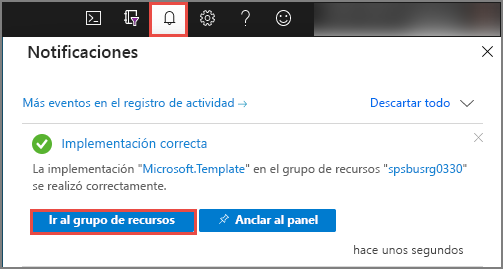
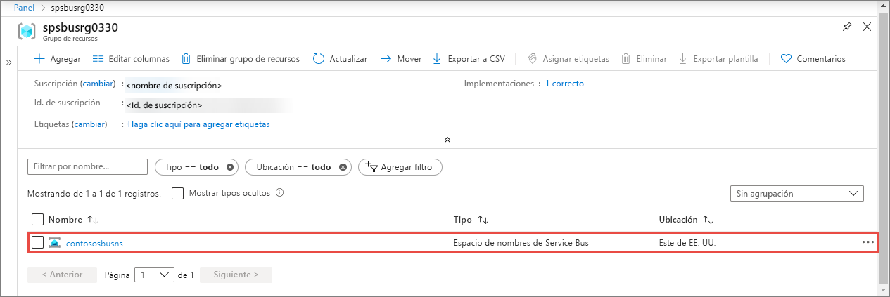
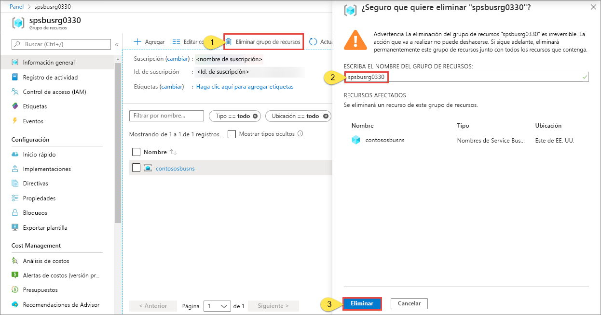

# Inicio rápido: Creación de una cola y un espacio de nombres de Service Bus con una plantilla de ARM

En este artículo se muestra cómo usar una plantilla de Azure Resource Manager que crea un espacio de nombres y una cola de Service Bus dentro de ese espacio de nombres. En el artículo se explica cómo especificar los recursos que se implementan y cómo definir los parámetros que se especifican cuando se ejecuta la implementación. Puede usar esta plantilla para sus propias implementaciones o personalizarla para satisfacer sus necesidades.

[!INCLUDE [About Azure Resource Manager](../../includes/resource-manager-quickstart-introduction.md)]

Si su entorno cumple los requisitos previos y está familiarizado con el uso de plantillas de Resource Manager, seleccione el botón **Implementar en Azure**. La plantilla se abrirá en Azure Portal.

## Requisitos previos

Si no tiene una suscripción a Azure, cree una [cuenta gratuita](https://azure.microsoft.com/free/) antes de empezar.

## Revisión de la plantilla

La plantilla usada en este inicio rápido forma parte de las [plantillas de inicio rápido de Azure](https://azure.microsoft.com/resources/templates/201-servicebus-create-queue).

:::code language="json" source="~/quickstart-templates/201-servicebus-create-queue/azuredeploy.json" range="1-75" highlight="31-63":::

Los recursos definidos en la plantilla incluyen:

- [**Microsoft.ServiceBus/namespaces**](/azure/templates/microsoft.servicebus/namespaces)
- [**Microsoft.ServiceBus/namespaces/queues**](/azure/templates/microsoft.servicebus/namespaces/queues)

> [!NOTE]
> Las siguientes plantillas de ARM están disponibles para su descarga e implementación.
>
> * [Creación de un espacio de nombres de Service Bus con regla de autorización y cola](service-bus-resource-manager-namespace-auth-rule.md)
> * [Creación de un espacio de nombres de Service Bus con un tema y una suscripción](service-bus-resource-manager-namespace-topic.md)
> * [Creación de un espacio de nombres de Service Bus](service-bus-resource-manager-namespace.md)
> * [Create a Service Bus namespace with topic, subscription, and rule](service-bus-resource-manager-namespace-topic-with-rule.md) (Creación de un espacio de nombres de Service Bus con tema, suscripción y regla)

Puede encontrar más plantillas en las [plantillas de inicio rápido de Azure](https://azure.microsoft.com/resources/templates/?resourceType=Microsoft.Servicebus&pageNumber=1&sort=Popular).

## Implementación de la plantilla

Con esta plantilla, implementa un espacio de nombres de Service Bus con una cola.

Las [colas de Service Bus](service-bus-queues-topics-subscriptions.md#queues) ofrecen una entrega de mensajes según el modelo “primero en entrar, primero en salir” (FIFO) a uno o más consumidores de la competencia.

Para ejecutar automáticamente la implementación, haga clic en el botón siguiente: Cree un nuevo grupo de recursos para la implementación de forma que pueda realizar una limpieza más rápida.

## Validación de la implementación

1. Seleccione **Notificaciones** en la parte superior para ver el estado de la implementación. Espere hasta que la implementación se realice correctamente. A continuación, seleccione **Ir al grupo de recursos** en el mensaje de notificación para ir a la página del grupo de recursos que contiene el espacio de nombres de Service Bus. 

    
2. Confirme que ve el espacio de nombres de Service Bus en la lista de recursos. 

    
3. Seleccione el espacio de nombres en la lista para ver la página de **espacio de nombres de Service Bus**. 

## Limpieza de recursos

1. En Azure Portal, vaya a la página **Grupo de recursos** del grupo de recursos.
2. Seleccione **Eliminar grupo de recursos** en la barra de herramientas. 
3. Escriba el nombre del grupo de recursos y seleccione **Eliminar**. 

    

## Pasos siguientes

Vea el siguiente tema, en el que se explica cómo crear una regla de autorización para la cola o el espacio de nombres:

[Creación de una regla de autorización de Service Bus para un espacio de nombres y una cola mediante una plantilla de Resource Manager](service-bus-resource-manager-namespace-auth-rule.md)

Vea los siguientes artículos para aprender a administrar estos recursos:

* [Administración de Service Bus con PowerShell](service-bus-manage-with-ps.md)
* [Administración de recursos de Service Bus con el Explorador de Service Bus](https://github.com/paolosalvatori/ServiceBusExplorer/releases)

[Authoring Azure Resource Manager templates]: ../azure-resource-manager/templates/template-syntax.md
[Service Bus namespace and queue template]: https://github.com/Azure/azure-quickstart-templates/blob/master/201-servicebus-create-queue/
[Azure Quickstart Templates]: https://azure.microsoft.com/documentation/templates/?term=service+bus
[Learn more about Service Bus queues]: service-bus-queues-topics-subscriptions.md
[Using Azure PowerShell with Azure Resource Manager]: ../azure-resource-manager/management/manage-resources-powershell.md
[Using the Azure CLI for Mac, Linux, and Windows with Azure Resource Management]: ../azure-resource-manager/management/manage-resources-cli.md