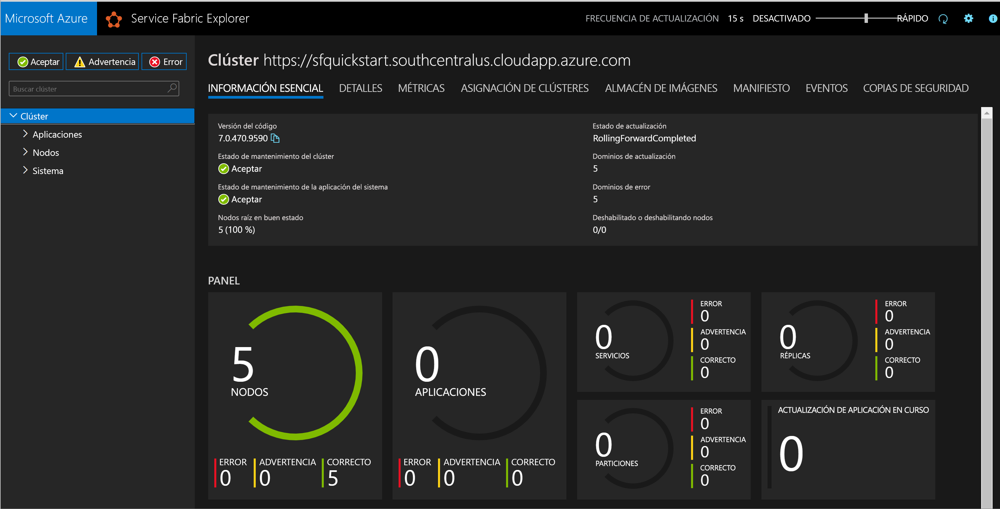
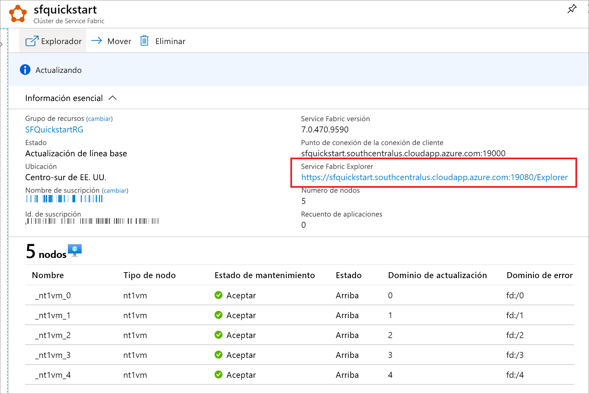

# <a name="quickstart-create-a-service-fabric-cluster-using-resource-manager-template"></a>Inicio rápido: Creación de un clúster de Service Fabric mediante una plantilla de Resource Manager

Azure Service Fabric es una plataforma de sistemas distribuidos que facilita el empaquetado, la implementación y la administración de microservicios y contenedores escalables y confiables. Un *clúster* de Service Fabric es un conjunto de máquinas virtuales conectadas a la red, en las que se implementan y administran los microservicios.

[!INCLUDE [About Azure Resource Manager](../../includes/resource-manager-quickstart-introduction.md)]

En este artículo se describe cómo implementar un clúster de prueba de Service Fabric en Azure mediante Resource Manager. Este clúster de Windows de cinco nodos está protegido con un certificado autofirmado y, por lo tanto, solo se debe usar con fines instructivos (en lugar de cargas de trabajo de producción).

Usaremos Azure PowerShell para implementar la plantilla. Además de Azure PowerShell, también puede usar Azure Portal, la CLI de Azure y API REST. Para obtener información sobre otros métodos de implementación, consulte [Implementación de plantillas](../azure-resource-manager/templates/deploy-portal.md).

Si no tiene una suscripción a Azure, cree una cuenta [gratuita](https://azure.microsoft.com/free/) antes de empezar.

## <a name="prerequisites"></a>Prerrequisitos

### <a name="install-service-fabric-sdk-and-powershell-modules"></a>Instalación del SDK de Service Fabric y de los módulos de PowerShell

Para realizar este inicio rápido, necesita lo siguiente:

* Instalación de [Service Fabric SDK y del módulo de PowerShell](service-fabric-get-started.md).

* Instale [Azure PowerShell](https://docs.microsoft.com/powershell/azure/install-Az-ps).

### <a name="download-the-sample-template-and-certificate-helper-script"></a>Descarga de la plantilla de ejemplo y el script del asistente de certificados

Clone o descargue el repositorio de [plantillas de inicio rápido de Azure Resource Manager](https://github.com/Azure/azure-quickstart-templates). Como alternativa, copie los siguientes archivos de forma local en la carpeta *service-fabric-secure-cluster-5-node-1-nodetype*:

* [New-ServiceFabricClusterCertificate.ps1](https://raw.githubusercontent.com/Azure/azure-quickstart-templates/master/service-fabric-secure-cluster-5-node-1-nodetype/New-ServiceFabricClusterCertificate.ps1)
* [azuredeploy.json](https://raw.githubusercontent.com/Azure/azure-quickstart-templates/master/service-fabric-secure-cluster-5-node-1-nodetype/azuredeploy.json)
* [azuredeploy.parameters.json](https://raw.githubusercontent.com/Azure/azure-quickstart-templates/master/service-fabric-secure-cluster-5-node-1-nodetype/azuredeploy.parameters.json)

### <a name="sign-in-to-azure"></a>Inicio de sesión en Azure

Inicie sesión en Azure y designe la suscripción que se usará para crear el clúster de Service Fabric.

```powershell
# Sign in to your Azure account
Login-AzAccount -SubscriptionId "<subscription ID>"
```

### <a name="create-a-self-signed-certificate-stored-in-key-vault"></a>Creación de un certificado autofirmado almacenado en Key Vault.

Service Fabric usa certificados X.509 para [proteger un clúster](./service-fabric-cluster-security.md) y proporcionar características de seguridad de las aplicaciones, así como la solución [Key Vault](../key-vault/general/overview.md) para administrar dichos certificados. La creación correcta del clúster requiere un certificado de clúster para habilitar la comunicación de nodo a nodo. Con el fin de crear este clúster de prueba de inicio rápido, crearemos un certificado autofirmado para la autenticación del clúster. Las cargas de trabajo de producción requieren certificados creados mediante un servicio de certificados de Windows Server correctamente configurado o uno de una entidad de certificación (CA) autorizada.

```powershell
# Designate unique (within cloudapp.azure.com) names for your resources
$resourceGroupName = "SFQuickstartRG"
$keyVaultName = "SFQuickstartKV"

# Create a new resource group for your Key Vault and Service Fabric cluster
New-AzResourceGroup -Name $resourceGroupName -Location SouthCentralUS

# Create a Key Vault enabled for deployment
New-AzKeyVault -VaultName $KeyVaultName -ResourceGroupName $resourceGroupName -Location SouthCentralUS -EnabledForDeployment

# Generate a certificate and upload it to Key Vault
.\New-ServiceFabricClusterCertificate.ps1
```

El script le pedirá lo siguiente (asegúrese de modificar *CertDNSName* y *KeyVaultName* en los valores de ejemplo siguientes):

* **Contraseña:** Password!1
* **CertDNSName:** *sfquickstart*.southcentralus.cloudapp.azure.com
* **KeyVaultName:** *SFQuickstartKV*
* **KeyVaultSecretName:** clustercert

Al finalizar, el script proporcionará los valores de parámetro necesarios para la implementación de la plantilla. Asegúrese de almacenarlos en las siguientes variables, ya que se necesitarán para implementar la plantilla de clúster:

```powershell
$sourceVaultId = "<Source Vault Resource Id>"
$certUrlValue = "<Certificate URL>"
$certThumbprint = "<Certificate Thumbprint>"
```

## <a name="create-a-service-fabric-cluster"></a>Creación de un clúster de Service Fabric

### <a name="review-the-template"></a>Revisión de la plantilla

La plantilla usada en este inicio rápido forma parte de las [plantillas de inicio rápido de Azure](https://azure.microsoft.com/resources/templates/service-fabric-secure-cluster-5-node-1-nodetype/). La plantilla de este artículo es demasiado larga para mostrarse aquí. Para ver la plantilla, examine el archivo [azuredeploy.json](https://raw.githubusercontent.com/Azure/azure-quickstart-templates/master/service-fabric-secure-cluster-5-node-1-nodetype/azuredeploy.json).

En la plantilla se han definido varios recursos de Azure:

* [Microsoft.Storage/storageAccounts](/azure/templates/microsoft.storage/storageaccounts)
* [Microsoft.Network/virtualNetworks](/azure/templates/microsoft.network/virtualnetworks)
* [Microsoft.Network/publicIPAddresses](/azure/templates/microsoft.network/publicipaddresses)
* [Microsoft.Network/loadBalancers](/azure/templates/microsoft.network/loadbalancers)
* [Microsoft.Compute/virtualMachineScaleSets](/azure/templates/microsoft.compute/virtualmachinescalesets)
* [Microsoft.ServiceFabric/clusters](/azure/templates/microsoft.servicefabric/clusters)

Para encontrar más plantillas relacionadas con Azure Service Fabric, consulte [Plantillas de inicio rápido de Azure](https://azure.microsoft.com/resources/templates/?sort=Popular&term=service+fabric).

### <a name="customize-the-parameters-file"></a>Personalización del archivo de parámetros

Abra *azuredeploy.parameters.json* y edite los valores de parámetro para que:

* **clusterName** coincida con el valor proporcionado para *CertDNSName* al crear el certificado de clúster
* **adminUserName** sea un valor distinto al del token de *GEN-UNIQUE* predeterminado.
* **adminPassword** sea un valor que distinto al del token de *GEN-PASSWORD* predeterminado
* **certificateThumbprint**, **sourceVaultResourceId** y **certificateUrlValue** sean todos una cadena vacía (`""`)

Por ejemplo:

```json
{
  "$schema": "https://schema.management.azure.com/schemas/2019-04-01/deploymentParameters.json#",
  "contentVersion": "1.0.0.0",
  "parameters": {
    "clusterName": {
      "value": "sfquickstart"
    },
    "adminUsername": {
      "value": "testadm"
    },
    "adminPassword": {
      "value": "Password#1234"
    },
    "certificateThumbprint": {
      "value": ""
    },
    "sourceVaultResourceId": {
      "value": ""
    },
    "certificateUrlValue": {
      "value": ""
    }
  }
}
```

## <a name="deploy-the-template"></a>Implementación de la plantilla

Almacene las rutas de acceso de la plantilla de Resource Manager y los archivos de parámetro en las variables y, a continuación, implemente la plantilla.

```powershell
$templateFilePath = "<full path to azuredeploy.json>"
$parameterFilePath = "<full path to azuredeploy.parameters.json>"

New-AzResourceGroupDeployment `
    -ResourceGroupName $resourceGroupName `
    -TemplateFile $templateFilePath `
    -TemplateParameterFile $parameterFilePath `
    -CertificateThumbprint $certThumbprint `
    -CertificateUrlValue $certUrlValue `
    -SourceVaultResourceId $sourceVaultId `
    -Verbose
```

## <a name="review-deployed-resources"></a>Revisión de los recursos implementados

Una vez finalizada la implementación, busque el valor de `managementEndpoint` en la salida y abra la dirección en un explorador web para ver el clúster en [Service Fabric Explorer](./service-fabric-visualizing-your-cluster.md).



También puede encontrar el punto de conexión de Service Fabric Explorer en la hoja de recursos del explorador de servicios en Azure Portal.



## <a name="clean-up-resources"></a>Limpieza de recursos

Cuando ya no lo necesite, elimine el grupo de recursos, que elimina los recursos que contiene.

```powershell
$resourceGroupName = Read-Host -Prompt "Enter the Resource Group name"
Remove-AzResourceGroup -Name $resourceGroupName
Write-Host "Press [ENTER] to continue..."
```

## <a name="next-steps"></a>Pasos siguientes

Para más información sobre cómo crear una plantilla de clúster de Azure Service Fabric personalizada, consulte:

> [!div class="nextstepaction"]
> [Creación de una plantilla de Resource Manager para el clúster de Service Fabric](service-fabric-cluster-creation-create-template.md)
