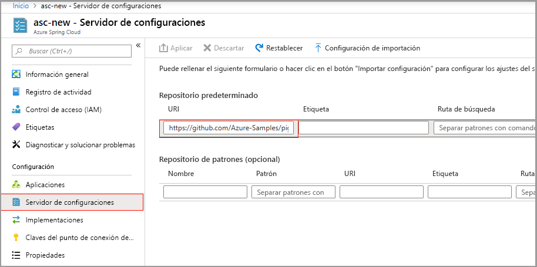

# <a name="quickstart-set-up-azure-spring-cloud-configuration-server"></a>Inicio rápido: configuración del servidor de configuración de Azure Spring Cloud

El servidor de configuración de Azure Spring Cloud es un servicio de configuración centralizado para sistemas distribuidos. Usa una capa de repositorio conectable que actualmente admite el almacenamiento local, Git y Subversion. En esta guía de inicio rápido, configurará el servidor de configuración para obtener datos de un repositorio de Git.

::: zone pivot="programming-language-csharp"

## <a name="prerequisites"></a>Requisitos previos

* Complete la guía de inicio rápido anterior de esta serie: [Aprovisionamiento del servicio Azure Spring Cloud](spring-cloud-quickstart-provision-service-instance.md).

## <a name="azure-spring-cloud-config-server-procedures"></a>Procedimientos de Azure Spring Cloud Config Server

Ejecute el comando siguiente para configurar el servidor de configuración con la ubicación del repositorio de Git del proyecto. Reemplace `<service instance name>` por el nombre del servicio que creó anteriormente. El valor predeterminado para el nombre de instancia de servicio que estableció en la guía de inicio rápido anterior no funciona con este comando.

```azurecli
az spring-cloud config-server git set -n <service instance name> --uri https://github.com/Azure-Samples/Azure-Spring-Cloud-Samples --search-paths steeltoe-sample/config
```

Este comando indica al servidor de configuración que busque los datos de configuración en la carpeta [steeltoe-sample/config](https://github.com/Azure-Samples/Azure-Spring-Cloud-Samples/tree/master/steeltoe-sample/config) del repositorio de la aplicación de ejemplo. Dado que el nombre de la aplicación que va a obtener los datos de configuración es `planet-weather-provider`, el archivo que se usará es [planet-weather-provider.yml](https://github.com/Azure-Samples/Azure-Spring-Cloud-Samples/blob/master/steeltoe-sample/config/planet-weather-provider.yml).

::: zone-end

::: zone pivot="programming-language-java"
Azure Spring Cloud Config Server es un servicio de configuración centralizado para sistemas distribuidos. Usa una capa de repositorio conectable que actualmente admite el almacenamiento local, Git y Subversion.  Configure el servidor de configuración para implementar aplicaciones de microservicios en Azure Spring Cloud.

## <a name="prerequisites"></a>Requisitos previos

* [Instalación de JDK 8](/java/azure/jdk/?preserve-view=true&view=azure-java-stable)
* [Registro para obtener una suscripción a Azure](https://azure.microsoft.com/free/)
* (Opcional) [Instale la versión 2.0.67 de la CLI de Azure, o cualquier versión superior](/cli/azure/install-azure-cli?preserve-view=true&view=azure-cli-latest), e instale la extensión de Azure Spring Cloud con el comando `az extension add --name spring-cloud`
* (Opcional) [Instale Azure Toolkit for IntelliJ](https://plugins.jetbrains.com/plugin/8053-azure-toolkit-for-intellij/) e [inicie sesión](/azure/developer/java/toolkit-for-intellij/create-hello-world-web-app#installation-and-sign-in)

## <a name="azure-spring-cloud-config-server-procedures"></a>Procedimientos de Azure Spring Cloud Config Server

#### <a name="portal"></a>[Portal](#tab/Azure-portal)

En el procedimiento siguiente se configura el servidor de configuración mediante Azure Portal para implementar el [ejemplo de Piggymetrics](spring-cloud-quickstart-sample-app-introduction.md).

1. Vaya a la página **Información general** del servicio y seleccione **Config Server**.

2. En la sección **Default repository** (Repositorio predeterminado), en **URI** seleccione "https://github.com/Azure-Samples/piggymetrics-config".

3. Seleccione **Aplicar** para guardar los cambios.

    

#### <a name="cli"></a>[CLI](#tab/Azure-CLI)

En el procedimiento siguiente se usa la CLI de Azure para configurar el servidor de configuración para implementar el [ejemplo de Piggymetrics](spring-cloud-quickstart-sample-app-introduction.md).

Configure config-server con la ubicación del repositorio de Git del proyecto:

```azurecli
az spring-cloud config-server git set -n <service instance name> --uri https://github.com/Azure-Samples/piggymetrics-config
```

---
::: zone-end

## <a name="next-steps"></a>Pasos siguientes

En esta guía de inicio rápido, ha creado recursos de Azure que seguirán acumulando cargos si permanecen en la suscripción. Si no tiene intención de pasar al siguiente inicio rápido, consulte [Limpieza de recursos](spring-cloud-quickstart-logs-metrics-tracing.md#clean-up-resources). De lo contrario, pase al siguiente inicio rápido:

> [!div class="nextstepaction"]
> [Compilación e implementación de aplicaciones](spring-cloud-quickstart-deploy-apps.md)