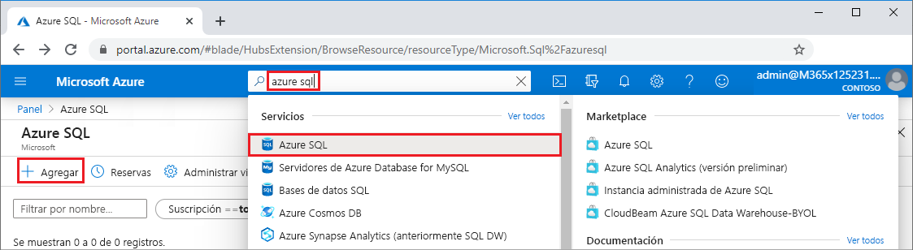
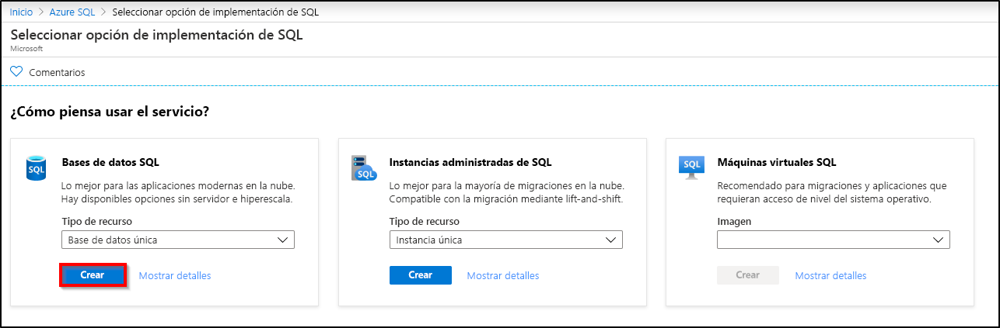
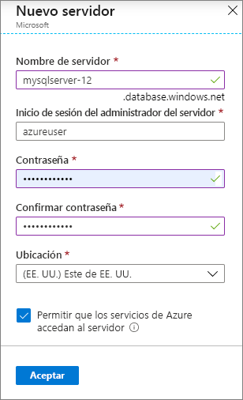
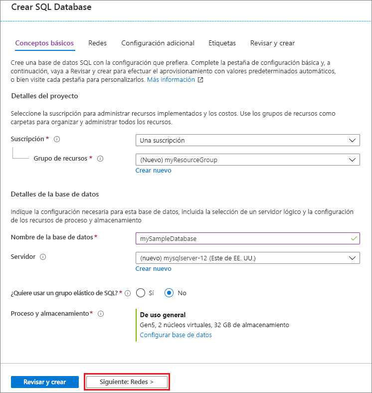
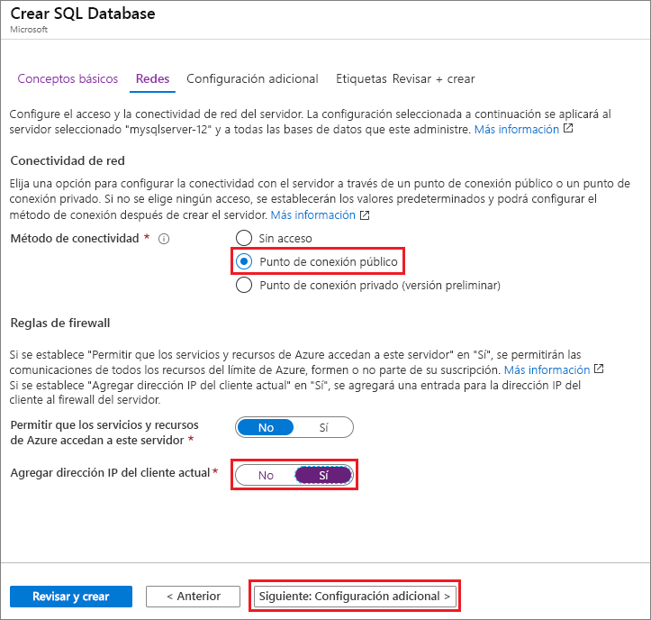
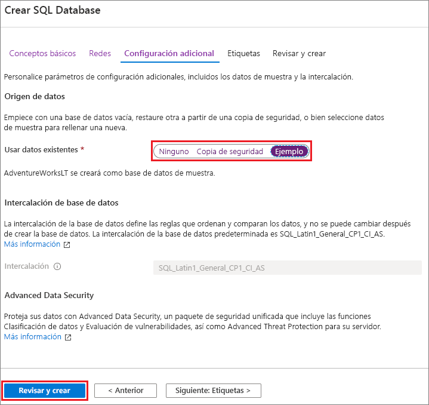

En este paso, creará un servidor de Azure SQL Database y una base de datos única que use los datos de ejemplo de AdventureWorksLT. Puede crear la base de datos mediante menús y pantallas de Azure Portal, o mediante un script de la CLI de Azure o de PowerShell en Azure Cloud Shell.

Todos los métodos incluyen la configuración de una regla de firewall en el nivel de servidor que permita a la dirección IP pública del equipo que está usando acceder al servidor. Para más información acerca de cómo crear reglas de firewall de servidor, consulte [Creación de un firewall de nivel de servidor](../sql-database-server-level-firewall-rule.md). También puede establecer reglas de firewall en el nivel de base de datos. Consulte [Creación de una regla de firewall de nivel de base de datos](/sql/relational-databases/system-stored-procedures/sp-set-database-firewall-rule-azure-sql-database). 

# <a name="portal"></a>[Portal](#tab/azure-portal)

Para crear un grupo de recursos, un servidor de SQL Server y una base de datos única en Azure Portal:

1. Inicie sesión en el [portal](https://portal.azure.com).
1. En la barra de búsqueda, busque y seleccione **Azure SQL**.
1. En la página **Azure SQL**, seleccione **Agregar**. 
   
   
   
1. En la página **Seleccione una opción de implementación de SQL**, seleccione el icono **Bases de datos SQL**, con **Base de datos única** en **Tipo de recurso**. Puede ver más información sobre las diferentes bases de datos si selecciona **Mostrar detalles**.
1. Seleccione **Crear**.
   
   
   
1. En la pestaña **Básico** del formulario **Crear base de datos SQL**, en **Detalles del proyecto**, seleccione la **Suscripción** de Azure correcta, si aún no lo está.
1. En **Grupo de recursos**, seleccione **Crear nuevo**, escriba *miGrupoDeRecursos* y seleccione **Aceptar**.
1. En **Detalles de la base de datos**, en **Nombre de la base de datos** escriba *miBaseDeDatosDeEjemplo*.
1. En **Servidor**, seleccione **Crear nuevo** y rellene el formulario **Nuevo servidor** como se indica a continuación:
   - **Nombre del servidor**: escriba *miservidorsql* y algunos caracteres para que el nombre sea único.
   - **Inicio de sesión del administrador del servidor**: escriba *usuarioazure*.
   - **Contraseña**: escriba una contraseña que cumpla los requisitos y escríbala de nuevo en el campo **Confirmar contraseña**.
   - **Ubicación**: despliegue los campos y elija una ubicación, como **(EE. UU.) Este de EE. UU.** .
   
   Seleccione **Aceptar**.
   
   
   
   Registre el inicio de sesión y la contraseña del administrador del servidor para poder iniciar sesión en el servidor y las bases de datos. Si olvida el inicio de sesión o la contraseña, puede obtener el nombre de inicio de sesión o restablecer la contraseña en la página **SQL Server** tras crear la base de datos. Para abrir la página **SQL Server**, seleccione el nombre del servidor en la página **Información general** de la base de datos.
   
1. En **Proceso y almacenamiento**, si desea volver a configurar los valores predeterminados, seleccione **Configurar base de datos**.
   
   En la página **Configurar**, puede:
   - Cambiar el **Nivel de proceso** de **Aprovisionado** a **Sin servidor**.
   - Revisar y cambiar la configuración de **Núcleos virtuales** y **Tamaño máximo de datos**.
   - Seleccionar **Cambiar configuración** para cambiar la generación del hardware.
   
   Después de realizar cambios, seleccione **Aplicar**.
   
1. Seleccione **Siguiente: Redes** en la parte inferior de la página.
   
   
   
1. En la pestaña **Redes**, en **Método de conectividad**, seleccione **Punto de conexión público**. 
1. En **Reglas de firewall**, establezca **Agregar dirección IP del cliente actual** en **Sí**.
1. Seleccione **Siguiente: Configuración adicional** en la parte inferior de la página.
   
   
   
   Para más información sobre la configuración del firewall, consulte [Permitir que los servicios y recursos de Azure accedan a este servidor](../sql-database-networkaccess-overview.md) e [Incorporación de un punto de conexión privado](../../private-link/private-endpoint-overview.md).
   
1. En la pestaña **Configuración adicional**, en la sección **Orígenes de datos**, en **Usar datos existentes**, seleccione **Ejemplo**.
1. En la parte inferior de la página, seleccione **Revisar y crear**.
   
   
   
1. Después de revisar la configuración, seleccione **Crear**.

# <a name="azure-cli"></a>[CLI de Azure](#tab/azure-cli)

Puede crear un grupo de recursos de Azure, SQL Server y una base de datos única mediante la interfaz de la línea de comandos de Azure (CLI de Azure). Si no desea usar Azure Cloud Shell, [instale la CLI de Azure](/cli/azure/install-azure-cli) en el equipo.

Para ejecutar el ejemplo de código siguiente en Azure Cloud Shell, seleccione **Probar** en la barra de título del ejemplo de código. Cuando se abra Cloud Shell, seleccione **Copiar** en la barra de título del ejemplo de código y pegue el ejemplo de código en la ventana de Cloud Shell. En el código, reemplace `<Subscription ID>` por su identificador de suscripción de Azure y, en `$startip` y `$endip`, reemplace `0.0.0.0` por la dirección IP pública del equipo que está usando.

Siga las indicaciones en pantalla para iniciar sesión en Azure y ejecutar el código. 

También puede usar Azure Cloud Shell desde Azure Portal; para ello, seleccione el icono de Cloud Shell en la barra superior. 
   
   
   
La primera vez que use Cloud Shell en el portal, seleccione **Bash** en el cuadro de diálogo de **bienvenida**. Las sesiones posteriores usarán la CLI de Azure en un entorno de Bash o bien puede seleccionar **Bash** en la barra de control de Cloud Shell. 

En el siguiente código de la CLI de Azure, se crea un grupo de recursos de Azure, un servidor de SQL Server, una base de datos única y una regla de firewall para el acceso al servidor. Asegúrese de registrar el grupo de recursos y los nombres de servidor generados, para poder administrar estos recursos más adelante.

```azurecli-interactive
#!/bin/bash

# Sign in to Azure and set execution context (if necessary)
az login
az account set --subscription <Subscription ID>

# Set the resource group name and location for your server
resourceGroupName=myResourceGroup-$RANDOM
location=westus2

# Set an admin login and password for your database
adminlogin=azureuser
password=Azure1234567

# Set a logical server name that is unique in the system
servername=server-$RANDOM

# Set the ip address range that can access your database
startip=0.0.0.0
endip=0.0.0.0

# Create a resource group
az group create \
    --name $resourceGroupName \
    --location $location

# Create a logical server in the resource group
az sql server create \
    --name $servername \
    --resource-group $resourceGroupName \
    --location $location  \
    --admin-user $adminlogin \
    --admin-password $password

# Configure a firewall rule for the server
az sql server firewall-rule create \
    --resource-group $resourceGroupName \
    --server $servername \
    -n AllowYourIp \
    --start-ip-address $startip \
    --end-ip-address $endip

# Create a gen5 2 vCore database in the server
az sql db create \
    --resource-group $resourceGroupName \
    --server $servername \
    --name mySampleDatabase \
    --sample-name AdventureWorksLT \
    --edition GeneralPurpose \
    --family Gen5 \
    --capacity 2 \
```

El código anterior usa estos comandos de la CLI de Azure:

| Get-Help | Descripción |
|---|---|
| [az account set](/cli/azure/account?view=azure-cli-latest#az-account-set) | Establece una suscripción como la suscripción activa actual. | 
| [az group create](/cli/azure/group#az-group-create) | Crea un grupo de recursos en el que se almacenan todos los recursos. |
| [az sql server create](/cli/azure/sql/server#az-sql-server-create) | Crea un servidor de SQL Database que hospeda bases de datos únicas y grupos elásticos. |
| [az sql server firewall-rule create](/cli/azure/sql/server/firewall-rule##az-sql-server-firewall-rule-create) | Crea las reglas de firewall de un servidor. | 
| [az sql db create](/cli/azure/sql/db#az-sql-db-create?view=azure-cli-latest) | Crea una base de datos. | 

Para obtener más ejemplos de la CLI de Azure de Azure SQL Database, consulte [Ejemplos de la CLI de Azure](../sql-database-cli-samples.md).

# <a name="powershell"></a>[PowerShell](#tab/azure-powershell)

Puede crear un grupo de recursos de Azure, un servidor de SQL Server y una base de datos única con Windows PowerShell. Si no desea usar Azure Cloud Shell, [instale el módulo de Azure PowerShell](/powershell/azure/install-az-ps).

[!INCLUDE [updated-for-az](../../../includes/updated-for-az.md)]

Para ejecutar el ejemplo de código siguiente en Azure Cloud Shell, seleccione **Probar** en la barra de título del código. Cuando se abra Cloud Shell, seleccione **Copiar** en la barra de título del ejemplo de código y pegue el ejemplo de código en la ventana de Cloud Shell. En el código, reemplace `<Subscription ID>` por su identificador de suscripción de Azure y, en `$startIp` y `$endIp`, reemplace `0.0.0.0` por la dirección IP pública del equipo que está usando. 

Siga las indicaciones en pantalla para iniciar sesión en Azure y ejecutar el código. 

También puede usar Azure Cloud Shell desde Azure Portal; para ello, seleccione el icono de Cloud Shell en la barra superior. 
   
   
   
La primera vez que use Cloud Shell en el portal, seleccione **PowerShell** en el cuadro de diálogo de **bienvenida**. Las sesiones posteriores usarán PowerShell o puede seleccionarlo en la barra de control de Cloud Shell. 

El siguiente código de PowerShell crea un grupo de recursos de Azure, un servidor de SQL Server, una base de datos única y una regla de firewall para el acceso al servidor. Asegúrese de registrar el grupo de recursos y los nombres de servidor generados, para poder administrar estos recursos más adelante.

   ```powershell-interactive
   # Set variables for your server and database
   $subscriptionId = '<SubscriptionID>'
   $resourceGroupName = "myResourceGroup-$(Get-Random)"
   $location = "West US"
   $adminLogin = "azureuser"
   $password = "Azure1234567"
   $serverName = "mysqlserver-$(Get-Random)"
   $databaseName = "mySampleDatabase"

   # The ip address range that you want to allow to access your server 
   $startIp = "0.0.0.0"
   $endIp = "0.0.0.0"

   # Show randomized variables
   Write-host "Resource group name is" $resourceGroupName 
   Write-host "Server name is" $serverName 

   # Connect to Azure
   Connect-AzAccount

   # Set subscription ID
   Set-AzContext -SubscriptionId $subscriptionId 

   # Create a resource group
   Write-host "Creating resource group..."
   $resourceGroup = New-AzResourceGroup -Name $resourceGroupName -Location $location -Tag @{Owner="SQLDB-Samples"}
   $resourceGroup

   # Create a server with a system wide unique server name
   Write-host "Creating primary logical server..."
   $server = New-AzSqlServer -ResourceGroupName $resourceGroupName `
      -ServerName $serverName `
      -Location $location `
      -SqlAdministratorCredentials $(New-Object -TypeName System.Management.Automation.PSCredential `
      -ArgumentList $adminLogin, $(ConvertTo-SecureString -String $password -AsPlainText -Force))
   $server

   # Create a server firewall rule that allows access from the specified IP range
   Write-host "Configuring firewall for primary logical server..."
   $serverFirewallRule = New-AzSqlServerFirewallRule -ResourceGroupName $resourceGroupName `
      -ServerName $serverName `
      -FirewallRuleName "AllowedIPs" -StartIpAddress $startIp -EndIpAddress $endIp
   $serverFirewallRule

   # Create General Purpose Gen4 database with 1 vCore
   Write-host "Creating a gen5 2 vCore database..."
   $database = New-AzSqlDatabase  -ResourceGroupName $resourceGroupName `
      -ServerName $serverName `
      -DatabaseName $databaseName `
      -Edition GeneralPurpose `
      -VCore 2 `
      -ComputeGeneration Gen5 `
      -MinimumCapacity 2 `
      -SampleName "AdventureWorksLT"
   $database
   ```

En el código anterior se usan estos cmdlets de PowerShell:

| Get-Help | Notas |
|---|---|
| [New-AzResourceGroup](/powershell/module/az.resources/new-azresourcegroup) | Crea un grupo de recursos en el que se almacenan todos los recursos. |
| [New-AzSqlServer](/powershell/module/az.sql/new-azsqlserver) | Crea un servidor de SQL Database que hospeda bases de datos únicas y grupos elásticos. |
| [New-AzSqlServerFirewallRule](/powershell/module/az.sql/new-azsqlserverfirewallrule) | Crea una regla de firewall para un servidor lógico. | 
| [New-AzSqlDatabase](/powershell/module/az.sql/new-azsqldatabase) | Crea una base de datos única de Azure SQL Database. | 

Para obtener más ejemplos de PowerShell de Azure SQL Database, consulte [Ejemplos de Azure PowerShell](../sql-database-powershell-samples.md).

---
