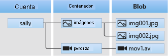
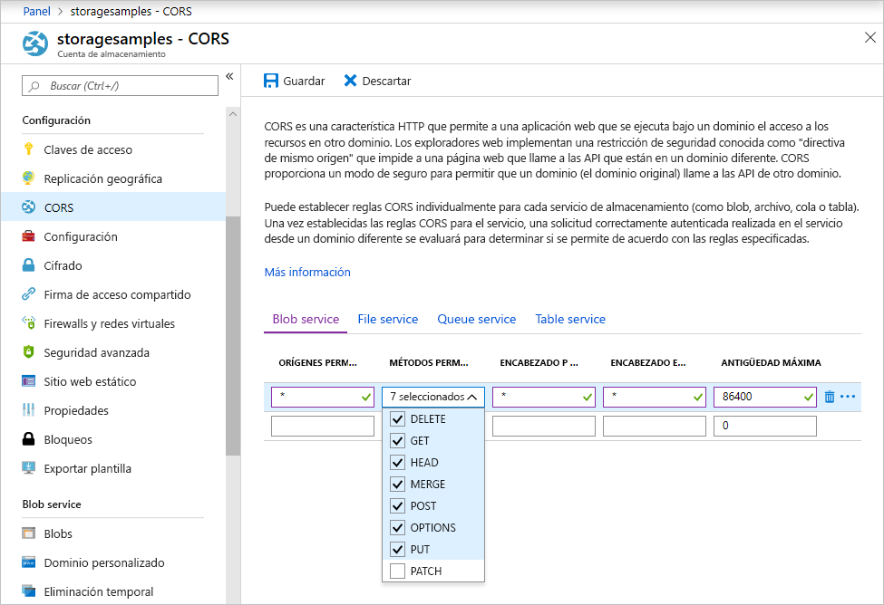

<!-- Customer intent: As a web application developer I want to interface with Azure Blob storage entirely on the client so that I can build a SPA application that is able to upload and delete files on blob storage. -->

# <a name="quickstart-manage-blobs-with-javascript-v12-sdk-in-a-browser"></a>Inicio rápido: Administración de blobs con el SDK de JavaScript v12 en un explorador

Azure Blob Storage está optimizado para el almacenamiento de grandes cantidades de datos no estructurados. Los blobs son objetos que pueden contener datos de texto o datos binarios, como imágenes, documentos, elementos multimedia de streaming y datos de archivo. En este inicio rápido, aprenderá a administrar blobs mediante JavaScript en un explorador. Cargará y enumerará los blobs, y creará y eliminará los contenedores.

Recursos adicionales:

* [Documentación de referencia de API](/javascript/api/@azure/storage-blob)
* [Código fuente de la biblioteca](https://github.com/Azure/azure-sdk-for-js/tree/master/sdk/storage/storage-blob)
* [Paquete (npm)](https://www.npmjs.com/package/@azure/storage-blob)
* [Muestras](https://docs.microsoft.com/azure/storage/common/storage-samples-javascript?toc=%2fazure%2fstorage%2fblobs%2ftoc.json#blob-samples)

## <a name="prerequisites"></a>Requisitos previos

* [Una cuenta de Azure con una suscripción activa](https://azure.microsoft.com/free/?ref=microsoft.com&utm_source=microsoft.com&utm_medium=docs&utm_campaign=visualstudio)
* [Una cuenta de Azure Storage](../common/storage-account-create.md).
* [Node.js](https://nodejs.org)
* [Microsoft Visual Studio Code](https://code.visualstudio.com)
* Una extensión de Visual Studio Code para la depuración del explorador, como:
    * [Debugger for Microsoft Edge](https://marketplace.visualstudio.com/items?itemName=msjsdiag.debugger-for-edge)
    * [Debugger for Chrome](https://marketplace.visualstudio.com/items?itemName=msjsdiag.debugger-for-chrome)
    * [Debugger for Firefox](https://marketplace.visualstudio.com/items?itemName=firefox-devtools.vscode-firefox-debug)


[!INCLUDE [storage-multi-protocol-access-preview](../../../includes/storage-multi-protocol-access-preview.md)]

## <a name="object-model"></a>Modelo de objetos

Blob Storage ofrece tres tipos de recursos:

* La cuenta de almacenamiento
* Un contenedor en la cuenta de almacenamiento
* Un blob en el contenedor

En el siguiente diagrama se muestra la relación entre estos recursos.



En este inicio rápido, va a usar las siguientes clases de JavaScript para interactuar con estos recursos:

* [BlobServiceClient](/javascript/api/@azure/storage-blob/blobserviceclient): La clase `BlobServiceClient` permite manipular recursos de Azure Storage y contenedores de blobs.
* [ContainerClient](/javascript/api/@azure/storage-blob/containerclient): La clase `ContainerClient` permite manipular contenedores de Azure Storage y sus blobs.
* [BlockBlobClient](/javascript/api/@azure/storage-blob/blockblobclient): La clase `BlockBlobClient` permite manipular los blobs de Azure Storage.

## <a name="setting-up"></a>Instalación

En esta sección se explica cómo preparar un proyecto para que funcione con la biblioteca cliente de Azure Blob Storage v12 para JavaScript.

### <a name="create-a-cors-rule"></a>Creación de una regla de CORS

Para que la aplicación web pueda acceder a un almacenamiento de blobs desde el cliente, debe configurar la cuenta para habilitar el [uso compartido de recursos entre orígenes](https://docs.microsoft.com/rest/api/storageservices/cross-origin-resource-sharing--cors--support-for-the-azure-storage-services), o CORS.

En Azure Portal, seleccione la cuenta de almacenamiento. Para definir una nueva regla de CORS, vaya a la sección **Configuración** y seleccione **CORS**. En esta guía de inicio rápido, se crea una regla de CORS abierta:



En la tabla siguiente se describe cada opción de configuración de CORS y se explican los valores que se utilizan para definir la regla.

|Configuración  |Value  | Descripción |
|---------|---------|---------|
| **ORÍGENES PERMITIDOS** | **\*** | Acepta una lista delimitada por comas de dominios establecidos como orígenes aceptables. Establecer el valor en `*` permite el acceso de todos los dominios a la cuenta de almacenamiento. |
| **MÉTODOS PERMITIDOS** | **DELETE**, **GET**, **HEAD**, **MERGE**, **POST**, **OPTIONS**, and **PUT** | Enumera los verbos HTTP permitidos para ejecutar en la cuenta de almacenamiento. Para los fines de esta guía de rápido, seleccione todas las opciones disponibles. |
| **ENCABEZADOS PERMITIDOS** | **\*** | Define una lista de encabezados de solicitud (incluidos los encabezados con prefijo) permitidos por la cuenta de almacenamiento. Establecer el valor en `*` permite el acceso de todos los encabezados. |
| **ENCABEZADOS EXPUESTOS** | **\*** | Enumera los encabezados de respuesta permitidos por la cuenta. Establecer el valor en `*` permite que la cuenta envíe cualquier encabezado. |
| **ANTIGÜEDAD MÁXIMA** | **86400** | La cantidad máxima de tiempo que el explorador almacena en caché la solicitud OPTIONS preparatoria en segundos. El valor *86400* permite que la memoria caché permanezca un día completo. |

Después de rellenar los campos con los valores de esta tabla, haga clic en el botón **Guardar**.

> [!IMPORTANT]
> Asegúrese de que cualquier configuración que utilice en producción exponga la cantidad mínima de acceso necesario para la cuenta de almacenamiento a fin de mantener un acceso seguro. La configuración de CORS descrita aquí es adecuada para una guía de inicio rápido, ya que define una directiva de seguridad flexible. Sin embargo, esta configuración no se recomienda para un contexto real.

### <a name="create-a-shared-access-signature"></a>Creación de una firma de acceso compartido

La firma de acceso compartido (SAS) la usa el código que se ejecuta en el explorador para autorizar las solicitudes para Azure Blob Storage. Mediante el uso de una firma de acceso compartido, el cliente puede autorizar el acceso a los recursos de almacenamiento sin la clave de acceso de cuenta ni la cadena de conexión. Para más información, consulte [Uso de firmas de acceso compartido (SAS)](../common/storage-sas-overview.md).

Siga estos pasos para obtener la dirección URL de SAS de Blob service:

1. En Azure Portal, seleccione la cuenta de almacenamiento.
2. Vaya a la sección **Configuración** y seleccione **Firma de acceso compartido**.
3. Desplácese hacia abajo y haga clic en el botón **Generar la cadena de conexión y SAS**.
4. Desplácese más hacia abajo y busque el campo **URL de SAS de Blob service**.
5. Haga clic en el botón **Copiar en el portapapeles** en el extremo derecho del campo **URL de SAS de Blob service**.
6. Guarde la dirección URL copiada en algún lugar para usarla en un próximo paso.

### <a name="add-the-azure-blob-storage-client-library"></a>Adición de la biblioteca cliente de Azure Blob Storage

En el equipo local, cree una nueva carpeta llamada *azure-blobs-js-browser* y ábrala en Visual Studio Code.

Seleccione **Ver > Terminal** para abrir una ventana de consola dentro de Visual Studio Code. Ejecute el siguiente comando del administrador de paquetes de Node.js (npm) en la ventana de terminal para crear un archivo [package.json](https://docs.npmjs.com/files/package.json).

```console
npm init -y
```

El SDK de Azure se compone de muchos paquetes independientes. Puede elegir los paquetes que necesita en función de los servicios que desea usar. Ejecute el siguiente comando `npm` en la ventana de terminal para instalar el paquete `@azure/storage-blob`.

```console
npm install --save @azure/storage-blob
```

#### <a name="bundle-the-azure-blob-storage-client-library"></a>Agrupación de la biblioteca cliente de Azure Blob Storage

Para usar las bibliotecas de Azure SDK en un sitio web, convierta el código para que funcione en el explorador. Para ello, use un software que instala varios programas. Esta instalación de varios programas toma el código JavaScript escrito con convenciones [Node.js](https://nodejs.org) y lo convierte en un formato que los exploradores comprenden. En este artículo de inicio rápido se usa el software [Parcel](https://parceljs.org/).

Para instalar Parcel, ejecute el comando `npm` en la ventana de terminal:

```console
npm install -g parcel-bundler
```

En Visual Studio Code, abra el archivo *package.json* y agregue `browserlist` entre las entradas `license` y `dependencies`. `browserlist` tiene como destino la versión más reciente de los tres exploradores populares. El archivo *package.json* ahora debería tener este aspecto:

:::code language="json" source="~/azure-storage-snippets/blobs/quickstarts/JavaScript/V12/azure-blobs-js-browser/package.json" highlight="12-16":::

Guarde el archivo *package.json*.

### <a name="import-the-azure-blob-storage-client-library"></a>Importación de la biblioteca cliente de Azure Blob Storage

Para usar las bibliotecas de Azure SDK en JavaScript, importe el paquete `@azure/storage-blob`. Cree un nuevo archivo en Visual Studio Code que contenga el siguiente código de JavaScript.

:::code language="javascript" source="~/azure-storage-snippets/blobs/quickstarts/JavaScript/V12/azure-blobs-js-browser/index.js" id="snippet_ImportLibrary":::

Guarde el archivo como *index.js* en el directorio *azure-blobs-js-browser*.

### <a name="implement-the-html-page"></a>Implementación de la página HTML

Cree un nuevo archivo en Visual Studio Code y agregue el siguiente código HTML.

:::code language="html" source="~/azure-storage-snippets/blobs/quickstarts/JavaScript/V12/azure-blobs-js-browser/index.html":::

Guarde el archivo como *index.js* en la carpeta *azure-blobs-js-browser*.

## <a name="code-examples"></a>Ejemplos de código

Este código de ejemplo muestra cómo realizar las siguientes tareas con la biblioteca cliente de Azure Blob Storage para JavaScript:

* [Declaración de campos para elementos de la interfaz de usuario](#declare-fields-for-ui-elements)
* [Adición de la información de la cuenta de almacenamiento](#add-your-storage-account-info)
* [Creación de objetos de cliente](#create-client-objects)
* [Creación y eliminación de un contenedor de almacenamiento](#create-and-delete-a-storage-container)
* [Enumeración de blobs](#list-blobs)
* [Carga de blobs](#upload-blobs)
* [Eliminación de blobs](#delete-blobs)

Ejecutará el código después de agregar todos los fragmentos de código al archivo *index.js*.

### <a name="declare-fields-for-ui-elements"></a>Declaración de campos para elementos de la interfaz de usuario

Agregue el siguiente código al final del archivo *index.js*.

:::code language="JavaScript" source="~/azure-storage-snippets/blobs/quickstarts/JavaScript/V12/azure-blobs-js-browser/index.js" id="snippet_DeclareVariables":::

Guarde el archivo *index.js*.

Este código declara campos para todos los elementos HTML e implementa una función `reportStatus` para mostrar la salida.

En las secciones siguientes, agregue cada nuevo bloque de código de JavaScript después del bloque anterior.

### <a name="add-your-storage-account-info"></a>Adición de la información de la cuenta de almacenamiento

Agregue código para acceder a la cuenta de almacenamiento. Reemplace el marcador de posición por la dirección URL de SAS de Blob service que ha generado anteriormente. Agregue el siguiente código al final del archivo *index.js*.

:::code language="javascript" source="~/azure-storage-snippets/blobs/quickstarts/JavaScript/V12/azure-blobs-js-browser/index.js" id="snippet_StorageAcctInfo":::

Guarde el archivo *index.js*.

### <a name="create-client-objects"></a>Creación de objetos de cliente

Cree [BlobServiceClient](/javascript/api/@azure/storage-blob/blobserviceclient) y [ContainerClient](/javascript/api/@azure/storage-blob/containerclient) para interactuar con el servicio de Azure Blob Storage. Agregue el siguiente código al final del archivo *index.js*.

:::code language="javascript" source="~/azure-storage-snippets/blobs/quickstarts/JavaScript/V12/azure-blobs-js-browser/index.js" id="snippet_CreateClientObjects":::

Guarde el archivo *index.js*.

### <a name="create-and-delete-a-storage-container"></a>Creación y eliminación de un contenedor de almacenamiento

Cree y elimine el contenedor de almacenamiento cuando haga clic en el botón correspondiente en la página web. Agregue el siguiente código al final del archivo *index.js*.

:::code language="javascript" source="~/azure-storage-snippets/blobs/quickstarts/JavaScript/V12/azure-blobs-js-browser/index.js" id="snippet_CreateDeleteContainer":::

Guarde el archivo *index.js*.

### <a name="list-blobs"></a>Enumeración de blobs

Enumere el contenido del contenedor de almacenamiento cuando haga clic en el botón **Enumerar archivos**. Agregue el siguiente código al final del archivo *index.js*.

:::code language="javascript" source="~/azure-storage-snippets/blobs/quickstarts/JavaScript/V12/azure-blobs-js-browser/index.js" id="snippet_ListBlobs":::

Guarde el archivo *index.js*.

Este código llama a la función [ContainerClient.listBlobsFlat](/javascript/api/@azure/storage-blob/containerclient#listblobsflat-containerlistblobsoptions-) y, después, usa un iterador para recuperar el nombre de cada [BlobItem](/javascript/api/@azure/storage-blob/blobitem) que devuelve. Para cada `BlobItem`, actualiza la lista **Archivos** con el valor de la propiedad [name](/javascript/api/@azure/storage-blob/blobitem#name).

### <a name="upload-blobs"></a>Cargar blobs

Cargue los archivos en el contenedor de almacenamiento cuando haga clic en el botón **Select and upload files** (Seleccionar y cargar archivos). Agregue el siguiente código al final del archivo *index.js*.

:::code language="javascript" source="~/azure-storage-snippets/blobs/quickstarts/JavaScript/V12/azure-blobs-js-browser/index.js" id="snippet_UploadBlobs":::

Guarde el archivo *index.js*.

Este código conecta el botón **Select and upload files** (Seleccionar y cargar archivos) con el elemento `file-input` oculto. El evento `click` de botón desencadena el evento `click` de entrada del archivo y muestra el selector de archivos. Después de seleccionar los archivos y cerrar el cuadro de diálogo, se produce el evento `input` y se llama a la función `uploadFiles`. Esta función crea un objeto [BlockBlobClient](/javascript/api/@azure/storage-blob/blockblobclient) y llama después a la función [uploadBrowserData](/javascript/api/@azure/storage-blob/blockblobclient#uploadbrowserdata-blob---arraybuffer---arraybufferview--blockblobparalleluploadoptions-) de solo explorador para cada archivo seleccionado. Cada llamada devuelve un objeto `Promise`. Cada objeto `Promise` se agrega a una lista para que se puedan esperar juntos, lo que hace que los archivos se carguen en paralelo.

### <a name="delete-blobs"></a>Eliminar blobs

Elimine los archivos del contenedor de almacenamiento cuando haga clic en el botón **Delete selected files** (Eliminar archivos seleccionados). Agregue el siguiente código al final del archivo *index.js*.

:::code language="javascript" source="~/azure-storage-snippets/blobs/quickstarts/JavaScript/V12/azure-blobs-js-browser/index.js" id="snippet_DeleteBlobs":::

Guarde el archivo *index.js*.

Este código llama a la función [ContainerClient.deleteBlob](/javascript/api/@azure/storage-blob/containerclient#deleteblob-string--blobdeleteoptions-) para quitar todos los archivos seleccionado de la lista. Luego, llama a la función `listFiles` mostrada anteriormente para actualizar el contenido de la lista **Archivos**.

## <a name="run-the-code"></a>Ejecución del código

Para ejecutar el código en el depurador de Visual Studio Code, configure el archivo *launch.json* para el explorador.

### <a name="configure-the-debugger"></a>Configuración del depurador

Para configurar la extensión del depurador en Visual Studio Code:

1. Seleccione **Ejecutar > Agregar configuración**.
2. Seleccione **Edge**, **Chrome** o **Firefox**, en función de la extensión que haya instalado en la sección [Requisitos previos](#prerequisites) anterior.

Agregar una nueva configuración crea un archivo *launch.json* y lo abre en el editor. Modifique el archivo *launch.json* para que el valor `url` sea `http://localhost:1234/index.html`, tal como se muestra:

:::code language="json" source="~/azure-storage-snippets/blobs/quickstarts/JavaScript/V12/azure-blobs-js-browser/.vscode/launch.json" highlight="11":::

Después de actualizarlo, guarde el archivo *launch.json*. Esta configuración indica a Visual Studio Code qué explorador abrir y qué dirección URL cargar.

### <a name="launch-the-web-server"></a>Inicio del servidor web

Para iniciar el servidor web de desarrollo local, seleccione **Ver > Terminal** para abrir una ventana de consola en Visual Studio Code y, luego, escriba el siguiente comando.

```console
parcel index.html
```

Parcel agrupa el código e inicia un servidor de desarrollo local para la página en `http://localhost:1234/index.html`. Los cambios que realice en *index.js* se compilarán automáticamente y se reflejarán en el servidor de desarrollo cada vez que guarde el archivo.

Si recibe un mensaje que indica que **no se pudo usar el puerto 1234 configurado**, puede cambiar el puerto mediante la ejecución del comando `parcel -p <port#> index.html`. En el archivo *launch.json*, actualice el puerto en la ruta de dirección URL para que coincida.

### <a name="start-debugging"></a>Iniciar la depuración

Ejecute la página en el depurador y hágase una idea de cómo funciona el almacenamiento de blobs. Si se produce algún error, el panel de **estado** de la página web mostrará el mensaje de error recibido.

Para abrir *index.html* en el explorador con el depurador de Visual Studio Code asociado, seleccione **Depurar > Iniciar depuración** o presione F5 en Visual Studio Code.

### <a name="use-the-web-app"></a>Uso de la aplicación web

En [Azure Portal](https://portal.azure.com), puede comprobar los resultados de las llamadas API a medida que sigue los pasos que se indican a continuación.

#### <a name="step-1---create-a-container"></a>Paso 1: Creación de un contenedor

1. En la aplicación web, seleccione **Crear contenedor**. El estado indica que se ha creado un contenedor.
2. Para comprobarlo en Azure Portal, seleccione la cuenta de almacenamiento. En **Blob service**, seleccione **Contenedores**. Compruebe que aparece el nuevo contenedor. (Puede que tenga que seleccionar **Actualizar**).

#### <a name="step-2---upload-a-blob-to-the-container"></a>Paso 2: Carga de un blob en el contenedor

1. En el equipo local, cree y guarde un archivo de prueba, como *test.txt*.
2. En la aplicación web, haga clic en **Select and upload files** (Seleccionar y cargar archivos).
3. Busque el archivo de prueba y seleccione **Abrir**. El estado indica que el archivo se ha cargado y se ha recuperado la lista de archivos.
4. En Azure Portal, seleccione el nombre del nuevo contenedor que creó anteriormente. Compruebe que aparece el archivo de prueba.

#### <a name="step-3---delete-the-blob"></a>Paso 3: Eliminación del blob

1. En la aplicación web, en **Archivos**, seleccione el archivo de prueba.
2. Seleccione **Delete selected files** (Eliminar archivos seleccionados). El estado indica que el archivo se ha eliminado y que el contenedor no contiene archivos.
3. En Azure Portal, seleccione **Actualizar**. Compruebe que ve **No se encontró ningún blob**.

#### <a name="step-4---delete-the-container"></a>Paso 4: Eliminación del contenedor

1. En la aplicación web, seleccione **Delete container** (Eliminar contenedor). Este estado indica que el contenedor se ha eliminado.
2. En Azure Portal, seleccione el vínculo **\<account-name\> | Contenedores** en la parte superior izquierda del panel del portal.
3. Seleccione **Refresh** (Actualizar). Desaparecerá el nuevo contenedor.
4. Cierre la aplicación web.

### <a name="clean-up-resources"></a>Limpieza de recursos

Haga clic en la consola de **Terminal** en Visual Studio Code y presione CTRL + C para detener el servidor web.

Para limpiar los recursos creados durante este inicio rápido, vaya a [Azure Portal](https://portal.azure.com) y elimine el grupo de recursos que creó en la sección [Requisitos previos](#prerequisites).

## <a name="next-steps"></a>Pasos siguientes

En este inicio rápido, ha aprendido a cargar, enumerar y eliminar blobs mediante JavaScript. También ha aprendido a crear y eliminar un contenedor de almacenamiento de blobs.

Para ver tutoriales, ejemplos, artículos de inicio rápido y otra documentación, visite:

> [!div class="nextstepaction"]
> [Documentación de Azure para JavaScript](/azure/developer/javascript/)

* Para más información, consulte [Uso de la biblioteca cliente de Azure Blob Storage para JavaScript](https://github.com/Azure/azure-sdk-for-js/blob/master/sdk/storage/storage-blob).
* Para ver las aplicaciones de ejemplo de Blob Storage, continúe con los [ejemplos de la biblioteca cliente de Azure Blob Storage para JavaScript v12](https://github.com/Azure/azure-sdk-for-js/tree/master/sdk/storage/storage-blob/samples).
