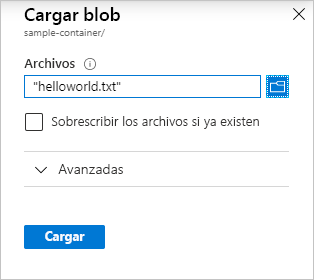

# Inicio rápido: Carga, descarga y enumeración de blobs con Azure Portal

En esta guía de inicio rápido, aprenderá a usar [Azure Portal](https://portal.azure.com/) para crear un contenedor en Azure Storage y para cargar y descargar los blobs en bloques en ese contenedor.

## Prerrequisitos

[!INCLUDE [storage-quickstart-prereq-include](../../../includes/storage-quickstart-prereq-include.md)]

## Crear un contenedor

Para crear un contenedor en Azure Portal, siga estos pasos:

1. Vaya a la nueva cuenta de almacenamiento en Azure Portal.
2. En el menú izquierdo de la cuenta de almacenamiento, desplácese a la sección **Blob service** y seleccione **Containers**.
3. Seleccione el botón **+ Contenedor**.
4. Escriba un nombre para el nuevo contenedor. El nombre del contenedor debe escribirse en minúsculas, comenzar por una letra o un número, y solo puede incluir letras, números y el carácter de guión (-). Para más información sobre la nomenclatura de contenedores y blobs, consulte [Naming and Referencing Containers, Blobs, and Metadata](https://docs.microsoft.com/rest/api/storageservices/naming-and-referencing-containers--blobs--and-metadata) (Asignación de nombres y referencia a contenedores, blobs y metadatos).
5. Establezca el nivel de acceso público al contenedor. El nivel predeterminado es **Private (no anonymous access)** [Privado (sin acceso anónimo)].
6. Seleccione **Aceptar** para crear el contenedor.

    

## Carga de un blob en bloques

Los blobs en bloques se componen de bloques de datos que se ensamblan para formar un blob. En la mayoría de los escenarios en los que se usa Blog Storage se emplean blobs en bloques. Resultan ideales para almacenar datos de texto y binarios en la nube, como archivos, imágenes y vídeos. Esta guía de inicio rápido muestra cómo trabajar con blobs en bloques.

Para cargar un blob en bloques en el nuevo contenedor en Azure Portal, siga estos pasos:

1. En Azure Portal, vaya al contenedor que creó en la sección anterior.
1. Seleccione el contenedor para mostrar una lista de los blobs que contiene. Este contenedor es nuevo, por lo que aún no contiene blobs.
1. Seleccione el botón **Cargar** para abrir la hoja Cargar y examine el sistema de archivos local para buscar un archivo para cargarlo como un blob en bloques. Opcionalmente, puede expandir la sección de opciones avanzadas para configurar otros valores de la operación de carga.

    

1. Seleccione botón **Upload** para cargar el blob.
1. Cargue tantos blobs como desee de esta manera. Verá que ahora aparecen los nuevos blobs dentro del contenedor.

## Descarga de un blob en bloques

Puede descargar un blob en bloques para mostrarlo en el explorador o guardarlo en el sistema de archivos local. Para descargar un blob en bloques, siga estos pasos:

1. Vaya a la lista de blobs que cargó en la sección anterior.
1. Haga clic con el botón derecho en el blob que va a descargar y seleccione **Descargar**.

## Limpieza de recursos

Para quitar los recursos creados en esta guía de inicio rápido, puede eliminar el contenedor. También se eliminarán todos los blobs del contenedor.

Para eliminar el contenedor:

1. En Azure Portal, vaya a la lista de contenedores en la cuenta de almacenamiento.
1. Seleccione el contenedor que desee eliminar.
1. Seleccione el botón **Más** ( **...** ) y, después, **Eliminar**.
1. Confirme que desea eliminar el contenedor.

## Pasos siguientes

En esta guía de inicio rápido ha aprendido a transferir archivos entre un disco local y Azure Blob Storage mediante Azure Portal. Para más información sobre cómo trabajar con Blob Storage, continúe con los procedimientos de Blob Storage.

> [!div class="nextstepaction"]
> [Procedimientos de las operaciones de Blob Storage](storage-dotnet-how-to-use-blobs.md)
