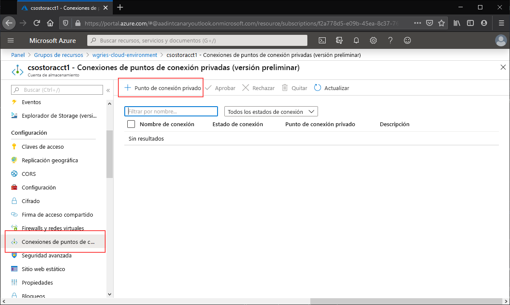
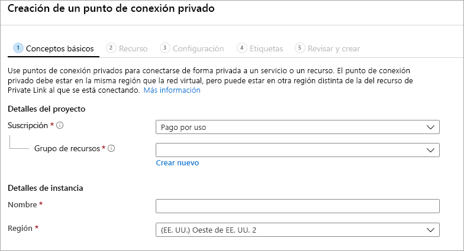
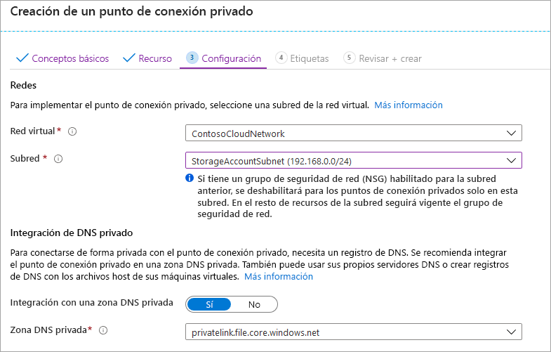
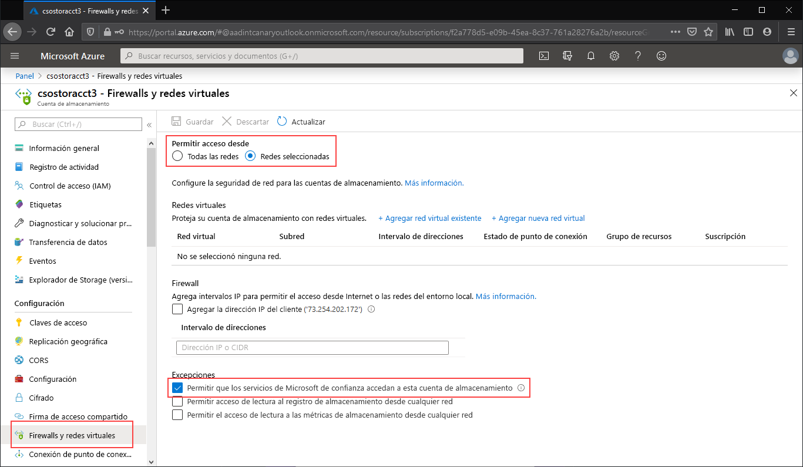
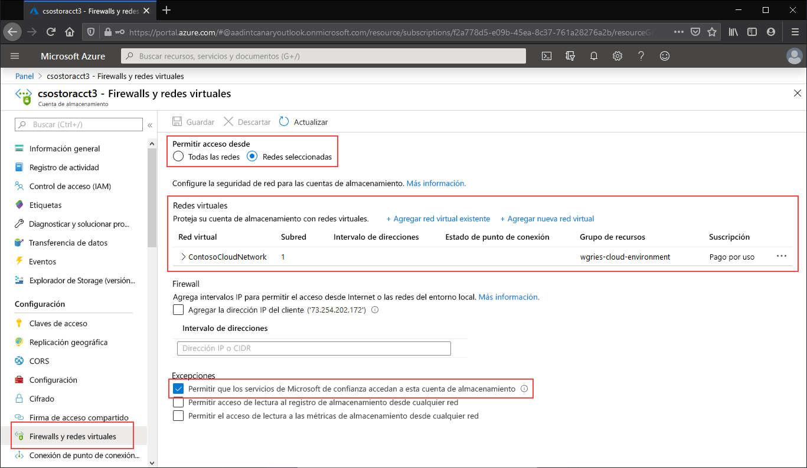

# <a name="configuring-azure-files-network-endpoints"></a>Configuración de puntos de conexión de red de Azure Files
Azure Files proporciona dos tipos principales de puntos de conexión para el acceso a los recursos compartidos de archivos de Azure: 
- Puntos de conexión públicos, que tienen una dirección IP pública y a los que se puede acceder desde cualquier parte del mundo.
- Puntos de conexión privados, que existen dentro de una red virtual y tienen una dirección IP privada en el espacio de direcciones de esa red virtual.

Los puntos de conexión públicos y privados existen en la cuenta de almacenamiento de Azure. Una cuenta de almacenamiento es una construcción de administración que representa un grupo compartido de almacenamiento en el que puede implementar varios recursos compartidos de archivos u otros recursos de almacenamiento, como contenedores de blobs o colas.

Este artículo se centra en cómo configurar los puntos de conexión de una cuenta de almacenamiento para acceder directamente al recurso compartido de archivos de Azure. La mayoría de los detalles proporcionados en este documento también se aplican al modo en que Azure File Sync interopera con puntos de conexión públicos y privados de la cuenta de almacenamiento; sin embargo, para más información sobre las consideraciones de redes para una implementación de Azure File Sync, consulte [Configuración del proxy y el firewall de Azure File Sync](storage-sync-files-firewall-and-proxy.md).

Se recomienda leer [Consideraciones de redes para Azure Files](storage-files-networking-overview.md) antes de pasar a esta guía de procedimientos.

## <a name="prerequisites"></a>Prerrequisitos
- En este artículo se supone que ya ha creado una suscripción a Azure. Si todavía no tiene una suscripción, cree una [cuenta gratuita](https://azure.microsoft.com/free/?WT.mc_id=A261C142F) antes de empezar.
- En este artículo se supone que ya ha creado un recurso compartido de archivos de Azure en una cuenta de almacenamiento a la que le gustaría conectarse desde el entorno local. Para aprender a crear un recurso compartido de archivos de Azure, consulte [Creación de un recurso compartido de archivos de Azure](storage-how-to-create-file-share.md).
- Si planea usar Azure PowerShell, [instale la versión más reciente](https://docs.microsoft.com/powershell/azure/install-az-ps).
- Si planea usar la CLI de Azure, [instale la versión más reciente](https://docs.microsoft.com/cli/azure/install-azure-cli?view=azure-cli-latest).

## <a name="create-a-private-endpoint"></a>Creación de un punto de conexión privado
La creación de un punto de conexión privado para la cuenta de almacenamiento hará que se implementen los siguientes recursos de Azure:

- **Punto de conexión privado**: un recurso de Azure que representa el punto de conexión privado de la cuenta de almacenamiento. Puede considerarlo como un recurso que conecta una cuenta de almacenamiento y una interfaz de red.
- **Interfaz de red (NIC)** : la interfaz de red que mantiene una dirección IP privada dentro de la red virtual o subred especificadas. Es el mismo recurso exacto que se implementa cuando se implementa una máquina virtual, pero en lugar de asignarlo a una máquina virtual, es propiedad del punto de conexión privado.
- **Zona DNS privada**: si nunca ha implementado antes un punto de conexión privado para esta red virtual, se implementará una nueva zona DNS privada para ella. También se creará en esta zona DNS un registro D de DNS para la cuenta de almacenamiento. Si ya ha implementado un punto de conexión privado en esta red virtual, se agregará a la zona DNS existente un nuevo registro D para la cuenta de almacenamiento. La implementación de una zona DNS es opcional, sin embargo, es muy recomendable y necesaria si va a montar los recursos compartidos de archivos de Azure con una entidad de servicio de AD o mediante la API FileREST.

> [!Note]  
> En este artículo se usa el sufijo DNS de la cuenta de almacenamiento para las regiones públicas de Azure `core.windows.net`. Este comentario también se aplica a nubes soberanas de Azure, como la nube de Azure US Government y la nube de Azure China; simplemente sustituya los sufijos adecuados en su entorno. 

# <a name="portal"></a>[Portal](#tab/azure-portal)
Vaya a la cuenta de almacenamiento para la que desea crear un punto de conexión privado. En la tabla de contenido de la cuenta de almacenamiento, seleccione **Conexiones de punto de conexión privado** y, luego, **+ Punto de conexión privado** para crear un punto de conexión privado. 



El asistente resultante tiene varias páginas que debe completar:

En la hoja **Aspectos básicos**, seleccione el grupo de recursos, el nombre y la región que quiera para el punto de conexión privado. Estos pueden ser cualquier cosa que desee, no tienen que coincidir con la cuenta de almacenamiento en ningún aspecto, aunque debe crear el punto de conexión privado en la misma región que la red virtual en la que quiere crear el punto de conexión privado.



En la hoja **Recurso**, seleccione el botón de radio **Connect to an Azure resource in my directory** (Conectarse a un recurso de Azure en mi directorio). En **Tipo de recurso**, seleccione **Microsoft.Storage/storageAccounts** para el tipo de recurso. El campo **Recurso** es la cuenta de almacenamiento con el recurso compartido de archivos de Azure al que quiere conectarse. El recurso secundario de destino es **archivo**, ya que es para Azure Files.

La hoja **Configuración** permite seleccionar la red virtual y la subred específicas a las que le gustaría agregar el punto de conexión privado. Seleccione la red virtual que creó anteriormente. Debe seleccionar una subred distinta de la subred en la que agregó el punto de conexión de servicio anteriormente. La hoja Configuración también contiene la información para crear o actualizar la zona DNS privada. Se recomienda usar la zona `privatelink.file.core.windows.net` predeterminada.



Haga clic en **Revisar y crear** para crear el punto de conexión privado. 

Si tiene una máquina virtual dentro de la red virtual o ha configurado el reenvío de DNS tal como se describe [aquí](storage-files-networking-dns.md), puede comprobar que el punto de conexión privado se ha configurado correctamente mediante la ejecución de los siguientes comandos desde PowerShell, la línea de comandos o el terminal (sirve para Windows, Linux o macOS). Debe reemplazar `<storage-account-name>` por el nombre adecuado de la cuenta de almacenamiento:

```
nslookup <storage-account-name>.file.core.windows.net
```

Si todo ha funcionado correctamente, verá la siguiente salida, donde `192.168.0.5` es la dirección IP privada del punto de conexión privado de la red virtual (salida mostrada para Windows):

```Output
Server:  UnKnown
Address:  10.2.4.4

Non-authoritative answer:
Name:    storageaccount.privatelink.file.core.windows.net
Address:  192.168.0.5
Aliases:  storageaccount.file.core.windows.net
```

# <a name="powershell"></a>[PowerShell](#tab/azure-powershell)
Para crear un punto de conexión privado para la cuenta de almacenamiento, primero debe obtener una referencia a la cuenta de almacenamiento y la subred de la red virtual a la que quiere agregar el punto de conexión privado. Reemplace `<storage-account-resource-group-name>`, `<storage-account-name>`, `<vnet-resource-group-name>`, `<vnet-name>` y `<vnet-subnet-name>` a continuación:

```PowerShell
$storageAccountResourceGroupName = "<storage-account-resource-group-name>"
$storageAccountName = "<storage-account-name>"
$virtualNetworkResourceGroupName = "<vnet-resource-group-name>"
$virtualNetworkName = "<vnet-name>"
$subnetName = "<vnet-subnet-name>"

# Get storage account reference, and throw error if it doesn't exist
$storageAccount = Get-AzStorageAccount `
        -ResourceGroupName $storageAccountResourceGroupName `
        -Name $storageAccountName `
        -ErrorAction SilentlyContinue

if ($null -eq $storageAccount) {
    $errorMessage = "Storage account $storageAccountName not found "
    $errorMessage += "in resource group $storageAccountResourceGroupName."
    Write-Error -Message $errorMessage -ErrorAction Stop
}

# Get virtual network reference, and throw error if it doesn't exist
$virtualNetwork = Get-AzVirtualNetwork `
        -ResourceGroupName $virtualNetworkResourceGroupName `
        -Name $virtualNetworkName `
        -ErrorAction SilentlyContinue

if ($null -eq $virtualNetwork) {
    $errorMessage = "Virtual network $virtualNetworkName not found "
    $errorMessage += "in resource group $virtualNetworkResourceGroupName."
    Write-Error -Message $errorMessage -ErrorAction Stop
}

# Get reference to virtual network subnet, and throw error if it doesn't exist
$subnet = $virtualNetwork | `
    Select-Object -ExpandProperty Subnets | `
    Where-Object { $_.Name -eq $subnetName }

if ($null -eq $subnet) {
    Write-Error `
            -Message "Subnet $subnetName not found in virtual network $virtualNetworkName." `
            -ErrorAction Stop
}
```

Para crear un punto de conexión privado, debe crear una conexión de servicio de vínculo privado a la cuenta de almacenamiento. La conexión de servicio de vínculo privado es una entrada para la creación del punto de conexión privado. 

```PowerShell
# Disable private endpoint network policies
$subnet.PrivateEndpointNetworkPolicies = "Disabled"
$virtualNetwork | Set-AzVirtualNetwork | Out-Null

# Create a private link service connection to the storage account.
$privateEndpointConnection = New-AzPrivateLinkServiceConnection `
        -Name "$storageAccountName-Connection" `
        -PrivateLinkServiceId $storageAccount.Id `
        -GroupId "file"

# Create a new private endpoint.
$privateEndpoint = New-AzPrivateEndpoint `
        -ResourceGroupName $storageAccountResourceGroupName `
        -Name "$storageAccountName-PrivateEndpoint" `
        -Location $virtualNetwork.Location `
        -Subnet $subnet `
        -PrivateLinkServiceConnection $privateEndpointConnection `
        -ErrorAction Stop
```

La creación de una zona DNS privada de Azure permite que el nombre original de la cuenta de almacenamiento, como `storageaccount.file.core.windows.net`, se resuelva en la dirección IP privada dentro de la red virtual. Aunque desde el punto de vista de la creación de un punto de conexión privado este paso es opcional, se necesita explícitamente para montar el recurso compartido de archivos de Azure mediante una entidad de seguridad de usuario de AD o para permitir el acceso mediante la API REST.  

```PowerShell
# Get the desired storage account suffix (core.windows.net for public cloud).
# This is done like this so this script will seamlessly work for non-public Azure.
$storageAccountSuffix = Get-AzContext | `
    Select-Object -ExpandProperty Environment | `
    Select-Object -ExpandProperty StorageEndpointSuffix

# For public cloud, this will generate the following DNS suffix:
# privatelink.file.core.windows.net.
$dnsZoneName = "privatelink.file.$storageAccountSuffix"

# Find a DNS zone matching desired name attached to this virtual network.
$dnsZone = Get-AzPrivateDnsZone | `
    Where-Object { $_.Name -eq $dnsZoneName } | `
    Where-Object {
        $privateDnsLink = Get-AzPrivateDnsVirtualNetworkLink `
                -ResourceGroupName $_.ResourceGroupName `
                -ZoneName $_.Name `
                -ErrorAction SilentlyContinue
        
        $privateDnsLink.VirtualNetworkId -eq $virtualNetwork.Id
    }

if ($null -eq $dnsZone) {
    # No matching DNS zone attached to virtual network, so create new one.
    $dnsZone = New-AzPrivateDnsZone `
            -ResourceGroupName $virtualNetworkResourceGroupName `
            -Name $dnsZoneName `
            -ErrorAction Stop

    $privateDnsLink = New-AzPrivateDnsVirtualNetworkLink `
            -ResourceGroupName $virtualNetworkResourceGroupName `
            -ZoneName $dnsZoneName `
            -Name "$virtualNetworkName-DnsLink" `
            -VirtualNetworkId $virtualNetwork.Id `
            -ErrorAction Stop
}
```

Ahora que tiene una referencia a la zona DNS privada, debe crear un registro D para la cuenta de almacenamiento.

```PowerShell
$privateEndpointIP = $privateEndpoint | `
    Select-Object -ExpandProperty NetworkInterfaces | `
    Select-Object @{ 
        Name = "NetworkInterfaces"; 
        Expression = { Get-AzNetworkInterface -ResourceId $_.Id } 
    } | `
    Select-Object -ExpandProperty NetworkInterfaces | `
    Select-Object -ExpandProperty IpConfigurations | `
    Select-Object -ExpandProperty PrivateIpAddress

$privateDnsRecordConfig = New-AzPrivateDnsRecordConfig `
        -IPv4Address $privateEndpointIP

New-AzPrivateDnsRecordSet `
        -ResourceGroupName $virtualNetworkResourceGroupName `
        -Name $storageAccountName `
        -RecordType A `
        -ZoneName $dnsZoneName `
        -Ttl 600 `
        -PrivateDnsRecords $privateDnsRecordConfig `
        -ErrorAction Stop | `
    Out-Null
```

Si tiene una máquina virtual dentro de la red virtual o ha configurado el reenvío de DNS tal como se describe [aquí](storage-files-networking-dns.md), puede comprobar que el punto de conexión privado se ha configurado correctamente mediante los siguientes comandos:

```PowerShell
$storageAccountHostName = [System.Uri]::new($storageAccount.PrimaryEndpoints.File) | `
    Select-Object -ExpandProperty Host

Resolve-DnsName -Name $storageAccountHostName
```

Si todo ha funcionado correctamente, verá la siguiente salida, donde `192.168.0.5` es la dirección IP privada del punto de conexión privado de la red virtual:

```Output
Name                             Type   TTL   Section    NameHost
----                             ----   ---   -------    --------
storageaccount.file.core.windows CNAME  60    Answer     storageaccount.privatelink.file.core.windows.net
.net

Name       : storageaccount.privatelink.file.core.windows.net
QueryType  : A
TTL        : 600
Section    : Answer
IP4Address : 192.168.0.5
```

# <a name="azure-cli"></a>[CLI de Azure](#tab/azure-cli)
Para crear un punto de conexión privado para la cuenta de almacenamiento, primero debe obtener una referencia a la cuenta de almacenamiento y la subred de la red virtual a la que quiere agregar el punto de conexión privado. Reemplace `<storage-account-resource-group-name>`, `<storage-account-name>`, `<vnet-resource-group-name>`, `<vnet-name>` y `<vnet-subnet-name>` a continuación:

```bash
storageAccountResourceGroupName="<storage-account-resource-group-name>"
storageAccountName="<storage-account-name>"
virtualNetworkResourceGroupName="<vnet-resource-group-name>"
virtualNetworkName="<vnet-name>"
subnetName="<vnet-subnet-name>"

# Get storage account ID 
storageAccount=$(az storage account show \
        --resource-group $storageAccountResourceGroupName \
        --name $storageAccountName \
        --query "id" | \
    tr -d '"')

# Get virtual network ID
virtualNetwork=$(az network vnet show \
        --resource-group $virtualNetworkResourceGroupName \
        --name $virtualNetworkName \
        --query "id" | \
    tr -d '"')

# Get subnet ID
subnet=$(az network vnet subnet show \
        --resource-group $virtualNetworkResourceGroupName \
        --vnet-name $virtualNetworkName \
        --name $subnetName \
        --query "id" | \
    tr -d '"')
```

Para crear un punto de conexión privado, primero debe asegurarse de que la directiva de red del punto de conexión privado de la subred está establecida en deshabilitado. Después, puede crear un punto de conexión privado con el comando `az network private-endpoint create`.

```bash
# Disable private endpoint network policies
az network vnet subnet update \
        --ids $subnet \
        --disable-private-endpoint-network-policies \
        --output none

# Get virtual network location
region=$(az network vnet show \
        --ids $virtualNetwork \
        --query "location" | \
    tr -d '"')

# Create a private endpoint
privateEndpoint=$(az network private-endpoint create \
        --resource-group $virtualNetworkResourceGroupName \
        --name "$storageAccountName-PrivateEndpoint" \
        --location $region \
        --subnet $subnet \
        --private-connection-resource-id $storageAccount \
        --group-ids "file" \
        --connection-name "$storageAccountName-Connection" \
        --query "id" | \
    tr -d '"')
```

La creación de una zona DNS privada de Azure permite que el nombre original de la cuenta de almacenamiento, como `storageaccount.file.core.windows.net`, se resuelva en la dirección IP privada dentro de la red virtual. Aunque desde el punto de vista de la creación de un punto de conexión privado este paso es opcional, se necesita explícitamente para montar el recurso compartido de archivos de Azure mediante una entidad de seguridad de usuario de AD o para permitir el acceso mediante la API REST.  

```bash
# Get the desired storage account suffix (core.windows.net for public cloud).
# This is done like this so this script will seamlessly work for non-public Azure.
storageAccountSuffix=$(az cloud show \
        --query "suffixes.storageEndpoint" | \
    tr -d '"')

# For public cloud, this will generate the following DNS suffix:
# privatelink.file.core.windows.net.
dnsZoneName="privatelink.file.$storageAccountSuffix"

# Find a DNS zone matching desired name attached to this virtual network.
possibleDnsZones=$(az network private-dns zone list \
        --query "[?name == '$dnsZoneName'].id" \
        --output tsv)

for possibleDnsZone in $possibleDnsZones
do
    possibleResourceGroupName=$(az resource show \
            --ids $possibleDnsZone \
            --query "resourceGroup" | \
        tr -d '"')
    
    link=$(az network private-dns link vnet list \
            --resource-group $possibleResourceGroupName \
            --zone-name $dnsZoneName \
            --query "[?virtualNetwork.id == '$virtualNetwork'].id" \
            --output tsv)
    
    if [ -z $link ]
    then
        1 > /dev/null
    else 
        dnsZoneResourceGroup=$possibleResourceGroupName
        dnsZone=$possibleDnsZone
        break
    fi  
done

if [ -z $dnsZone ]
then
    # No matching DNS zone attached to virtual network, so create a new one
    dnsZone=$(az network private-dns zone create \
            --resource-group $virtualNetworkResourceGroupName \
            --name $dnsZoneName \
            --query "id" | \
        tr -d '"')
    
    az network private-dns link vnet create \
            --resource-group $resourceGroupName \
            --zone-name $zoneName \
            --name "$virtualNetworkName-DnsLink" \
            --virtual-network $virtualNetwork \
            --registration-enabled false \
            --output none
fi
```

Ahora que tiene una referencia a la zona DNS privada, debe crear un registro D para la cuenta de almacenamiento.

```bash
privateEndpointNIC=$(az network private-endpoint show \
        --ids $privateEndpoint \
        --query "networkInterfaces[0].id" | \
    tr -d '"')

privateEndpointIP=$(az network nic show \
        --ids $privateEndpointNIC \
        --query "ipConfigurations[0].privateIpAddress" | \
    tr -d '"')

az network private-dns record-set a create \
        --resource-group $dnsZoneResourceGroup \
        --zone-name $dnsZoneName \
        --name $storageAccountName \
        --output none

az network private-dns record-set a add-record \
        --resource-group $dnsZoneResourceGroup \
        --zone-name $dnsZoneName \
        --record-set-name $storageAccountName \
        --ipv4-address $privateEndpointIP \
        --output none
```

Si tiene una máquina virtual dentro de la red virtual o ha configurado el reenvío de DNS tal como se describe [aquí](storage-files-networking-dns.md), puede comprobar que el punto de conexión privado se ha configurado correctamente mediante los siguientes comandos:

```bash
httpEndpoint=$(az storage account show \
        --resource-group $storageAccountResourceGroupName \
        --name $storageAccountName \
        --query "primaryEndpoints.File" | \
    tr -d '"')

hostName=$(echo $httpEndpoint | cut -c7-$(expr length $httpEndpoint) | tr -d "/")
nslookup $hostName
```

Si todo ha funcionado correctamente, verá la siguiente salida, donde `192.168.0.5` es la dirección IP privada del punto de conexión privado de la red virtual:

```Output
Server:         127.0.0.53
Address:        127.0.0.53#53

Non-authoritative answer:
storageaccount.file.core.windows.net      canonical name = storageaccount.privatelink.file.core.windows.net.
Name:   storageaccount.privatelink.file.core.windows.net
Address: 192.168.0.5
```

---

## <a name="restrict-access-to-the-public-endpoint"></a>Restricción del acceso al punto de conexión público
Puede restringir el acceso al punto de conexión público mediante la configuración del firewall de la cuenta de almacenamiento. En general, la mayoría de las directivas de firewall de una cuenta de almacenamiento restringirán el acceso de red a una o varias redes virtuales. Existen dos enfoques para restringir el acceso de una cuenta de almacenamiento a una red virtual:

- [Cree uno o varios puntos de conexión privados para la cuenta de almacenamiento](#create-a-private-endpoint) y restrinja todo el acceso al punto de conexión público. De esta forma se garantiza que solo el tráfico que se origina en las redes virtuales deseadas pueda acceder a los recursos compartidos de archivos de Azure dentro de la cuenta de almacenamiento.
- Restrinja el punto de conexión público a una o más redes virtuales. Para ello, se usa una funcionalidad de la red virtual llamada *puntos de conexión de servicio*. Al restringir el tráfico a una cuenta de almacenamiento a través de un punto de conexión de servicio, sigue teniendo acceso a la cuenta de almacenamiento a través de la dirección IP pública.

### <a name="restrict-all-access-to-the-public-endpoint"></a>Restricción de todo el acceso al punto de conexión público
Aunque todo el acceso al punto de conexión público esté restringido, se puede acceder a la cuenta de almacenamiento mediante los puntos de conexión privados. De lo contrario, se rechazarán las solicitudes válidas al punto de conexión público de la cuenta de almacenamiento. 

# <a name="portal"></a>[Portal](#tab/azure-portal)
Vaya a la cuenta de almacenamiento para la que desea restringir todo el acceso al punto de conexión público. En la tabla de contenido de la cuenta de almacenamiento, seleccione la entrada **Firewalls y redes virtuales**.

En la parte superior de la página, seleccione el botón de radio **Redes seleccionadas**. Esta acción anulará la ocultación de una serie de opciones para controlar la restricción del punto de conexión público. Active **Allow trusted Microsoft services to access this service account** (Permitir que los servicios de Microsoft de confianza accedan a esta cuenta de servicio) para permitir que servicios de confianza de terceros, como Azure File Sync, accedan a la cuenta de almacenamiento.



# <a name="powershell"></a>[PowerShell](#tab/azure-powershell)
El siguiente comando de PowerShell denegará todo el tráfico que llega al punto de conexión público de la cuenta de almacenamiento. Tenga en cuenta que este comando tiene el parámetro `-Bypass` establecido en `AzureServices`. De esta forma, los servicios propios de confianza, como Azure File Sync, acceden a la cuenta de almacenamiento mediante el punto de conexión público.

```PowerShell
# This assumes $storageAccount is still defined from the beginning of this of this guide.
$storageAccount | Update-AzStorageAccountNetworkRuleSet `
        -DefaultAction Deny `
        -Bypass AzureServices `
        -WarningAction SilentlyContinue `
        -ErrorAction Stop | `
    Out-Null
```

# <a name="azure-cli"></a>[CLI de Azure](#tab/azure-cli)
El siguiente comando de la CLI denegará todo el tráfico que llega al punto de conexión público de la cuenta de almacenamiento. Tenga en cuenta que este comando tiene el parámetro `-bypass` establecido en `AzureServices`. De esta forma, los servicios propios de confianza, como Azure File Sync, acceden a la cuenta de almacenamiento mediante el punto de conexión público.

```bash
# This assumes $storageAccountResourceGroupName and $storageAccountName 
# are still defined from the beginning of this guide.
az storage account update \
    --resource-group $storageAccountResourceGroupName \
    --name $storageAccountName \
    --bypass "AzureServices" \
    --default-action "Deny" \
    --output none
```
---

### <a name="restrict-access-to-the-public-endpoint-to-specific-virtual-networks"></a>Restricción del acceso al punto de conexión público a redes virtuales específicas
Al restringir la cuenta de almacenamiento a redes virtuales específicas, se permiten solicitudes al punto de conexión público en las redes virtuales especificadas. Para ello, se usa una funcionalidad de la red virtual llamada *puntos de conexión de servicio*. Esta funcionalidad se puede usar con o sin puntos de conexión privados.

# <a name="portal"></a>[Portal](#tab/azure-portal)
Vaya a la cuenta de almacenamiento para la que desea restringir el punto de conexión público a redes virtuales específicas. En la tabla de contenido de la cuenta de almacenamiento, seleccione la entrada **Firewalls y redes virtuales**. 

En la parte superior de la página, seleccione el botón de radio **Redes seleccionadas**. Esta acción anulará la ocultación de una serie de opciones para controlar la restricción del punto de conexión público. Haga clic en **+ Add existing virtual network** (+ Agregar red virtual existente) para seleccionar la red virtual específica a la que se debe permitir el acceso a la cuenta de almacenamiento a través del punto de conexión público. Para ello, es necesario seleccionar una red virtual y una subred para esa red virtual. 

Active **Allow trusted Microsoft services to access this service account** (Permitir que los servicios de Microsoft de confianza accedan a esta cuenta de servicio) para permitir que servicios de confianza de terceros, como Azure File Sync, accedan a la cuenta de almacenamiento.



# <a name="powershell"></a>[PowerShell](#tab/azure-powershell)
Para restringir el acceso al punto de conexión público de la cuenta de almacenamiento a redes virtuales específicas mediante puntos de conexión de servicio, primero es necesario recopilar información sobre la cuenta de almacenamiento y la red virtual. Rellene `<storage-account-resource-group>`, `<storage-account-name>`, `<vnet-resource-group-name>`, `<vnet-name>` y `<subnet-name>` para recopilar esta información.

```PowerShell
$storageAccountResourceGroupName = "<storage-account-resource-group>"
$storageAccountName = "<storage-account-name>"
$restrictToVirtualNetworkResourceGroupName = "<vnet-resource-group-name>"
$restrictToVirtualNetworkName = "<vnet-name>"
$subnetName = "<subnet-name>"

$storageAccount = Get-AzStorageAccount `
        -ResourceGroupName $storageAccountResourceGroupName `
        -Name $storageAccountName `
        -ErrorAction Stop

$virtualNetwork = Get-AzVirtualNetwork `
        -ResourceGroupName $restrictToVirtualNetworkResourceGroupName `
        -Name $restrictToVirtualNetworkName `
        -ErrorAction Stop

$subnet = $virtualNetwork | `
    Select-Object -ExpandProperty Subnets | `
    Where-Object { $_.Name -eq $subnetName }

if ($null -eq $subnet) {
    Write-Error `
            -Message "Subnet $subnetName not found in virtual network $restrictToVirtualNetworkName." `
            -ErrorAction Stop
}
```

Para que el tejido de red de Azure permita que el tráfico de la red virtual llegue al punto de conexión público de la cuenta de almacenamiento, la subred de la red virtual debe tener expuesto el punto de conexión de servicio `Microsoft.Storage`. Los siguientes comandos de PowerShell agregarán el punto de conexión de servicio `Microsoft.Storage` a la subred, si aún no está ahí.

```PowerShell
$serviceEndpoints = $subnet | `
    Select-Object -ExpandProperty ServiceEndpoints | `
    Select-Object -ExpandProperty Service

if ($serviceEndpoints -notcontains "Microsoft.Storage") {
    if ($null -eq $serviceEndpoints) {
        $serviceEndpoints = @("Microsoft.Storage")
    } elseif ($serviceEndpoints -is [string]) {
        $serviceEndpoints = @($serviceEndpoints, "Microsoft.Storage")
    } else {
        $serviceEndpoints += "Microsoft.Storage"
    }

    $virtualNetwork = $virtualNetwork | Set-AzVirtualNetworkSubnetConfig `
            -Name $subnetName `
            -AddressPrefix $subnet.AddressPrefix `
            -ServiceEndpoint $serviceEndpoints `
            -WarningAction SilentlyContinue `
            -ErrorAction Stop | `
        Set-AzVirtualNetwork `
            -ErrorAction Stop
}
```

El último paso en la restricción del tráfico a la cuenta de almacenamiento es crear una regla de red y agregarla al conjunto de reglas de red de la cuenta de almacenamiento.

```PowerShell
$networkRule = $storageAccount | Add-AzStorageAccountNetworkRule `
    -VirtualNetworkResourceId $subnet.Id `
    -ErrorAction Stop

$storageAccount | Update-AzStorageAccountNetworkRuleSet `
        -DefaultAction Deny `
        -Bypass AzureServices `
        -VirtualNetworkRule $networkRule `
        -WarningAction SilentlyContinue `
        -ErrorAction Stop | `
    Out-Null
```

# <a name="azure-cli"></a>[CLI de Azure](#tab/azure-cli)
Para restringir el acceso al punto de conexión público de la cuenta de almacenamiento a redes virtuales específicas mediante puntos de conexión de servicio, primero es necesario recopilar información sobre la cuenta de almacenamiento y la red virtual. Rellene `<storage-account-resource-group>`, `<storage-account-name>`, `<vnet-resource-group-name>`, `<vnet-name>` y `<subnet-name>` para recopilar esta información.

```bash
storageAccountResourceGroupName="<storage-account-resource-group>"
storageAccountName="<storage-account-name>"
restrictToVirtualNetworkResourceGroupName="<vnet-resource-group-name>"
restrictToVirtualNetworkName="<vnet-name>"
subnetName="<subnet-name>"

storageAccount=$(az storage account show \
        --resource-group $storageAccountResourceGroupName \
        --name $storageAccountName \
        --query "id" | \
    tr -d '"')

virtualNetwork=$(az network vnet show \
        --resource-group $restrictToVirtualNetworkResourceGroupName \
        --name $restrictToVirtualNetworkName \
        --query "id" | \
    tr -d '"')

subnet=$(az network vnet subnet show \
        --resource-group $restrictToVirtualNetworkResourceGroupName \
        --vnet-name $restrictToVirtualNetworkName \
        --name $subnetName \
        --query "id" | \
    tr -d '"')
```

Para que el tejido de red de Azure permita que el tráfico de la red virtual llegue al punto de conexión público de la cuenta de almacenamiento, la subred de la red virtual debe tener expuesto el punto de conexión de servicio `Microsoft.Storage`. Los siguientes comandos de la CLI de Azure agregarán el punto de conexión de servicio `Microsoft.Storage` a la subred, si aún no está ahí.

```bash
serviceEndpoints=$(az network vnet subnet show \
        --resource-group $restrictToVirtualNetworkResourceGroupName \
        --vnet-name $restrictToVirtualNetworkName \
        --name $subnetName \
        --query "serviceEndpoints[].service" \
        --output tsv)

foundStorageServiceEndpoint=false
for serviceEndpoint in $serviceEndpoints
do
    if [ $serviceEndpoint = "Microsoft.Storage" ]
    then
        foundStorageServiceEndpoint=true
    fi
done

if [ $foundStorageServiceEndpoint = false ] 
then
    serviceEndpointList=""

    for serviceEndpoint in $serviceEndpoints
    do
        serviceEndpointList+=$serviceEndpoint
        serviceEndpointList+=" "
    done
    
    serviceEndpointList+="Microsoft.Storage"

    az network vnet subnet update \
            --ids $subnet \
            --service-endpoints $serviceEndpointList \
            --output none
fi
```

El último paso en la restricción del tráfico a la cuenta de almacenamiento es crear una regla de red y agregarla al conjunto de reglas de red de la cuenta de almacenamiento.

```bash
az storage account network-rule add \
        --resource-group $storageAccountResourceGroupName \
        --account-name $storageAccountName \
        --subnet $subnet \
        --output none

az storage account update \
        --resource-group $storageAccountResourceGroupName \
        --name $storageAccountName \
        --bypass "AzureServices" \
        --default-action "Deny" \
        --output none
```

---

## <a name="see-also"></a>Consulte también
- [Consideraciones de redes para Azure Files](storage-files-networking-overview.md)
- [Configuración del reenvío de DNS para Azure Files](storage-files-networking-dns.md)
- [Configuración de VPN S2S para Azure Files](storage-files-configure-s2s-vpn.md)