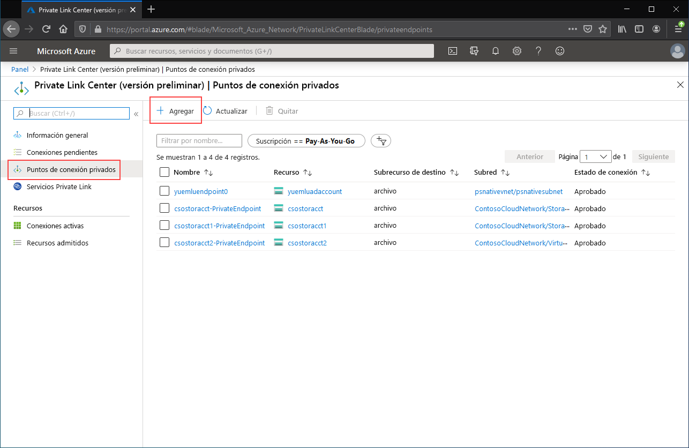
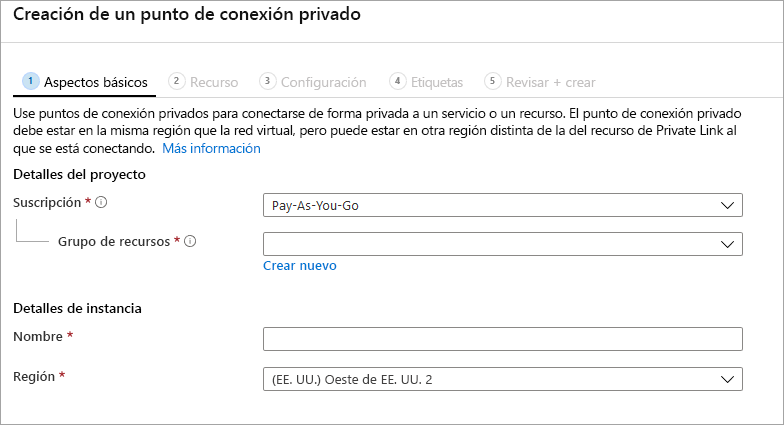

# <a name="configuring-azure-file-sync-network-endpoints"></a>Configuración de puntos de conexión de red de Azure File Sync
Azure Files y Azure File Sync proporcionan dos tipos principales de puntos de conexión para el acceso a los recursos compartidos de archivos de Azure: 
- Puntos de conexión públicos, que tienen una dirección IP pública y a los que se puede acceder desde cualquier parte del mundo.
- Puntos de conexión privados, que existen dentro de una red virtual y tienen una dirección IP privada en el espacio de direcciones de esa red virtual.

Tanto para Azure Files como para Azure File Sync, los objetos de administración de Azure, la cuenta de almacenamiento y el servicio de sincronización de almacenamiento, respectivamente, controlan los puntos de conexión públicos y privados. La cuenta de almacenamiento es una construcción de administración que representa un grupo compartido de almacenamiento en el que puede implementar varios recursos compartidos de archivos u otros recursos de almacenamiento, como contenedores de blobs o colas. El servicio de sincronización de almacenamiento es una construcción de administración que representa servidores registrados, que son servidores de archivos de Windows con una relación de confianza establecida con Azure File Sync, y grupos de sincronización, que definen la topología de la relación de sincronización. 

Este artículo se centra en cómo configurar los puntos de conexión de red para Azure Files y Azure File Sync. Para más información sobre cómo configurar los puntos de conexión de red para acceder directamente a los recursos compartidos de archivos de Azure, en lugar de almacenarlos en la caché local con Azure File Sync, consulte [Configuración de puntos de conexión de red de Azure Files](storage-files-networking-endpoints.md).

Se recomienda leer [Consideraciones de redes para Azure File Sync](storage-sync-files-networking-overview.md) antes de pasar a esta guía de procedimientos.

## <a name="prerequisites"></a>Requisitos previos 
En este artículo se da por hecho que:
- Tiene una suscripción de Azure. Si todavía no tiene una suscripción, cree una [cuenta gratuita](https://azure.microsoft.com/free/?WT.mc_id=A261C142F) antes de empezar.
- Ya ha creado un recurso compartido de archivos de Azure en una cuenta de almacenamiento a la que le gustaría conectarse desde el entorno local. Para aprender a crear un recurso compartido de archivos de Azure, consulte [Creación de un recurso compartido de archivos de Azure](storage-how-to-create-file-share.md).
- Ya ha creado un servicio de sincronización de almacenamiento con el que ha registrado el servidor de archivos de Windows. Para obtener información sobre cómo implementar Azure File Sync, consulte [Implementación de Azure File Sync](storage-sync-files-deployment-guide.md).

Además:
- Si planea usar Azure PowerShell, [instale la versión más reciente](https://docs.microsoft.com/powershell/azure/install-az-ps).
- Si planea usar la CLI de Azure, [instale la versión más reciente](https://docs.microsoft.com/cli/azure/install-azure-cli?view=azure-cli-latest).

## <a name="create-the-private-endpoints"></a>Creación de los puntos de conexión privados
Al crear un punto de conexión privado para un recurso de Azure, se implementan los recursos siguientes:

- **Punto de conexión privado**: recurso de Azure que representa el punto de conexión privado de la cuenta de almacenamiento o el servicio de sincronización de almacenamiento. Puede considerarlo un recurso que conecta su recurso de Azure y una interfaz de red.
- **Interfaz de red (NIC)** : la interfaz de red que mantiene una dirección IP privada dentro de la red virtual o subred especificadas. Es el mismo recurso exacto que se implementa cuando se implementa una máquina virtual, pero en lugar de asignarlo a una máquina virtual, es propiedad del punto de conexión privado.
- **Zona DNS privada**: si nunca ha implementado antes un punto de conexión privado para esta red virtual, se implementará una nueva zona DNS privada para ella. También se creará un registro D de DNS para el recurso de Azure en esta zona DNS. Si ya ha implementado un punto de conexión privado en esta red virtual, se agregará un nuevo registro D para el recurso de Azure a la zona DNS existente. La implementación de una zona DNS es opcional, pero se recomienda encarecidamente para simplificar la administración de DNS.

> [!Note]  
> En este artículo se usan los sufijos DNS para las regiones públicas de Azure, `core.windows.net` para las cuentas de almacenamiento y `afs.azure.net` para los servicios de sincronización de almacenamiento. Este comentario también se aplica a nubes soberanas de Azure, como la nube de Azure US Government; simplemente sustituya los sufijos adecuados en su entorno.

### <a name="create-the-storage-account-private-endpoint"></a>Creación del punto de conexión privado de la cuenta de almacenamiento
# <a name="portal"></a>[Portal](#tab/azure-portal)
[!INCLUDE [storage-files-networking-endpoints-private-portal](../../../includes/storage-files-networking-endpoints-private-portal.md)]

Si tiene una máquina virtual dentro de la red virtual o ha configurado el reenvío de DNS tal como se describe en [Configuración del reenvío de DNS para Azure Files](storage-files-networking-dns.md), puede comprobar que el punto de conexión privado se ha configurado correctamente mediante la ejecución de los siguientes comandos desde PowerShell, la línea de comandos o el terminal (sirve para Windows, Linux o macOS). Debe reemplazar `<storage-account-name>` por el nombre adecuado de la cuenta de almacenamiento:

```
nslookup <storage-account-name>.file.core.windows.net
```

Si todo ha funcionado correctamente, verá la siguiente salida, donde `192.168.0.5` es la dirección IP privada del punto de conexión privado de la red virtual (salida mostrada para Windows):

```Output
Server:  UnKnown
Address:  10.2.4.4

Non-authoritative answer:
Name:    storageaccount.privatelink.file.core.windows.net
Address:  192.168.0.5
Aliases:  storageaccount.file.core.windows.net
```

# <a name="powershell"></a>[PowerShell](#tab/azure-powershell)
[!INCLUDE [storage-files-networking-endpoints-private-powershell](../../../includes/storage-files-networking-endpoints-private-powershell.md)]

Si tiene una máquina virtual dentro de la red virtual o ha configurado el reenvío de DNS tal como se describe en [Configuración del reenvío de DNS para Azure Files](storage-files-networking-dns.md), puede comprobar que el punto de conexión privado se ha configurado correctamente mediante los siguientes comandos:

```PowerShell
$storageAccountHostName = [System.Uri]::new($storageAccount.PrimaryEndpoints.file) | `
    Select-Object -ExpandProperty Host

Resolve-DnsName -Name $storageAccountHostName
```

Si todo ha funcionado correctamente, verá la siguiente salida, donde `192.168.0.5` es la dirección IP privada del punto de conexión privado de la red virtual:

```Output
Name                             Type   TTL   Section    NameHost
----                             ----   ---   -------    --------
storageaccount.file.core.windows CNAME  60    Answer     storageaccount.privatelink.file.core.windows.net
.net

Name       : storageaccount.privatelink.file.core.windows.net
QueryType  : A
TTL        : 600
Section    : Answer
IP4Address : 192.168.0.5
```

# <a name="azure-cli"></a>[CLI de Azure](#tab/azure-cli)
[!INCLUDE [storage-files-networking-endpoints-private-cli](../../../includes/storage-files-networking-endpoints-private-cli.md)]

Si tiene una máquina virtual dentro de la red virtual o ha configurado el reenvío de DNS tal como se describe en [Configuración del reenvío de DNS para Azure Files](storage-files-networking-dns.md), puede comprobar que el punto de conexión privado se ha configurado correctamente mediante los siguientes comandos:

```bash
httpEndpoint=$(az storage account show \
        --resource-group $storageAccountResourceGroupName \
        --name $storageAccountName \
        --query "primaryEndpoints.file" | \
    tr -d '"')

hostName=$(echo $httpEndpoint | cut -c7-$(expr length $httpEndpoint) | tr -d "/")
nslookup $hostName
```

Si todo ha funcionado correctamente, verá la siguiente salida, donde `192.168.0.5` es la dirección IP privada del punto de conexión privado de la red virtual:

```Output
Server:         127.0.0.53
Address:        127.0.0.53#53

Non-authoritative answer:
storageaccount.file.core.windows.net      canonical name = storageaccount.privatelink.file.core.windows.net.
Name:   storageaccount.privatelink.file.core.windows.net
Address: 192.168.0.5
```

---

### <a name="create-the-storage-sync-private-endpoint"></a>Creación del punto de conexión privado de sincronización de almacenamiento
> [!Important]  
> Para usar puntos de conexión privados en el recurso del servicio de sincronización de almacenamiento, debe usar la versión del agente Azure File Sync versión 10.1 o superior. Las versiones del agente anteriores a 10.1 no admiten puntos de conexión privados en el servicio de sincronización de almacenamiento. Todas las versiones anteriores del agente admiten puntos de conexión privados en el recurso de la cuenta de almacenamiento.

# <a name="portal"></a>[Portal](#tab/azure-portal)
Vaya a **Private Link Center**. Para ello, escriba *Private Link* en la barra de búsqueda de la parte superior de Azure Portal. En la tabla de contenido de Private Link Center, seleccione **Puntos de conexión privados** y, luego, **+ Agregar** para crear un punto de conexión privado.

[](media/storage-sync-files-networking-endpoints/create-storage-sync-private-endpoint-0.png#lightbox)

El asistente resultante tiene varias páginas que debe completar:

En la hoja **Aspectos básicos**, seleccione el grupo de recursos, el nombre y la región que quiera para el punto de conexión privado. Estos pueden ser cualquier cosa que desee y no tienen que coincidir con el servicio de sincronización de almacenamiento en ningún aspecto, aunque debe crear el punto de conexión privado en la misma región que la red virtual en la que quiere crear el punto de conexión privado.



En la hoja **Recurso**, seleccione el botón de radio **Connect to an Azure resource in my directory** (Conectarse a un recurso de Azure en mi directorio). En **Tipo de recurso**, seleccione **Microsoft.StorageSync/storageSyncServices** para el tipo de recurso. 

La hoja **Configuración** permite seleccionar la red virtual y la subred específicas a las que le gustaría agregar el punto de conexión privado. Seleccione la misma red virtual que usó para la cuenta de almacenamiento anterior. La hoja Configuración también contiene la información para crear o actualizar la zona DNS privada.

Haga clic en **Revisar y crear** para crear el punto de conexión privado.

Para probar que el punto de conexión privado se ha configurado correctamente, ejecute los siguientes comandos de PowerShell. 

```powershell
$privateEndpointResourceGroupName = "<your-private-endpoint-resource-group>"
$privateEndpointName = "<your-private-endpoint-name>"

Get-AzPrivateEndpoint `
        -ResourceGroupName $privateEndpointResourceGroupName `
        -Name $privateEndpointName `
        -ErrorAction Stop | `
    Select-Object -ExpandProperty NetworkInterfaces | `
    Select-Object -ExpandProperty Id | `
    ForEach-Object { Get-AzNetworkInterface -ResourceId $_ } | `
    Select-Object -ExpandProperty IpConfigurations | `
    Select-Object -ExpandProperty PrivateLinkConnectionProperties | `
    Select-Object -ExpandProperty Fqdns | `
    ForEach-Object { Resolve-DnsName -Name $_ } | `
    Format-List
```

Si todo ha funcionado correctamente, debería ver la siguiente salida, donde `192.168.1.4`, `192.168.1.5`, `192.168.1.6` y `192.168.1.7` son las direcciones IP privadas asignadas al punto de conexión privado:

```Output
Name     : mysssmanagement.westus2.afs.azure.net
Type     : CNAME
TTL      : 60
Section  : Answer
NameHost : mysssmanagement.westus2.privatelink.afs.azure.net


Name       : mysssmanagement.westus2.privatelink.afs.azure.net
QueryType  : A
TTL        : 60
Section    : Answer
IP4Address : 192.168.1.4

Name     : myssssyncp.westus2.afs.azure.net
Type     : CNAME
TTL      : 60
Section  : Answer
NameHost : myssssyncp.westus2.privatelink.afs.azure.net


Name       : myssssyncp.westus2.privatelink.afs.azure.net
QueryType  : A
TTL        : 60
Section    : Answer
IP4Address : 192.168.1.5

Name     : myssssyncs.westus2.afs.azure.net
Type     : CNAME
TTL      : 60
Section  : Answer
NameHost : myssssyncs.westus2.privatelink.afs.azure.net


Name       : myssssyncs.westus2.privatelink.afs.azure.net
QueryType  : A
TTL        : 60
Section    : Answer
IP4Address : 192.168.1.6

Name     : mysssmonitoring.westus2.afs.azure.net
Type     : CNAME
TTL      : 60
Section  : Answer
NameHost : mysssmonitoring.westus2.privatelink.afs.azure.net


Name       : mysssmonitoring.westus2.privatelink.afs.azure.net
QueryType  : A
TTL        : 60
Section    : Answer
IP4Address : 192.168.1.7

```

# <a name="powershell"></a>[PowerShell](#tab/azure-powershell)
Para crear un punto de conexión privado para el servicio de sincronización de almacenamiento, primero debe obtener una referencia a dicho servicio. No olvide reemplazar `<storage-sync-service-resource-group>` y `<storage-sync-service>` por los valores correctos para su entorno. En los siguientes comandos de PowerShell se supone que está usando la información de la red virtual previamente rellenada anterior. 

```powershell
$storageSyncServiceResourceGroupName = "<storage-sync-service-resource-group>"
$storageSyncServiceName = "<storage-sync-service>"

$storageSyncService = Get-AzStorageSyncService `
        -ResourceGroupName $storageSyncServiceResourceGroupName `
        -Name $storageSyncServiceName `
        -ErrorAction SilentlyContinue

if ($null -eq $storageSyncService) {
    $errorMessage = "Storage Sync Service $storageSyncServiceName not found "
    $errorMessage += "in resource group $storageSyncServiceResourceGroupName."
    Write-Error -Message $errorMessage -ErrorAction Stop
}
```

Para crear un punto de conexión privado, debe crear una conexión de servicio Private Link privada al servicio de sincronización de almacenamiento. La conexión de Private Link es una entrada para la creación del punto de conexión privado.

```PowerShell 
# Disable private endpoint network policies
$subnet.PrivateEndpointNetworkPolicies = "Disabled"
$virtualNetwork = $virtualNetwork | `
    Set-AzVirtualNetwork -ErrorAction Stop

# Create a private link service connection to the storage account.
$privateEndpointConnection = New-AzPrivateLinkServiceConnection `
        -Name "$storageSyncServiceName-Connection" `
        -PrivateLinkServiceId $storageSyncService.ResourceId `
        -GroupId "Afs" `
        -ErrorAction Stop

# Create a new private endpoint.
$privateEndpoint = New-AzPrivateEndpoint `
        -ResourceGroupName $storageSyncServiceResourceGroupName `
        -Name "$storageSyncServiceName-PrivateEndpoint" `
        -Location $virtualNetwork.Location `
        -Subnet $subnet `
        -PrivateLinkServiceConnection $privateEndpointConnection `
        -ErrorAction Stop
```

La creación de una zona DNS privada de Azure permite que los nombres de host del servicio de sincronización de almacenamiento, como `mysssmanagement.westus2.afs.azure.net`, se resuelvan en las direcciones IP privadas correctas para el servicio de sincronización de almacenamiento dentro de la red virtual. Aunque desde el punto de vista de la creación de un punto de conexión privado este paso es opcional, se necesita explícitamente para que el agente de Azure File Sync pueda acceder al servicio de sincronización de almacenamiento. 

```powershell
# Get the desired Storage Sync Service suffix (afs.azure.net for public cloud).
# This is done like this so this script will seamlessly work for non-public Azure.
$azureEnvironment = Get-AzContext | `
    Select-Object -ExpandProperty Environment | `
    Select-Object -ExpandProperty Name

switch($azureEnvironment) {
    "AzureCloud" {
        $storageSyncSuffix = "afs.azure.net"
    }

    "AzureUSGovernment" {
        $storageSyncSuffix = "afs.azure.us"
    }
    
    default {
        Write-Error 
                -Message "The Azure environment $_ is not currently supported by Azure File Sync." `
                -ErrorAction Stop
    }
}

# For public cloud, this will generate the following DNS suffix:
# privatelink.afs.azure.net
$dnsZoneName = "privatelink.$storageSyncSuffix"

# Find a DNS zone matching desired name attached to this virtual network.
$dnsZone = Get-AzPrivateDnsZone | `
    Where-Object { $_.Name -eq $dnsZoneName } | `
    Where-Object {
        $privateDnsLink = Get-AzPrivateDnsVirtualNetworkLink `
                -ResourceGroupName $_.ResourceGroupName `
                -ZoneName $_.Name `
                -ErrorAction SilentlyContinue
        
        $privateDnsLink.VirtualNetworkId -eq $virtualNetwork.Id
    }

if ($null -eq $dnsZone) {
    # No matching DNS zone attached to virtual network, so create new one.
    $dnsZone = New-AzPrivateDnsZone `
            -ResourceGroupName $virtualNetworkResourceGroupName `
            -Name $dnsZoneName `
            -ErrorAction Stop

    $privateDnsLink = New-AzPrivateDnsVirtualNetworkLink `
            -ResourceGroupName $virtualNetworkResourceGroupName `
            -ZoneName $dnsZoneName `
            -Name "$virtualNetworkName-DnsLink" `
            -VirtualNetworkId $virtualNetwork.Id `
            -ErrorAction Stop
}
```
Ahora que tiene una referencia a la zona DNS privada, debe crear registros D para el servicio de sincronización de almacenamiento.

```PowerShell 
$privateEndpointIpFqdnMappings = $privateEndpoint | `
    Select-Object -ExpandProperty NetworkInterfaces | `
    Select-Object -ExpandProperty Id | `
    ForEach-Object { Get-AzNetworkInterface -ResourceId $_ } | `
    Select-Object -ExpandProperty IpConfigurations | `
    ForEach-Object { 
        $privateIpAddress = $_.PrivateIpAddress; 
        $_ | `
            Select-Object -ExpandProperty PrivateLinkConnectionProperties | `
            Select-Object -ExpandProperty Fqdns | `
            Select-Object `
                @{ 
                    Name = "PrivateIpAddress"; 
                    Expression = { $privateIpAddress } 
                }, `
                @{ 
                    Name = "FQDN"; 
                    Expression = { $_ } 
                } 
    }

foreach($ipFqdn in $privateEndpointIpFqdnMappings) {
    $privateDnsRecordConfig = New-AzPrivateDnsRecordConfig `
        -IPv4Address $ipFqdn.PrivateIpAddress
    
    $dnsEntry = $ipFqdn.FQDN.Substring(0, 
        $ipFqdn.FQDN.IndexOf(".", $ipFqdn.FQDN.IndexOf(".") + 1))

    New-AzPrivateDnsRecordSet `
            -ResourceGroupName $virtualNetworkResourceGroupName `
            -Name $dnsEntry `
            -RecordType A `
            -ZoneName $dnsZoneName `
            -Ttl 600 `
            -PrivateDnsRecords $privateDnsRecordConfig `
            -ErrorAction Stop | `
        Out-Null
}
```

# <a name="azure-cli"></a>[CLI de Azure](#tab/azure-cli)
Para crear un punto de conexión privado para el servicio de sincronización de almacenamiento, primero debe obtener una referencia a dicho servicio. No olvide reemplazar `<storage-sync-service-resource-group>` y `<storage-sync-service>` por los valores correctos para su entorno. En los siguientes comandos de la CLI se supone que está usando la información rellenada previamente de la red virtual anterior. 

```bash
storageSyncServiceResourceGroupName="<storage-sync-service-resource-group>"
storageSyncServiceName="<storage-sync-service>"

storageSyncService=$(az resource show \
        --resource-group $storageSyncServiceResourceGroupName \
        --name $storageSyncServiceName \
        --resource-type "Microsoft.StorageSync/storageSyncServices" \
        --query "id" | \
    tr -d '"')

storageSyncServiceRegion=$(az resource show \
        --resource-group $storageSyncServiceResourceGroupName \
        --name $storageSyncServiceName \
        --resource-type "Microsoft.StorageSync/storageSyncServices" \
        --query "location" | \
    tr -d '"')
```

Para crear un punto de conexión privado, primero debe asegurarse de que la directiva de red del punto de conexión privado de la subred está establecida en deshabilitado. Después, puede crear un punto de conexión privado con el comando `az network private-endpoint create`.

```bash
# Disable private endpoint network policies
az network vnet subnet update \
        --ids $subnet \
        --disable-private-endpoint-network-policies \
        --output none

# Get virtual network location
region=$(az network vnet show \
        --ids $virtualNetwork \
        --query "location" | \
    tr -d '"')

# Create a private endpoint
privateEndpoint=$(az network private-endpoint create \
        --resource-group $storageSyncServiceResourceGroupName \
        --name "$storageSyncServiceName-PrivateEndpoint" \
        --location $region \
        --subnet $subnet \
        --private-connection-resource-id $storageSyncService \
        --group-id "Afs" \
        --connection-name "$storageSyncServiceName-Connection" \
        --query "id" | \
    tr -d '"')
```

La creación de una zona DNS privada de Azure permite que los nombres de host del servicio de sincronización de almacenamiento, como `mysssmanagement.westus2.afs.azure.net`, se resuelvan en las direcciones IP privadas correctas para el servicio de sincronización de almacenamiento dentro de la red virtual. Aunque desde el punto de vista de la creación de un punto de conexión privado este paso es opcional, se necesita explícitamente para que el agente de Azure File Sync pueda acceder al servicio de sincronización de almacenamiento. 

```bash
# Get the desired storage account suffix (afs.azure.net for public cloud).
# This is done like this so this script will seamlessly work for non-public Azure.
azureEnvironment=$(az cloud show \
        --query "name" |
    tr -d '"')

storageSyncSuffix=""
if [ $azureEnvironment == "AzureCloud" ]
then
    storageSyncSuffix="afs.azure.net"
elif [ $azureEnvironment == "AzureUSGovernment" ]
then
    storageSyncSuffix="afs.azure.us"
else
    echo "Unsupported Azure environment $azureEnvironment."
fi

# For public cloud, this will generate the following DNS suffix:
# privatelinke.afs.azure.net.
dnsZoneName="privatelink.$storageSyncSuffix"

# Find a DNS zone matching desired name attached to this virtual network.
possibleDnsZones=""
possibleDnsZones=$(az network private-dns zone list \
        --query "[?name == '$dnsZoneName'].id" \
        --output tsv)

dnsZone=""
possibleDnsZone=""
for possibleDnsZone in $possibleDnsZones
do
    possibleResourceGroupName=$(az resource show \
            --ids $possibleDnsZone \
            --query "resourceGroup" | \
        tr -d '"')
    
    link=$(az network private-dns link vnet list \
            --resource-group $possibleResourceGroupName \
            --zone-name $dnsZoneName \
            --query "[?virtualNetwork.id == '$virtualNetwork'].id" \
            --output tsv)
    
    if [ -z $link ]
    then
        echo "1" > /dev/null
    else 
        dnsZoneResourceGroup=$possibleResourceGroupName
        dnsZone=$possibleDnsZone
        break
    fi  
done

if [ -z $dnsZone ]
then
    # No matching DNS zone attached to virtual network, so create a new one
    dnsZone=$(az network private-dns zone create \
            --resource-group $virtualNetworkResourceGroupName \
            --name $dnsZoneName \
            --query "id" | \
        tr -d '"')
    
    az network private-dns link vnet create \
            --resource-group $virtualNetworkResourceGroupName \
            --zone-name $dnsZoneName \
            --name "$virtualNetworkName-DnsLink" \
            --virtual-network $virtualNetwork \
            --registration-enabled false \
            --output none
    
    dnsZoneResourceGroup=$virtualNetworkResourceGroupName
fi
```

Ahora que tiene una referencia a la zona DNS privada, debe crear registros D para el servicio de sincronización de almacenamiento.

```bash
privateEndpointNIC=$(az network private-endpoint show \
        --ids $privateEndpoint \
        --query "networkInterfaces[0].id" | \
    tr -d '"')

privateIpAddresses=$(az network nic show \
        --ids $privateEndpointNIC \
        --query "ipConfigurations[].privateIpAddress" \
        --output tsv) 

hostNames=$(az network nic show \
        --ids $privateEndpointNIC \
        --query "ipConfigurations[].privateLinkConnectionProperties.fqdns[]" \
        --output tsv)

i=0
for privateIpAddress in $privateIpAddresses
do
    j=0
    targetHostName=""
    for hostName in $hostNames
    do
        if [ $i == $j ]
        then
            targetHostName=$hostName
            break
        fi

        j=$(expr $j + 1)
    done

    endpointName=$(echo $targetHostName | \
        cut -c1-$(expr $(expr index $targetHostName ".") - 1))

    az network private-dns record-set a create \
        --resource-group $dnsZoneResourceGroup \
        --zone-name $dnsZoneName \
        --name "$endpointName.$storageSyncServiceRegion" \
        --output none
    
    az network private-dns record-set a add-record \
        --resource-group $dnsZoneResourceGroup \
        --zone-name $dnsZoneName \
        --record-set-name "$endpointName.$storageSyncServiceRegion" \
        --ipv4-address $privateIpAddress \
        --output none

    i=$(expr $i + 1)
done
```
---

## <a name="restrict-access-to-the-public-endpoints"></a>Restricción del acceso a los puntos de conexión públicos
Puede restringir el acceso a los puntos de conexión públicos de la cuenta de almacenamiento y de los servicios de sincronización de almacenamiento. La restricción del acceso al punto de conexión público proporciona seguridad adicional al garantizar que los paquetes de red solo se aceptan de ubicaciones aprobadas. 

### <a name="restrict-access-to-the-storage-account-public-endpoint"></a>Restricción del acceso al punto de conexión público de la cuenta de almacenamiento
La restricción del acceso al punto de conexión público se lleva a cabo mediante la configuración del firewall de la cuenta de almacenamiento. En general, la mayoría de las directivas de firewall de una cuenta de almacenamiento restringirán el acceso de red a una o varias redes virtuales. Existen dos enfoques para restringir el acceso de una cuenta de almacenamiento a una red virtual:

- [Cree uno o varios puntos de conexión privados para la cuenta de almacenamiento](#create-the-storage-account-private-endpoint) y deshabilite el acceso al punto de conexión público. De esta forma se garantiza que solo el tráfico que se origina en las redes virtuales deseadas pueda acceder a los recursos compartidos de archivos de Azure dentro de la cuenta de almacenamiento.
- Restrinja el punto de conexión público a una o más redes virtuales. Para ello, se usa una funcionalidad de la red virtual llamada *puntos de conexión de servicio*. Al restringir el tráfico a una cuenta de almacenamiento a través de un punto de conexión de servicio, sigue teniendo acceso a la cuenta de almacenamiento a través de la dirección IP pública.

#### <a name="disable-access-to-the-storage-account-public-endpoint"></a>Deshabilitación del acceso al punto de conexión público de la cuenta de almacenamiento
Si el acceso al punto de conexión público está deshabilitado, aún se puede acceder a la cuenta de almacenamiento a través de los puntos de conexión privados. De lo contrario, se rechazarán las solicitudes válidas al punto de conexión público de la cuenta de almacenamiento. 

# <a name="portal"></a>[Portal](#tab/azure-portal)
[!INCLUDE [storage-files-networking-endpoints-public-disable-portal](../../../includes/storage-files-networking-endpoints-public-disable-portal.md)]

# <a name="powershell"></a>[PowerShell](#tab/azure-powershell)
[!INCLUDE [storage-files-networking-endpoints-public-disable-powershell](../../../includes/storage-files-networking-endpoints-public-disable-powershell.md)]

# <a name="azure-cli"></a>[CLI de Azure](#tab/azure-cli)
[!INCLUDE [storage-files-networking-endpoints-public-disable-cli](../../../includes/storage-files-networking-endpoints-public-disable-cli.md)]

---

#### <a name="restrict-access-to-the-storage-account-public-endpoint-to-specific-virtual-networks"></a>Restricción del acceso al punto de conexión público de la cuenta de almacenamiento a redes virtuales específicas
Al restringir la cuenta de almacenamiento a redes virtuales específicas, se permiten solicitudes al punto de conexión público en las redes virtuales especificadas. Para ello, se usa una funcionalidad de la red virtual llamada *puntos de conexión de servicio*. Esta funcionalidad se puede usar con o sin puntos de conexión privados.

# <a name="portal"></a>[Portal](#tab/azure-portal)
[!INCLUDE [storage-files-networking-endpoints-public-restrict-portal](../../../includes/storage-files-networking-endpoints-public-restrict-portal.md)]

# <a name="powershell"></a>[PowerShell](#tab/azure-powershell)
[!INCLUDE [storage-files-networking-endpoints-public-restrict-powershell](../../../includes/storage-files-networking-endpoints-public-restrict-powershell.md)]

# <a name="azure-cli"></a>[CLI de Azure](#tab/azure-cli)
[!INCLUDE [storage-files-networking-endpoints-public-restrict-cli](../../../includes/storage-files-networking-endpoints-public-restrict-cli.md)]

---

### <a name="disable-access-to-the-storage-sync-service-public-endpoint"></a>Deshabilitación del acceso al punto de conexión público del servicio de sincronización de almacenamiento
Azure File Sync le permite restringir el acceso a redes virtuales específicas a través de puntos de conexión privados únicamente; Azure File Sync no admite puntos de conexión de servicio para restringir el acceso al punto de conexión público a redes virtuales específicas. Esto significa que los dos estados del punto de conexión público del servicio de sincronización de almacenamiento se habilitan y deshabilitan.

# <a name="portal"></a>[Portal](#tab/azure-portal)
No es posible a través de Azure Portal. Seleccione las instrucciones de Azure de la pestaña de PowerShell o la CLI de Azure para obtener instrucciones sobre cómo deshabilitar el punto de conexión público del servicio de sincronización de almacenamiento. 

# <a name="powershell"></a>[PowerShell](#tab/azure-powershell)
Para deshabilitar el acceso al punto de conexión público del servicio de sincronización de almacenamiento, estableceremos la propiedad `incomingTrafficPolicy` en el servicio de sincronización de almacenamiento en `AllowVirtualNetworksOnly`. Si desea habilitar el acceso al punto de conexión público del servicio de sincronización de almacenamiento, establezca `incomingTrafficPolicy` en `AllowAllTraffic` en su lugar. No olvide reemplazar `<storage-sync-service-resource-group>` y `<storage-sync-service>`.

```powershell
$storageSyncServiceResourceGroupName = "<storage-sync-service-resource-group>"
$storageSyncServiceName = "<storage-sync-service>"

$storageSyncService = Get-AzResource `
        -ResourceGroupName $storageSyncServiceResourceGroupName `
        -ResourceName $storageSyncServiceName `
        -ResourceType "Microsoft.StorageSync/storageSyncServices"

$storageSyncService.Properties.incomingTrafficPolicy = "AllowVirtualNetworksOnly"
$storageSyncService = $storageSyncService | Set-AzResource -Confirm:$false -Force
```

# <a name="azure-cli"></a>[CLI de Azure](#tab/azure-cli)
Para deshabilitar el acceso al punto de conexión público del servicio de sincronización de almacenamiento, estableceremos la propiedad `incomingTrafficPolicy` en el servicio de sincronización de almacenamiento en `AllowVirtualNetworksOnly`. Si desea habilitar el acceso al punto de conexión público del servicio de sincronización de almacenamiento, establezca `incomingTrafficPolicy` en `AllowAllTraffic` en su lugar. No olvide reemplazar `<storage-sync-service-resource-group>` y `<storage-sync-service>`.

```bash
storageSyncServiceResourceGroupName="<storage-sync-service-resource-group>"
storageSyncServiceName="<storage-sync-service>"

az resource update \
        --resource-group $storageSyncServiceResourceGroupName \
        --name $storageSyncServiceName \
        --resource-type "Microsoft.StorageSync/storageSyncServices" \
        --set "properties.incomingTrafficPolicy=AllowVirtualNetworksOnly" \
        --output none
```
---

## <a name="see-also"></a>Consulte también
- [Planeamiento de una implementación de Azure File Sync](storage-sync-files-planning.md)
- [Implementación de Azure File Sync](storage-sync-files-deployment-guide.md)
