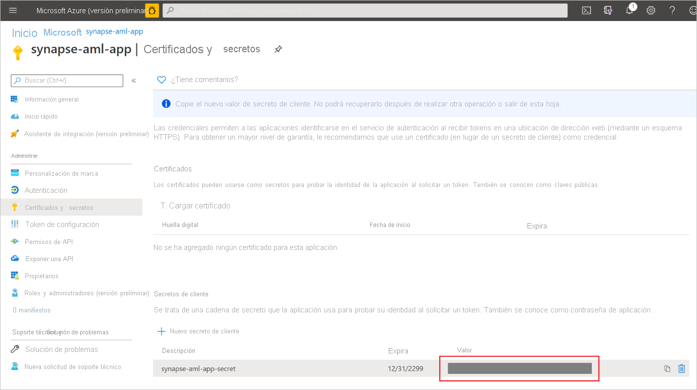

# Inicio rápido: Creación de un servicio vinculado de Azure Machine Learning en Synapse

En este inicio rápido, vinculará un área de trabajo de Azure Synapse Analytics a un área de trabajo de Azure Machine Learning. La vinculación de estas áreas de trabajo permite aprovechar Azure Machine Learning en diversas experiencias de Synapse.

Por ejemplo, el vínculo a un área de trabajo de Azure Machine Learning permite estas experiencias:

- Ejecutar canalizaciones de Azure Machine Learning como un paso en las canalizaciones de Synapse. Para más información, consulte [Ejecución de canalizaciones de Azure Machine Learning](/azure/data-factory/transform-data-machine-learning-service).

- Enriquecer sus datos con predicciones mediante la incorporación de un modelo de Machine Learning del registro de modelos de Azure Machine Learning y puntuar el modelo en grupos de Synapse SQL. Para más información, consulte [Tutorial: Asistente para puntuación de modelos de Machine Learning en grupos de Synapse SQL](tutorial-sql-pool-model-scoring-wizard.md).

## Requisitos previos

- Una suscripción a Azure: [cree una cuenta gratuita](https://azure.microsoft.com/free/).
- Un [área de trabajo de Synapse Analytics](../get-started-create-workspace.md) con una cuenta de almacenamiento de ADLS Gen2 configurada como el almacenamiento predeterminado. Debe ser el **Colaborador de datos de blobs de almacenamiento** del sistema de archivos de ADLS Gen2 con el que quiere trabajar.
- [Un área de trabajo de Azure Machine Learning](/azure/machine-learning/how-to-manage-workspace).
- Necesita permisos (o una solicitud de alguien que tenga permisos) para crear una entidad de servicio y un secreto que puede usar para crear el servicio vinculado. Tenga en cuenta que esta entidad de servicio debe tener asignado el rol de colaborador en el área de trabajo de Azure Machine Learning.

## Inicio de sesión en Azure Portal

Inicie sesión en el [Portal de Azure](https://portal.azure.com/)

## Creación de una entidad de servicio

Con este paso se creará una nueva entidad de servicio. Si desea usar una entidad de servicio existente, puede omitir este paso.
1. Abra Azure Portal. 

1. Seleccione **Azure Active Directory** -> **Registros de aplicaciones**.

1. Haga clic en **Nuevo registro**. A continuación, siga las instrucciones de la interfaz de usuario para registrar una nueva aplicación.

1. Una vez registrada la aplicación, genere un secreto para ella. Vaya a **Su aplicación** -> **Certificate & Secret** (Certificado y secreto). Haga clic en **Add client secret** (Agregar secreto de cliente) para generar un secreto. Conserve el secreto de manera segura, se usará más adelante.

   

1. Cree una entidad de servicio para la aplicación. Vaya a **Su aplicación** -> **Información general** y, a continuación, haga clic en **Crear entidad de servicio**. En algunos casos, esta entidad de servicio se crea automáticamente.

   

1. Agregue la entidad de servicio como "colaborador" del área de trabajo de Azure Machine Learning. Tenga en cuenta que para esto se requerirá ser propietario del grupo de recursos al que pertenece el área de trabajo de Azure Machine Learning.

   

## Creación de un servicio vinculado

1. En el área de trabajo de Synapse en la que desea crear el nuevo servicio vinculado de Azure Machine Learning, vaya a **Administración** -> **Servicio vinculado**, cree un nuevo servicio vinculado con el tipo "Azure Machine Learning".

   

2. Rellene el formulario:

   - Id. de entidad de servicio: se trata del **id. de aplicación (cliente)** de la aplicación web.
  
     > [!NOTE]
     > No es el nombre de la aplicación. Puede encontrar este id. en la página de información general de la aplicación. Debe ser una cadena larga con un aspecto similar a "81707eac-ab38-406u-8f6c-10ce76a568d5".

   - Clave de entidad de servicio: el secreto generado en la sección anterior.

3. Haga clic en **Probar conexión** para comprobar si la configuración es correcta. Si se supera la prueba de conexión, haga clic en **Guardar**.

   Si se produce un error en la prueba de conexión, asegúrese de que el id. y el secreto de la entidad de servicio son correctos e inténtelo de nuevo.

## Pasos siguientes

- [Tutorial: Asistente para puntuación de modelos de Machine Learning: grupo de SQL dedicado](tutorial-sql-pool-model-scoring-wizard.md)
- [Funcionalidades de Machine Learning en Azure Synapse Analytics](what-is-machine-learning.md)
