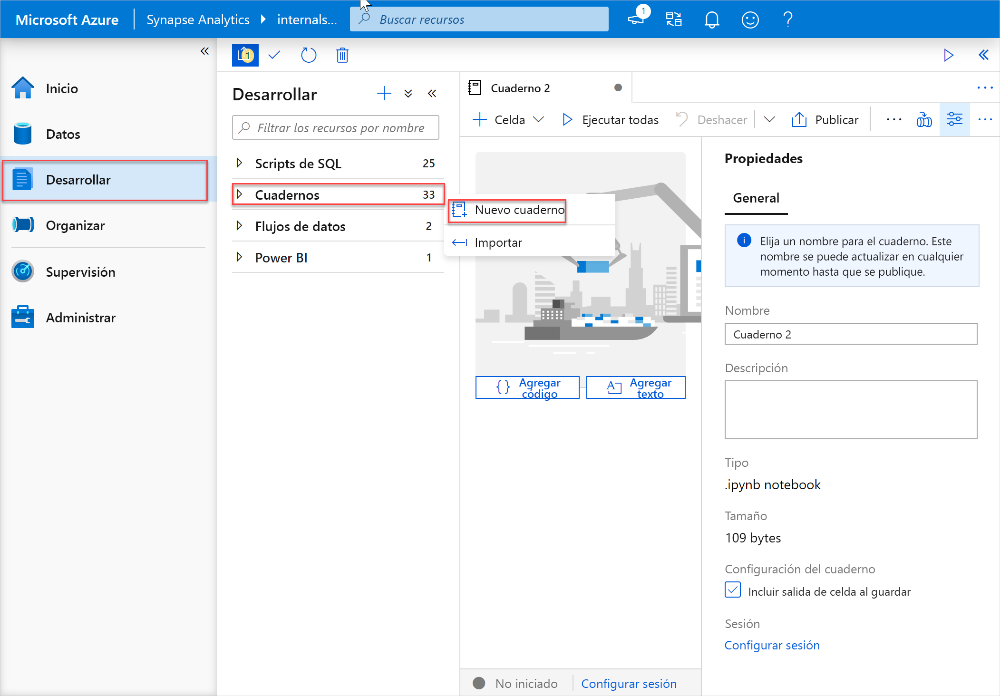
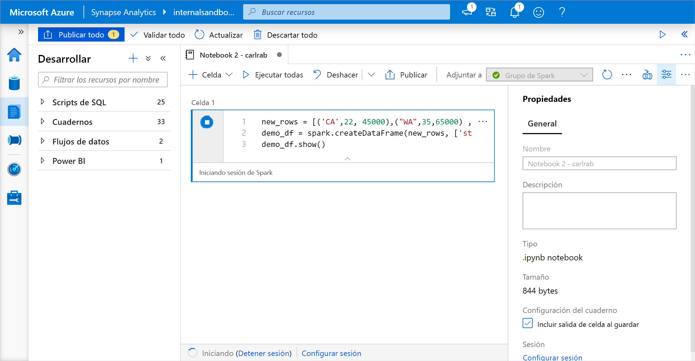
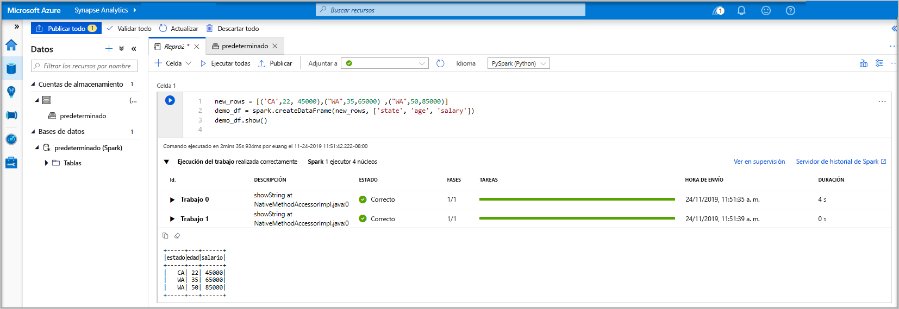
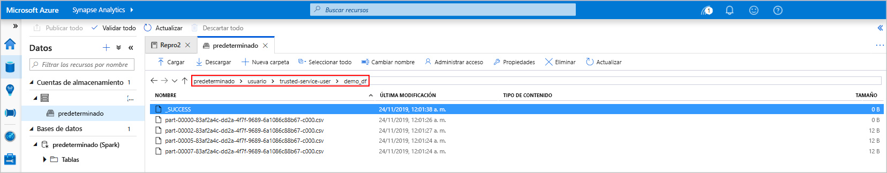
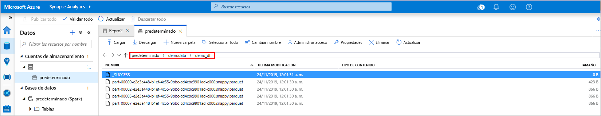
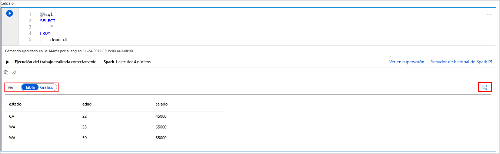
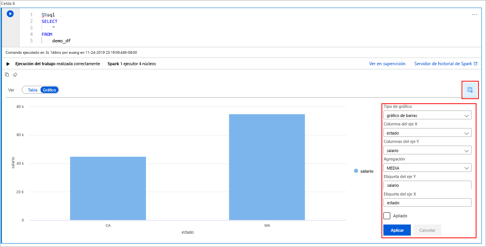

# <a name="quickstart-create-a-serverless-apache-spark-pool-in-azure-synapse-analytics-using-web-tools"></a>Inicio rápido: Creación de un grupo de Apache Spark sin servidor en Azure Synapse Analytics mediante herramientas web

En este inicio rápido, aprenderá a crear un grupo de Apache Spark sin servidor en Azure Synapse mediante herramientas web. Luego, aprenderá a conectarse al grupo de Apache Spark y a ejecutar consultas SQL de Spark en archivos y tablas. Apache Spark permite el análisis rápido de datos y procesamiento de clústeres con el procesamiento en memoria. Para información sobre Spark en Azure Synapse, consulte [Introducción: Apache Spark en Azure Synapse](./spark/apache-spark-overview.md).

> [!IMPORTANT]
> La facturación de las instancias de Spark se prorratea por minuto, tanto si se usan como si no. Asegúrese de cerrar la instancia de Spark después de que haya terminado de usarla, o configure un breve tiempo de espera. Para obtener más información, consulte la sección **Limpieza de recursos** de este artículo.

Si no tiene una suscripción a Azure, [cree una cuenta gratuita antes de empezar](https://azure.microsoft.com/free/).

## <a name="prerequisites"></a>Prerrequisitos

- Una suscripción a Azure: [cree una cuenta gratuita](https://azure.microsoft.com/free/)
- [Área de trabajo de Synapse Analytics](quickstart-create-workspace.md)
- [Grupo de Apache Spark sin servidor](quickstart-create-apache-spark-pool-studio.md)

## <a name="sign-in-to-the-azure-portal"></a>Inicio de sesión en Azure Portal

Inicie sesión en [Azure Portal](https://portal.azure.com/).

Si no tiene una suscripción a Azure, cree una [cuenta gratuita](https://azure.microsoft.com/free/) antes de empezar.

## <a name="create-a-notebook"></a>Creación de un cuaderno

Un cuaderno es un entorno interactivo que admite varios lenguajes de programación. El cuaderno le permite interactuar con los datos, combinar código con texto y Markdown y, realizar visualizaciones simples.

1. En la vista de Azure Portal del área de trabajo de Azure Synapse que quiera usar, seleccione **Iniciar Synapse Studio**.
2. Cuando haya iniciado Synapse Studio, seleccione **Desarrollar**. A continuación, seleccione el icono " **+** " para agregar un nuevo recurso.
3. Desde ahí, seleccione **Cuaderno**. Se crea un cuaderno y se abre con un nombre generado automáticamente.
 
     

4. En la ventana **Properties** (Propiedades), proporcione un nombre para el cuaderno.
5. En la barra de herramientas, haga clic en **Publish** (Publicar).
6. Si solo hay un grupo de Apache Spark en el área de trabajo, se selecciona de forma predeterminada. Use la lista desplegable para seleccionar el grupo de Apache Spark correcto si no se selecciona ninguno.
7. Haga clic en **Add code** (Agregar código). El lenguaje predeterminado es `Pyspark`. Va a usar una combinación de Pyspark y Spark SQL, por lo que la opción predeterminada es correcta. Otros lenguajes admitidos son Scala y .NET para Spark.
8. A continuación, creará un objeto DataFrame simple de Spark para manipularlo. En este caso, se crea a partir del código. Hay tres filas y tres columnas:

   ```python
   new_rows = [('CA',22, 45000),("WA",35,65000) ,("WA",50,85000)]
   demo_df = spark.createDataFrame(new_rows, ['state', 'age', 'salary'])
   demo_df.show()
   ```

9. Ahora ejecute la celda con uno de los métodos siguientes:

   - Presione **MAYÚS + ENTRAR**.
   - Seleccione el icono de reproducción azul situado a la izquierda de la celda.
   - Seleccione el botón **Run all** (Ejecutar todo) en la barra de herramientas.

       

10. Si no se está ejecutando la instancia del grupo de Apache Spark, se inicia automáticamente. Puede ver el estado de la instancia del grupo de Apache Spark tanto debajo de la celda está ejecutando como en el panel de estado de la parte inferior del cuaderno. En función del tamaño del grupo, el inicio debe durar entre 2 y 5 minutos. Una vez que el código haya terminado de ejecutarse, la información que aparece debajo de la celda muestra cuánto tiempo tardó en ejecutarse y su ejecución. En la celda de salida, verá la salida.

    

11. Los datos existen ahora en una trama de datos; desde ahí, puede usarlos de muchas maneras diferentes. Los va a necesitar en diferentes formatos durante el resto de este inicio rápido.
12. Escriba el código siguiente en otra celda y ejecútelo; se crea una tabla de Spark, un archivo CSV y un archivo de Parquet, todos ellos con copias de los datos:

    ```python
     demo_df.createOrReplaceTempView('demo_df')
     demo_df.write.csv('demo_df', mode='overwrite')
     demo_df.write.parquet('abfss://<<TheNameOfAStorageAccountFileSystem>>@<<TheNameOfAStorageAccount>>.dfs.core.windows.net/demodata/demo_df', mode='overwrite')
    ```

    Si se usa el explorador de almacenamiento, es posible ver el impacto de las dos formas diferentes de escribir un archivo usadas anteriormente. Cuando no se especifica ningún sistema de archivos, se usa el valor predeterminado, en este caso `default>user>trusted-service-user>demo_df`. Los datos se guardan en la ubicación del sistema de archivos especificado.

    Observe que en los formatos "csv" y "parquet", las operaciones de escritura crean un directorio con muchos archivos con particiones.

    

    

## <a name="run-spark-sql-statements"></a>Ejecución de instrucciones de Spark SQL

SQL (Lenguaje de consulta estructurado) es el lenguaje más común y ampliamente utilizado para la consulta y definición de datos. Spark SQL funciona como una extensión de Apache Spark para procesar datos estructurados, mediante la conocida sintaxis de SQL.

1. Pegue el siguiente código en una celda vacía y, luego, ejecútelo. El comando muestra las tablas del grupo.

   ```sql
   %%sql
   SHOW TABLES
   ```

   Cuando se usa un cuaderno con el grupo de Apache Spark en Azure Synapse, se obtiene un objeto preestablecido `sqlContext` que puede usar para ejecutar consultas con Spark SQL. `%%sql` indica al cuaderno que use el valor preestablecido de `sqlContext` para ejecutar la consulta. La consulta recupera las diez primeras filas de una tabla del sistema que incluye de forma predeterminada todos los grupos de Apache Spark de Azure Synapse.

2. Ejecute otra consulta para ver los datos en `demo_df`.

    ```sql
    %%sql
    SELECT * FROM demo_df
    ```

    El código genera dos celdas de salida, una que contiene los resultados de datos y la otra que muestra la vista del trabajo.

    De manera predeterminada la vista de resultados muestra una cuadrícula. Pero hay un modificador de vista debajo que permite cambiar entre la vista de cuadrícula y la de gráfico.

    

3. En el modificador **View** (Vista), seleccione **Chart** (Gráfico).
4. Seleccione el icono **View options** (Opciones de vista) en el extremo derecho.
5. En el campo **Chart type** (Tipo de gráfico), seleccione "bar chart" (gráfico de barras).
6. En el campo de columna del eje X, seleccione "state"(estado).
7. En el campo de columna del eje Y, seleccione "salary" (salario).
8. En el campo **Aggregation** (Agregación), seleccione "AVG" (MEDIA).
9. Seleccione **Aplicar**.

   

10. Es posible obtener la misma experiencia de ejecutar SQL, pero sin tener que cambiar de lenguaje. Para ello, reemplace la celda de SQL anterior por esta celda de PySpark; la experiencia de salida es la misma porque se usa el comando **display**:

    ```python
    display(spark.sql('SELECT * FROM demo_df'))
    ```

11. Cada una de las celdas que se ejecutaron anteriormente tenía la opción de ir a **History Server** (Servidor de historial) y **Monitoring** (Supervisión). Al hacer clic en los vínculos, se le remite a diferentes partes de la experiencia del usuario.

> [!NOTE]
> Una parte de la [documentación oficial de Apache Spark](https://spark.apache.org/docs/latest/) se basa en el uso de la consola de Spark, que no está disponible en Synapse Spark. En su lugar, use las experiencias de [cuaderno](quickstart-apache-spark-notebook.md) o [IntelliJ](./spark/intellij-tool-synapse.md).

## <a name="clean-up-resources"></a>Limpieza de recursos

Azure Synapse guarda los datos en Azure Data Lake Storage. Puede dejar que se cierre de forma segura una instancia de Spark cuando no esté en uso. Los grupos de Apache Spark sin servidor se le cobrarán mientras estén en ejecución, aunque no esté en uso. 

Como en muchas ocasiones los cargos del clúster son mucho más elevados que los cargos de almacenamiento, es mejor para la economía dejar que las instancias de Spark se cierren cuando no estén en uso.

Para asegurarse de que se cierra la instancia de Spark, finalice todas las sesiones (cuadernos) conectadas. El grupo se cierra cuando se alcanza el **tiempo de inactividad** especificado en el grupo de Apache Spark. También puede decidir **finalizar la sesión** en la barra de estado en la parte inferior del cuaderno.

## <a name="next-steps"></a>Pasos siguientes

En este inicio rápido, ha aprendido a crear un grupo de Apache Spark sin servidor y a ejecutar una consulta básica de SQL de Spark.

- [Azure Synapse Analytics](overview-what-is.md)
- [Documentación de .NET para Apache Spark](/dotnet/spark?toc=/azure/synapse-analytics/toc.json&bc=/azure/synapse-analytics/breadcrumb/toc.json)


