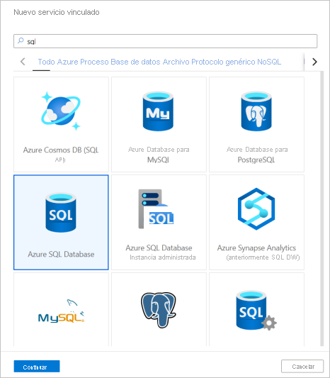
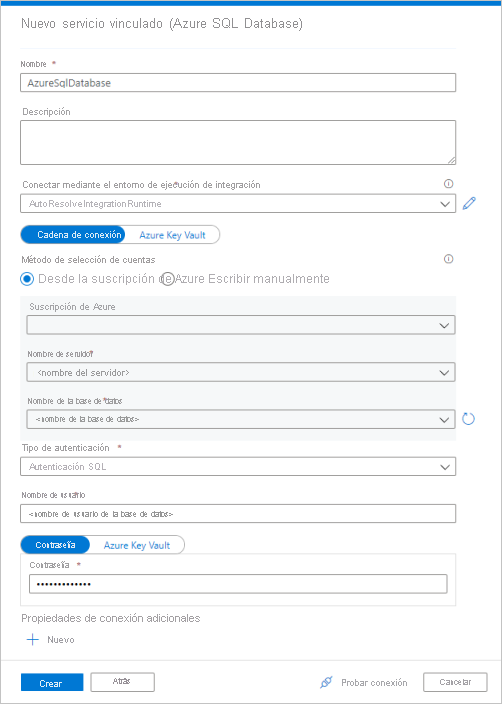
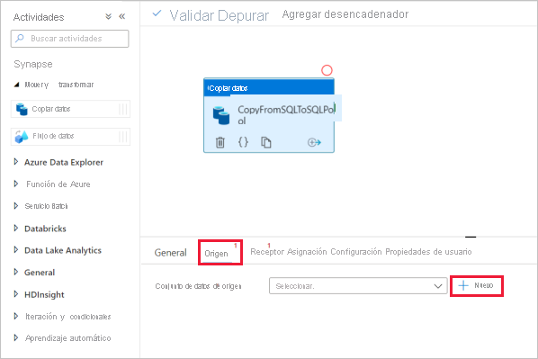
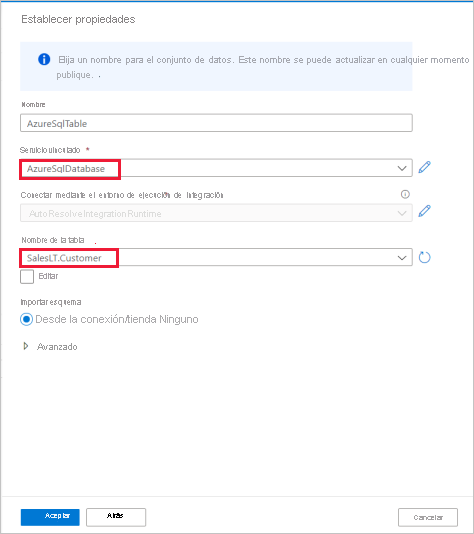

# Inicio rápido: Carga de datos en un grupo de SQL dedicado mediante la actividad de copia

Azure Synapse Analytics ofrece varios motores de análisis que le ayudarán a ingerir, transformar, modelar y analizar sus datos. Un grupo de SQL dedicado ofrece funcionalidades de proceso y almacenamiento basadas en T-SQL. Después de crear un grupo de SQL dedicado en el área de trabajo de Synapse, los datos se pueden cargar, modelar, procesar y entregar para tener información para los análisis más rápidamente.

En este inicio rápido, aprenderá a *cargar datos de Azure SQL Database en Azure Synapse Analytics*. Puede seguir los mismos pasos para copiar datos de otros tipos de almacenes de datos. Este flujo similar se aplica a la copia de datos en otros orígenes y receptores.

## Requisitos previos

* Suscripción de Azure: Si no tiene una suscripción a Azure, cree una [cuenta gratuita](https://azure.microsoft.com/free/) antes de empezar.
* Área de trabajo de Azure Synapse: Cree un área de trabajo de Synapse desde Azure Portal, y siga las instrucciones de [Inicio rápido: Creación de un área de trabajo de Synapse](quickstart-create-workspace.md).
* Azure SQL Database: este tutorial copia los datos del conjunto de datos de ejemplo de Adventure Works LT en Azure SQL Database. Puede crear esta base de datos de ejemplo en SQL Database si sigue las instrucciones que aparecen en [Creación de una base de datos de ejemplo en Azure SQL Database](../azure-sql/database/single-database-create-quickstart.md). O bien, puede usar otros almacenes de datos siguiendo los mismos pasos.
* Cuenta de almacenamiento de Azure: Azure Storage se usa como área de *almacenamiento provisional* en la operación de copia. Si no dispone de una cuenta de almacenamiento de Azure, consulte las instrucciones de [Creación de una cuenta de almacenamiento](../storage/common/storage-account-create.md).
* Azure Synapse Analytics: Puede usar un grupo de SQL dedicado como almacén de datos receptor. Si no tiene una instancia de Azure Synapse Analytics, consulte [Creación de un grupo de SQL dedicado](quickstart-create-sql-pool-portal.md) para ver los pasos para crear una.

### Desplazamiento a Synapse Studio

Una vez que se crea el área de trabajo de Synapse, hay dos formas de abrir Synapse Studio:

* Abrir el área de trabajo de Synapse en [Azure Portal](https://ms.portal.azure.com/#home). Seleccione **Abrir** en la tarjeta Abrir Synapse Studio de Información general.
* Abra [Azure Synapse Analytics](https://web.azuresynapse.net/) e inicie sesión en su área de trabajo.

En este inicio rápido, usamos el área de trabajo denominada "adftest2020" como ejemplo. Se le dirigirá automáticamente a la página principal de Synapse Studio.

## Crear servicios vinculados

En Azure Synapse Analytics, un servicio vinculado es donde se define la información de conexión a otros servicios. En esta sección, creará los dos tipos de servicios vinculados siguientes: Servicios vinculados Azure SQL Database y Azure Data Lake Storage Gen2 (ADLS Gen2).

1. En la página principal de Synapse Studio, seleccione la pestaña **Administrar** en el panel de navegación izquierdo.
1. En Conexiones externas, seleccione Servicios vinculados.
  
   

1. Para agregar un servicio vinculado, seleccione **Nuevo**.
1. Seleccione **Azure SQL Database** en la galería y, luego, elija **Continuar**. Puede escribir "sql" en el cuadro de búsqueda para filtrar los conectores.

   

1. En la página New Linked Service (Nuevo servicio vinculado) seleccione el nombre del servidor y el de la base de datos en la lista desplegable y especifique el nombre de usuario y la contraseña. Haga clic en **Prueba de conexión** para validar la configuración y, después, seleccione **Crear**.

   

1. Repita los pasos 3-4, pero seleccione **Azure Data Lake Storage Gen2** en la galería. En la página New Linked Service (Nuevo servicio vinculado), seleccione el nombre de su cuenta de almacenamiento en la lista desplegable. Haga clic en **Prueba de conexión** para validar la configuración y, después, seleccione **Crear**. 

   
 
## Crear una canalización

Una canalización contiene el flujo lógico para una ejecución de un conjunto de actividades. En esta sección, creará una canalización que contiene una actividad de copia que ingiere datos de Azure SQL Database en un grupo de SQL dedicado.

1. Vaya a la ficha **Integrar**. Seleccione el icono de signo de más situado junto al encabezado de canalizaciones y seleccione Pipeline (Canalización).

   

1. En la sección *Move and Transform* (Mover y transformar) del panel *Activities* (Actividades), arrastre **Copy data** (Copiar datos) al lienzo de la canalización.
1. Seleccione la actividad de copia y vaya a la pestaña Origen. Seleccione **Nuevo** para crear un conjunto de datos de origen.

   

1. Seleccione **Azure SQL Database** como almacén de datos y después seleccione **Continuar**.
1. En el panel *Establecer propiedades*, seleccione el servicio vinculado de Azure SQL Database que creó en un paso anterior. 
1. En Nombre de tabla, seleccione una tabla de ejemplo para usarla en la siguiente actividad de copia. En este inicio rápido, se usa la tabla "SalesLT.Customer" como ejemplo. 

   
1. Seleccione **Aceptar** cuando haya terminado.
1. Seleccione la actividad de copia y vaya a la pestaña Receptor. Seleccione **Nuevo** para crear un conjunto de datos de receptor.
1. Seleccione **Grupo de SQL dedicado de Azure Synapse** como almacén de datos y después seleccione **Continuar**.
1. En el panel **Establecer propiedades**, seleccione el grupo de SQL Analytics que creó en un paso anterior. Si está escribiendo en una tabla existente, en *Nombre de tabla* selecciónela en el menú desplegable. De lo contrario, marque "Editar" y escriba el nuevo nombre de la tabla. Seleccione **Aceptar** cuando haya terminado.
1. Para la configuración del conjunto del receptor, habilite **Auto create table** (Creación automática de tabla) en el campo Opción de tabla.

   

1. En la página **Configuración**, seleccione la casilla de **Habilitar almacenamiento provisional**. Esta opción se aplica si los datos de origen no son compatibles con PolyBase. En la sección **Staging settings** (Configuración de almacenamiento provisional), seleccione el servicio vinculado Azure Data Lake Storage Gen2 que creó en el paso anterior como almacenamiento provisional. 

    El almacenamiento se usa para almacenar provisionalmente los datos antes de cargarlos en Azure Synapse Analytics mediante PolyBase. Una vez que se completa la copia, los datos provisionales de Data Lake Storage Gen2 se limpian automáticamente.

   

1. Para comprobar la canalización, seleccione **Validate** (Comprobar) en la barra de herramientas. Verá el resultado de la salida de la validación de canalización en el lado derecho de la página. 

## Depuración y publicación de la canalización

Una vez que haya terminado de configurar la canalización, puede ejecutar una depuración antes de publicar los artefactos para verificar que todo esté correcto.

1. Para depurar la canalización, seleccione **Depurar** en la barra de herramientas. Verá el estado de ejecución de la canalización en la pestaña **Output** (Salida) en la parte inferior de la ventana. 

   

1. Una vez que la ejecución de la canalización se realiza correctamente, en la barra de herramientas superior, seleccione **Publish all** (Publicar todo). Esta acción publica las entidades (conjuntos de datos y canalizaciones) que creó en el servicio de Synapse Analytics.
1. Espere a que aparezca el mensaje **Successfully published** (Publicado correctamente). Para ver los mensajes de notificación, seleccione el botón de campana en la esquina superior derecha. 

## Activación y supervisión de la canalización

En esta sección, se desencadena manualmente la canalización publicada en el paso anterior. 

1. Seleccione **Add Trigger** (Agregar desencadenador) en la barra de herramientas y, después, seleccione **Trigger Now** (Desencadenar ahora). En la página **Pipeline Run** (Ejecución de la canalización), seleccione **OK** (Aceptar).  
1. Vaya a la pestaña **Supervisar** que se encuentra en la barra lateral izquierda. Verá una ejecución de canalización que se desencadena de forma manual. 
1. Cuando la ejecución de la canalización finaliza correctamente, seleccione el vínculo de la columna **Pipeline name** (Nombre de canalización) para ver los detalles de la ejecución de actividad o para volver a ejecutar la canalización. En este ejemplo, solo hay una actividad, así que solo verá una entrada en la lista. 
1. Para más información sobre la operación de copia, seleccione el vínculo **Details** (Detalles) (icono de gafas) en la columna **Activity name** (Nombre de actividad). Puede supervisar detalles como el volumen de datos copiados desde el origen al receptor, el rendimiento de los datos, los pasos de ejecución con su duración correspondiente y las configuraciones que se utilizan.

   

1. Para volver a la vista de ejecuciones de canalización, seleccione el vínculo **Todas las ejecuciones de la canalización**. Seleccione **Refresh** (Actualizar) para actualizar la lista.
1. Verifique que los datos se han escrito correctamente en el grupo de SQL dedicado.

## Pasos siguientes

Continúe al artículo siguiente para obtener información sobre la compatibilidad de Azure Synapse Analytics:

> [!div class="nextstepaction"]
> [Canalización y actividades](https://docs.microsoft.com/azure/data-factory/concepts-pipelines-activities?toc=/azure/synapse-analytics/toc.json&bc=/azure/synapse-analytics/breadcrumb/toc.json)
> [Información general del conector](https://docs.microsoft.com/azure/data-factory/connector-overview?toc=/azure/synapse-analytics/toc.json&bc=/azure/synapse-analytics/breadcrumb/toc.json)
> [Actividad de copia](https://docs.microsoft.com/azure/data-factory/copy-activity-overview?toc=/azure/synapse-analytics/toc.json&bc=/azure/synapse-analytics/breadcrumb/toc.json)