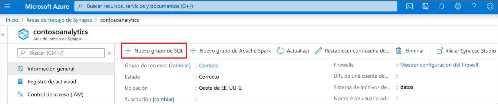
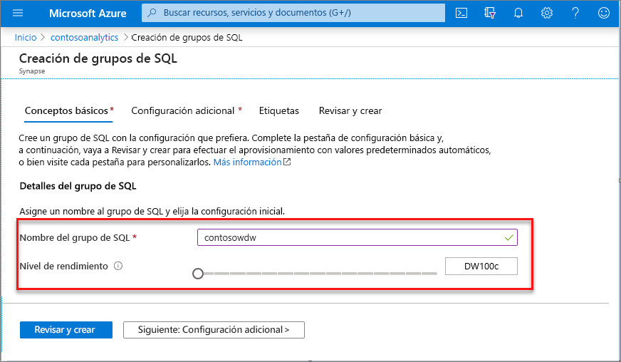
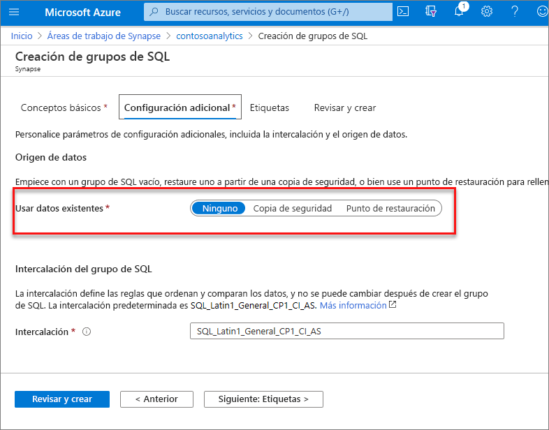
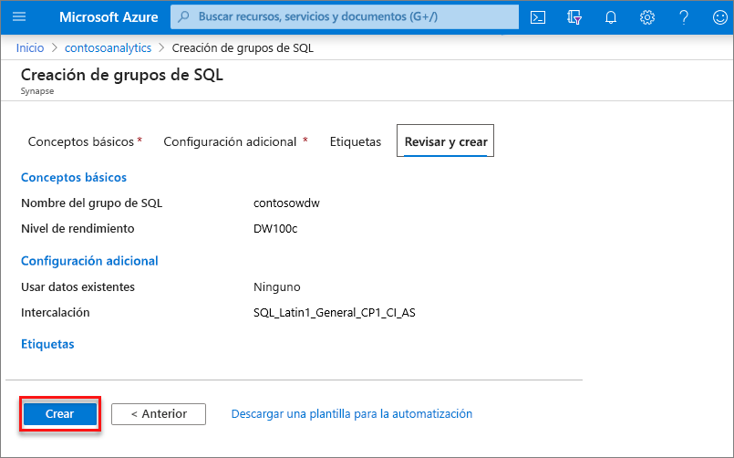
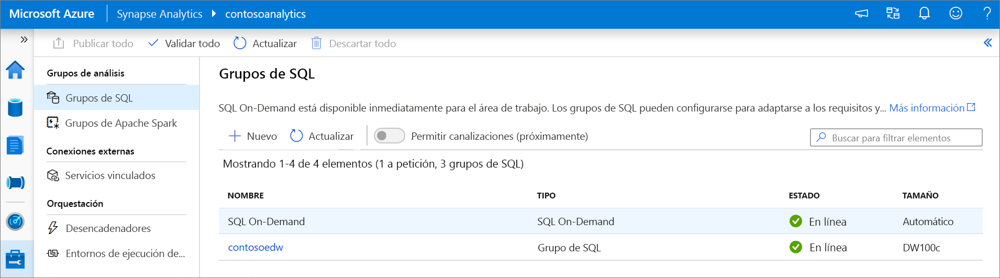
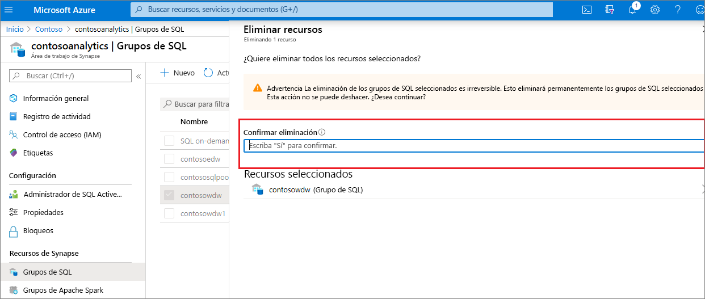

# Inicio rápido: Creación de un grupo de SQL dedicado (versión preliminar) mediante Azure Portal

Azure Synapse Analytics ofrece varios motores de análisis que le ayudarán a ingerir, transformar, modelar y analizar sus datos. Un grupo de SQL dedicado ofrece funcionalidades de proceso y almacenamiento basadas en T-SQL. Después de crear un grupo de SQL dedicado en el área de trabajo de Synapse, los datos se pueden cargar, modelar, procesar y entregar para tener información para los análisis más rápidamente.

En este inicio rápido aprenderá a crear un grupo de SQL dedicado en un área de trabajo de Synapse mediante Azure Portal.

Si no tiene una suscripción a Azure, [cree una cuenta gratuita antes de empezar](https://azure.microsoft.com/free/).

## Requisitos previos

- Una suscripción a Azure: [cree una cuenta gratuita](https://azure.microsoft.com/free/)
- [Área de trabajo de Synapse](./quickstart-create-workspace.md)

## Inicio de sesión en Azure Portal

Inicie sesión en el [Portal de Azure](https://portal.azure.com/)

## Desplazamiento al área de trabajo de Synapse

1. Vaya al área de trabajo de Synapse en la que se va a crear el grupo de SQL dedicado. Para ello, escriba el nombre del servicio (o el nombre del recurso directamente) en la barra de búsqueda.
. 
1. En la lista de áreas de trabajo, escriba el nombre (o una parte del nombre) del área que desea abrir. En este ejemplo, se usará un área de trabajo denominado **contosoanalytics**.

## Creación de un grupo de SQL dedicado

1. En el área de trabajo de Synapse en la que desea crear el grupo de SQL dedicado, seleccione el comando **New dedicado SQL pool** (Nuevo grupo de SQL dedicado) en la barra superior.

2. Escriba la siguiente información en la pestaña **Datos básicos**.

    | Configuración | Valor sugerido | Descripción |
    | :------ | :-------------- | :---------- |
    | **Nombre del grupo de SQL dedicado** | Cualquier nombre válido | Nombre del grupo de SQL dedicado. |
    | **Nivel de rendimiento** | DW100c | Establézcalo en el menor tamaño para reducir los costos de este inicio rápido. |

  
    

    > [!IMPORTANT]
    > Tenga en cuenta que existen limitaciones específicas para los nombres que los grupos de SQL dedicados pueden usar. Los nombres no pueden contener caracteres especiales, deben tener 15 caracteres como máximo, no contener palabras reservadas y ser únicos en el área de trabajo.

3. Seleccione **Siguiente: Configuración adicional**.
4. Seleccione **None** (Ninguno) para aprovisionar el grupo de SQL dedicado sin datos. Deje seleccionada la intercalación predeterminada.

    Si desea restaurar el grupo de SQL dedicado desde un punto de restauración, seleccione el **punto de restauración**. Para obtener más información sobre cómo realizar una restauración, vea [ Restauración de un grupo de SQL dedicado](backuprestore/restore-sql-pool.md)

5. Seleccione **Revisar + crear**.
6. Asegúrese de que los detalles son correctos en función de lo que se especificó anteriormente. Seleccione **Crear**.

7. Llegados a este punto, se iniciará el flujo de aprovisionamiento de recursos.
 

8. Una vez completado el aprovisionamiento, al desplazarse al área de trabajo se mostrará una nueva entrada para el grupo de SQL dedicado recién creado.
 

Una vez que se cree el grupo de SQL dedicado, estará disponible en el área de trabajo para la carga de datos, el procesamiento de secuencias, la lectura del lago, etc.

## Limpieza de recursos

Siga los pasos que se indican a continuación para eliminar el grupo de SQL dedicado del área de trabajo.
> [!WARNING]
> Al eliminar un grupo de SQL dedicado, se quitan del área de trabajo el motor de análisis y los datos almacenados en la base de datos del grupo de SQL dedicado eliminado. Ya no será posible conectarse al grupo de SQL dedicado y todas las consultas, canalizaciones y cuadernos que lean o escriban en este grupo de SQL dedicado dejarán de funcionar.

Si quiere eliminar el grupo de SQL dedicado, siga estos pasos:

1. Vaya a la hoja de grupos de SQL en la hoja del área de trabajo.
1. Seleccione el grupo de SQL dedicado que se va a eliminar (en este caso, **contosowdw**).
1. Una vez seleccionado, seleccione **Delete** (Eliminar).
1. Confirme la eliminación y haga clic en el botón **Delete** (Eliminar)
1. Cuando el proceso se complete correctamente, el grupo de SQL dedicado dejará de aparecer en los recursos del área de trabajo.

## Pasos siguientes

- Consulte [Quickstart: Creación de un grupo de Apache Spark sin servidor en Synapse Studio mediante herramientas web](quickstart-apache-spark-notebook.md).
- Consulte [Quickstart: Creación de un grupo de Apache Spark sin servidor mediante Azure Portal](quickstart-create-apache-spark-pool-portal.md).
