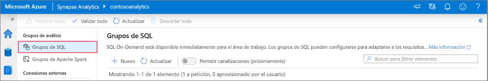
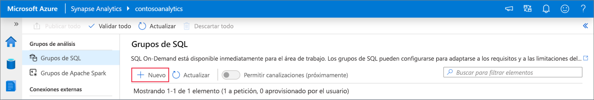
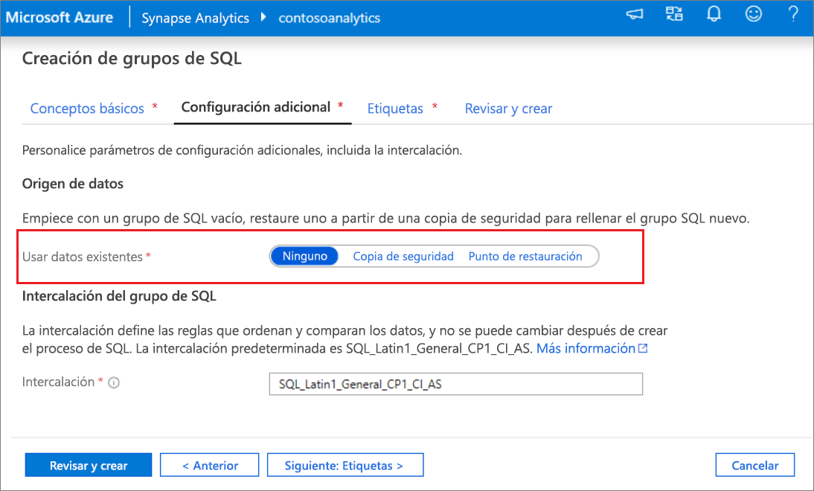
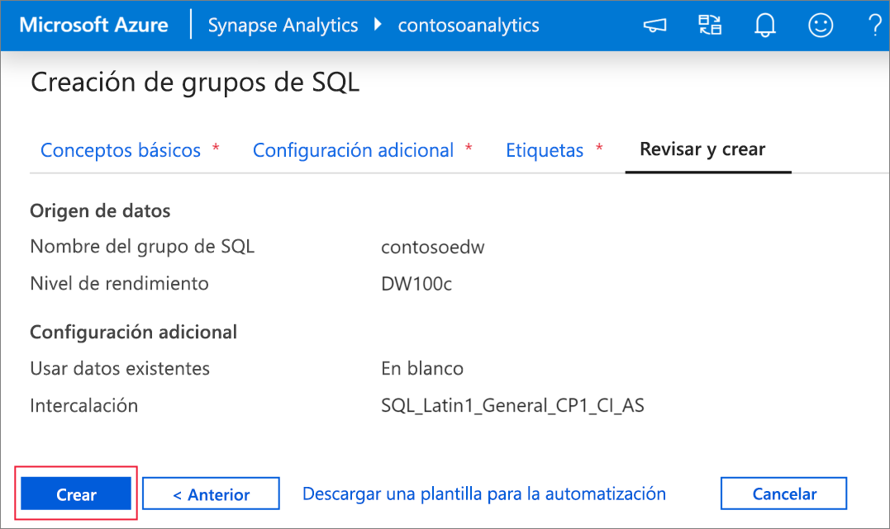
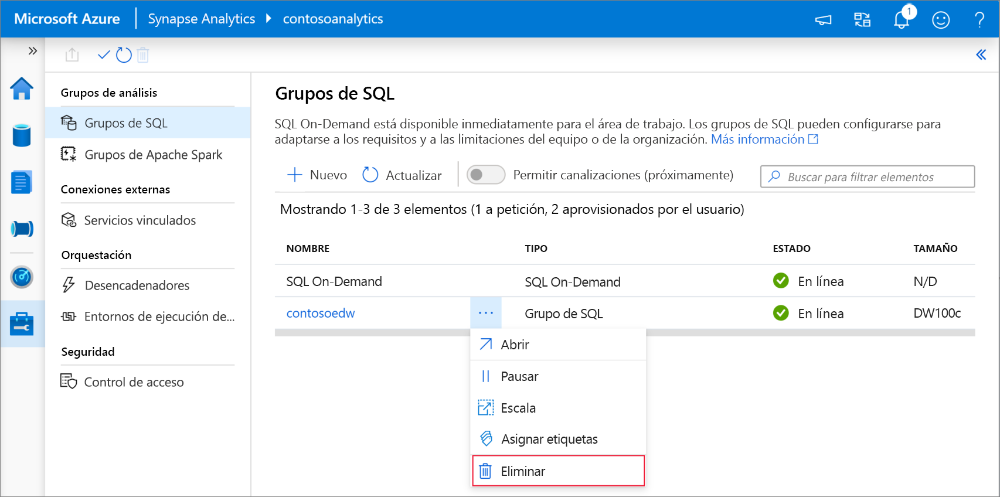

# Inicio rápido: Creación de un grupo de SQL dedicado mediante Synapse Studio

Azure Synapse Analytics ofrece varios motores de análisis que le ayudarán a ingerir, transformar, modelar y analizar sus datos. Un grupo de SQL dedicado ofrece funcionalidades de proceso y almacenamiento basadas en T-SQL. Después de crear un grupo de SQL dedicado en el área de trabajo de Synapse, los datos se pueden cargar, modelar, procesar y entregar para tener información para los análisis más rápidamente.

En este inicio rápido se describen los pasos necesarios para crear un grupo de SQL dedicado en un área de trabajo de Synapse mediante Synapse Studio.

Si no tiene una suscripción a Azure, [cree una cuenta gratuita antes de empezar](https://azure.microsoft.com/free/).

## Requisitos previos

- Una suscripción a Azure: [cree una cuenta gratuita](https://azure.microsoft.com/free/)
- [Área de trabajo de Synapse](quickstart-create-workspace.md)

## Inicio de sesión en Azure Portal

Inicie sesión en el [Portal de Azure](https://portal.azure.com/)

## Desplazamiento al área de trabajo de Synapse

1. Vaya al área de trabajo de Synapse en la que se va a crear el grupo de SQL dedicado. Para ello, escriba el nombre del servicio (o el nombre del recurso directamente) en la barra de búsqueda.

    
1. En la lista de áreas de trabajo, escriba el nombre (o una parte del nombre) del área que desea abrir. En este ejemplo, se usará un área de trabajo denominado **contosoanalytics**.

    

## Inicio de Synapse Studio

1. En la información general del área de trabajo, seleccione la **dirección URL web del área de trabajo**  para iniciar Synapse Studio.

    

## Creación de un grupo de SQL dedicado en Synapse Studio

1. En la página principal de Synapse Studio, vaya a **Management Hub** (Centro de administración) en el panel de navegación de la izquierda, para lo que debe seleccionar el icono **Manage** (Administrar).

    

1. Una vez que esté en Management Hub (Centro de administración), vaya a la sección **SQL pools** (Grupos de SQL) para ver la lista actual de grupos de Apache Spark que están disponibles en el área de trabajo.

    

1. Seleccione el comando **+ New** (+Nuevo) y aparecerá el nuevo Asistente para crear grupos de SQL. 

    

1. Escriba la siguiente información en la pestaña **Datos básicos**.

    | Configuración | Valor sugerido | Descripción |
    | :------ | :-------------- | :---------- |
    | **Nombre del grupo de SQL** | contosoedw | Este es el nombre que tendrá el grupo de SQL dedicado. |
    | **Nivel de rendimiento** | DW100c | Establézcalo en el menor tamaño para reducir los costos de este artículo de inicio rápido |

    
    > [!IMPORTANT]
    > Tenga en cuenta que existen limitaciones específicas para los nombres que los grupos de SQL dedicados pueden usar. Los nombres no pueden contener caracteres especiales, deben tener 15 caracteres como máximo, no contener palabras reservadas y ser únicos en el área de trabajo.

4. En la pestaña siguiente, **Additional settings** (Configuración adicional), seleccione **none** (no) para aprovisionar el grupo de SQL sin datos. Deje seleccionada la opción de intercalación predeterminada.

    Si desea restaurar el grupo de SQL dedicado desde un punto de restauración, seleccione el **punto de restauración**. Para obtener más información sobre cómo realizar una restauración, vea [ Restauración de un grupo de SQL dedicado](backuprestore/restore-sql-pool.md)

    

1. Por ahora no vamos a agregar etiquetas, así que seleccione **Review + create** (Revisar y crear).

1. En la pestaña **Review + create** (Revisar y crear), asegúrese de que los datos son correctos, en función de lo que se especificó anteriormente, y haga clic en **Create** (Crear). 

    

1. Llegados a este punto, se iniciará el flujo de aprovisionamiento de recursos.

1. Una vez completado el aprovisionamiento, al desplazarse al área de trabajo se mostrará una nueva entrada para el grupo de SQL recién creado.

    

1. Una vez creado el grupo de SQL dedicado, estará disponible en el área de trabajo para la carga de datos, el procesamiento de secuencias, la lectura del lago, etc.

## Eliminación de un grupo de SQL dedicado mediante Synapse Studio    

Siga los pasos que se indican a continuación para eliminar el grupo de SQL dedicado del área de trabajo mediante Synapse Studio.
> [!WARNING]
> Al eliminar un grupo de SQL dedicado, se quitará también el motor de análisis del área de trabajo, por lo que no será posible conectarse al grupo y todas las consultas, canalizaciones y scripts que usen este grupo de SQL dedicado dejarán de funcionar.

Si está seguro de que quiere eliminar el grupo de SQL dedicado, haga lo siguiente:

1. Vaya a los grupos de SQL en el centro de administración de Synapse Studio.
1. Seleccione los puntos suspensivos en el grupo de SQL dedicado que se va a eliminar (en este caso, **contosoedw**) para mostrar los comandos del grupo de SQL dedicado:

    
1. Presione **Eliminar**.
1. Confirme la eliminación y presione el botón **Eliminar**.
1. Cuando el proceso se complete correctamente, el grupo de SQL dedicado dejará de aparecer en los recursos del área de trabajo.

## Pasos siguientes
 
- Consulte [Quickstart: Creación de un cuaderno de Apache Spark](quickstart-apache-spark-notebook.md)
- Consulte [Quickstart: Creación de un grupo de SQL dedicado mediante Azure Portal](quickstart-create-sql-pool-portal.md).
