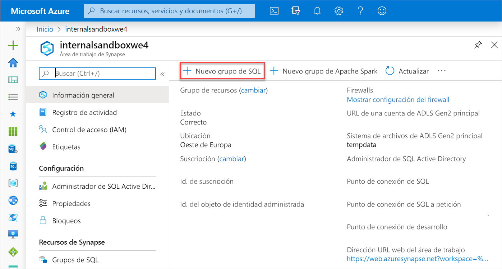
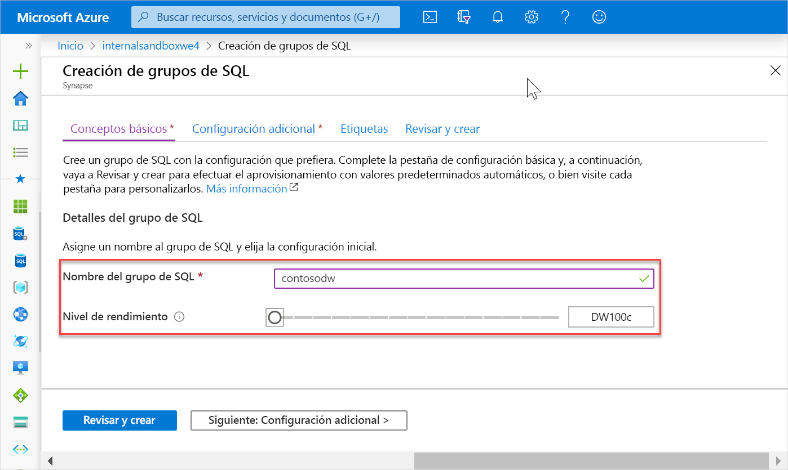
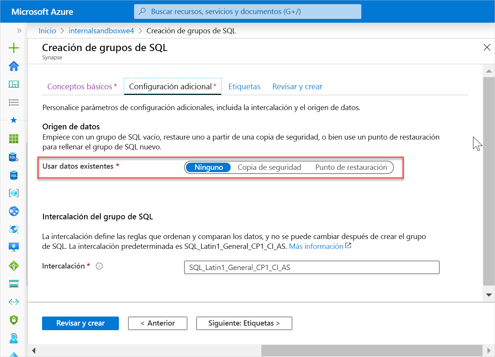
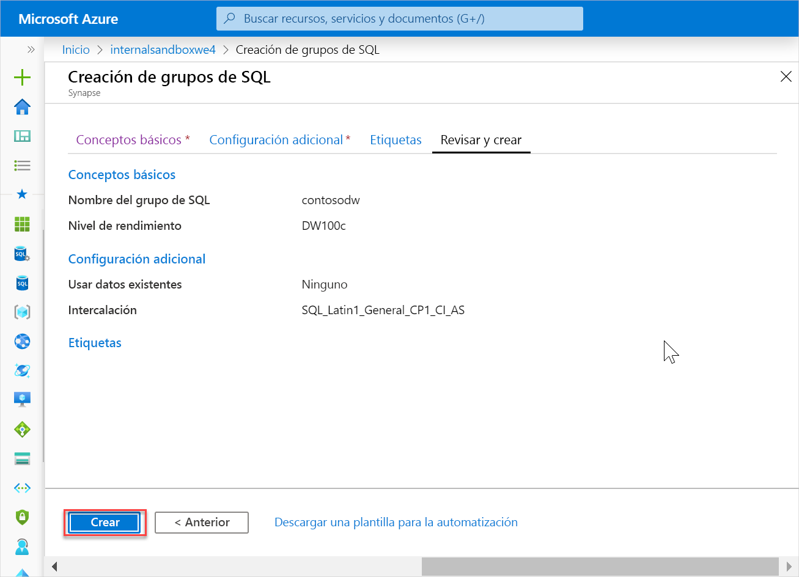
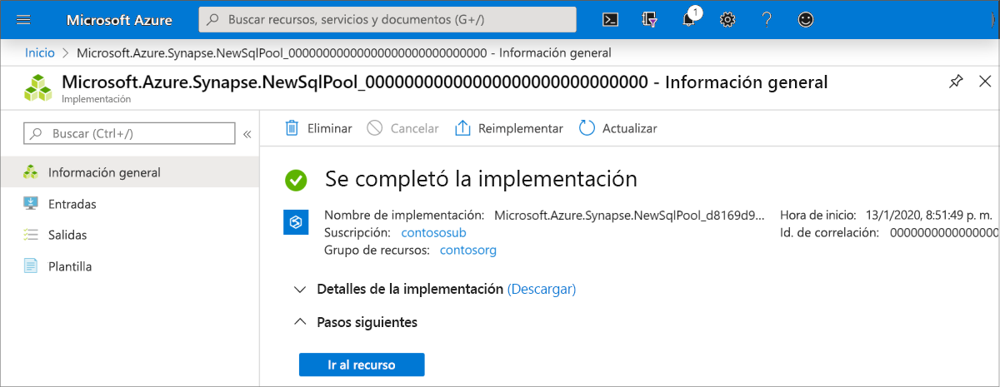
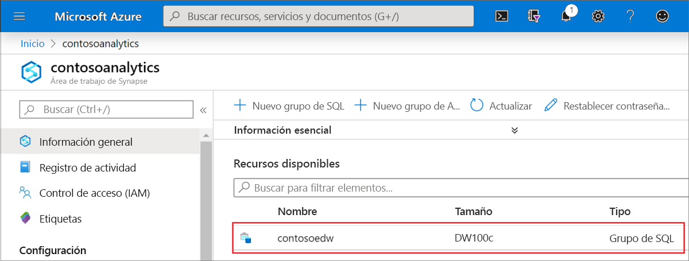
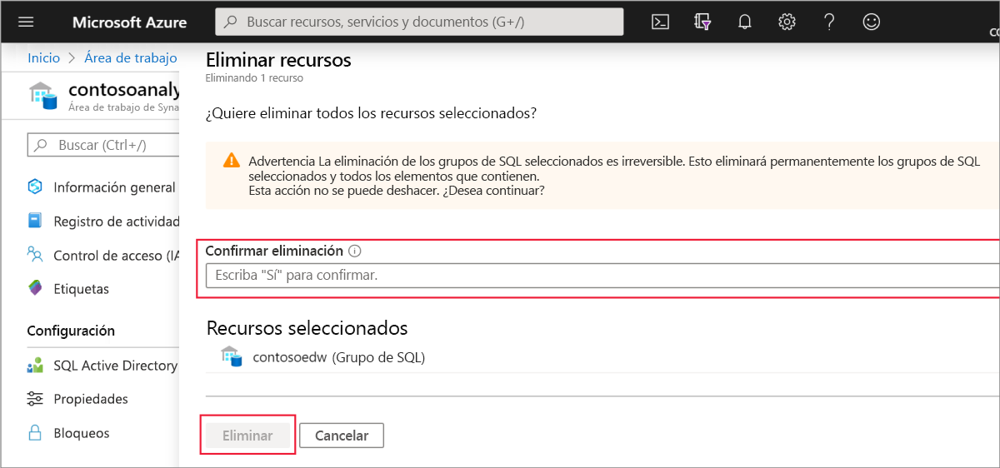

# Inicio rápido: Creación de grupo de Synapse SQL

Azure Synapse Analytics ofrece varios motores de análisis que le ayudarán a ingerir, transformar, modelar, analizar y servir sus datos. Un grupo de SQL ofrece funcionalidades de proceso y almacenamiento basadas en T-SQL. Después de crear un grupo de SQL en el área de trabajo de Synapse, los datos se pueden cargar, modelar, procesar y servir para obtener información.

En este inicio rápido aprenderá a crear un grupo de SQL en un área de trabajo de Synapse mediante Azure Portal.

Si no tiene una suscripción a Azure, [cree una cuenta gratuita antes de empezar](https://azure.microsoft.com/free/).

## Prerrequisitos

[Área de trabajo de Synapse](quickstart-create-workspace.md)

## Inicio de sesión en Azure Portal

Inicie sesión en el [Portal de Azure](https://portal.azure.com/)

## Creación de un grupo de SQL

1. En el área de trabajo de Synapse en la que desea crear el grupo de SQL, haga clic en el comando **New SQL pool** (Nuevo grupo de SQL) en la barra superior.

2. Escriba la siguiente información en la pestaña **Datos básicos**.

    | Configuración | Valor sugerido | Descripción |
    | :------ | :-------------- | :---------- |
    | **Nombre del grupo de SQL** | Cualquier nombre válido | Nombre del grupo de SQL. |
    | **Nivel de rendimiento** | DW100c | Establézcalo en el menor tamaño para reducir los costos de este inicio rápido. |
    ||||
  
    
    > [!IMPORTANT]
    > Tenga en cuenta que existen limitaciones específicas para los nombres que los grupos de SQL pueden usar. Los nombres no pueden contener caracteres especiales, deben tener 15 caracteres como máximo, no contener palabras reservadas y ser únicos en el área de trabajo.

3. Haga clic en **Siguiente: Configuración adicional**.
4. Seleccione **None** (Ninguno) para aprovisionar el grupo de SQL sin datos. Deje seleccionada la intercalación predeterminada.

5. Haga clic en **Revisar + crear**.
6. Asegúrese de que los detalles son correctos en función de lo que se especificó anteriormente y haga clic en **Crear**.

7. Llegados a este punto, se iniciará el flujo de aprovisionamiento de recursos.
 

8. Una vez completado el aprovisionamiento, al desplazarse al área de trabajo se mostrará una nueva entrada para el grupo de SQL recién creado.
 

## Limpieza de recursos

Siga los pasos que se indican a continuación para eliminar el grupo de SQL del área de trabajo.
> [!WARNING]
> Al eliminar un grupo de SQL, se quitan del área de trabajo el motor de análisis y los datos almacenados en la base de datos del grupo de SQL eliminado. Ya no será posible conectarse al grupo de SQL y todas las consultas, canalizaciones y cuadernos que lean o escriban en este grupo de SQL dejarán de funcionar.

Si quiere eliminar el grupo de SQL, complete estos pasos:

1. Vaya a la hoja de grupos de SQL en la hoja del área de trabajo
1. Seleccione el grupo de SQL que se va a eliminar (en este caso, **contosoedw**).
1. Selecciónelo y presione **Eliminar**.
1. Confirme la eliminación y presione el botón **Eliminar**.
 
1. Cuando el proceso se complete correctamente, el grupo de SQL dejará de aparecer en los recursos del área de trabajo.

Una vez creado el grupo de SQL, estará disponible en el área de trabajo para la carga de datos, el procesamiento de secuencias, la lectura del lago, etc.

## Pasos siguientes

- Consulte [Quickstart: Creación de un grupo de Apache Spark (versión preliminar) en Synapse Analytics mediante herramientas web](quickstart-apache-spark-notebook.md).
- Consulte [Quickstart: Creación de un grupo de Apache Spark (versión preliminar)](quickstart-create-apache-spark-pool.md).
