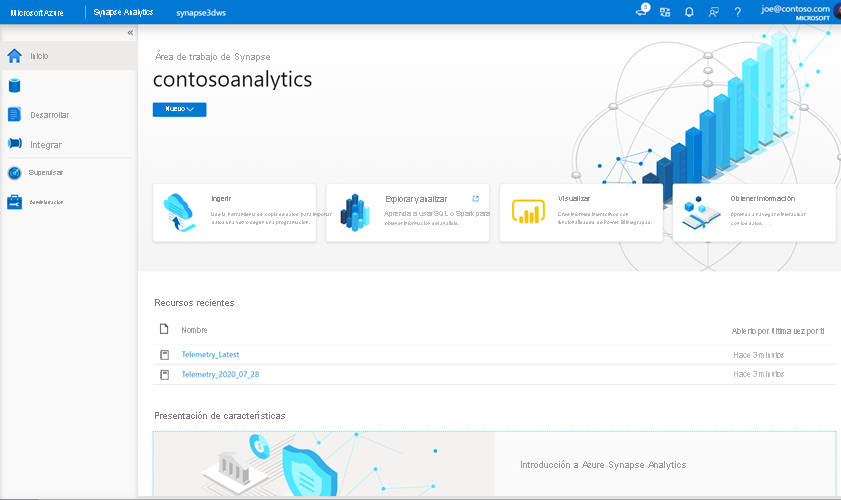
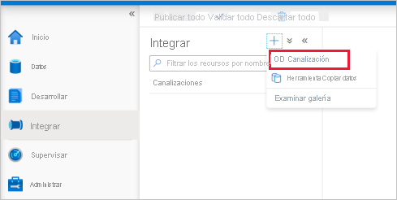

# <a name="quickstart-transform-data-using-mapping-data-flows"></a>Inicio rápido: Transformación de datos mediante flujos de datos de asignación

En este inicio rápido, usará Azure Synapse Analytics para crear una canalización que transforme los datos de un origen de Azure Data Lake Storage Gen2 (ADLS Gen2) en un receptor de ADLS Gen2 mediante un flujo de datos de asignación. El patrón de configuración de este inicio rápido se puede expandir al transformar los datos mediante el flujo de datos de asignación.

En este inicio rápido, hará lo siguiente:

> [!div class="checklist"]
> * Crear una canalización con una actividad de Data Flow en Azure Synapse Analytics.
> * Cree un flujo de datos de asignación con cuatro transformaciones.
> * Realización de la serie de pruebas de la canalización.
> * Supervisión de una actividad de Data Flow

## <a name="prerequisites"></a>Requisitos previos

* **Suscripción de Azure**: Si no tiene una suscripción a Azure, cree una [cuenta gratuita](https://azure.microsoft.com/free/) antes de empezar.
* **Área de trabajo de Azure Synapse**: Cree un área de trabajo de Synapse desde Azure Portal siguiendo las instrucciones que se indican en [Inicio rápido: Creación de un área de trabajo de Synapse](quickstart-create-workspace.md).
* **Cuenta de Azure Storage**: El almacenamiento ADLS se puede usar como almacén de datos de *origen* y *receptor*. Si no tiene una cuenta de almacenamiento, consulte [Crear una cuenta de almacenamiento](../storage/common/storage-account-create.md) para crear una.

    El archivo que se está transformando en este tutorial es MoviesDB. csv, que se puede encontrar [aquí](https://raw.githubusercontent.com/djpmsft/adf-ready-demo/master/moviesDB.csv). Para recuperar el archivo de GitHub, copie el contenido en un editor de texto de su elección para guardarlo localmente como un archivo. csv. Para cargar el archivo en la cuenta de almacenamiento, vea [Carga de blobs con Azure Portal](../storage/blobs/storage-quickstart-blobs-portal.md). Los ejemplos harán referencia a un contenedor denominado "Sample-Data".

### <a name="navigate-to-the-synapse-studio"></a>Desplazamiento a Synapse Studio

Una vez creada el área de trabajo de Azure Synapse, hay dos maneras de abrir Synapse Studio:

* Abrir el área de trabajo de Synapse en [Azure Portal](https://ms.portal.azure.com/#home). Seleccione **Abrir** en la tarjeta Abrir Synapse Studio de Información general.
* Abra [Azure Synapse Analytics](https://web.azuresynapse.net/) e inicie sesión en su área de trabajo.

En este inicio rápido, se usa como ejemplo el área de trabajo denominada "adftest2020". Se le dirigirá automáticamente a la página principal de Synapse Studio.



## <a name="create-a-pipeline-with-a-data-flow-activity"></a>Creación de una canalización con una actividad de Data Flow

Una canalización contiene el flujo lógico para una ejecución de un conjunto de actividades. En este paso, creará una canalización que contiene una actividad de Data Flow.

1. Vaya a la ficha **Integrar**. Seleccione el icono de signo de más situado junto al encabezado de canalizaciones y seleccione Pipeline (Canalización).

   

1. En la página de configuración **Properties** (Propiedades) de la canalización, escriba **TransformMovies** en **Name** (Nombre).

1. En *Move and Transform* (Mover y transformar) en el panel *Activities* (Actividades), arrastre **Data flow** (Flujo de datos) al lienzo de la canalización.

1. En el menú emergente de la página **Adding data flow** (Agregar flujo de datos), seleccione **Create new data flow** -> **Data flow** (Crear nuevo flujo de datos > Flujo de datos). Pulse **OK** (Aceptar) cuando haya terminado.

   

1. En la página **Properties** (Propiedades), asigne al flujo de datos el nombre **TransformMovies**.

## <a name="build-transformation-logic-in-the-data-flow-canvas"></a>Generación de la lógica de transformación en el lienzo de flujo de datos

Una vez creado el flujo de datos, se le enviará automáticamente al lienzo flujo de datos. En este paso, creará un flujo de datos que toma el archivo MoviesDB.csv del almacenamiento de ADLS y agrega la clasificación media de comedias entre 1910 y 2000. Después, volverá a escribir este archivo en el almacenamiento de ADLS.

1. Encima del lienzo del flujo de datos, mueva el control deslizante **Data flow debug** (Depuración de flujo de datos) a la posición de activado. El modo de depuración permite realizar pruebas interactivas de la lógica de transformación en un clúster de Spark activo. Los clústeres de Data Flow tardan de 5 a 7 minutos en prepararse y se recomienda que los usuarios activen primero la depuración si planean realizar el desarrollo de Data Flow. Para más información, consulte [Modo de depuración](https://docs.microsoft.com/azure/data-factory/concepts-data-flow-debug-mode?toc=/azure/synapse-analytics/toc.json&bc=/azure/synapse-analytics/breadcrumb/toc.json).

    

1. Para agregar un lienzo de flujo de datos, haga clic en el cuadro **Agregar origen** y agregue un origen.

1. Asigne un nombre al origen **MoviesDB**. Haga clic en **Nuevo** para crear un conjunto de datos de origen nuevo.

    

1. Elija **Azure Data Lake Storage Gen2**. Haga clic en Continue.

    

1. Elija **DelimitedText**. Haga clic en Continue.

1. Asigne un nombre al conjunto de datos **MoviesDB**. En la lista desplegable de servicios vinculados, elija **Nuevo**.

1. En la pantalla de creación del servicio vinculado, asigne el nombre **ADLSGen2** al servicio vinculado ADLS Gen2 y especifique el método de autenticación. A continuación, escriba las credenciales de conexión. En este inicio rápido, se va a usar la clave de cuenta para conectarse a nuestra cuenta de almacenamiento. Puede hacer clic en **Prueba de conexión** para comprobar que las credenciales se escribieron correctamente. Cuando haya terminado, haga clic en **Create** (Crear).

    

1. Una vez de regreso a la pantalla de creación del conjunto de datos, escriba la ubicación del archivo en el campo **File path** (Ruta de acceso de archivo). En este inicio rápido, el archivo "MoviesDB.csv" se encuentra en el contenedor "sample-data". Como el archivo tiene encabezados, active **First row as header** (Primera fila como encabezado). Seleccione **From Connection/Store** (Desde la conexión o almacén) para importar el esquema de encabezado directamente desde el archivo en el almacenamiento. Pulse **OK** (Aceptar) cuando haya terminado.

    

1. Si se ha iniciado el clúster de depuración, vaya a la pestaña **Vista previa de los datos** de la transformación de origen y haga clic en **Actualizar** para obtener una instantánea de los datos. Puede usar la vista previa de los datos para comprobar que la transformación está configurada correctamente.

    

1. Junto al nodo de origen en el lienzo de flujo de datos, haga clic en el icono de signo más para agregar una nueva transformación. La primera transformación que va a agregar es un **filtro**.

    

1. Denomine **FilterYears** a la transformación de filtro. Haga clic en el cuadro de expresión junto a **Filtro en** para abrir el generador de expresiones. Aquí especificará la condición de filtrado.

1. El generador de expresiones de flujo de datos le permite compilar de forma interactiva expresiones para utilizarlas en varias transformaciones. Las expresiones pueden incluir funciones integradas, columnas del esquema de entrada y parámetros definidos por el usuario. Para más información sobre cómo compilar expresiones, vea [Generador de expresiones de Mapping Data Flow](https://docs.microsoft.com/azure/data-factory/concepts-data-flow-expression-builder?toc=/azure/synapse-analytics/toc.json&bc=/azure/synapse-analytics/breadcrumb/toc.json).

    En este inicio rápido, quiere filtrar las películas de género comedia que se estrenaron entre los años 1910 y 2000. Dado que el año es actualmente una cadena, debe convertirlo en un entero mediante la función ```toInteger()```. Use los operadores mayor o igual que (> =) y menor o igual que (< =) para comparar con los valores de año literal 1910 y 200-. Una estas expresiones junto con el operador and (&&). La expresión aparece como:

    ```toInteger(year) >= 1910 && toInteger(year) <= 2000```

    Para averiguar qué películas son comedias, puede usar la función ```rlike()``` para buscar el patrón " comedia" en la columna de géneros. Una la expresión rlike con la comparación de año para obtener:

    ```toInteger(year) >= 1910 && toInteger(year) <= 2000 && rlike(genres, 'Comedy')```

    

    Si tiene un clúster de depuración activo, puede comprobar la lógica; para ello, haga clic en **Actualizar** para ver la salida de la expresión en comparación con las entradas usadas. Hay más de una respuesta correcta sobre cómo puede realizar esta lógica mediante el lenguaje de expresiones de flujo de datos.

    Haga clic en **Guardar y finalizar** una vez que haya terminado con la expresión.

1. Capture una **Vista previa de datos** para comprobar que el filtro funciona correctamente.

1. La transformación siguiente que se va a agregar es una transformación de **agregado** en **Schema Modifier** (Modificador de esquema).

    

1. Denomine **AggregateComedyRatings** a la transformación de agregado. En la pestaña **Agrupar por**, seleccione **year** (año) en la lista desplegable para agrupar las agregaciones por el año en que apareció la película.

    

1. Vaya a la pestaña **Agregados**. En el cuadro de texto de la izquierda, asigne a la columna agregada el nombre **AverageComedyRating**. Haga clic en el cuadro de la expresión derecha para especificar la expresión de agregado a través del generador de expresiones.

    

1. Para obtener el promedio de la columna **Rating** (Clasificación), use la función de agregado ```avg()```. Como **Rating** (Clasificación) es una cadena y ```avg()``` toma una entrada numérica, debemos convertir el valor en un número a través de la función ```toInteger()```. Se trata de una expresión similar a la siguiente:

    ```avg(toInteger(Rating))```

    Haga clic en **Guardar y finalizar** cuando haya terminado.

    

1. Vaya a la pestaña **Vista previa de datos** para ver la salida de la transformación. Observe que solo hay dos columnas, **year** y **AverageComedyRating**.

    

1. A continuación, desea agregar una transformación de **receptor** en **Destino**.

    

1. Asigne un nombre al receptor **Sink** (Receptor). Haga clic en **Nuevo** para crear un conjunto de datos de receptor.

1. Elija **Azure Data Lake Storage Gen2**. Haga clic en Continue.

1. Elija **DelimitedText**. Haga clic en Continue.

1. Asigne el nombre **MoviesSink** al conjunto de datos de receptor. Como servicio vinculado, elija el servicio vinculado ADLS Gen2 que creó en el paso 7. Escriba una carpeta de salida en la que escribir los datos. En este inicio rápido, vamos a escribir en la carpeta "output" del contenedor "sample-data". No es necesario que la carpeta exista de antemano y se puede crear dinámicamente. Establezca **Usar la primera fila como encabezado** en true y seleccione **Ninguna** en **Importar esquema**. Pulse **OK** (Aceptar) cuando haya terminado.

    

Ahora ha terminado de crear el flujo de datos. Está preparado para ejecutarlo en la canalización.

## <a name="running-and-monitoring-the-data-flow"></a>Ejecución y supervisión del flujo de datos

Puede depurar una canalización antes de publicarla. En este paso, va a desencadenar una ejecución de depuración de la canalización de flujo de datos. Aunque la vista previa de los datos no escribe datos, una ejecución de depuración escribirá datos en el destino del receptor.

1. Vaya al lienzo de la canalización. Haga clic en **Depurar** para desencadenar una ejecución de depuración.

    

1. La depuración de canalización de actividades de Data Flow usa el clúster de depuración activo, pero sigue tardando al menos un minuto en inicializarse. Puede realizar un seguimiento del progreso a través de la pestaña **Salida**. Una vez que la ejecución se realice correctamente, haga clic en el icono de anteojos para abrir el panel de supervisión.

    

1. En el panel supervisión, puede ver el número de filas y el tiempo invertido en cada paso de transformación.

    

1. Haga clic en una transformación para obtener información detallada sobre las columnas y las particiones de los datos.

    

Si siguió correctamente este inicio rápido, debe haber escrito 83 filas y 2 columnas en la carpeta del receptor. Puede comprobar el almacenamiento de blobs para confirmar los datos.


## <a name="next-steps"></a>Pasos siguientes

Avance a los artículos siguientes para aprender sobre la compatibilidad de Azure Synapse Analytics:

> [!div class="nextstepaction"]
> [Canalización y actividades](https://docs.microsoft.com/azure/data-factory/concepts-pipelines-activities?toc=/azure/synapse-analytics/toc.json&bc=/azure/synapse-analytics/breadcrumb/toc.json)
> [Introducción a al flujo de datos de asignación](https://docs.microsoft.com/azure/data-factory/concepts-data-flow-overview?toc=/azure/synapse-analytics/toc.json&bc=/azure/synapse-analytics/breadcrumb/toc.json)
> [Lenguaje de expresiones de flujo de datos](https://docs.microsoft.com/azure/data-factory/data-flow-expression-functions?toc=/azure/synapse-analytics/toc.json&bc=/azure/synapse-analytics/breadcrumb/toc.json)
