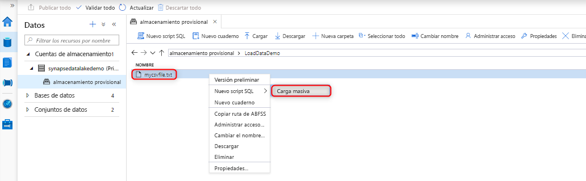
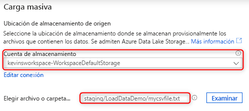
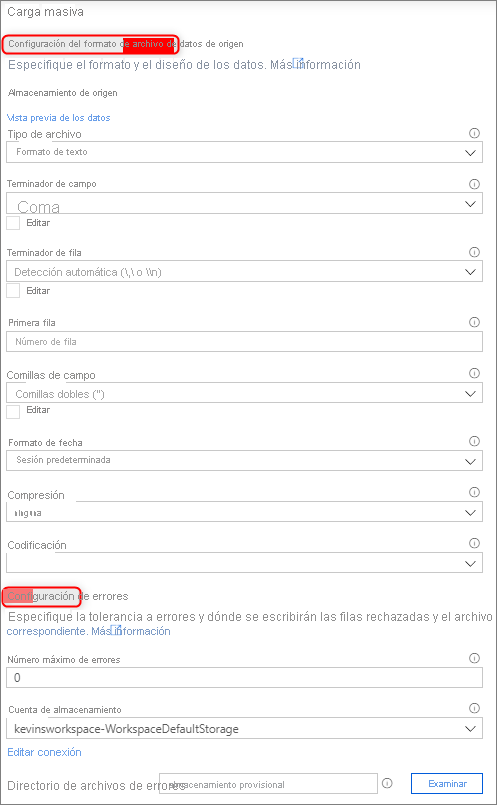
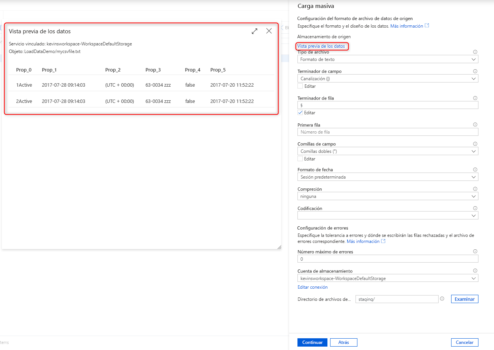
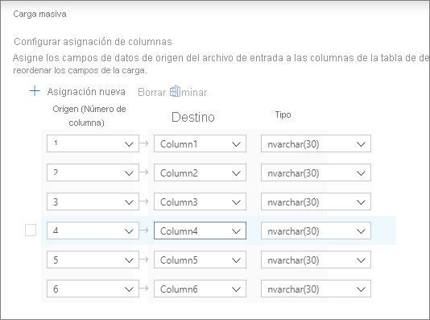
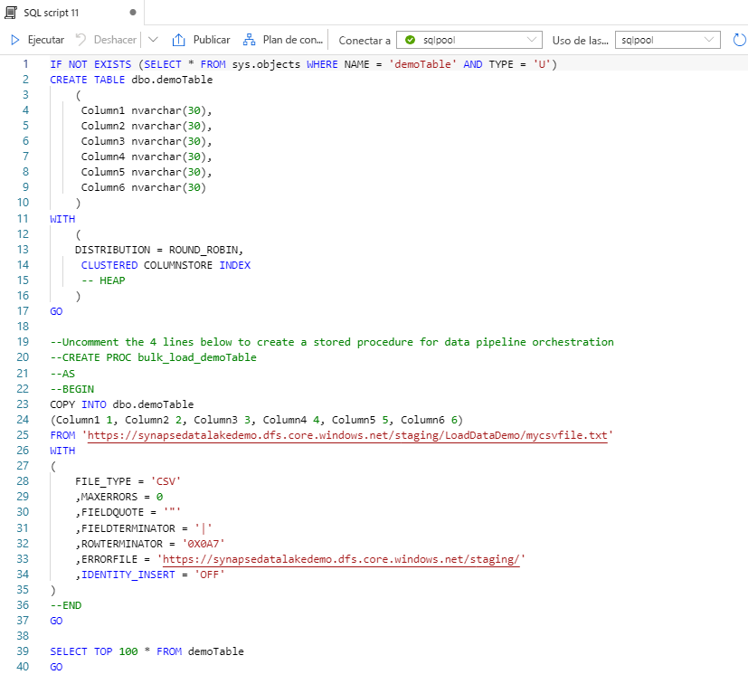

# Carga masiva con Synapse SQL

La carga de datos nunca ha sido más fácil que cuando se usa el Asistente para carga masiva en Synapse Studio. Este asistente le guiará a través de la creación de un script de T-SQL con la [instrucción COPY](https://docs.microsoft.com/sql/t-sql/statements/copy-into-transact-sql?view=azure-sqldw-latest) para cargar datos de forma masiva. 

## Puntos de entrada al Asistente para carga masiva

Ahora puede cargar datos de forma masiva fácilmente mediante grupos de SQL. Solo tiene que hacer clic con el botón derecho en las siguientes áreas en Synapse Studio:

- Un archivo o una carpeta de una cuenta de Azure Storage asociada al área de trabajo 

## Prerrequisitos

- Debe tener acceso al área de trabajo al menos con el rol de RBAC de Colaborador de datos de Storage Blob en la cuenta de Azure Data Lake Storage Gen2.

- Debe tener los permisos necesarios [para usar la instrucción COPY](https://docs.microsoft.com/sql/t-sql/statements/copy-into-transact-sql?view=azure-sqldw-latest#permissions) y tener permisos de creación de tablas si va a crear una tabla en la que cargar datos.

- El servicio vinculado asociado a la cuenta de Azure Data Lake Storage Gen2 **debe tener acceso al archivo**/**carpeta** que se va a cargar. Por ejemplo, si el mecanismo de autenticación del servicio vinculado es Identidad administrada, la identidad administrada del área de trabajo debe tener, al menos, permiso de lectura de Blob Storage en la cuenta de almacenamiento.

- Si hay una red virtual habilitada en el área de trabajo, asegúrese de que el runtime integrado asociado a la cuenta de Azure Data Lake Storage Gen2 los servicios vinculados para los datos de origen y la ubicación del archivo de error tiene habilitada la creación interactiva. La creación interactiva es necesaria para la detección automática de esquemas, la vista previa del contenido del archivo de origen y la exploración de cuentas de almacenamiento de Azure Data Lake Storage Gen2 en el asistente.

### Pasos

1. Seleccione la cuenta de almacenamiento y el archivo o la carpeta desde donde se va a realizar la carga en el panel Source storage location (Ubicación de almacenamiento de origen): 

2. Seleccione la configuración del formato de archivo, incluida la cuenta de almacenamiento en la que desea escribir las filas rechazadas (archivo de error). Actualmente solo se admiten archivos .csv y Parquet.

    

3. Puede hacer clic en "Preview data" (Vista previa de los datos) para ver cómo va a analizar el archivo la instrucción COPY para ayudarle en la configuración del formato de archivo. Haga clic en "Preview data" (Vista previa de los datos) cada vez que cambie la configuración del formato de archivo para ver cómo va a analizar el archivo la instrucción COPY con la configuración actualizada:  

4. Seleccione el grupo de SQL que va a usar para cargar, incluido si la carga será para una tabla existente o una nueva: 

5. Haga clic en "Configure column mapping" (Configurar asignación de columnas) para asegurarse de que tiene la asignación de columnas adecuada. En el caso de las nuevas tablas, la configuración de la asignación de columnas es fundamental para actualizar los tipos de datos de la columna de destino: 

6. Haga clic en "Open script" (Abrir script) y se generará un script de T-SQL con la instrucción COPY para cargar desde un lago de datos: 

## Pasos siguientes

- Consulte el artículo [Instrucción COPY](https://docs.microsoft.com/sql/t-sql/statements/copy-into-transact-sql?view=azure-sqldw-latest#syntax) para más información sobre las funcionalidades de COPY
- Consulte el artículo [Introducción a la carga de datos](https://docs.microsoft.com/azure/synapse-analytics/sql-data-warehouse/design-elt-data-loading#what-is-elt)
