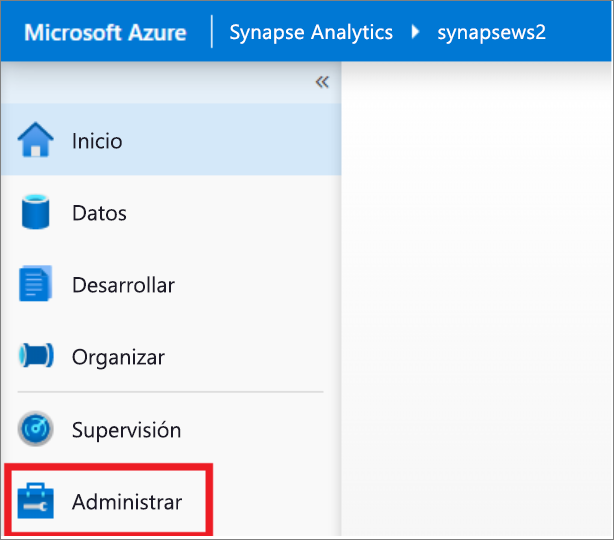
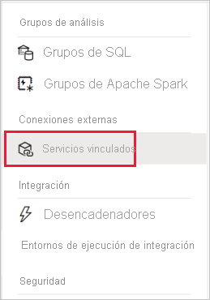
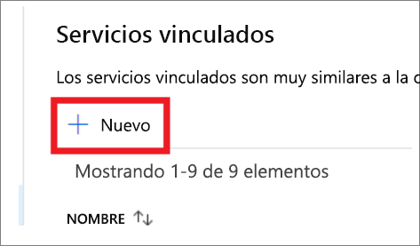
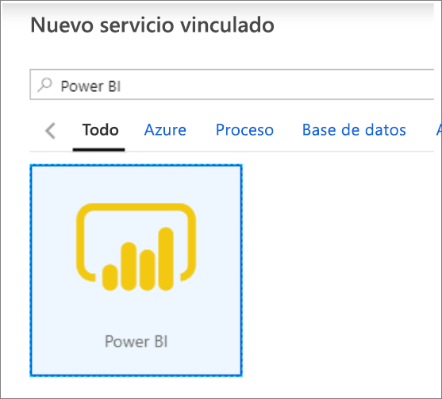
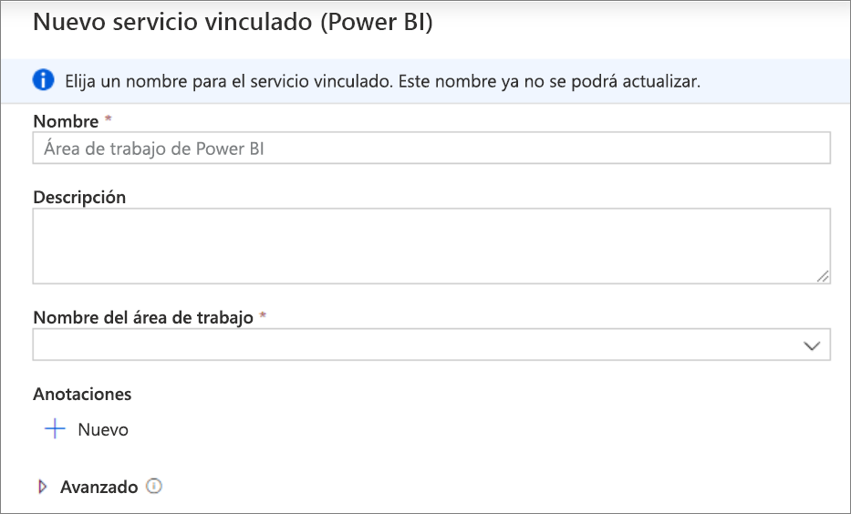
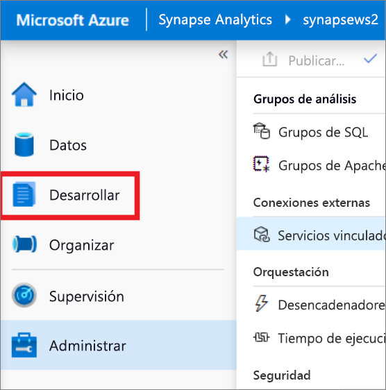
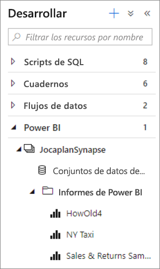
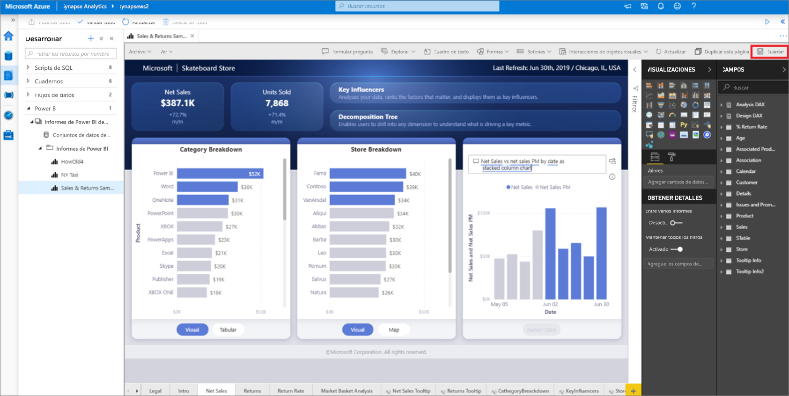

# Inicio rápido: Vinculación de un área de trabajo de Power BI a un área de trabajo de Synapse

En este inicio rápido, aprenderá a conectar un área de trabajo de Power BI a un área de trabajo de Synapse Analytics para crear informes de Power BI y conjuntos de valores de Synapse Studio (versión preliminar).

Si no tiene una suscripción a Azure, [cree una cuenta gratuita antes de empezar](https://azure.microsoft.com/free/).

## Requisitos previos

- [Creación de un área de trabajo de Azure Synapse y una cuenta de almacenamiento asociada](quickstart-create-workspace.md).
- [Un área de trabajo de Power BI Professional o Premium](https://docs.microsoft.com/power-bi/service-create-the-new-workspaces).

## Vinculación de un área de trabajo de Power BI a su área de trabajo de Synapse

1. Inicie Synapse Studio y haga clic en **Manage** (Administrar).

    

2. En **External Connections** (Conexiones externas), haga clic en **Linked services** (Servicios vinculados).

    

3. Haga clic en **+ Nuevo**.

    

4. Haga clic en **Power BI** y, después en **Continue** (Continuar).

    

5. Escriba un nombre para el servicio vinculado y seleccione un área de trabajo en la lista desplegable.

    

6. Haga clic en **Crear**.

## Visualización del área de trabajo de Power BI en Synapse Studio

Una vez que las áreas de trabajo están vinculadas, desde Synapse Studio puede examinar los conjuntos de valores de Power BI, editar o crear nuevos informes de Power BI.

1. Haga clic en **Develop** (Desarrollar).

    

2. Expanda Power BI y el área de trabajo que desea utilizar.

    

Para crear informes, haga clic en **+** en la parte superior de la pestaña **Develop** (Desarrollar). Para editar los informes existentes, haga clic en su nombre. Los cambios guardados se volverán a escribir en el área de trabajo de Power BI.

## Pasos siguientes

Más información acerca de la [creación de un informe de Power BI en archivos almacenados en Azure Storage](sql/tutorial-connect-power-bi-desktop.md).
