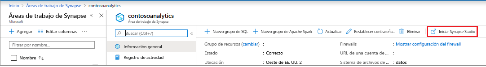
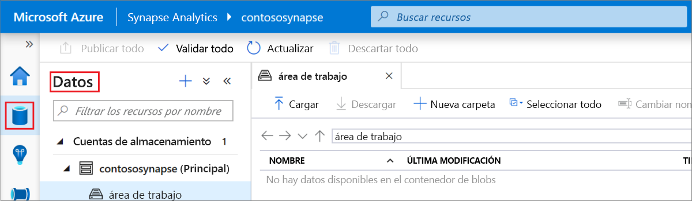
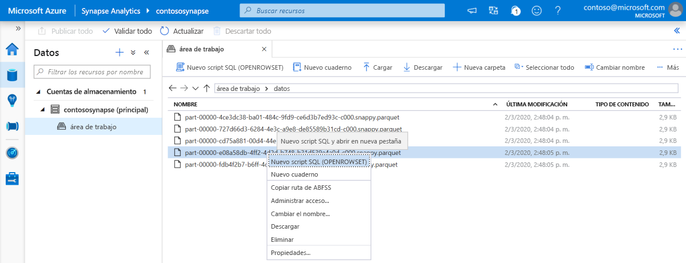
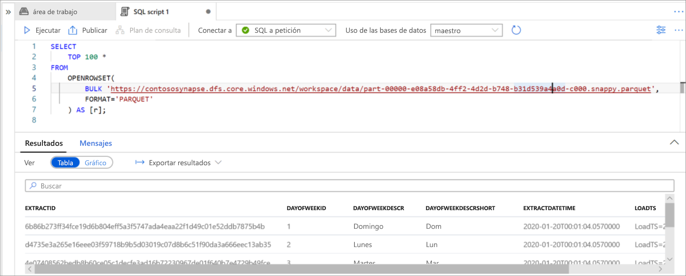

# Inicio rápido: Uso de Synapse Studio (versión preliminar)

En este artículo de inicio rápido, aprenderá a consultar archivos con Synapse Studio.

Si no tiene una suscripción a Azure, cree una cuenta [gratuita](https://azure.microsoft.com/free/) antes de empezar.

## Inicio de sesión en Azure Portal

Inicie sesión en [Azure Portal](https://portal.azure.com/).

## Prerrequisitos

[Cree un área de trabajo de Azure Synapse y una cuenta de almacenamiento asociada](quickstart-create-workspace.md).

## Inicio de Synapse Studio

En el área de trabajo de Azure Synapse en Azure Portal, haga clic en **Iniciar Synapse Studio**.

Como alternativa, puede iniciar Synapse Studio haciendo clic en [Azure Synapse Analytics](https://web.azuresynapse.net) y proporcionando los valores de inquilino, suscripción y área de trabajo adecuados.

## Examen de las cuentas de almacenamiento

Cuando abra Synapse Studio, vaya a **Datos** y, a continuación, expanda **Cuentas de almacenamiento** para ver la cuenta de almacenamiento en el área de trabajo.

Puede crear nuevas carpetas y cargar archivos mediante los vínculos de la barra de herramientas para organizar los archivos.

## Consulta de archivos en la cuenta de almacenamiento

> [!IMPORTANT]
> Debe ser miembro del rol `Storage Blob Reader` en el almacenamiento subyacente para poder realizar consultas en los archivos. Obtenga información sobre cómo [asignar los permisos de RBAC **Lector de datos de Storage Blob** o **Colaborador de datos de Storage Blob** en Azure Storage](../storage/common/storage-auth-aad-rbac-portal.md?toc=/azure/synapse-analytics/toc.json&bc=/azure/synapse-analytics/breadcrumb/toc.json#assign-a-built-in-rbac-role).

1. Cargue algunos archivos `PARQUET`.
2. Seleccione uno o varios archivos y, a continuación, cree un nuevo script SQL o un cuaderno de Spark para ver el contenido de los archivos. Si desea crear un cuaderno, debe crear el [grupo de Apache Spark en el área de trabajo](quickstart-create-apache-spark-pool.md).

   

3. Ejecute la consulta o cuaderno generados para ver el contenido del archivo.

   

4. Puede cambiar la consulta para filtrar y ordenar los resultados. Busque características de lenguaje que están disponibles en SQL a petición en [Introducción a las características de SQL](sql/overview-features.md).

## Pasos siguientes

- Permita a los usuarios de Azure AD consultar archivos mediante la asignación de los permisos de RBAC [**Lector de datos de Storage Blob** o **Colaborador de datos de Storage Blob** en Azure Storage](../storage/common/storage-auth-aad-rbac-portal.md?toc=/azure/synapse-analytics/toc.json&bc=/azure/synapse-analytics/breadcrumb/toc.json#assign-a-built-in-rbac-role)
- [Consulta de archivos en Azure Storage mediante SQL a petición (versión preliminar)](sql/on-demand-workspace-overview.md)
- [Creación de un grupo de Apache Spark mediante Azure Portal](quickstart-create-apache-spark-pool.md)
- [Tutorial: Conexión de SQL a petición (versión preliminar) con Power BI Desktop y creación de informes](sql/tutorial-connect-power-bi-desktop.md)
