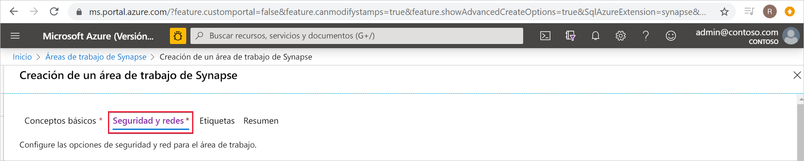
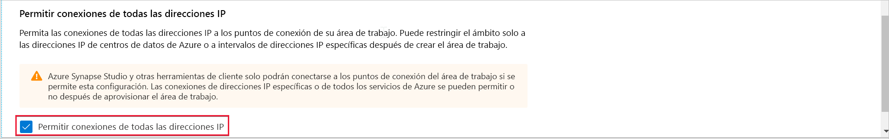
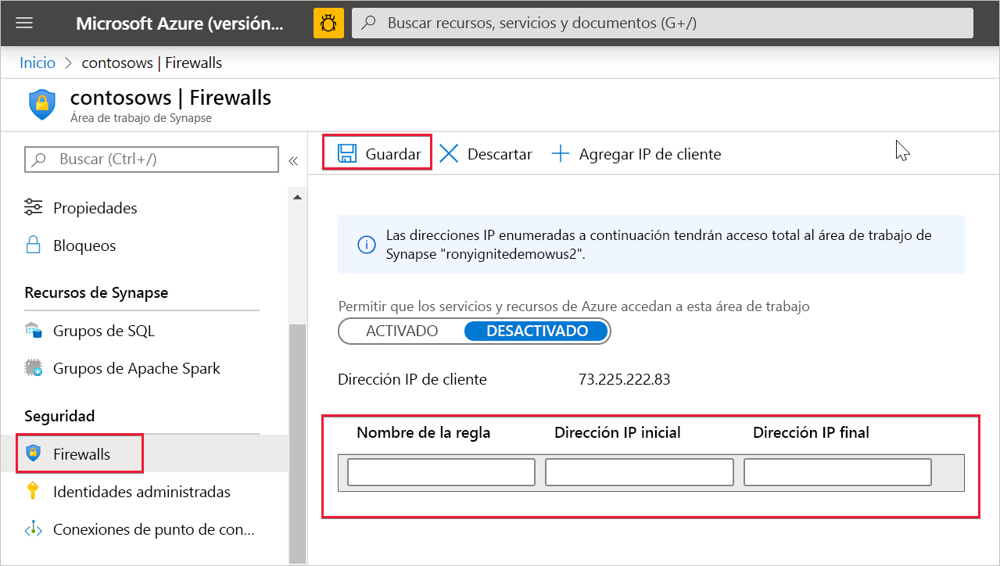

# Reglas de firewall de IP de Azure Synapse Analytics

En este artículo se explican las reglas de firewall de IP y se muestra cómo configurarlas en Azure Synapse Analytics.

## Reglas de firewall de IP

Las reglas de firewall de IP conceden o deniegan el acceso al área de trabajo de Synapse en función de la dirección IP de origen de cada solicitud. Se pueden configurar reglas de firewall de IP para el área de trabajo. Las reglas de firewall de IP configuradas en el nivel de área de trabajo se aplican a todos los puntos de conexión públicos del área de trabajo (grupos de SQL dedicado, grupo de SQL sin servidor y desarrollo).

## Creación y administración de reglas de firewall de IP

Hay dos maneras de agregar reglas de firewall de IP a un área de trabajo de Synapse. Para agregar un firewall de IP al área de trabajo, seleccione **Security + networking** (Seguridad y redes) y active **Uso permitido de conexiones de todas las direcciones IP** durante la creación del área de trabajo.

También puede agregar reglas de firewall de IP a un área de trabajo de Synapse después de crear el área de trabajo. En Azure Portal, vaya a **Seguridad** y seleccione **Firewalls**. Para agregar una nueva regla de firewall de IP, asígnele un nombre, una dirección IP inicial y una dirección IP final. Seleccione **Guardar** cuando haya terminado.

## Conexión con Synapse desde su propia red

Puede conectarse al área de trabajo de Synapse con Synapse Studio. También puede usar SQL Server Management Studio (SSMS) para conectarse a los recursos de SQL (grupos de SQL dedicado y grupo de SQL sin servidor) del área de trabajo.

Asegúrese de que el firewall de la red y del equipo local permita la comunicación saliente en los puertos TCP 80, 443 y 1443 para Synapse Studio.

Además, debe permitir la comunicación saliente en el puerto UDP 53 para Synapse Studio. Para conectarse mediante herramientas como SSMS y Power BI, debe permitir la comunicación saliente en el puerto TCP 1433.

Si va a usar la configuración predeterminada de la directiva de conexión de redireccionamiento, puede que necesite permitir la comunicación saliente en otros puertos. [Aquí](https://docs.microsoft.com/azure/sql-database/sql-database-connectivity-architecture#connection-policy) puede encontrar más información sobre las directivas de conexión.

## Pasos siguientes

Creación de un [área de trabajo de Azure Synapse](../quickstart-create-workspace.md)

Creación de un área de trabajo de Azure Synapse con una [red virtual de área de trabajo administrada](./synapse-workspace-managed-vnet.md)