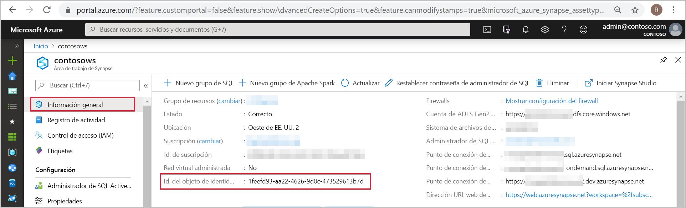
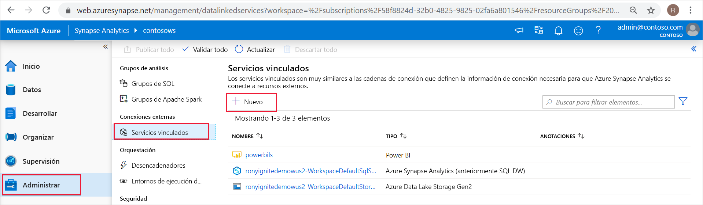
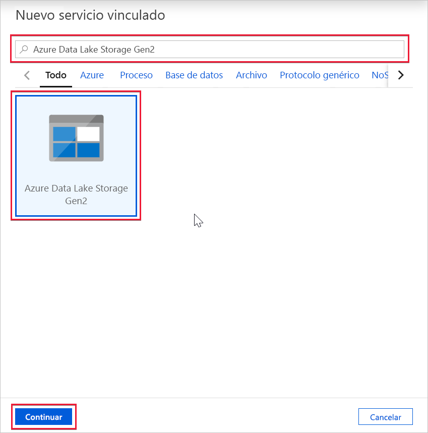
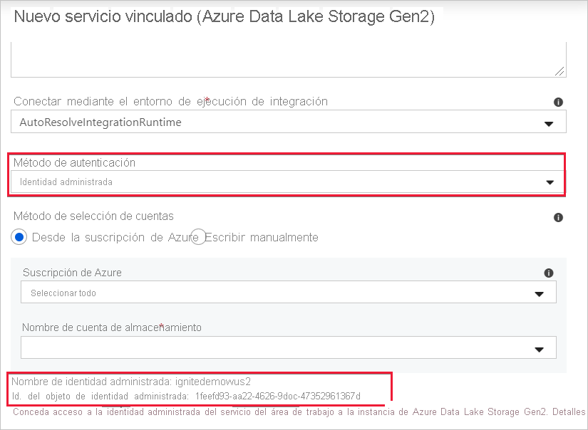

# Identidad administrada del área de trabajo de Azure Synapse (versión preliminar)

En este artículo, aprenderá sobre la identidad administrada en el área de trabajo de Azure Synapse.

## Identidades administradas

La identidad administrada para recursos de Azure es una característica de Azure Active Directory. Esta característica proporciona a los servicios de Azure una identidad de sistema administrada automáticamente en Azure AD. Puede usar la funcionalidad de identidad administrada para autenticarse en cualquier servicio que admita la autenticación de Azure AD.

Identidad administrada para recursos de Azure es el nuevo nombre del servicio conocido anteriormente como Managed Service Identity (MSI). Consulte [Identidades administradas](../../active-directory/managed-identities-azure-resources/overview.md?toc=/azure/synapse-analytics/toc.json&bc=/azure/synapse-analytics/breadcrumb/toc.json) para más información.

## Identidad administrada del área de trabajo de Azure Synapse

Al crear el área de trabajo, se crea una identidad administrada asignada por el sistema para el área de trabajo de Azure Synapse.

>[!NOTE]
>En el resto de este documento, se hará referencia a ella como identidad administrada.

Azure Synapse usa la identidad administrada para orquestar las canalizaciones. El ciclo de vida de la identidad administrada está directamente vinculado al área de trabajo de Azure Synapse. Si elimina el área de trabajo de Azure Synapse, la identidad administrada también se borra.

La identidad administrada del área de trabajo necesita permisos para realizar operaciones en las canalizaciones. Al conceder permisos, puede usar el identificador de objeto o el nombre del área de trabajo de Azure Synapse para buscar la identidad administrada.

## Recuperación de la identidad administrada en Azure Portal

Puede recuperar la identidad administrada en Azure Portal. Abra el área de trabajo de Azure Synapse en Azure Portal y seleccione **Información general** en el panel de navegación izquierdo. El identificador de objeto de la identidad administrada se muestra en la pantalla principal.

También se mostrará la información de identidad administrada cuando cree un servicio vinculado que admita la autenticación de la identidad administrada desde Azure Synapse Studio.

Inicie **Azure Synapse Studio** y seleccione la pestaña **Manage** (Administrar) en el panel de navegación izquierdo. Luego, seleccione **Linked services** (Servicios vinculados) y elija la opción **+ New** (+ Nuevo) para crear un servicio vinculado.

En la ventana **New linked service** (Nuevo servicio vinculado), escriba *Azure Data Lake Storage Gen2*. Seleccione el tipo de recurso **Azure Data Lake Storage Gen2** en la lista siguiente y elija **Continue** (Continuar).

En la siguiente ventana, elija **Managed Identity** (Identidad administrada) en **Authentication method** (Método de autenticación). Verá los valores de **Name** (Nombre) y **Object ID** (Id. de objeto).

## Pasos siguientes

[Concesión de permisos a la identidad administrada de área de trabajo de Azure Synapse](./how-to-grant-workspace-managed-identity-permissions.md)
