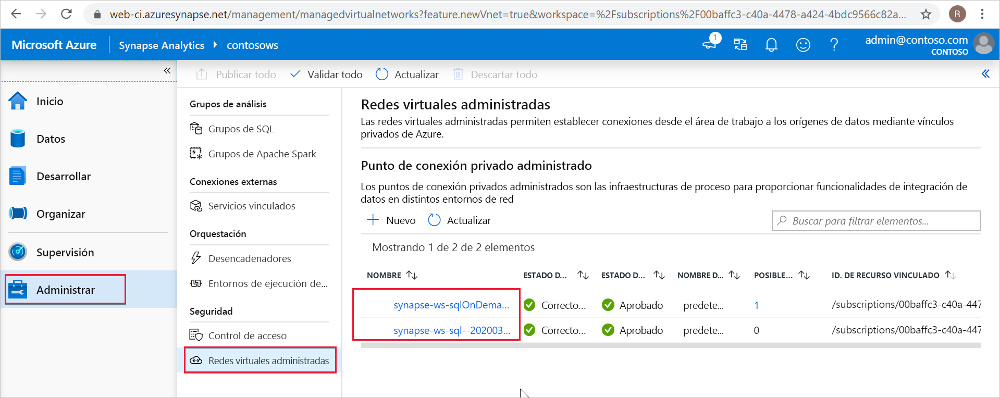

# Puntos de conexión privados administrados de Synapse (versión preliminar)

En este artículo se explican los puntos de conexión privados administrados en Azure Synapse Analytics.

## Puntos de conexión privados administrados

Los puntos de conexión privados se crean en Microsoft Azure Virtual Network del área de trabajo administrada y establecen un vínculo privado a los recursos de Azure. Azure Synapse administra estos puntos de conexión privados en su nombre.

Azure Synapse admite vínculos privados. Private Link le permite acceder tanto a los servicios de Azure (como Azure Storage y Azure Cosmos DB) como a los servicios de cliente o asociado hospedados por Azure desde su red virtual de Azure de forma segura.

Cuando se usa un vínculo privado, el tráfico entre la red virtual y el área de trabajo atraviesa completamente la red troncal de Microsoft. Private Link protege frente a los riesgos de la filtración de datos. El vínculo privado a un recurso se establece mediante la creación de un punto de conexión privado.

El punto de conexión privado usa una dirección IP privada desde la red virtual para incorporar el servicio de manera eficaz a la red virtual. Los puntos de conexión privados se asignan a un recurso específico de Azure, no a todo el servicio. Los clientes pueden limitar la conectividad a un recurso específico aprobado por su organización. 

Más información sobre [vínculos privados y puntos de conexión privados](https://docs.microsoft.com/azure/private-link/).

>[!IMPORTANT]
>Los puntos de conexión privados administrados solo se admiten en áreas de trabajo de Azure Synapse con una red virtual de área de trabajo administrada.

>[!NOTE]
>Todo el tráfico saliente de la red virtual del área de trabajo administrada, excepto el que atraviese puntos de conexión privados administrados, se bloqueará en el futuro. Se recomienda crear puntos de conexión privados administrados para conectarse a todos los orígenes de datos de Azure que se encuentren fuera del área de trabajo. 

Una conexión de punto de conexión privado se crea en un estado "pendiente" cuando se crea un punto de conexión privado administrado en Azure Synapse. Se inicia un flujo de trabajo de aprobación. El propietario del recurso de vínculo privado es responsable de aprobar o rechazar la conexión.

Si el propietario aprueba la conexión, se establece el vínculo privado. Sin embargo, si el propietario no aprueba la conexión, no se establecerá el vínculo privado. En cualquier caso, el punto de conexión privado administrado se actualizará con el estado de la conexión.

Solo un punto de conexión privado administrado en un estado aprobado puede enviar tráfico a un recurso de vínculo privado determinado.

## Puntos de conexión privados administrados para el grupo de SQL dedicado y el grupo de SQL sin servidor

El grupo de SQL dedicado y el grupo de SQL sin servidor son funcionalidades de análisis del área de trabajo de Azure Synapse. Estas funcionalidades usan una infraestructura de varios inquilinos que no está implementada en la [red virtual de área de trabajo administrada](./synapse-workspace-managed-vnet.md).

Cuando se crea un área de trabajo, Azure Synapse crea en ella dos puntos de conexión privados administrados, uno para el grupo de SQL dedicado y otro para el grupo de SQL sin servidor. 

Estos dos puntos de conexión privados administrados aparecen en Azure Synapse Studio. Seleccione **Manage** (Administrar) en el panel de navegación izquierdo y, luego, elija **Managed Virtual Networks** (Redes virtuales administradas) para verlas en Studio.

El punto de conexión privado administrado cuyo destino es un grupo de SQL se llama *synapse-ws-sql--\<workspacename\>* y el que tiene como destino el grupo de SQL sin servidor se llama *synapse-ws-sqlOnDemand--\<workspacename\>* .

Estos dos puntos de conexión privados administrados se crean automáticamente al crear el área de trabajo de Azure Synapse. No se le cobra por ellos.

## Pasos siguientes

Para obtener más información, avance al artículo [Creación de puntos de conexión privados administrados al origen de datos](./how-to-create-managed-private-endpoints.md).
