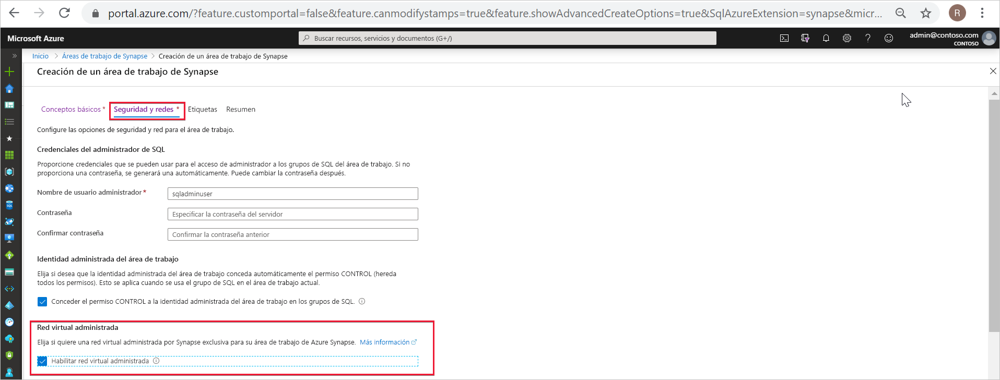
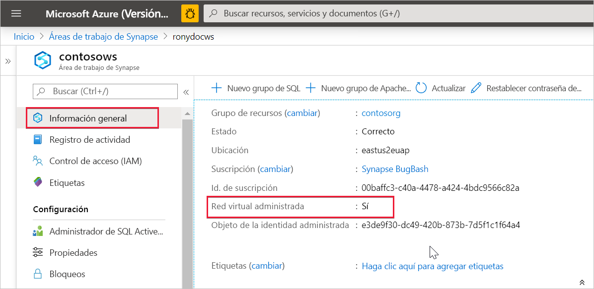

# Red virtual administrada de Azure Synapse Analytics (versión preliminar)

En este artículo se explica la red virtual administrada en Azure Synapse Analytics.

## Red virtual del área de trabajo administrada

Al crear un área de trabajo de Azure Synapse, puede elegir asociarla a Microsoft Azure Virtual Network. La red virtual asociada al área de trabajo se administra mediante Azure Synapse. Esta red virtual se denomina *red virtual de área de trabajo administrada*.

La red virtual de área de trabajo administrada aporta valor de cuatro formas:

- Con una red virtual de área de trabajo administrada puede dejar que Azure Synapse se ocupe de la pesada tarea de administrar la red virtual.
- No es necesario configurar reglas de grupo de seguridad de red de entrada en sus propias redes virtuales para permitir que el tráfico de administración de Azure Synapse entre en la red virtual. La configuración incorrecta de estas reglas de grupo de seguridad de red provoca la interrupción del servicio para los clientes.
- No es necesario crear una subred para los clústeres de Spark en función de la carga máxima.
- La red virtual de área de trabajo administrada, junto con los puntos de conexión privados administrados, sirven de protección contra la filtración de datos. Solo se pueden crear puntos de conexión privados administrados en áreas de trabajo que tengan asociadas una red virtual de área de trabajo administrada.

La creación de un área de trabajo con una red virtual de área de trabajo administrada asociada garantiza que el área de trabajo esté aislada por la red de otras áreas de trabajo. Azure Synapse ofrece varias funcionalidades de análisis en un área de trabajo: integración de datos, Apache Spark, grupo de SQL y SQL a petición.

Si el área de trabajo tiene una red virtual de área de trabajo administrada, en ella se implementan la integración de datos y los recursos de Spark. Una red virtual de área de trabajo administrada también proporciona aislamiento en el nivel de usuario para las actividades de Spark, ya que cada clúster de Spark está en su propia subred.

Grupo de SQL y SQL a petición son funcionalidades de varios inquilinos y, por tanto, residen fuera de la red virtual de área de trabajo administrada. En la comunicación dentro del área de trabajo con el grupo de SQL y SQL a petición se usan vínculos privados de Azure. Estos vínculos privados se crean automáticamente cuando se crea un área de trabajo con una red virtual de área de trabajo administrada asociada.

>[!IMPORTANT]
>Esta configuración del área de trabajo no se puede cambiar una vez creada el área de trabajo. Por ejemplo, no puede volver a configurar un área de trabajo que no tenga una red virtual de área de trabajo administrada asociada y asociarle una red virtual. De igual modo, no puede volver a configurar un área de trabajo que no tenga una red virtual de área de trabajo administrada asociada y desasociarle la red virtual.

## Creación de un área de trabajo de Azure Synapse con una red virtual de área de trabajo administrada

Si aún no lo ha hecho, registre el proveedor de recursos de red. Al registrar un proveedor de recursos se configura la suscripción para que funcione con este. Elija *Microsoft.Network* en la lista de proveedores de recursos al [registrarse](https://docs.microsoft.com/azure/azure-resource-manager/management/resource-providers-and-types).

Para crear un área de trabajo de Azure Synapse que tenga una red virtual de área de trabajo administrada asociada, seleccione la pestaña **Seguridad y redes** en Azure Portal y active la casilla **Enable managed virtual network** (Habilitar red virtual administrada).

Si deja la casilla desactivada, el área de trabajo no tendrá asociada ninguna red virtual.

>[!IMPORTANT]
>En un área de trabajo que tenga una red virtual de área de trabajo administrada solo se pueden usar vínculos privados.

>[!NOTE]
>Todo el tráfico saliente de la red virtual del área de trabajo administrada, excepto el que atraviese puntos de conexión privados administrados, se bloqueará en el futuro. Se recomienda crear puntos de conexión privados administrados para conectarse a todos los orígenes de datos de Azure que se encuentren fuera del área de trabajo. 

Para comprobar si el área de trabajo de Azure Synapse está asociada a una red virtual de área de trabajo administrada, seleccione **Información general** en Azure Portal.

## Pasos siguientes

Creación de un [área de trabajo de Azure Synapse](../quickstart-create-workspace.md)

Más información sobre los [puntos de conexión privados administrados](./synapse-workspace-managed-private-endpoints.md)

[Creación de puntos de conexión privados administrados a los orígenes de datos](./how-to-create-managed-private-endpoints.md)
