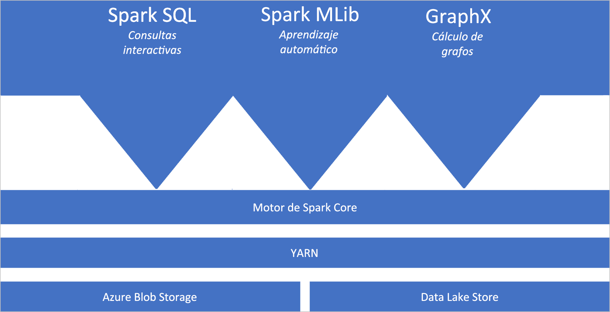
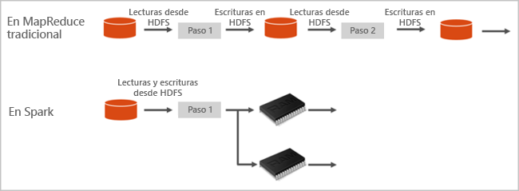

# Apache Spark en Azure Synapse Analytics

Apache Spark es una plataforma de procesamiento paralelo que admite el procesamiento en memoria para mejorar el rendimiento de aplicaciones de análisis de macrodatos. Apache Spark en Azure Synapse Analytics es una de las implementaciones de Microsoft de Apache Spark en la nube. Azure Synapse facilita la creación y la configuración de un grupo de Spark (versión preliminar) en Azure. Los grupos de Spark en Azure Synapse son compatibles con Azure Storage y Azure Data Lake Storage Generation 2. Por lo tanto, puede usar grupos de Azure Spark para procesar los datos almacenados en Azure.

[!INCLUDE [preview](../includes/note-preview.md)]

## ¿Qué es Apache Spark?

Apache Spark proporciona primitivas para la computación de clústeres en memoria. Un trabajo de Spark puede cargar y almacenar en la memoria caché datos, y repetir consultas sobre ellos. La computación en memoria es mucho más rápida que las aplicaciones basadas en disco. Spark también se integra con varios lenguajes de programación para que pueda manipular los conjuntos de datos distribuidos, como las colecciones locales. No se necesita estructurar todo como operaciones de asignación y reducción.

Los grupos de Spark en Azure Synapse ofrecen un servicio de Spark totalmente administrado. A continuación, se enumeran las ventajas de crear un grupo de Spark en Synapse Analytics.

| Característica | Descripción |
| --- | --- |
| Velocidad y eficacia |Las instancias de Spark comienzan en aproximadamente 2 minutos cuando hay menos de 60 nodos y en unos 5 minutos cuando hay más de 60 nodos. De forma predeterminada, la instancia se cierra 5 minutos después del último trabajo ejecutado, a menos que se mantenga activa mediante una conexión de cuaderno. |
| Creación fácil |Puede crear un grupo de Spark en Azure Synapse en unos minutos mediante Azure Portal, Azure PowerShell o el SDK de .NET de Synapse Analytics. Consulte [Introducción a los grupos de Spark en Synapse Analytics](../quickstart-create-apache-spark-pool-studio.md). |
| Facilidad de uso |Synapse Analytics incluye un cuaderno personalizado derivado de [Nteract](https://nteract.io/). Puede usar estos notebooks para el procesamiento y la visualización de datos interactivos.|
| API de REST |Spark en Synapse Analytics incluye [Apache Livy](https://github.com/cloudera/hue/tree/master/apps/spark/java#welcome-to-livy-the-rest-spark-server), un servidor de trabajos de Spark basado en una API REST para enviar y supervisar trabajos de forma remota. |
| Compatibilidad con Azure Data Lake Storage Generation 2| Los grupos de Spark en Azure Synapse pueden usar Azure Data Lake Storage Generation 2, así como Blob Storage. Para más información sobre Data Lake Storage, consulte [Introducción a Azure Data Lake Storage](../../data-lake-store/data-lake-store-overview.md). |
| Integración con IDE de terceros | Azure Synapse proporciona un complemento IDE para [IntelliJ IDEA de JetBrains](https://www.jetbrains.com/idea/), que es útil para crear y enviar aplicaciones a un grupo de Spark. |
| Bibliotecas de Anaconda precargadas |Los grupos de Spark en Azure Synapse vienen con las bibliotecas de Anaconda preinstaladas. [Anaconda](https://docs.continuum.io/anaconda/) ofrece prácticamente 200 bibliotecas para el aprendizaje automático, el análisis de datos, la visualización, etc. |
| Escalabilidad | Apache Spark en los grupos de Azure Synapse puede tener habilitada la escalabilidad automática, de modo que los grupos se escalen agregando o quitando nodos según sea necesario. Además, se pueden cerrar clústeres de Spark sin que se pierdan datos, ya que todos están almacenados en Azure Storage o Data Lake Storage. |

Los grupos de Spark en Azure Synapse incluyen los siguientes componentes que están disponibles en los grupos de forma predeterminada.

- [Spark Core](https://spark.apache.org/docs/latest/). Incluye Spark Core, Spark SQL, GraphX y MLlib.
- [Anaconda](https://docs.continuum.io/anaconda/)
- [Apache Livy](https://github.com/cloudera/hue/tree/master/apps/spark/java#welcome-to-livy-the-rest-spark-server)
- [Cuaderno de Nteract](https://nteract.io/)

## Arquitectura de grupos de Spark

Comprender los componentes de Spark es fácil si se entiende la manera en que Spark se ejecuta en Synapse Analytics.

Las aplicaciones de Spark se ejecutan como conjuntos de procesos independientes en un grupo, coordinados por el objeto SparkContext en el programa principal (denominado el programa conductor).

SparkContext puede conectarse al administrador de clústeres, que asigna recursos entre aplicaciones. El administrador de clústeres es [Apache Hadoop YARN](https://hadoop.apache.org/docs/current/hadoop-yarn/hadoop-yarn-site/YARN.html). Una vez conectado, Spark adquiere ejecutores en los nodos del grupo, que son procesos que ejecutan cálculos y almacenan datos de la aplicación. A continuación, envía el código de la aplicación (definido por archivos JAR o Python que se pasan a SparkContext) a los ejecutores. Por último, SparkContext envía las tareas a los ejecutores para la ejecución.

SparkContext ejecuta la función principal del usuario y las distintas operaciones paralelas en los nodos. A continuación, SparkContext recopila los resultados de las operaciones. Los nodos leen y escriben datos desde y hacia el sistema de archivos. Además, los nodos almacenan en caché los datos transformados en memoria como conjuntos de datos distribuidos resistentes (RDD).

SparkContext se conecta al grupo de Spark y es responsable de convertir una aplicación en un grafo acíclico dirigido (DAG). El grafo consta de tareas individuales que se ejecutan en un proceso ejecutor en los nodos. Cada aplicación obtiene sus propios procesos ejecutores, que permanecen mientras dure la aplicación y ejecutan tareas en varios subprocesos.

## Casos de uso de Apache Spark en Synapse Analytics

Los grupos de Spark en Synapse Analytics permiten los siguientes escenarios clave:

### Ingeniería y preparación de los datos

Apache Spark incluye muchas características de lenguaje que admiten la preparación y el procesamiento de grandes volúmenes de datos, de modo que se puedan transformar en otros más valiosos y, luego, puedan consumirlos otros servicios dentro de Synapse Analytics. Esto es posible gracias a varios lenguajes (C#, Scala, PySpark, Spark SQL) y las bibliotecas suministradas para el procesamiento y la conectividad.

### Machine Learning

Apache Spark incluye [MLlib](https://spark.apache.org/mllib/), una biblioteca de aprendizaje automático basada en Spark que puede usar desde un grupo de Spark en Synapse Analytics. Los grupos de Spark en Synapse Analytics también incluyen Anaconda, una distribución de Python con diversos paquetes para la ciencia de datos, incluido el aprendizaje automático. Cuando se combinan con la compatibilidad integrada con los cuadernos, dispone de un entorno para crear aplicaciones de aprendizaje automático.

## ¿Por dónde empiezo?

Use los siguientes artículos para aprender más sobre Apache Spark en Synapse Analytics:

- [Inicio rápido: Creación de un grupo de Spark en Azure Synapse](../quickstart-create-apache-spark-pool-portal.md)
- [Inicio rápido: Creación de un cuaderno de Apache Spark](../quickstart-apache-spark-notebook.md)
- [Tutorial: Aprendizaje automático con Apache Spark](./apache-spark-machine-learning-mllib-notebook.md)
- [Documentación oficial de Apache Spark](https://spark.apache.org/docs/latest/)

> [!NOTE]
> Parte de la documentación oficial de Apache Spark se basa en el uso de la consola de Spark, que no está disponible en Azure Synapse Spark; en su lugar, use las experiencias del cuaderno o de IntelliJ.

## Pasos siguientes

En esta introducción, conocerá los conceptos básicos de Apache Spark en Azure Synapse Analytics. Avance al siguiente artículo para aprender a crear un grupo de Spark en Azure Synapse Analytics:

- [Creación de un grupo de Spark en Azure Synapse](../quickstart-create-apache-spark-pool-portal.md)
