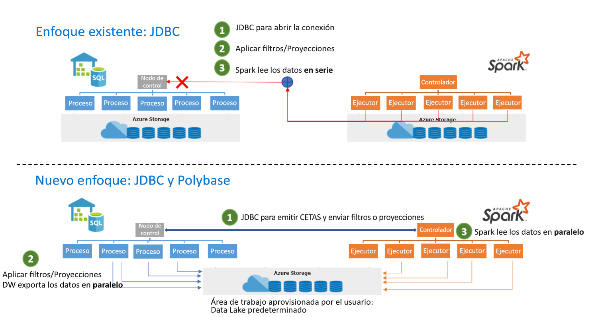

# <a name="introduction"></a>Introducción

El conector entre Azure Synapse Apache Spark y Synapse SQL está diseñado para transferir datos de forma eficaz entre los grupos de Spark (versión preliminar) y los grupos de SQL de Azure Synapse. El conector entre Azure Synapse Apache Spark y Synapse SQL solo funciona en grupos SQL, no funciona con SQL On-demand (SQL a petición).

## <a name="design"></a>Diseño

La transferencia de datos entre grupos de Spark y grupos de SQL se puede realizar mediante JDBC. Sin embargo, dados dos sistemas distribuidos, como grupos de SQL y de Spark, JDBC tiende a convertirse en un cuello de botella con la transferencia de datos serie.

El conector entre el grupo de Azure Synapse Apache Spark y Synapse SQL es una implementación de origen de datos para Apache Spark. Se emplea Azure Data Lake Storage Gen2 y Polybase en los grupos de SQL para transferir datos de forma eficaz entre el clúster de Spark y la instancia de Synapse SQL.



## <a name="authentication-in-azure-synapse-analytics"></a>Autenticación en Azure Synapse Analytics

La autenticación entre sistemas se realiza sin problemas en Azure Synapse Analytics. Hay un servicio de token que se conecta con Azure Active Directory para obtener los tokens de seguridad que se van a usar al acceder a la cuenta de almacenamiento o al servidor de almacenamiento de datos. 

Por esta razón, no es necesario crear credenciales ni especificarlas en la API del conector, siempre y cuando AAD-Auth esté configurado en la cuenta de almacenamiento y el servidor de almacenamiento de datos. Si no es así, se puede especificar la autenticación de SQL. Encontrará más detalles en la sección [Uso](#usage).

## <a name="constraints"></a>Restricciones

- Este conector solo funciona en Scala.

## <a name="prerequisites"></a>Requisitos previos

- Tener el rol **db_exporter** en la base de datos o el grupo de SQL al que quiere, o del que desea, transferir los datos.

Para crear usuarios, conéctese a la base de datos y siga estos ejemplos:

```sql
CREATE USER Mary FROM LOGIN Mary;
CREATE USER [mike@contoso.com] FROM EXTERNAL PROVIDER;
```

Para asignar un rol:

```sql
EXEC sp_addrolemember 'db_exporter', 'Mary';
```

## <a name="usage"></a>Uso

Las instrucciones de importación no son necesarias, ya que se importan previamente para la experiencia del cuaderno.

### <a name="transferring-data-to-or-from-a-sql-pool-attached-with-the-workspace"></a>Transferencia de datos hacia un grupo de SQL asociado al área de trabajo, o desde él

> [!NOTE]
> **Importaciones no necesarias en la experiencia del cuaderno**

```scala
 import com.microsoft.spark.sqlanalytics.utils.Constants
 import org.apache.spark.sql.SqlAnalyticsConnector._
```

#### <a name="read-api"></a>Read API

```scala
val df = spark.read.sqlanalytics("[DBName].[Schema].[TableName]")
```

La API anterior funciona tanto con tablas internas (administradas) como externas en el grupo de SQL.

#### <a name="write-api"></a>Write API

```scala
df.write.sqlanalytics("[DBName].[Schema].[TableName]", [TableType])
```

donde TableType puede ser Constants.INTERNAL o Constants.EXTERNAL

```scala
df.write.sqlanalytics("[DBName].[Schema].[TableName]", Constants.INTERNAL)
df.write.sqlanalytics("[DBName].[Schema].[TableName]", Constants.EXTERNAL)
```

Se realiza la autenticación en Storage y en SQL Server

### <a name="if-you-are-transferring-data-to-or-from-a-sql-pool-or-database-outside-the-workspace"></a>Si va a transferir datos hacia un grupo de SQL o una base de datos fuera del área de trabajo, o desde él

> [!NOTE]
> Importaciones no necesarias en la experiencia del cuaderno

```scala
 import com.microsoft.spark.sqlanalytics.utils.Constants
 import org.apache.spark.sql.SqlAnalyticsConnector._
```

#### <a name="read-api"></a>Read API

```scala
val df = spark.read.
option(Constants.SERVER, "samplews.database.windows.net").
sqlanalytics("<DBName>.<Schema>.<TableName>")
```

#### <a name="write-api"></a>Write API

```scala
df.write.
option(Constants.SERVER, "[samplews].[database.windows.net]").
sqlanalytics("[DBName].[Schema].[TableName]", [TableType])
```

### <a name="using-sql-auth-instead-of-aad"></a>Uso de la autenticación de SQL en lugar de AAD

#### <a name="read-api"></a>Read API

Actualmente, el conector no admite la autenticación basada en token en un grupo de SQL que esté fuera del área de trabajo. Tendrá que usar la autenticación de SQL.

```scala
val df = spark.read.
option(Constants.SERVER, "samplews.database.windows.net").
option(Constants.USER, [SQLServer Login UserName]).
option(Constants.PASSWORD, [SQLServer Login Password]).
sqlanalytics("<DBName>.<Schema>.<TableName>")
```

#### <a name="write-api"></a>Write API

```scala
df.write.
option(Constants.SERVER, "[samplews].[database.windows.net]").
option(Constants.USER, [SQLServer Login UserName]).
option(Constants.PASSWORD, [SQLServer Login Password]).
sqlanalytics("[DBName].[Schema].[TableName]", [TableType])
```

### <a name="using-the-pyspark-connector"></a>Uso del conector de PySpark

> [!NOTE]
> Este ejemplo está pensado únicamente para la experiencia del cuaderno.

Suponga que tiene una trama de datos "pyspark_df" que quiere escribir en el almacenamiento de datos.

Cree una tabla temporal mediante la trama de datos en PySpark:

```py
pyspark_df.createOrReplaceTempView("pysparkdftemptable")
```

Ejecute una celda de Scala en el cuaderno de PySpark mediante magics:

```scala
%%spark
val scala_df = spark.sqlContext.sql ("select * from pysparkdftemptable")

pysparkdftemptable.write.sqlanalytics("sqlpool.dbo.PySparkTable", Constants.INTERNAL)
```

Del mismo modo, en el escenario de lectura, lea los datos mediante Scala y escríbalos en una tabla temporal, y use Spark SQL en PySpark para consultar la tabla temporal en una trama de datos.

## <a name="allowing-other-users-to-use-the-dw-connector-in-your-workspace"></a>Concesión de permiso a otros usuarios para usar el conector de DW en un área de trabajo

Para modificar los permisos que faltan para otros usuarios es preciso ser propietario de los datos de Storage Blob en la cuenta de almacenamiento de ADLS Gen2 conectada al área de trabajo. Asegúrese de que el usuario tiene acceso al área de trabajo y permisos para ejecutar cuadernos.

### <a name="option-1"></a>Opción 1

- Convertir al usuario en un colaborador o propietario de datos de Storage Blob

### <a name="option-2"></a>Opción 2

- Especifique las siguientes ACL en la estructura de carpetas:

| Carpeta | / | synapse | workspaces  | <workspacename> | sparkpools | <sparkpoolname>  | sparkpoolinstances  |
|--|--|--|--|--|--|--|--|
| Permisos de acceso | --X | --X | --X | --X | --X | --X | -WX |
| Permisos predeterminados | ---| ---| ---| ---| ---| ---| ---|

- Debe ser capaz de usar la lista de control de acceso en todas las carpetas de "synapse" y hacia abajo desde Azure Portal. Para usar una lista de control de acceso en la carpeta raíz "/", siga las instrucciones que se indican a continuación.

- Conexión a la cuenta de almacenamiento conectada con el área de trabajo desde el Explorador de Storage mediante AAD
- Seleccione su cuenta y proporcione la dirección URL de ADLS Gen2 y el sistema de archivos predeterminado para el área de trabajo
- Una vez que pueda ver la cuenta de almacenamiento en la lista, haga clic con el botón derecho en el área de trabajo de la lista y seleccione "Manage Access" (Administrar acceso).
- Agregue el usuario a la carpeta / con el permiso de acceso de "ejecución". Seleccione "OK" (Aceptar).

> [!IMPORTANT]
> Asegúrese de no seleccionar "predeterminado" si no tiene previsto hacerlo.

## <a name="next-steps"></a>Pasos siguientes

- [Creación de un grupo de SQL mediante Azure Portal](../../synapse-analytics/quickstart-create-apache-spark-pool-portal.md)
- [Creación de un grupo de Apache Spark mediante Azure Portal](../../synapse-analytics/quickstart-create-apache-spark-pool-portal.md) 
