# <a name="quickstart-create-and-query-a-synapse-sql-pool-using-the-azure-portal"></a>Inicio rápido: Creación y consulta de un grupo de SQL de Synapse mediante Azure Portal

Cree y consulte rápidamente un grupo de SQL de Synapse (almacenamiento de datos) en Azure Synapse Analytics (antes SQL DW) mediante Azure Portal.

## <a name="prerequisites"></a>Requisitos previos

1. Si no tiene una suscripción a Azure, cree una cuenta [gratuita](https://azure.microsoft.com/free/) antes de empezar.

   > [!NOTE]
   > La creación de un grupo de SQL en Azure Synapse puede dar lugar a un nuevo servicio facturable. Para más información, consulte los [precios de Azure Synapse Analytics](https://azure.microsoft.com/pricing/details/synapse-analytics/).

2. Descargue e instale la versión más reciente de [SQL Server Management Studio](/sql/ssms/download-sql-server-management-studio-ssms?toc=/azure/synapse-analytics/sql-data-warehouse/toc.json&bc=/azure/synapse-analytics/sql-data-warehouse/breadcrumb/toc.json&view=azure-sqldw-latest) (SSMS).

## <a name="sign-in-to-the-azure-portal"></a>Inicio de sesión en Azure Portal

Inicie sesión en [Azure Portal](https://portal.azure.com/).

## <a name="create-a-sql-pool"></a>Creación de un grupo de SQL

Los almacenamientos de datos se crean mediante un grupo de SQL en Azure Synapse Analytics. Se crea un grupo de SQL con un conjunto definido de [recursos de proceso](memory-concurrency-limits.md). La base de datos se crea dentro de un [grupo de recursos de Azure](../../azure-resource-manager/management/overview.md?toc=/azure/synapse-analytics/sql-data-warehouse/toc.json&bc=/azure/synapse-analytics/sql-data-warehouse/breadcrumb/toc.json) y en un [servidor lógico de SQL](../../azure-sql/database/logical-servers.md?toc=/azure/synapse-analytics/sql-data-warehouse/toc.json&bc=/azure/synapse-analytics/sql-data-warehouse/breadcrumb/toc.json).

Siga estos pasos para crear un grupo de SQL que contenga los datos de ejemplo **AdventureWorksDW**.

1. Seleccione **Crear un recurso** en la esquina superior izquierda de Azure Portal.

   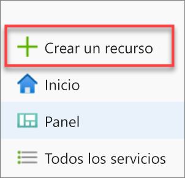

2. Seleccione **Bases de datos** en la página **Nuevo** y, después, seleccione **Azure Synapse Analytics (formerly SQL DW)** en la lista **Destacados**.

   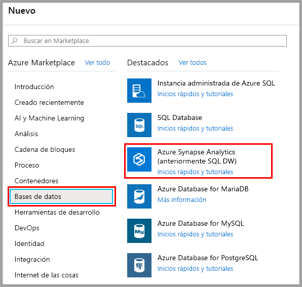

3. En **Básicos**, especifique su suscripción, grupo de recursos, nombre de grupo de SQL y nombre de servidor:

   | Configuración | Valor sugerido | Descripción |
   | :------ | :-------------- | :---------- |
   | **Suscripción** | Su suscripción | Para más información acerca de sus suscripciones, consulte [Suscripciones](https://account.windowsazure.com/Subscriptions). |
   | **Grupos de recursos** | myResourceGroup | Para conocer cuáles son los nombres de grupo de recursos válidos, consulte el artículo [Convenciones de nomenclatura](/azure/architecture/best-practices/resource-naming?toc=/azure/synapse-analytics/sql-data-warehouse/toc.json&bc=/azure/synapse-analytics/sql-data-warehouse/breadcrumb/toc.json). |
   | **Nombre del grupo de SQL** | Cualquier nombre globalmente único (un ejemplo es *mySampleDataWarehouse*) | Para conocer los nombres de base de datos válidos, consulte [Database Identifiers](/sql/relational-databases/databases/database-identifiers?toc=/azure/synapse-analytics/sql-data-warehouse/toc.json&bc=/azure/synapse-analytics/sql-data-warehouse/breadcrumb/toc.json&view=azure-sqldw-latest) (Identificadores de base de datos). Tenga en cuenta que un grupo de SQL es un tipo de base de datos. |
   | **Server** | Cualquier nombre globalmente único | Seleccione un servidor existente o cree uno. Para ello debe seleccionar **Crear nuevo**. Para conocer cuáles son los nombres de servidor válidos, consulte el artículo [Naming conventions](/azure/architecture/best-practices/resource-naming?toc=/azure/synapse-analytics/sql-data-warehouse/toc.json&bc=/azure/synapse-analytics/sql-data-warehouse/breadcrumb/toc.json) (Convenciones de nomenclatura). |

   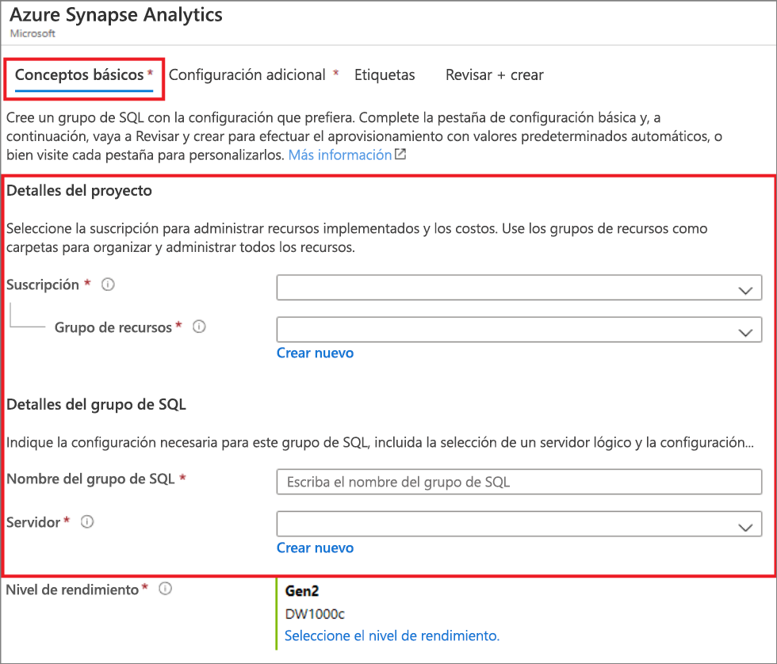

4. En **Nivel de rendimiento**, seleccione **Select performance level** (Seleccionar nivel de rendimiento) para cambiar la configuración, si lo desea, con un control deslizante.

   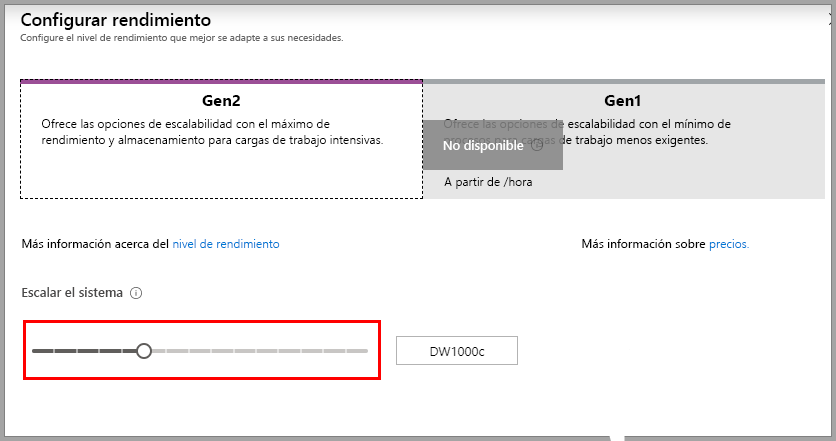  

   Para más información acerca de los niveles de rendimiento, consulte [Administración de proceso en Azure Synapse Analytics](sql-data-warehouse-manage-compute-overview.md).

5. Seleccione **Configuración adicional**, en **Usar datos existentes**, elija **Ejemplo** para que AdventureWorksDW se cree como la base de datos de ejemplo.

    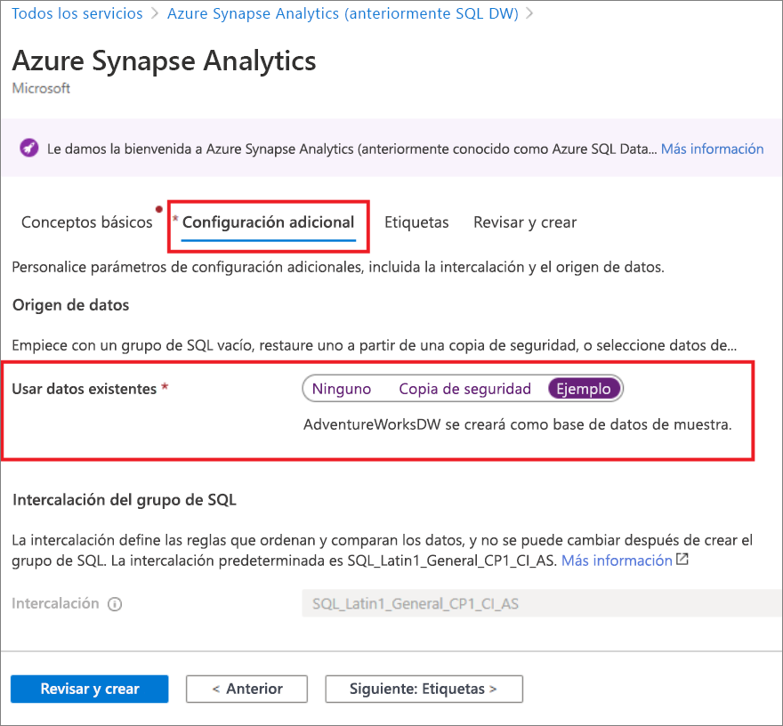 

6. Una vez completada la pestaña Basics (Aspectos básicos) del formulario de Azure Synapse Analytics, seleccione **Review + Create** (Revisar y crear) y, después, **Create** (Crear) para crear el grupo de SQL. El aprovisionamiento tarda unos minutos.

   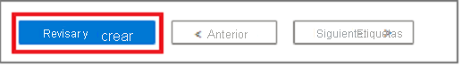

   

7. Para supervisar el proceso de implementación, seleccione **Notificaciones** en la barra de herramientas.

   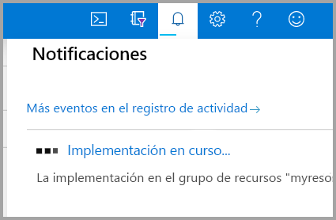

## <a name="create-a-server-level-firewall-rule"></a>Crear una regla de firewall de nivel de servidor

El servicio Azure Synapse crea un firewall en el nivel de servidor. El firewall impide que herramientas y aplicaciones externas se conecten al servidor y a cualquier base de datos incluida en este. Para habilitar la conectividad, puede agregar reglas de firewall que habilitan la conectividad para direcciones IP concretas. Siga estos pasos para crear una [regla de firewall de nivel de servidor](../../azure-sql/database/firewall-configure.md?toc=/azure/synapse-analytics/sql-data-warehouse/toc.json&bc=/azure/synapse-analytics/sql-data-warehouse/breadcrumb/toc.json) para la dirección IP del cliente.

> [!NOTE]
> Azure Synapse se comunica a través del puerto 1433. Si intenta conectarse desde una red corporativa, es posible que el firewall de la red no permita el tráfico saliente a través del puerto 1433. En ese caso, no podrá conectarse al servidor salvo que el departamento de TI abra el puerto 1433.

1. Una vez finalizada la implementación, seleccione **Todos los servicios** en el menú izquierdo. Seleccione **Databases** (Bases de datos) y seleccione la estrella que hay al lado de **Azure Synapse Analytics** para agregar Azure Synapse Analytics a sus favoritos.

2. Select **Azure Synapse Analytics** en el menú de la izquierda y, después, seleccione **mySampleDataWarehouse** en la página **Azure Synapse Analytics**. Se abre la página de información general de la base de datos, en la que se muestra el nombre completo del servidor (por ejemplo, **sqlpoolservername.database.windows.net**) y ofrece otras opciones de configuración.

3. Copie este nombre para conectarse a su servidor y a sus bases de datos en este inicio rápido y los posteriores. Para abrir la configuración del servidor, seleccione su nombre.

   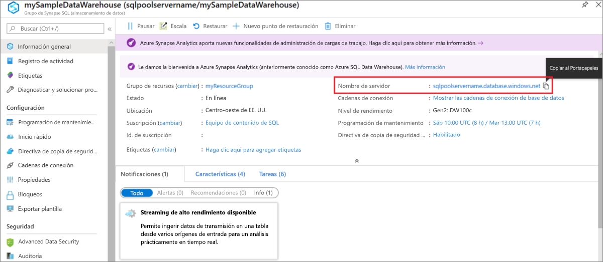

4. Seleccione **Mostrar configuración del firewall**.

   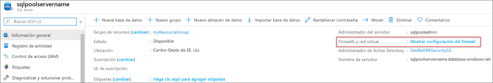

5. Se abrirá la página **Configuración del firewall** del servidor.

   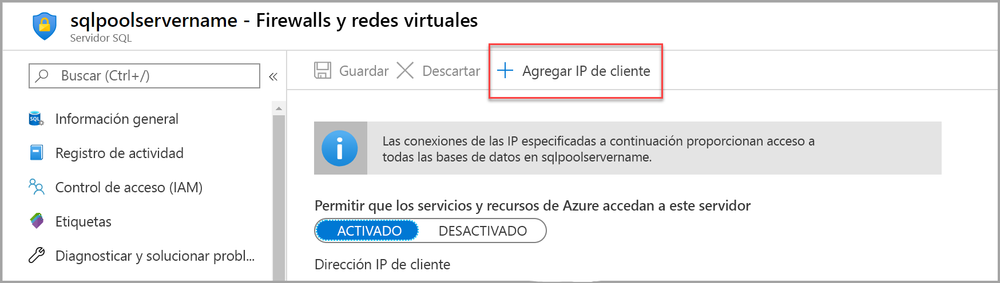

6. Para agregar la dirección IP actual a una regla de firewall nueva, seleccione **Agregar IP de cliente** en la barra de herramientas. La regla de firewall puede abrir el puerto 1433 para una única dirección IP o un intervalo de direcciones IP.

7. Seleccione **Guardar**. Se crea una regla de firewall de nivel de servidor para el puerto 1433 de la dirección IP actual en el servidor.

8. Seleccione **Aceptar** y cierre la página **Configuración del firewall**.

Ahora puede conectarse al servidor y sus grupos de SQL mediante esta dirección IP. La conexión funciona desde SQL Server Management Studio u otra herramienta de su elección. Cuando se conecte, use la cuenta de ServerAdmin que creó anteriormente.

> [!IMPORTANT]
> De forma predeterminada, el acceso a través del firewall de SQL Database está habilitado para todos los servicios de Azure. Seleccione **DESACTIVAR** en esta página y luego **Guardar** para deshabilitar el firewall para todos los servicios de Azure.

## <a name="get-the-fully-qualified-server-name"></a>Obtención del nombre completo del servidor

En Azure Portal encontrará el nombre completo del servidor. Más adelante usará el nombre completo cuando se conecte al servidor.

1. Inicie sesión en [Azure Portal](https://portal.azure.com/).

2. Seleccione **Azure Synapse Analytics** en el menú de la izquierda y, después, seleccione su base de datos en la página **Azure Synapse Analytics**.

3. En el panel **Essentials** de la página de Azure Portal de la base de datos, busque y copie el **nombre del servidor**. En este ejemplo, el nombre completo es sqlpoolservername.database.windows.net.

    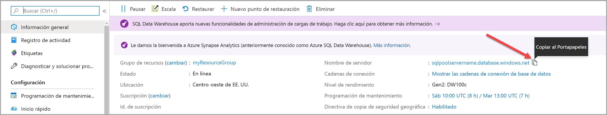

## <a name="connect-to-the-server-as-server-admin"></a>Conexión al servidor como administrador del mismo

En esta sección se usa [SQL Server Management Studio](/sql/ssms/download-sql-server-management-studio-ssms?toc=/azure/synapse-analytics/sql-data-warehouse/toc.json&bc=/azure/synapse-analytics/sql-data-warehouse/breadcrumb/toc.json&view=azure-sqldw-latest) (SSMS) para establecer una conexión con el servidor.

1. Abra SQL Server Management Studio.

2. En el cuadro de diálogo **Conectar con el servidor**, especifique la siguiente información:

   | Configuración | Valor sugerido | Descripción |
   | :------ | :-------------- | :---------- |
   | Tipo de servidor | Motor de base de datos | Este valor es obligatorio |
   | Nombre de servidor | Nombre completo del servidor | Este es un ejemplo: **sqlpoolservername.database.windows.net**. |
   | Authentication | Autenticación de SQL Server | Autenticación de SQL es el único tipo de autenticación que se ha configurado en este tutorial. |
   | Inicio de sesión | La cuenta de administrador del servidor | Es la cuenta que especificó cuando creó el servidor. |
   | Contraseña | La contraseña de la cuenta de administrador del servidor | Es la contraseña que especificó cuando creó el servidor. |
   ||||

   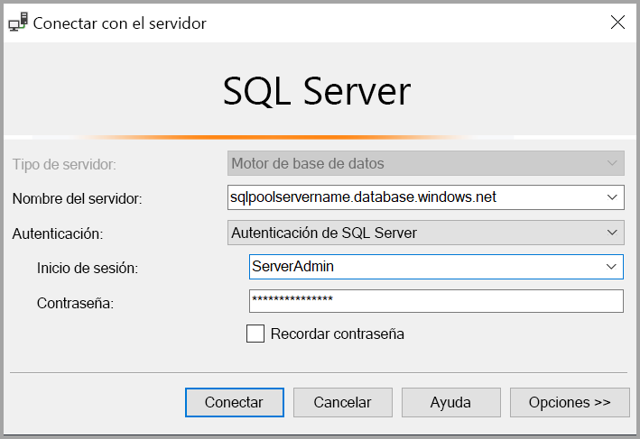

3. Seleccione **Conectar**. La ventana Explorador de objetos se abre en SSMS.

4. En el Explorador de objetos, expanda **Bases de datos**. Después, expanda **mySampleDatabase** para ver los objetos de la base de datos.

   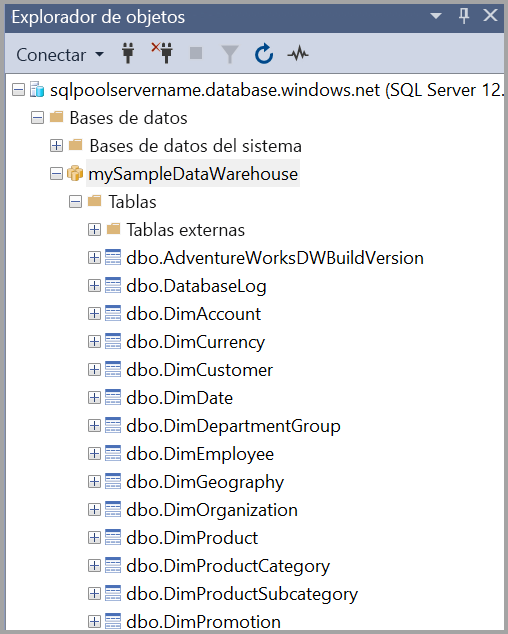

## <a name="run-some-queries"></a>Ejecución de algunas consultas

No se recomienda ejecutar consultas si se ha iniciado sesión como administrador del servidor, ya que usa una [clase de recursos limitada](resource-classes-for-workload-management.md). En su lugar, configure [Aislamiento de la carga de trabajo](https://docs.microsoft.com/azure/synapse-analytics/sql-data-warehouse/quickstart-configure-workload-isolation-tsql) como [se ilustra en los tutoriales](https://docs.microsoft.com/azure/synapse-analytics/sql-data-warehouse/load-data-wideworldimportersdw#create-a-user-for-loading-data).

SQL Data Warehouse utiliza T-SQL como lenguaje de consulta. Para abrir una ventana de consulta y ejecutar algunas consultas de T-SQL, siga estos pasos:

1. Seleccione con el botón derecho **mySampleDataWarehouse** y, después, seleccione **Nueva consulta**. Se abrirá una nueva ventana de consulta.

2. En la ventana de consulta, escriba el siguiente comando para ver una lista de bases de datos.

    ```sql
    SELECT * FROM sys.databases
    ```

3. seleccione **Ejecutar**. Los resultados de la consulta muestran dos bases de datos: **master** y **mySampleDataWarehouse**.

   

4. Para ver algunos datos, utilice el siguiente comando para ver el número de clientes cuyo apellido es Adams y que tienen tres hijos en casa. Los resultados muestran seis clientes.

    ```sql
    SELECT LastName, FirstName FROM dbo.dimCustomer
    WHERE LastName = 'Adams' AND NumberChildrenAtHome = 3;
    ```

   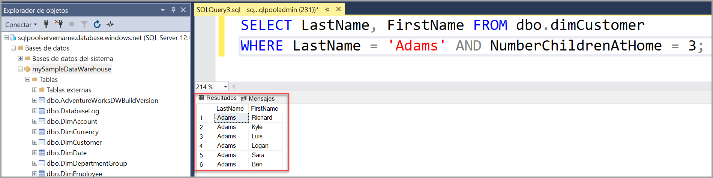

## <a name="clean-up-resources"></a>Limpieza de recursos

Se le está cobrando por unidades de almacenamiento de datos y por los datos almacenados en el grupo de SQL. Estos recursos de proceso y de almacenamiento se facturan por separado.

- Si quiere conservar los datos en almacenamiento, puede pausar el proceso cuando no use el grupo de SQL. Si se hace una pausa en el proceso, solo se carga el almacenamiento de datos. Puede reanudar el proceso siempre que esté listo para trabajar con los datos.

- Si quiere eliminar cobros futuros, puede eliminar el grupo de SQL.

Siga estos pasos para limpiar los recursos que ya no necesite.

1. Inicie sesión en [Azure Portal](https://portal.azure.com) y seleccione el grupo de SQL.

   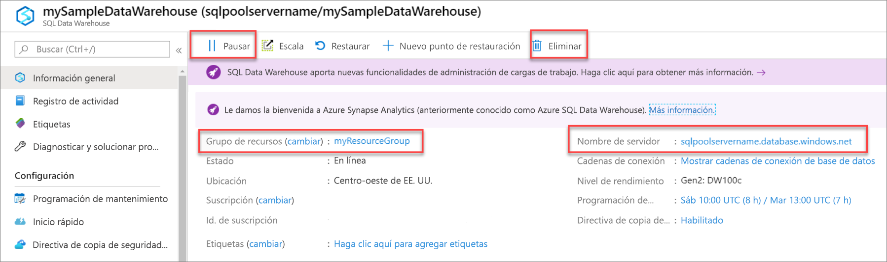

2. Para pausar el proceso, seleccione el botón **Pausar**. Cuando el grupo de SQL esté en pausa, verá un botón **Reanudar**. Para reanudar el proceso, seleccione **Reanudar**.

3. Para quitar el grupo de SQL para que no se le cobre por el proceso o almacenamiento, seleccione **Eliminar**.

4. Para eliminar el servidor que ha creado, seleccione **sqlpoolservername.database.windows.net** en la imagen anterior y, después, **Eliminar**. Debe tener cuidado con este procedimiento, ya que la eliminación del servidor elimina también todas las bases de datos asignadas al servidor.

5. Para quitar el grupo de recursos, seleccione **myResourceGroup** y **Eliminar grupo de recursos**.

## <a name="next-steps"></a>Pasos siguientes

Para más información sobre la carga de datos en el grupo de SQL, continúe con el artículo [Carga de datos en un grupo de SQL](load-data-from-azure-blob-storage-using-polybase.md).
