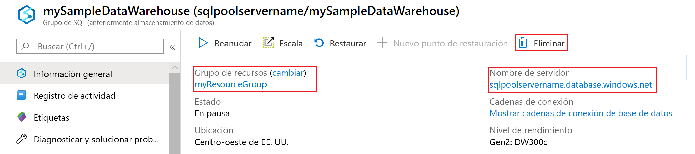

# <a name="tutorial-load-the-new-york-taxicab-dataset"></a>Tutorial: Carga de conjuntos de datos de taxis de Nueva York

En este tutorial se usa la [instrucción COPY](https://docs.microsoft.com/sql/t-sql/statements/copy-into-transact-sql?view=azure-sqldw-latest) para cargar un conjunto de datos de taxis de Nueva York desde una cuenta de almacenamiento de un blob de Azure. El tutorial utiliza [Azure Portal](https://portal.azure.com) y [SQL Server Management Studio](/sql/ssms/download-sql-server-management-studio-ssms?toc=/azure/synapse-analytics/sql-data-warehouse/toc.json&bc=/azure/synapse-analytics/sql-data-warehouse/breadcrumb/toc.json&view=azure-sqldw-latest) (SSMS) para:

> [!div class="checklist"]
>
> * Creación de un grupo de SQL en Azure Portal
> * Establecer una regla de firewall de nivel de servidor en Azure Portal
> * Conectarse al almacenamiento de datos con SSMS
> * Crear un usuario designado para cargar datos
> * Crear tablas para el conjunto de datos de ejemplo 
> * Usar la instrucción COPY de T-SQL para cargar datos en el almacenamiento de datos
> * Ver el progreso de los datos a medida que se cargan

Si no tiene una suscripción a Azure, cree una [cuenta gratuita](https://azure.microsoft.com/free/) antes de empezar.

## <a name="before-you-begin"></a>Antes de empezar

Antes de completar este tutorial, descargue e instale la versión más reciente de [SQL Server Management Studio](/sql/ssms/download-sql-server-management-studio-ssms?toc=/azure/synapse-analytics/sql-data-warehouse/toc.json&bc=/azure/synapse-analytics/sql-data-warehouse/breadcrumb/toc.json&view=azure-sqldw-latest) (SSMS).

## <a name="log-in-to-the-azure-portal"></a>Iniciar sesión en Azure Portal

Inicie sesión en [Azure Portal](https://portal.azure.com/).

## <a name="create-a-blank-database"></a>Crear una base de datos en blanco

Se crea un grupo de SQL con un conjunto definido de [recursos de proceso](memory-concurrency-limits.md). La base de datos se crea dentro de un [grupo de recursos de Azure](../../azure-resource-manager/management/overview.md?toc=/azure/synapse-analytics/sql-data-warehouse/toc.json&bc=/azure/synapse-analytics/sql-data-warehouse/breadcrumb/toc.json) y en un [servidor lógico de SQL](../../azure-sql/database/logical-servers.md?toc=/azure/synapse-analytics/sql-data-warehouse/toc.json&bc=/azure/synapse-analytics/sql-data-warehouse/breadcrumb/toc.json).

Siga estos pasos para crear una base de datos en blanco.

1. Haga clic en **Crear un recurso** en la esquina superior izquierda de Azure Portal.

2. Seleccione **Bases de datos** en la página **Nuevo** y **Azure Synapse Analytics** en **Destacados**, en la página **Nuevo**.

    

3. Rellene el formulario con la siguiente información:

   | Configuración            | Valor sugerido       | Descripción                                                  |
   | ------------------ | --------------------- | ------------------------------------------------------------ |
   | *Nombre**            | mySampleDataWarehouse | Para conocer los nombres de base de datos válidos, consulte [Database Identifiers](/sql/relational-databases/databases/database-identifiers?toc=/azure/synapse-analytics/sql-data-warehouse/toc.json&bc=/azure/synapse-analytics/sql-data-warehouse/breadcrumb/toc.json&view=azure-sqldw-latest) (Identificadores de base de datos). |
   | **Suscripción**   | Su suscripción     | Para más información acerca de sus suscripciones, consulte [Suscripciones](https://account.windowsazure.com/Subscriptions). |
   | **Grupos de recursos** | myResourceGroup       | Para conocer cuáles son los nombres de grupo de recursos válidos, consulte el artículo [Convenciones de nomenclatura](/azure/architecture/best-practices/resource-naming?toc=/azure/synapse-analytics/sql-data-warehouse/toc.json&bc=/azure/synapse-analytics/sql-data-warehouse/breadcrumb/toc.json). |
   | **Seleccionar origen**  | Base de datos en blanco        | Se especifica para crear una base de datos en blanco. Tenga en cuenta que un almacenamiento de datos es un tipo de base de datos. |

    

4. Seleccione **Servidor** para crear y configurar un servidor nuevo para la nueva base de datos. Rellene el **formulario de servidor nuevo** con la siguiente información:

    | Configuración                | Valor sugerido          | Descripción                                                  |
    | ---------------------- | ------------------------ | ------------------------------------------------------------ |
    | **Nombre del servidor**        | Cualquier nombre globalmente único | Para conocer cuáles son los nombres de servidor válidos, consulte el artículo [Naming conventions](/azure/architecture/best-practices/resource-naming?toc=/azure/synapse-analytics/sql-data-warehouse/toc.json&bc=/azure/synapse-analytics/sql-data-warehouse/breadcrumb/toc.json) (Convenciones de nomenclatura). |
    | **Inicio de sesión del administrador del servidor** | Cualquier nombre válido           | Para conocer los nombres de inicio de sesión válidos, consulte [Database Identifiers](/sql/relational-databases/databases/database-identifiers?toc=/azure/synapse-analytics/sql-data-warehouse/toc.json&bc=/azure/synapse-analytics/sql-data-warehouse/breadcrumb/toc.json&view=azure-sqldw-latest) (Identificadores de base de datos). |
    | **Contraseña**           | Cualquier contraseña válida       | La contraseña debe tener un mínimo de ocho caracteres y debe contener caracteres de tres de las siguientes categorías: caracteres en mayúsculas, caracteres en minúsculas, números y caracteres no alfanuméricos. |
    | **Ubicación**           | Cualquier ubicación válida       | Para obtener información acerca de las regiones, consulte [Regiones de Azure](https://azure.microsoft.com/regions/). |

    

5. Elija **Seleccionar**.

6. Haga clic en **Nivel de rendimiento** para especificar si el almacenamiento de datos es Gen1 o Gen2 y especificar el número de unidades de almacenamiento de datos.

7. Para este tutorial, seleccione el grupo de SQL **Gen2**. El control deslizante se establece de forma predeterminada en **DW1000c**.  Intente moverlo hacia arriba y hacia abajo para ver cómo funciona.

    

8. Seleccione **Aplicar**.
9. En la hoja de aprovisionamiento, seleccione una **intercalación** para la base de datos en blanco. En este tutorial, use el valor predeterminado. Para más información sobre las intercalaciones, vea [Collations](/sql/t-sql/statements/collations?toc=/azure/synapse-analytics/sql-data-warehouse/toc.json&bc=/azure/synapse-analytics/sql-data-warehouse/breadcrumb/toc.json&view=azure-sqldw-latest) (Intercalaciones)

10. Una vez completado el formulario, seleccione **Crear** para aprovisionar la base de datos. El aprovisionamiento tarda unos minutos.

11. Para supervisar el proceso de implementación, seleccione **Notificaciones** en la barra de herramientas.
  
     

## <a name="create-a-server-level-firewall-rule"></a>Crear una regla de firewall de nivel de servidor

Un firewall a nivel de servidor impide que herramientas y aplicaciones externas se conecten al servidor o a cualquier base de datos incluida en este. Para habilitar la conectividad, puede agregar reglas de firewall que habilitan la conectividad para direcciones IP concretas.  Siga estos pasos para crear una [regla de firewall de nivel de servidor](../../azure-sql/database/firewall-configure.md?toc=/azure/synapse-analytics/sql-data-warehouse/toc.json&bc=/azure/synapse-analytics/sql-data-warehouse/breadcrumb/toc.json) para la dirección IP del cliente.

> [!NOTE]
> SQL Data Warehouse se comunica a través del puerto 1433. Si intenta conectarse desde una red corporativa, es posible que el firewall de la red no permita el tráfico saliente a través del puerto 1433. En ese caso, no podrá conectarse al servidor salvo que el departamento de TI abra el puerto 1433.

1. Cuando se haya terminado la implementación, seleccione **Bases de datos SQL** en el menú de la izquierda y, después, seleccione **mySampleDatabase** en la página **Bases de datos SQL**. Se abre la página de información general de la base de datos, que muestra el nombre completo del servidor (por ejemplo, **mynewserver-20180430.database.windows.net**) y proporciona opciones para otras configuraciones.

2. Copie este nombre para conectarse a su servidor y a sus bases de datos en los inicios rápidos posteriores. Después, seleccione el nombre del servidor para abrir su configuración.

    

3. Seleccione el nombre del servidor para abrir su configuración.

    

4. Seleccione **Mostrar configuración del firewall**. Se abrirá la página **Configuración del firewall** para el servidor.

    

5. Seleccione **Agregar IP de cliente** en la barra de herramientas para agregar la dirección IP actual a la nueva regla de firewall. La regla de firewall puede abrir el puerto 1433 para una única dirección IP o un intervalo de direcciones IP.

6. Seleccione **Guardar**. Se creará una regla de firewall de nivel de servidor para el puerto 1433 de la dirección IP actual en el servidor.

7. Seleccione **Aceptar** y después cierre la página **Configuración de firewall**.

Ahora puede conectarse al servidor y sus almacenamientos de datos mediante esta dirección IP. La conexión funciona desde SQL Server Management Studio u otra herramienta de su elección. Cuando se conecte, use la cuenta de ServerAdmin que creó anteriormente.  

> [!IMPORTANT]
> De forma predeterminada, el acceso a través del firewall de SQL Database está habilitado para todos los servicios de Azure. Seleccione **DESACTIVAR** en esta página y luego **Guardar** para deshabilitar el firewall para todos los servicios de Azure.

## <a name="get-the-fully-qualified-server-name"></a>Obtención del nombre completo del servidor

Encontrará el nombre completo del servidor en Azure Portal. Más adelante usará el nombre completo cuando se conecte al servidor.

1. Inicie sesión en [Azure Portal](https://portal.azure.com/).
2. Seleccione **Azure Synapse Analytics** en el menú de la izquierda y, después, seleccione su base de datos en la página **Azure Synapse Analytics**.
3. En el panel **Essentials** de la página de Azure Portal de la base de datos, busque y copie el **nombre del servidor**. En este ejemplo, el nombre completo es mynewserver-20180430.database.windows.net.

      

## <a name="connect-to-the-server-as-server-admin"></a>Conexión al servidor como administrador del mismo

En esta sección se usa [SQL Server Management Studio](/sql/ssms/download-sql-server-management-studio-ssms?toc=/azure/synapse-analytics/sql-data-warehouse/toc.json&bc=/azure/synapse-analytics/sql-data-warehouse/breadcrumb/toc.json&view=azure-sqldw-latest) (SSMS) para establecer una conexión con el servidor.

1. Abra SQL Server Management Studio.

2. En el cuadro de diálogo **Conectar con el servidor**, especifique la siguiente información:

    | Configuración        | Valor sugerido                            | Descripción                                                  |
    | -------------- | ------------------------------------------ | ------------------------------------------------------------ |
    | Tipo de servidor    | Motor de base de datos                            | Este valor es obligatorio                                       |
    | Nombre de servidor    | Nombre completo del servidor            | Este nombre debería parecerse al siguiente: **mynewserver-20180430.database.windows.net**. |
    | Authentication | Autenticación de SQL Server                  | Autenticación de SQL es el único tipo de autenticación que hemos configurado en este tutorial. |
    | Inicio de sesión          | La cuenta de administrador del servidor                   | Es la cuenta que especificó cuando creó el servidor. |
    | Contraseña       | La contraseña de la cuenta de administrador del servidor | Es la contraseña que especificó cuando creó el servidor. |

    

3. Seleccione **Conectar**. La ventana Explorador de objetos se abre en SSMS.

4. En el Explorador de objetos, expanda **Bases de datos**. A continuación, expanda **Bases de datos del sistema** y **maestro** para ver los objetos de la base de datos maestra.  Expanda **mySampleDatabase** para ver los objetos de la base de datos.

    

## <a name="create-a-user-for-loading-data"></a>Creación de un usuario para cargar datos

La cuenta de administrador del servidor está pensada para realizar operaciones de administración y no es adecuada para ejecutar consultas en datos de usuario. La carga de datos es una operación que utiliza mucha memoria. Los valores máximos de memoria se definen por las [unidades de almacenamiento de datos](what-is-a-data-warehouse-unit-dwu-cdwu.md) y la [clase de recurso](resource-classes-for-workload-management.md) configuradas.

Es mejor crear un inicio de sesión y un usuario que esté dedicado para cargar datos. A continuación, agregue el usuario de carga a una [clase de recurso](resource-classes-for-workload-management.md) que permita una asignación de memoria máxima apropiada.

Puesto que actualmente está conectado como administrador del servidor, puede crear inicios de sesión y usuarios. Siga estos pasos para crear un inicio de sesión y un usuario llamado **LoaderRC20**. Luego, asigne el usuario a la clase de recurso **staticrc20**.

1. En SSMS, haga clic con el botón derecho en **maestro** para mostrar un menú desplegable y elija **Nueva consulta**. Se abrirá una nueva ventana de consulta.

    

2. En la ventana de consulta, escriba estos comandos de T-SQL para crear un inicio de sesión y un usuario denominado LoaderRC20, sustituyendo su propia contraseña por 'a123STRONGpassword!'.

    ```sql
    CREATE LOGIN LoaderRC20 WITH PASSWORD = 'a123STRONGpassword!';
    CREATE USER LoaderRC20 FOR LOGIN LoaderRC20;
    ```

3. Seleccione **Execute**(Ejecutar).

4. Haga clic con el botón derecho en **mySampleDataWarehouse** y elija **Nueva consulta**. Se abre una nueva ventana de consulta.  

    

5. Escriba los siguientes comandos de T-SQL para crear un usuario de base de datos denominado LoaderRC20 para el inicio de sesión LoaderRC20. La segunda línea concede al nuevo usuario permisos de CONTROL en el nuevo almacenamiento de datos.  Estos permisos son similares a convertir al usuario en el propietario de la base de datos. La tercera línea agrega el nuevo usuario como miembro de la [clase de recurso](resource-classes-for-workload-management.md) staticrc20.

    ```sql
    CREATE USER LoaderRC20 FOR LOGIN LoaderRC20;
    GRANT CONTROL ON DATABASE::[mySampleDataWarehouse] to LoaderRC20;
    EXEC sp_addrolemember 'staticrc20', 'LoaderRC20';
    ```

6. Seleccione **Execute**(Ejecutar).

## <a name="connect-to-the-server-as-the-loading-user"></a>Conexión al servidor como el usuario de carga

El primer paso para cargar datos es iniciar sesión como LoaderRC20.  

1. En el Explorador de objetos, seleccione el menú desplegable **Conectar** y, a continuación, **Motor de base de datos**. Aparecerá el cuadro de diálogo **Conectar con el servidor** .

    

2. Escriba el nombre completo del servidor y escriba **LoaderRC20** como inicio de sesión.  Escriba la contraseña para LoaderRC20.

3. Seleccione **Conectar**.

4. Cuando la conexión esté lista, verá dos conexiones de servidor en el Explorador de objetos. Una conexión como ServerAdmin y otra como MedRCLogin.

    

## <a name="create-tables-for-the-sample-data"></a>Creación de tablas para los datos de ejemplo

Está listo para comenzar el proceso de carga de datos en el nuevo almacenamiento de datos. En esta parte del tutorial se muestra cómo usar la instrucción COPY para cargar el conjunto de datos de taxis de la ciudad de Nueva York desde un blob de Azure Storage. Para consultas futuras y aprender cómo introducir los datos en Azure Blob Storage o cómo cargarlos directamente desde su origen, consulte la [introducción a la carga](design-elt-data-loading.md).

Ejecute los siguientes scripts SQL para especificar información acerca de los datos que desea cargar. Esta información incluye dónde se encuentran los datos, el formato del contenido de los mismos y la definición de tabla para ellos.

1. En la sección anterior, inició sesión en el almacenamiento de datos como LoaderRC20. En SSMS, haga clic con el botón derecho en la conexión de LoaderRC20 y seleccione **Nueva consulta**.  Aparece una nueva ventana de consulta.

    

2. Compare la ventana de consulta con la imagen anterior.  Verifique que la nueva ventana de consulta se ejecuta como LoaderRC20 y que realiza consultas en la base de datos MySampleDataWarehouse. Utilice esta ventana de consulta para realizar todos los pasos de carga.

7. Ejecute las siguientes instrucciones de T-SQL para crear las tablas:

    ```sql
    CREATE TABLE [dbo].[Date]
    (
        [DateID] int NOT NULL,
        [Date] datetime NULL,
        [DateBKey] char(10) COLLATE SQL_Latin1_General_CP1_CI_AS NULL,
        [DayOfMonth] varchar(2) COLLATE SQL_Latin1_General_CP1_CI_AS NULL,
        [DaySuffix] varchar(4) COLLATE SQL_Latin1_General_CP1_CI_AS NULL,
        [DayName] varchar(9) COLLATE SQL_Latin1_General_CP1_CI_AS NULL,
        [DayOfWeek] char(1) COLLATE SQL_Latin1_General_CP1_CI_AS NULL,
        [DayOfWeekInMonth] varchar(2) COLLATE SQL_Latin1_General_CP1_CI_AS NULL,
        [DayOfWeekInYear] varchar(2) COLLATE SQL_Latin1_General_CP1_CI_AS NULL,
        [DayOfQuarter] varchar(3) COLLATE SQL_Latin1_General_CP1_CI_AS NULL,
        [DayOfYear] varchar(3) COLLATE SQL_Latin1_General_CP1_CI_AS NULL,
        [WeekOfMonth] varchar(1) COLLATE SQL_Latin1_General_CP1_CI_AS NULL,
        [WeekOfQuarter] varchar(2) COLLATE SQL_Latin1_General_CP1_CI_AS NULL,
        [WeekOfYear] varchar(2) COLLATE SQL_Latin1_General_CP1_CI_AS NULL,
        [Month] varchar(2) COLLATE SQL_Latin1_General_CP1_CI_AS NULL,
        [MonthName] varchar(9) COLLATE SQL_Latin1_General_CP1_CI_AS NULL,
        [MonthOfQuarter] varchar(2) COLLATE SQL_Latin1_General_CP1_CI_AS NULL,
        [Quarter] char(1) COLLATE SQL_Latin1_General_CP1_CI_AS NULL,
        [QuarterName] varchar(9) COLLATE SQL_Latin1_General_CP1_CI_AS NULL,
        [Year] char(4) COLLATE SQL_Latin1_General_CP1_CI_AS NULL,
        [YearName] char(7) COLLATE SQL_Latin1_General_CP1_CI_AS NULL,
        [MonthYear] char(10) COLLATE SQL_Latin1_General_CP1_CI_AS NULL,
        [MMYYYY] char(6) COLLATE SQL_Latin1_General_CP1_CI_AS NULL,
        [FirstDayOfMonth] date NULL,
        [LastDayOfMonth] date NULL,
        [FirstDayOfQuarter] date NULL,
        [LastDayOfQuarter] date NULL,
        [FirstDayOfYear] date NULL,
        [LastDayOfYear] date NULL,
        [IsHolidayUSA] bit NULL,
        [IsWeekday] bit NULL,
        [HolidayUSA] varchar(50) COLLATE SQL_Latin1_General_CP1_CI_AS NULL
    )
    WITH
    (
        DISTRIBUTION = ROUND_ROBIN,
        CLUSTERED COLUMNSTORE INDEX
    );
    
    CREATE TABLE [dbo].[Geography]
    (
        [GeographyID] int NOT NULL,
        [ZipCodeBKey] varchar(10) COLLATE SQL_Latin1_General_CP1_CI_AS NOT NULL,
        [County] varchar(50) COLLATE SQL_Latin1_General_CP1_CI_AS NULL,
        [City] varchar(50) COLLATE SQL_Latin1_General_CP1_CI_AS NULL,
        [State] varchar(50) COLLATE SQL_Latin1_General_CP1_CI_AS NULL,
        [Country] varchar(50) COLLATE SQL_Latin1_General_CP1_CI_AS NULL,
        [ZipCode] varchar(50) COLLATE SQL_Latin1_General_CP1_CI_AS NULL
    )
    WITH
    (
        DISTRIBUTION = ROUND_ROBIN,
        CLUSTERED COLUMNSTORE INDEX
    );
    
    CREATE TABLE [dbo].[HackneyLicense]
    (
        [HackneyLicenseID] int NOT NULL,
        [HackneyLicenseBKey] varchar(50) COLLATE SQL_Latin1_General_CP1_CI_AS NOT NULL,
        [HackneyLicenseCode] varchar(50) COLLATE SQL_Latin1_General_CP1_CI_AS NULL
    )
    WITH
    (
        DISTRIBUTION = ROUND_ROBIN,
        CLUSTERED COLUMNSTORE INDEX
    );
    
    CREATE TABLE [dbo].[Medallion]
    (
        [MedallionID] int NOT NULL,
        [MedallionBKey] varchar(50) COLLATE SQL_Latin1_General_CP1_CI_AS NOT NULL,
        [MedallionCode] varchar(50) COLLATE SQL_Latin1_General_CP1_CI_AS NULL
    )
    WITH
    (
        DISTRIBUTION = ROUND_ROBIN,
        CLUSTERED COLUMNSTORE INDEX
    );
    
    CREATE TABLE [dbo].[Time]
    (
        [TimeID] int NOT NULL,
        [TimeBKey] varchar(8) COLLATE SQL_Latin1_General_CP1_CI_AS NOT NULL,
        [HourNumber] tinyint NOT NULL,
        [MinuteNumber] tinyint NOT NULL,
        [SecondNumber] tinyint NOT NULL,
        [TimeInSecond] int NOT NULL,
        [HourlyBucket] varchar(15) COLLATE SQL_Latin1_General_CP1_CI_AS NOT NULL,
        [DayTimeBucketGroupKey] int NOT NULL,
        [DayTimeBucket] varchar(100) COLLATE SQL_Latin1_General_CP1_CI_AS NOT NULL
    )
    WITH
    (
        DISTRIBUTION = ROUND_ROBIN,
        CLUSTERED COLUMNSTORE INDEX
    );
    
    CREATE TABLE [dbo].[Trip]
    (
        [DateID] int NOT NULL,
        [MedallionID] int NOT NULL,
        [HackneyLicenseID] int NOT NULL,
        [PickupTimeID] int NOT NULL,
        [DropoffTimeID] int NOT NULL,
        [PickupGeographyID] int NULL,
        [DropoffGeographyID] int NULL,
        [PickupLatitude] float NULL,
        [PickupLongitude] float NULL,
        [PickupLatLong] varchar(50) COLLATE SQL_Latin1_General_CP1_CI_AS NULL,
        [DropoffLatitude] float NULL,
        [DropoffLongitude] float NULL,
        [DropoffLatLong] varchar(50) COLLATE SQL_Latin1_General_CP1_CI_AS NULL,
        [PassengerCount] int NULL,
        [TripDurationSeconds] int NULL,
        [TripDistanceMiles] float NULL,
        [PaymentType] varchar(50) COLLATE SQL_Latin1_General_CP1_CI_AS NULL,
        [FareAmount] money NULL,
        [SurchargeAmount] money NULL,
        [TaxAmount] money NULL,
        [TipAmount] money NULL,
        [TollsAmount] money NULL,
        [TotalAmount] money NULL
    )
    WITH
    (
        DISTRIBUTION = ROUND_ROBIN,
        CLUSTERED COLUMNSTORE INDEX
    );
    
    CREATE TABLE [dbo].[Weather]
    (
        [DateID] int NOT NULL,
        [GeographyID] int NOT NULL,
        [PrecipitationInches] float NOT NULL,
        [AvgTemperatureFahrenheit] float NOT NULL
    )
    WITH
    (
        DISTRIBUTION = ROUND_ROBIN,
        CLUSTERED COLUMNSTORE INDEX
    );
    ```
    

## <a name="load-the-data-into-your-data-warehouse"></a>Carga de datos en el almacenamiento de datos

En esta sección se usa la [instrucción COPY para cargar](https://docs.microsoft.com/sql/t-sql/statements/copy-into-transact-sql?view=azure-sqldw-latest) los datos de ejemplo desde Azure Storage Blob.  

> [!NOTE]
> En este tutorial se cargan los datos directamente en la tabla final. Normalmente, se cargan en una tabla de almacenamiento provisional para las cargas de trabajo de producción. Con los datos en la tabla de almacenamiento provisional, puede realizar las transformaciones necesarias. 

1. Ejecute las siguientes instrucciones para cargar los datos:

    ```sql
    COPY INTO [dbo].[Date]
    FROM 'https://nytaxiblob.blob.core.windows.net/2013/Date'
    WITH
    (
        FILE_TYPE = 'CSV',
        FIELDTERMINATOR = ',',
        FIELDQUOTE = ''
    )
    OPTION (LABEL = 'COPY : Load [dbo].[Date] - Taxi dataset');
    
    
    COPY INTO [dbo].[Geography]
    FROM 'https://nytaxiblob.blob.core.windows.net/2013/Geography'
    WITH
    (
        FILE_TYPE = 'CSV',
        FIELDTERMINATOR = ',',
        FIELDQUOTE = ''
    )
    OPTION (LABEL = 'COPY : Load [dbo].[Geography] - Taxi dataset');
    
    COPY INTO [dbo].[HackneyLicense]
    FROM 'https://nytaxiblob.blob.core.windows.net/2013/HackneyLicense'
    WITH
    (
        FILE_TYPE = 'CSV',
        FIELDTERMINATOR = ',',
        FIELDQUOTE = ''
    )
    OPTION (LABEL = 'COPY : Load [dbo].[HackneyLicense] - Taxi dataset');
    
    COPY INTO [dbo].[Medallion]
    FROM 'https://nytaxiblob.blob.core.windows.net/2013/Medallion'
    WITH
    (
        FILE_TYPE = 'CSV',
        FIELDTERMINATOR = ',',
        FIELDQUOTE = ''
    )
    OPTION (LABEL = 'COPY : Load [dbo].[Medallion] - Taxi dataset');
    
    COPY INTO [dbo].[Time]
    FROM 'https://nytaxiblob.blob.core.windows.net/2013/Time'
    WITH
    (
        FILE_TYPE = 'CSV',
        FIELDTERMINATOR = ',',
        FIELDQUOTE = ''
    )
    OPTION (LABEL = 'COPY : Load [dbo].[Time] - Taxi dataset');
    
    COPY INTO [dbo].[Weather]
    FROM 'https://nytaxiblob.blob.core.windows.net/2013/Weather'
    WITH
    (
        FILE_TYPE = 'CSV',
        FIELDTERMINATOR = ',',
        FIELDQUOTE = '',
        ROWTERMINATOR='0X0A'
    )
    OPTION (LABEL = 'COPY : Load [dbo].[Weather] - Taxi dataset');
    
    COPY INTO [dbo].[Trip]
    FROM 'https://nytaxiblob.blob.core.windows.net/2013/Trip2013'
    WITH
    (
        FILE_TYPE = 'CSV',
        FIELDTERMINATOR = '|',
        FIELDQUOTE = '',
        ROWTERMINATOR='0X0A',
        COMPRESSION = 'GZIP'
    )
    OPTION (LABEL = 'COPY : Load [dbo].[Trip] - Taxi dataset');
    ```

2. Consulte los datos mientras se carga. Va a cargar varios gigabytes de datos y a comprimirlos en índices de almacén de columnas agrupados de alto rendimiento. Ejecute la siguiente consulta, que usa vistas de administración dinámica (DMV) para mostrar el estado de la carga.

    ```sql
    SELECT  r.[request_id]                           
    ,       r.[status]                               
    ,       r.resource_class                         
    ,       r.command
    ,       sum(bytes_processed) AS bytes_processed
    ,       sum(rows_processed) AS rows_processed
    FROM    sys.dm_pdw_exec_requests r
                  JOIN sys.dm_pdw_dms_workers w
                         ON r.[request_id] = w.request_id
    WHERE [label] = 'COPY : Load [dbo].[Date] - Taxi dataset' OR
        [label] = 'COPY : Load [dbo].[Geography] - Taxi dataset' OR
        [label] = 'COPY : Load [dbo].[HackneyLicense] - Taxi dataset' OR
        [label] = 'COPY : Load [dbo].[Medallion] - Taxi dataset' OR
        [label] = 'COPY : Load [dbo].[Time] - Taxi dataset' OR
        [label] = 'COPY : Load [dbo].[Weather] - Taxi dataset' OR
        [label] = 'COPY : Load [dbo].[Trip] - Taxi dataset' 
    and session_id <> session_id() and type = 'WRITER'
    GROUP BY r.[request_id]                           
    ,       r.[status]                               
    ,       r.resource_class                         
    ,       r.command;
    ```
    
3. Consulte todas las consultas del sistema.

    ```sql
    SELECT * FROM sys.dm_pdw_exec_requests;
    ```

4. Disfrute viendo cómo los datos se cargan ordenadamente en el almacenamiento de datos.

    

## <a name="clean-up-resources"></a>Limpieza de recursos

Se le cobran recursos de proceso y datos que cargó en el almacenamiento de datos. Estos se cobran por separado.

* Si desea conservar los datos de almacenamiento, puede pausar el proceso cuando no está utilizando el almacenamiento de datos. Cuando pausa el proceso, solamente se cobra por el almacenamiento de datos y puede reanudar el proceso cada vez que está listo para trabajar con los datos.
* Si desea quitar cobros futuros, puede eliminar el almacenamiento de datos.

Siga estos pasos para limpiar los recursos según estime oportuno.

1. Inicie la sesión en [Azure Portal](https://portal.azure.com) y seleccione el almacenamiento de datos.

    

2. Para pausar el proceso, seleccione el botón **Pausar**. Cuando el almacenamiento de datos se pause, verá un botón **Iniciar**.  Para reanudar el proceso, seleccione **Iniciar**.

3. Para quitar el almacenamiento de datos para que no se le cobre por proceso o almacenamiento, seleccione **Eliminar**.

4. Para eliminar el servidor que ha creado, seleccione **mynewserver-20180430.database.windows.net** en la imagen anterior y haga clic en **Eliminar**.  Debe tener cuidado con esto, ya que la eliminación del servidor eliminará todas las bases de datos asignadas al servidor.

5. Para quitar el grupo de recursos, seleccione **myResourceGroup** y **Eliminar grupo de recursos**.

## <a name="next-steps"></a>Pasos siguientes

En este tutorial, aprendió a crear un almacenamiento de datos y a crear un usuario para cargar datos. Ha usado una [instrucción COPY](https://docs.microsoft.com/sql/t-sql/statements/copy-into-transact-sql?view=azure-sqldw-latest#examples) sencilla para cargar datos en el almacenamiento de datos.

Hizo todo esto:
> [!div class="checklist"]
>
> * Creó un almacenamiento de datos en Azure Portal
> * Establecer una regla de firewall de nivel de servidor en Azure Portal
> * Se conectó al almacenamiento de datos con SSMS
> * Creó un usuario designado para cargar datos
> * Ha creado tablas para los datos de ejemplo.
> * Ha usado la instrucción COPY de T-SQL para cargar datos en el almacenamiento de datos.
> * Vio el progreso de los datos a medida que se cargaban

Avance a la introducción al desarrollo para obtener información sobre cómo migrar una base de datos existente a Azure Synapse Analytics:

> [!div class="nextstepaction"]
> [Decisiones de diseño para migrar una base de datos existente a Azure Synapse Analytics](sql-data-warehouse-overview-develop.md)

Para obtener más ejemplos y referencias de carga, consulte la siguiente documentación:

- [Documentación de referencia de la instrucción COPY](https://docs.microsoft.com/sql/t-sql/statements/copy-into-transact-sql?view=azure-sqldw-latest#syntax)
- [Ejemplos de la instrucción COPY para cada método de autenticación](https://docs.microsoft.com/azure/synapse-analytics/sql-data-warehouse/quickstart-bulk-load-copy-tsql-examples)
- [Inicio rápido de la instrucción COPY para una sola tabla](https://docs.microsoft.com/azure/synapse-analytics/sql-data-warehouse/quickstart-bulk-load-copy-tsql)
