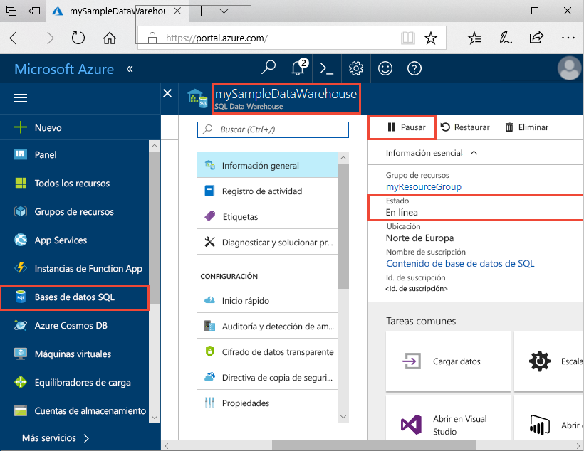
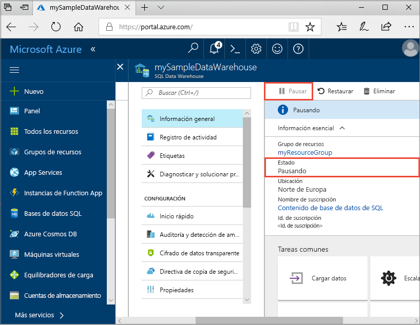
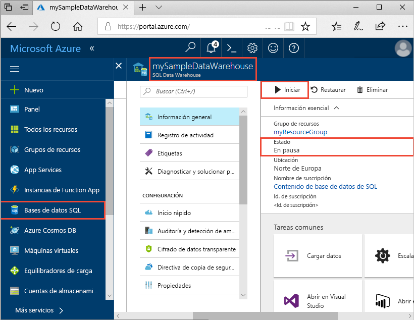
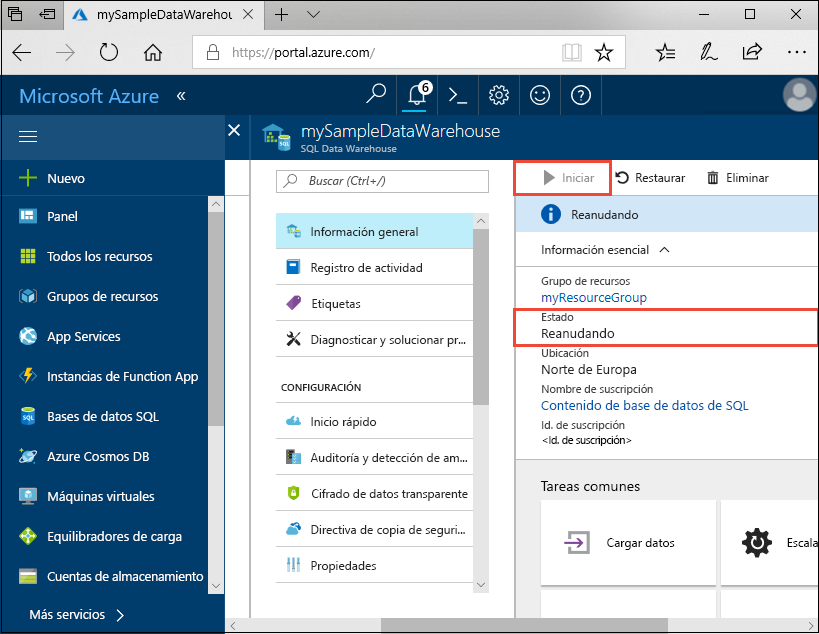
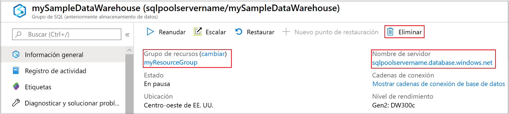

# Inicio rápido: Pausa y reanudación de los recursos de proceso en un grupo de SQL dedicado (antes SQL DW) a través de Azure Portal

Puede usar Azure Portal para pausar y reanudar los recursos de proceso del grupo de SQL dedicado (antes SQL DW). Si no tiene una suscripción a Azure, cree una cuenta [gratuita](https://azure.microsoft.com/free/) antes de empezar.

## Inicio de sesión en Azure Portal

Inicie sesión en [Azure Portal](https://portal.azure.com/).

## Antes de empezar

Use [Creación y conexión en el portal](../quickstart-create-sql-pool-portal.md) para crear un grupo de SQL dedicado llamado **mySampleDataWarehouse**. 

## Pausa del proceso

Para reducir costos, puede pausar y reanudar los recursos de proceso a petición. Por ejemplo, si no va a usar la base de datos durante la noche y los fines de semana, puede pausarla durante esas horas y reanudarla durante el día.
 
>[!NOTE]
>No se le cobrará por recursos de proceso mientras la base de datos se encuentre en pausa. Sin embargo, se le seguirá cobrando por el almacenamiento. 

Para pausar un grupo de SQL dedicado, siga estos pasos:

1. Inicie sesión en [Azure Portal](https://portal.azure.com/).
2. Haga clic en **Dedicated SQL pool (formerly SQL DW)** (Grupo de SQL dedicado [antes SQL DW]) en la página de navegación izquierda de Azure Portal.
2. Seleccione **mySampleDataWarehouse** en la página **Dedicated SQL pool (formerly SQL DW)** (Grupo de SQL dedicado [antes SQL DW]) para abrir el grupo de SQL. 
3. En la página **mySampleDataWarehouse**, observe que el **Estado** sea **En línea**.

    

4. Para pausar el grupo de SQL dedicado, haga clic en el botón **Pausar**. 
5. Aparece una pregunta de confirmación en la que tiene que indicar si quiera continuar. Haga clic en **Sí**.
6. Espere un momento y, a continuación, observe que el **Estado** sea **Pausando**.

    

7. Una vez completada la operación de pausa, el estado es **En pausa** y el botón de opción es **Reanudar**.
8. Ahora, los recursos de proceso del grupo de SQL dedicado están sin conexión. No se le cobrará el proceso hasta que reanude el servicio.

    

## Reanudación del proceso

Para reanudar un grupo de SQL dedicado, siga estos pasos:

1. Haga clic en **Dedicated SQL pool (formerly SQL DW)** (Grupo de SQL dedicado [antes SQL DW]) en la página de navegación izquierda de Azure Portal.
2. Seleccione **mySampleDataWarehouse** en la página **Dedicated SQL pool (formerly SQL DW)** (Grupo de SQL dedicado [antes SQL DW]) para abrir la página del grupo de SQL. 
3. En la página **mySampleDataWarehouse**, observe que el **Estado** sea **En pausa**.

    

1. Para reanudar el grupo de SQL, haga clic en **Reanudar**. 
1. Aparece una pregunta de confirmación en la que tiene que indicar si lo quiere iniciar. Haga clic en **Sí**.
1. Observe que el **Estado** sea **Reanudando**.

    

1. Cuando el grupo de SQL vuelva a estar en línea, el estado será **En línea** y el botón de opción será **Pausar**.
1. Los recursos de proceso para el grupo de SQL ahora están en línea y se puede usar el servicio. Los cargos del proceso se han reanudado.

    

## Limpieza de recursos

Se le cobra por las unidades de almacenamiento de datos y los datos almacenados en el grupo de SQL dedicado. Estos recursos de proceso y de almacenamiento se facturan por separado. 

- Si quiere conservar los datos de almacenamiento, pause el proceso.
- Si quiere eliminar cobros futuros, puede eliminar el grupo de SQL dedicado. 

Siga estos pasos para limpiar los recursos según estime oportuno.

1. Inicie sesión en [Azure Portal](https://portal.azure.com) y seleccione el grupo de SQL dedicado.

    

1. Para pausar el proceso, haga clic en el botón **Pausar**. 

1. Para quitar el grupo de SQL dedicado para que no le cobren por proceso o almacenamiento, haga clic en **Eliminar**.

## Pasos siguientes

Ya ha pausado y reanudado el proceso para el grupo de SQL dedicado. Continúe con el siguiente artículo para más información sobre cómo [cargar datos en un grupo de SQL dedicado](load-data-from-azure-blob-storage-using-polybase.md). Para más información acerca de la administración de funcionalidades de proceso, consulte el artículo sobre [introducción a la administración de proceso](sql-data-warehouse-manage-compute-overview.md). 

