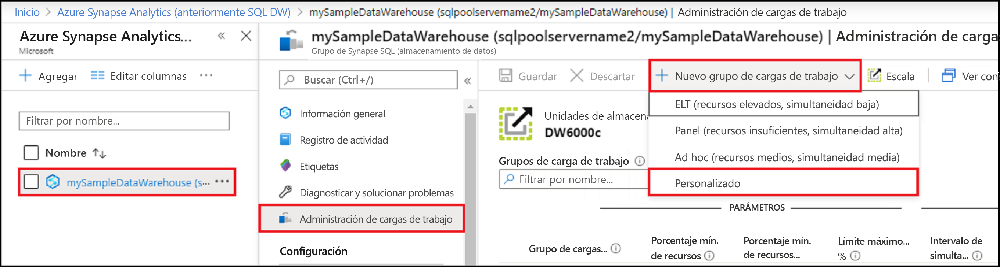
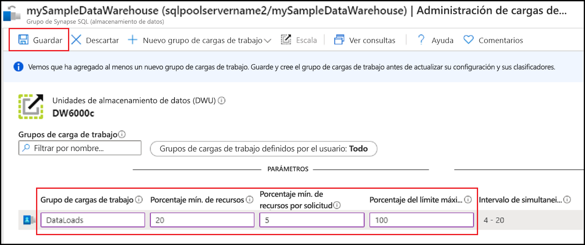
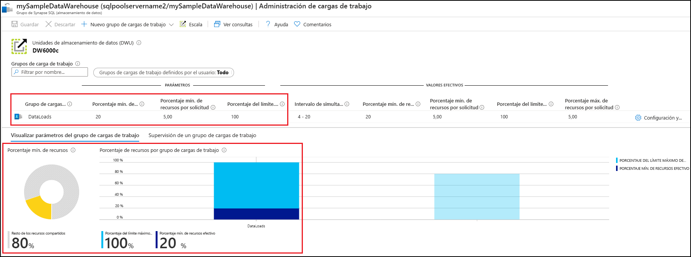
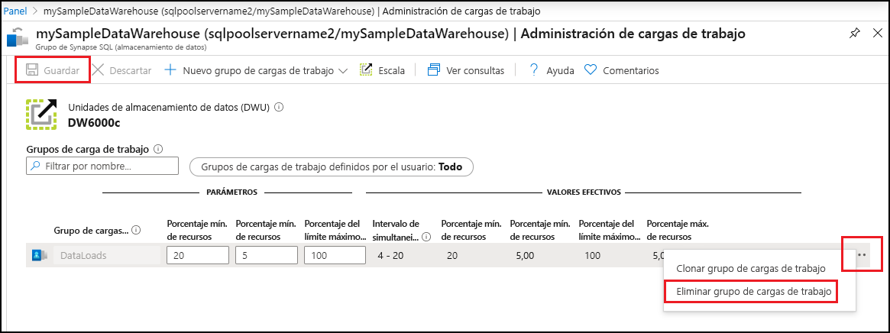

# Inicio rápido: Configuración del aislamiento de cargas de trabajo de un grupo de SQL mediante un grupo de cargas de trabajo en Azure Portal

En este inicio rápido, configurará el [aislamiento de cargas de trabajo ](sql-data-warehouse-workload-isolation.md) mediante la creación de un grupo de cargas de trabajo para reservar recursos.  Para este tutorial, se creará el grupo de cargas de trabajo para la carga de datos llamado `DataLoads`. El grupo de cargas de trabajo reservará un 20 % de los recursos del sistema.  Con un aislamiento del 20 % para las cargas de datos, se garantizan los recursos necesarios para cumplir los Acuerdos de Nivel de Servicio.  Después de crear el grupo de cargas de trabajo, [cree un clasificador de cargas de trabajo](quickstart-create-a-workload-classifier-portal.md) para asignarle consultas.

Si no tiene una suscripción a Azure, cree una cuenta [gratuita](https://azure.microsoft.com/free/) antes de empezar.

## Inicio de sesión en Azure Portal

Inicie sesión en [Azure Portal](https://portal.azure.com/).

> [!NOTE]
> La creación de una instancia del grupo de SQL en Azure Synapse Analytics puede dar lugar a un nuevo servicio facturable.  Para más información, consulte los [precios de Azure Synapse Analytics](https://azure.microsoft.com/pricing/details/sql-data-warehouse/).

## Prerrequisitos

En este inicio rápido se da por supuesto que ya tiene una instancia del grupo de SQL en Synapse SQL y que tiene permisos CONTROL DATABASE. Si tiene que crear una, consulte [Guía de inicio rápido: Creación de una instancia de Azure SQL Data Warehouse en Azure Portal, y realización de consultas en ella](create-data-warehouse-portal.md) para crear un almacenamiento de datos denominado **mySampleDataWarehouse**.

>[!IMPORTANT] 
>Su grupo de SQL debe estar en línea para que se pueda configurar la administración de las cargas de trabajo. 

## Configuración del aislamiento de cargas de trabajo
Los recursos de un grupo de SQL se pueden aislar y reservar para cargas de trabajo concretas mediante la creación de grupos de cargas de trabajo.  Para más información sobre la forma en que los grupos de cargas de trabajo le ayudan en la administración de su carga de trabajo, consulte la documentación relativa al concepto de [Aislamiento de cargas de trabajo](sql-data-warehouse-workload-isolation.md).  En [Inicio rápido: Creación y conexión (Azure Portal)](create-data-warehouse-portal.md) se creó **mySampleDataWarehouse** y se inicializó con 400 DWU. Con los pasos siguientes se crea un grupo de cargas de trabajo en **mySampleDataWarehouse**.

Para crear un grupo de cargas de trabajo con un aislamiento del 20 %:
1.  Haga clic en **Azure Synapse Analytics (formerly SQL DW)** a la izquierda de la página de Azure Portal.
2.  Seleccione **mySampleDataWarehouse** en la página de **Azure Synapse Analytics (formerly SQL DW)** . Se abre el grupo de SQL.
3.  Haga clic en **Administración de cargas de trabajos**.
4.  Haga clic en **Nuevo grupo de cargas de trabajo**.
5.  Haga clic en **Personalizado**.

    

6.  Escriba `DataLoads` en **Grupo de cargas de trabajo**.
7.  Escriba `20` en **Porcentaje mín. de recursos**.
8.  Escriba `5` en **Porcentaje mín. de recursos por solicitud**.
9.  Escriba `100` en **Porcentaje del límite máximo de recursos**.
10.   Haga clic en **Save**(Guardar).

   

Cuando se crea el grupo de cargas de trabajo, aparece una notificación del portal.  Los recursos del grupo de cargas de trabajo se muestran en los gráficos debajo de los valores configurados.

   

## Limpieza de recursos

Para eliminar el grupo de cargas de trabajo `DataLoads` creado en este tutorial:
1. Haga clic en **`...`** a la derecha del grupo de cargas de trabajo `DataLoads`.
2. Haga clic en **Eliminar grupo de cargas de trabajo**.
3. Haga clic en **Sí** cuando se le pida que confirme la eliminación del grupo de cargas de trabajo.
4. Haga clic en **Guardar**.

   

Se le está cobrando por unidades de almacenamiento de datos y por los datos almacenados en el almacenamiento de datos. Estos recursos de proceso y de almacenamiento se facturan por separado.

- Si desea conservar los datos de almacenamiento, puede pausar el proceso cuando no está utilizando el almacenamiento de datos. Si se hace una pausa en el proceso, solo se carga el almacenamiento de datos. Cuando esté listo para trabajar con los datos, reanude el proceso.
- Si desea quitar cobros futuros, puede eliminar el almacenamiento de datos.

Siga estos pasos para limpiar los recursos.

1. Inicie sesión en [Azure Portal](https://portal.azure.com) y seleccione el almacenamiento de datos.

    

2. Para pausar el proceso, seleccione el botón **Pausar**. Cuando el almacenamiento de datos se haya puesto en pausa, verá un botón **Iniciar**.  Para reanudar el proceso, seleccione **Iniciar**.

3. Para quitar el almacenamiento de datos para que no se le cobre por proceso o almacenamiento, seleccione **Eliminar**.

4. Para eliminar el servidor SQL que creó, seleccione **sqlpoolservername.database.windows.net** en la imagen anterior y seleccione **Eliminar**.  Debe tener cuidado con este procedimiento, ya que la eliminación del servidor elimina también todas las bases de datos asignadas al servidor.

5. Para quitar el grupo de recursos, seleccione **myResourceGroup** y **Eliminar grupo de recursos**.

## Pasos siguientes

Para usar el grupo de cargas de trabajo `DataLoads`, es preciso crear un [clasificador de cargas de trabajo](/sql/t-sql/statements/create-workload-classifier-transact-sql?toc=/azure/synapse-analytics/sql-data-warehouse/toc.json&bc=/azure/synapse-analytics/sql-data-warehouse/breadcrumb/toc.json&view=azure-sqldw-latest) para enrutar las solicitudes al grupo de cargas de trabajo.  Pase al tutorial acerca de cómo [crear un clasificador de cargas de trabajo](quickstart-create-a-workload-classifier-portal.md) para crear uno para `DataLoads`.

## Consulte también
Vea el artículo de procedimientos [Administrar y supervisión de la administración de cargas de trabajo](sql-data-warehouse-how-to-manage-and-monitor-workload-importance.md) para más información sobre cómo supervisar cargas de trabajo para la administración de cargas de trabajo.
