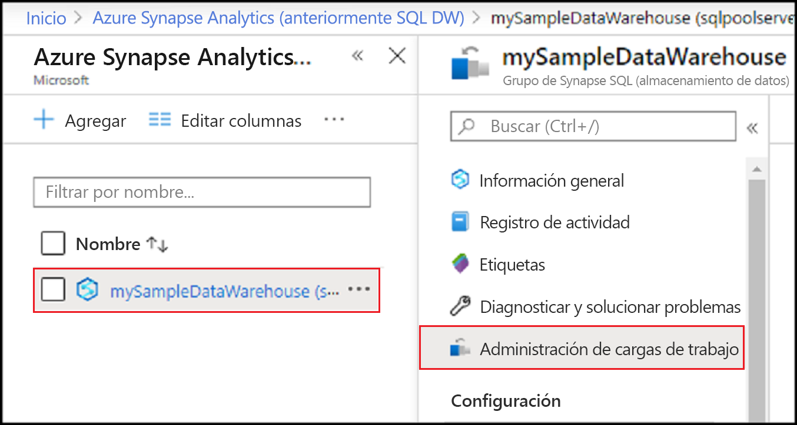
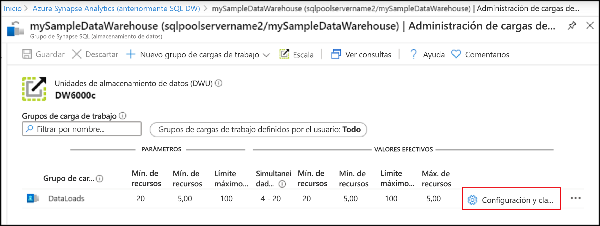
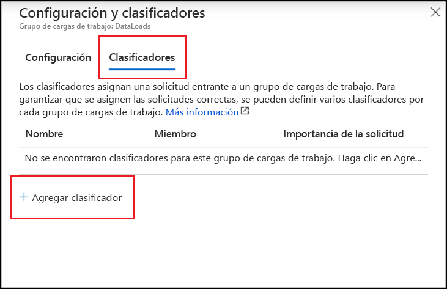
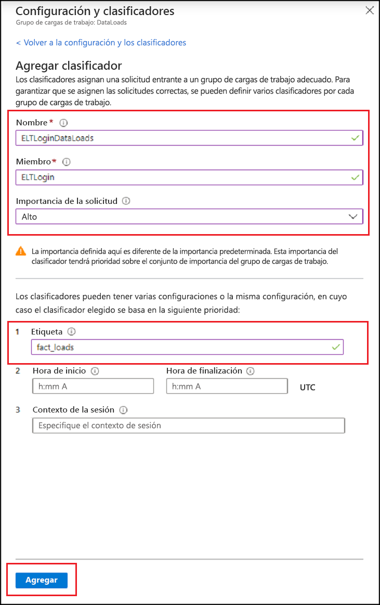
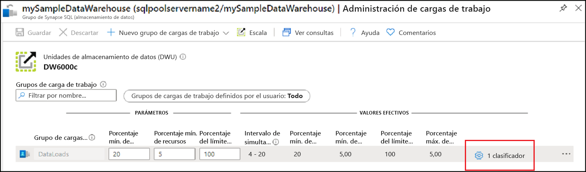

# <a name="quickstart-create-a-synapse-sql-pool-workload-classifier-using-the-azure-portal"></a>Inicio rápido: Creación de un clasificador de cargas de trabajo del grupo de Synapse SQL mediante Azure Portal

En esta guía de inicio rápido, creará un [clasificador de cargas de trabajo](sql-data-warehouse-workload-classification.md) para asignar consultas a un grupo de cargas de trabajo.  El clasificador asignará solicitudes del `ELTLogin`usuario de SQL al `DataLoads`grupo de cargas de trabajo.   Consulte el tutorial [Inicio rápido: Configuración del aislamiento de cargas de trabajo](quickstart-configure-workload-isolation-portal.md) para crear el grupo de cargas de trabajo `DataLoads`.  En este tutorial se creará un clasificador de cargas de trabajo con la opción WLM_LABEL para facilitar la correcta clasificación de las solicitudes.  El clasificador asignará la `HIGH` [importancia de la carga de trabajo](sql-data-warehouse-workload-importance.md) a estas solicitudes también.


Si no tiene una suscripción a Azure, cree una cuenta [gratuita](https://azure.microsoft.com/free/) antes de empezar.


## <a name="sign-in-to-the-azure-portal"></a>Inicio de sesión en Azure Portal

Inicie sesión en [Azure Portal](https://portal.azure.com/).

> [!NOTE]
> La creación de una instancia del grupo de SQL en Azure Synapse Analytics puede dar lugar a un nuevo servicio facturable.  Para más información, consulte los [precios de Azure Synapse Analytics](https://azure.microsoft.com/pricing/details/sql-data-warehouse/).

## <a name="prerequisites"></a>Prerrequisitos

En este inicio rápido se da por supuesto que ya tiene una instancia del grupo de SQL en Synapse SQL y que tiene permisos CONTROL DATABASE. Si tiene que crear una, consulte [Guía de inicio rápido: Creación de una instancia de Azure SQL Data Warehouse en Azure Portal, y realización de consultas en ella](create-data-warehouse-portal.md) para crear un almacenamiento de datos denominado **mySampleDataWarehouse**.
<br><br>
Existe un grupo de cargas de trabajo `DataLoads`.  Consulte el tutorial [Inicio rápido: Configuración del aislamiento de cargas de trabajo](quickstart-configure-workload-isolation-portal.md) para crear el grupo de cargas de trabajo.
<br><br>
>[!IMPORTANT] 
>Su grupo de SQL debe estar en línea para que se pueda configurar la administración de las cargas de trabajo. 


## <a name="create-a-login-for-eltlogin"></a>Creación de un inicio de sesión para ELTLogin

Cree un inicio de sesión de autenticación de SQL Server mediante la base de datos `master` mediante [CREATE LOGIN](/sql/t-sql/statements/create-login-transact-sql?toc=/azure/synapse-analytics/sql-data-warehouse/toc.json&bc=/azure/synapse-analytics/sql-data-warehouse/breadcrumb/toc.json&view=azure-sqldw-latest) para `ELTLogin`.

```sql
IF NOT EXISTS (SELECT * FROM sys.sql_logins WHERE name = 'ELTLogin')
BEGIN
CREATE LOGIN [ELTLogin] WITH PASSWORD='<strongpassword>'
END
;
```

## <a name="create-user-and-grant-permissions"></a>Creación de usuario y concesión de permisos

Después de que se crea el inicio de sesión es preciso crear un usuario en la base de datos.  Use [CREATE USER](/sql/t-sql/statements/create-user-transact-sql?toc=/azure/synapse-analytics/sql-data-warehouse/toc.json&bc=/azure/synapse-analytics/sql-data-warehouse/breadcrumb/toc.json&view=azure-sqldw-latest) para crear el usuario de SQL `ELTRole` en **mySampleDataWarehouse**.  Dado que en este tutorial vamos a probar la clasificación, conceda el permiso `ELTLogin` a **mySampleDataWarehouse**. 

```sql
IF NOT EXISTS (SELECT * FROM sys.database_principals WHERE name = 'ELTLogin')
BEGIN
CREATE USER [ELTLogin] FOR LOGIN [ELTLogin]
GRANT CONTROL ON DATABASE::mySampleDataWarehouse TO ELTLogin 
END
;
```

## <a name="configure-workload-classification"></a>Configuración de la clasificación de cargas de trabajo
La clasificación permite enrutar solicitudes, en función de un conjunto de reglas, a un grupo de cargas de trabajo.  En el tutorial [Inicio rápido: Configuración del aislamiento de cargas de trabajo](quickstart-configure-workload-isolation-portal.md) se creó el grupo de cargas de trabajo `DataLoads`.  Ahora se creará un clasificador de cargas de trabajo para enrutar las consultas al grupo de cargas de trabajo `DataLoads`.


1.  Haga clic en **Azure Synapse Analytics (formerly SQL DW)** a la izquierda de la página de Azure Portal.
2.  Seleccione **mySampleDataWarehouse** en la página de **Azure Synapse Analytics (formerly SQL DW)** . Se abre el grupo de SQL.
3.  Haga clic en **Administración de cargas de trabajos**.

    

4.  Haga clic en **Configuración y clasificadores** en el lado derecho del grupo de cargas de trabajo `DataLoads`.

    

5. Haga clic en **Clasificadores**.
6. Haga clic en **Agregar clasificador**.

    

7.  Escriba `ELTLoginDataLoads` en **Nombre**.
8.  Escriba `ELTLogin` en **Miembro**.
9.  Elija `High` en **Importancia de la solicitud**.  *Opcional*, la importancia normal es el valor predeterminado.
10. Escriba `fact_loads` en **Etiqueta**.
11. Haga clic en **Agregar**.
12. Haga clic en **Save**(Guardar).

    

## <a name="verify-and-test-classification"></a>Comprobación y prueba de la clasificación
Consulte la vista de catálogo [sys.workload_management_workload_classifiers](/sql/relational-databases/system-catalog-views/sys-workload-management-workload-classifiers-transact-sql?view=azure-sqldw-latest) para comprobar la existencia del clasificador `ELTLoginDataLoads`.

```sql
SELECT * FROM sys.workload_management_workload_classifiers WHERE name = 'ELTLoginDataLoads'
```

Consulte la vista de catálogo [sys.workload_management_workload_classifier_details](/sql/relational-databases/system-catalog-views/sys-workload-management-workload-classifier-details-transact-sql?view=azure-sqldw-latest) para comprobar los detalles del clasificador.

```sql
SELECT c.[name], c.group_name, c.importance, cd.classifier_type, cd.classifier_value
  FROM sys.workload_management_workload_classifiers c
  JOIN sys.workload_management_workload_classifier_details cd
    ON cd.classifier_id = c.classifier_id
  WHERE c.name = 'ELTLoginDataLoads'
```

Ejecute las siguientes instrucciones para probar la clasificación.  Asegúrese de que está conectado como ``ELTLogin`` y de que ``Label`` se usa en la consulta.
```sql
CREATE TABLE factstaging (ColA int)
INSERT INTO factstaging VALUES(0)
INSERT INTO factstaging VALUES(1)
INSERT INTO factstaging VALUES(2)
GO

CREATE TABLE testclassifierfact WITH (DISTRIBUTION = ROUND_ROBIN)
AS
SELECT * FROM factstaging
OPTION (LABEL='fact_loads')
```

Compruebe que la instrucción `CREATE TABLE` está clasificada en el grupo de cargas de trabajo `DataLoads` mediante el clasificador de cargas de trabajo `ELTLoginDataLoads`.
```sql 
SELECT TOP 1 request_id, classifier_name, group_name, resource_allocation_percentage, submit_time, [status], [label], command 
FROM sys.dm_pdw_exec_requests 
WHERE [label] = 'fact_loads'
ORDER BY submit_time DESC
```


## <a name="clean-up-resources"></a>Limpieza de recursos

Para eliminar el clasificador de cargas de trabajo `ELTLoginDataLoads` creado en este tutorial:

1. Haga clic en **1 Clasificador** en el lado derecho del `DataLoads` grupo de cargas de trabajo.

    

2. Haga clic en **Clasificadores**.
3. Haga clic en **`...`** a la derecha del clasificador de cargas de trabajo `ELTLoginDataLoads`.
4. Haga clic en **Eliminar**.
5. Haga clic en **Guardar**.

    

Se le está cobrando por unidades de almacenamiento de datos y por los datos almacenados en el almacenamiento de datos. Estos recursos de proceso y de almacenamiento se facturan por separado.

- Si desea conservar los datos de almacenamiento, puede pausar el proceso cuando no está utilizando el almacenamiento de datos. Si se hace una pausa en el proceso, solo se carga el almacenamiento de datos. Cuando esté listo para trabajar con los datos, reanude el proceso.
- Si desea quitar cobros futuros, puede eliminar el almacenamiento de datos.

Siga estos pasos para limpiar los recursos.

1. Inicie sesión en [Azure Portal](https://portal.azure.com) y seleccione el almacenamiento de datos.

    

2. Para pausar el proceso, seleccione el botón **Pausar**. Cuando el almacenamiento de datos se haya puesto en pausa, verá un botón **Iniciar**.  Para reanudar el proceso, seleccione **Iniciar**.

3. Para quitar el almacenamiento de datos para que no se le cobre por proceso o almacenamiento, seleccione **Eliminar**.

4. Para eliminar el servidor SQL que creó, seleccione **sqlpoolservername.database.windows.net** en la imagen anterior y seleccione **Eliminar**.  Debe tener cuidado con este procedimiento, ya que la eliminación del servidor elimina también todas las bases de datos asignadas al servidor.

5. Para quitar el grupo de recursos, seleccione **myResourceGroup** y **Eliminar grupo de recursos**.

## <a name="next-steps"></a>Pasos siguientes

Supervise la carga de trabajo mediante las métricas de supervisión de Azure Portal.  Para más información, consulte [Administración y supervisión de la administración de cargas de trabajo](sql-data-warehouse-how-to-manage-and-monitor-workload-importance.md).
